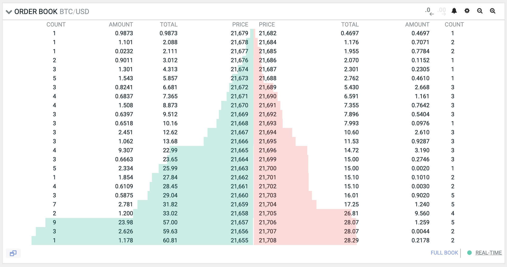

# UniswapV3 技术学习系列（一）：市场机制与 AMM 原理

## 系列介绍

欢迎来到 UniswapV3 技术学习系列！本系列是继 [UniswapV1](https://github.com/RyanWeb31110/uniswapv1_tech) 和 [UniswapV2](https://github.com/RyanWeb31110/uniswapv2_tech) 之后的第三个系列学习项目，我们将深入探索去中心化交易所（DEX）的演进之路。

本系列基于 [Uniswap V3 Development Book](https://uniswapv3book.com/) 教程，从零开始构建一个功能完整的去中心化交易所。通过实战开发，您将深入理解：

- **集中流动性（Concentrated Liquidity）**：UniswapV3 的核心创新
- **Tick 机制**：如何实现精细化的价格区间管理
- **多层级手续费体系**：根据不同风险匹配费率结构
- **非同质化流动性仓位**：使用 NFT 表示的独特 LP 位置
- **高级数学原理**：定点数运算、平方根价格等核心算法

### 项目实现目标

本项目的目标是构建一个 UniswapV3 的核心实现。我们不会构建完全一致的副本，而是专注于 Uniswap 最核心和最重要的机制。原因是 Uniswap 是一个庞大的项目，包含许多细节和辅助功能——完整拆解所有内容会让本系列过于冗长。相反，我们将构建 Uniswap 的核心部分，包括流动性管理、交换、手续费、外围合约、报价合约和 NFT 合约。

#### 智能合约实现

完成本系列学习后，您将实现以下合约：

**核心合约：**

- **UniswapV3Pool** - 核心池子合约，实现流动性管理和交换功能
  - 与原始实现非常接近，但为了简化有一些实现细节不同
  - 只处理"精确输入"交换（已知输入金额的交换）
  - 原始实现还支持"精确输出"交换（指定购买数量的交换）

- **UniswapV3Factory** - 工厂合约，部署新池子并记录所有已部署的池子
  - 与原始实现基本相同
  - 去除了更改所有者和手续费的能力

**外围合约：**

- **UniswapV3Manager** - 外围合约，简化与池子合约的交互
  - 这是 SwapRouter 的简化实现
  - 同样只实现"精确输入"交换

- **UniswapV3Quoter** - 报价合约，允许在链上计算交换价格
  - Quoter 和 QuoterV2 的最小化实现
  - 只支持"精确输入"交换

- **UniswapV3NFTManager** - NFT 管理器，将流动性仓位转换为 NFT
  - NonfungiblePositionManager 的简化实现
  - 支持 ERC721 标准的流动性凭证

#### 前端应用

本系列还包含一个简化版的 Uniswap UI 克隆。虽然功能简单，但它展示了前端应用如何使用 Ethers.js 和 MetaMask 与智能合约交互，帮助您理解完整的 DApp 开发流程。

> 💡 **学习建议**
>
> 完成本系列后，您将能够阅读 Uniswap V3 的源代码，并理解本书范围之外的所有机制。我们的实现虽然简化，但保留了最核心的架构和算法，这将为您深入研究完整实现打下坚实基础。

---

### 本文内容

在这第一篇文章中，我们先回顾传统金融市场的基本概念，理解中心化交易所的运作模式，然后引入自动化做市商（AMM）的革命性设计，为后续深入 UniswapV3 的技术细节打下坚实基础。

---

## 一、中心化交易所的运作原理

### 1.1 订单簿机制

在传统的中心化交易所（如币安、Coinbase）中，**订单簿（Order Book）** 是交易系统的核心。订单簿本质上是一个记录所有待成交买卖订单的数据结构，每个订单包含三个关键信息：

- **交易方向**：买入（Bid）或卖出（Ask）
- **价格**：订单期望成交的价格点
- **数量**：希望交易的资产数量

当买单的出价高于或等于卖单的要价时，交易撮合引擎会自动匹配订单并执行交易。这种模式在传统金融市场已运作数百年，技术成熟且高效。

**订单簿示例：**



### 1.2 流动性的重要性

**流动性（Liquidity）** 是市场能够正常运转的基础，它描述的是市场中可供交易的资产可用性。我们用一个生活化的例子来理解：

- 如果你想买一台二手钢琴，但整个市场没有人卖钢琴，这就是 **流动性不足**
- 如果你想卖一台二手钢琴，但市场上已经有 100 台钢琴在售卖而没人买，这就是 **供给过剩但需求不足**
- 如果市场上既有卖家也有买家，价格合理且能快速成交，这就是 **流动性充足**

在加密货币市场中，流动性决定了：
- **成交速度**：订单能否快速匹配
- **价格稳定性**：避免大额交易导致价格剧烈波动
- **交易成本**：买卖价差（Spread）的大小

### 1.3 做市商的角色

当市场出现流动性不足时，**做市商（Market Maker）** 就会发挥关键作用。做市商是专业的金融机构或个人，他们的工作模式是：

1. **双边报价**：同时挂出买单和卖单，提供即时的交易对手
2. **赚取价差**：通过买卖价差（Bid-Ask Spread）获利
3. **承担风险**：持有资产库存，承受价格波动风险
4. **获得奖励**：交易所通常会给予做市商手续费返佣或其他激励

传统做市商需要大量资本、复杂的算法和专业团队，这是一个高度中心化的角色。那么，如何在去中心化的世界里实现相同的功能呢？

---

## 二、去中心化交易所的创新之路

### 2.1 去中心化交易的需求

去中心化交易所（DEX）同样需要解决流动性问题，但它面临着独特的挑战：

- **无法依赖中心化撮合引擎**：没有服务器可以快速匹配订单
- **链上存储成本高昂**：维护订单簿需要大量存储和计算
- **MEV 攻击风险**：矿工可以看到未打包的订单并进行抢跑
- **跨链资产交易**：需要支持多链生态的互操作性

因此，去中心化交易所必须找到一种全新的解决方案，这个方案就是 **自动化做市商（AMM）**。

### 2.2 从 V1 到 V3 的演进

在深入 AMM 之前，让我们先了解 Uniswap 的演进历程：

**UniswapV1（2018）**
- 首次提出恒定乘积公式：`x * y = k`
- 仅支持 ETH 与 ERC20 代币的交易对
- 流动性在全价格区间均匀分布
- 资金利用率相对较低

**UniswapV2（2020）**
- 支持任意 ERC20 代币对交易
- 引入闪电兑换（Flash Swap）
- 添加价格预言机功能
- 改进手续费机制

**UniswapV3（2021）** ⭐ 本系列重点
- **集中流动性**：LP 可自定义价格区间
- **多层级手续费**：0.05%、0.30%、1.00%
- **NFT 流动性凭证**：每个仓位是独特的 ERC721
- **增强型预言机**：更高效的 TWAP 实现
- **资金效率提升 4000 倍**

---

## 三、自动化做市商（AMM）原理

### 3.1 什么是 AMM？

**自动化做市商（Automated Market Maker, AMM）** 是一种通过智能合约自动化执行做市功能的算法机制。它的核心特点是：

#### 去中心化特性
- ✅ **无需中心化管理**：不受单一实体控制
- ✅ **资产去中心化存储**：资金存储在链上合约中
- ✅ **无需许可访问**：任何人随时随地可以使用

#### 技术实现
- **智能合约驱动**：所有逻辑通过代码自动执行
- **流动性池（Liquidity Pool）**：替代订单簿的新模式
- **数学公式定价**：通过算法确定交易价格
- **链上透明**：所有交易和状态公开可验证

### 3.2 流动性池的工作机制

在 AMM 中，每个交易对（如 ETH/USDC）都是一个独立的智能合约，我们称之为 **流动性池（Pool）**。

#### 流动性池的组成
```
流动性池 = 代币储备 + 定价算法 + 手续费机制
```

以 ETH/USDC 池为例：
- 合约中同时存储 ETH 和 USDC
- 根据算法公式自动计算交易价格
- 每笔交易收取手续费奖励给流动性提供者

#### 两种参与角色

**流动性提供者（Liquidity Provider, LP）**
- 向池中注入成对的代币（如同时存入 ETH 和 USDC）
- 赚取交易手续费作为回报
- 承担价格波动带来的无常损失（Impermanent Loss）

**交易者（Trader）**
- 用一种代币兑换另一种代币
- 支付交易手续费
- 享受即时成交、无需等待订单匹配

### 3.3 AMM 与传统交易所的核心差异

| 对比维度 | 中心化交易所 | AMM（去中心化） |
|---------|------------|----------------|
| **价格发现** | 订单簿撮合 | 算法公式计算 |
| **流动性来源** | 专业做市商 | 社区 LP 提供 |
| **资产保管** | 交易所托管 | 智能合约托管 |
| **交易许可** | 需要 KYC | 无需许可 |
| **透明度** | 不透明 | 完全透明 |
| **单点故障** | 存在 | 不存在 |
| **手续费分配** | 交易所收取 | LP 分享 |

### 3.4 AMM 的革命性意义

AMM 并不是简单地将订单簿搬到链上，而是一种全新的交易范式：

**技术层面**
- 所有逻辑通过智能合约自动执行
- 无需维护链上订单簿，节省 Gas 成本
- 算法确保池子永远有流动性（价格可能不理想）

**经济层面**
- 将做市商的利润分配给普通用户
- 降低了参与做市的门槛
- 创造了全新的被动收益模式

**哲学层面**

- 代码即法律（Code is Law）
- 真正的去中心化金融基础设施
- 抗审查、无国界的全球市场

---

## 四、深入理解 Uniswap 的 AMM 实现

### 4.1 池化的核心思想

**池化（Pooling）** 是 Uniswap AMM 的基础理念：

与其让买卖双方直接匹配订单，不如：
1. 让所有 LP 将资金汇聚到一个公共池子
2. 池子使用数学公式自动计算每笔交易的价格
3. 交易者与池子进行交互，而不是与其他交易者
4. 手续费按比例分配给所有 LP

这种模式的优势：
- ✅ **简化交易逻辑**：不需要复杂的订单匹配算法
- ✅ **永续流动性**：只要池子有资金，交易永远可以执行
- ✅ **公平分配**：所有 LP 按出资比例分享收益
- ✅ **可组合性**：其他合约可以直接调用池子

### 4.2 程序化与不可变性

Uniswap 核心合约的关键设计原则：

**完全自动化**
- 所有交易规则在部署时确定
- 没有管理员、特权用户或后门
- 算法逻辑公开可审计

**不可篡改**

- 核心逻辑部署后无法修改
- 保证规则的长期稳定性
- 增强用户信任

**角色清晰**

- **流动性提供者**：存入资金，赚取手续费
- **交易者**：支付手续费，兑换代币
- 两个角色可以是同一用户，灵活切换

### 4.3 术语说明

在本系列文章中，以下术语可互换使用：

- **池（Pool）** =   **交易对（Pair）** =   **流动性池（Liquidity Pool）**
  - 因为 Uniswap 中每个池包含且仅包含两种代币

- **流动性提供者（Liquidity Provider,  LP）**
  - 也称为"流动性挖矿者"或"做市商"

- **仓位（Position）**
  - 在 V3 中特指 LP 在特定价格区间的流动性

---

## 五、V3 的革命性创新预览

在后续文章中，我们将深入探讨 UniswapV3 的核心创新：

### 5.1 集中流动性

传统 V1/V2 中，流动性在全价格区间（0 → ∞）均匀分布，导致资金利用率低下。V3 允许 LP 选择特定价格区间提供流动性，资金效率提升可达 **4000 倍**！

**示例对比：**
- V2：投入 10,000 USDC 提供流动性，覆盖 0 → ∞
- V3：投入 10,000 USDC 只覆盖 1,800 → 2,200 的价格区间
- 结果：在该价格区间内，V3 的流动性深度相当于 V2 的 4000 倍

### 5.2 多层级手续费

根据不同风险特征，V3 提供三档费率：

| 费率 | 适用场景 | 示例 |
|------|---------|------|
| 0.05% | 稳定币对 | USDC/USDT, DAI/USDC |
| 0.30% | 主流代币对 | ETH/USDC, WBTC/ETH |
| 1.00% | 高风险/低流动性 | 长尾小币种 |

### 5.3 NFT 流动性凭证

V2 的 LP Token 是同质化的 ERC20，而 V3 的每个仓位是独特的 ERC721 NFT：

- 记录了价格区间、流动性数量等信息
- 支持链上 SVG 渲染的可视化展示
- 可以交易、转移、作为抵押品

---

## 六、本章小结

在这篇文章中，我们建立了理解去中心化交易所的基础知识：

**核心要点回顾：**

1. **中心化交易所** 依赖订单簿和专业做市商提供流动性
2. **流动性** 是市场正常运转的核心，决定了成交效率和价格稳定性
3. **AMM** 通过智能合约和算法公式自动化做市功能
4. **流动性池** 取代订单簿，成为 DEX 的核心架构
5. **Uniswap** 通过池化机制实现了去中心化、无需许可的交易

**下一步学习路径：**

- 详细推导恒定乘积公式 `x * y = k` 的数学原理
- 理解价格、储备量、流动性之间的关系

---

## 相关资源

### 官方文档
- [Uniswap V3 白皮书](https://uniswap.org/whitepaper-v3.pdf)
- [Uniswap V3 官方文档](https://docs.uniswap.org/protocol/concepts/V3-overview/concentrated-liquidity)

### 系列项目对比学习
- [UniswapV1 技术学习](https://github.com/RyanWeb31110/uniswapv1_tech) - 了解 AMM 基础
- [UniswapV2 技术学习](https://github.com/RyanWeb31110/uniswapv2_tech) - 学习任意代币对
- [UniswapV3 技术学习](https://github.com/RyanWeb31110/uniswapv3_tech) - 掌握集中流动性

### 互动交流
如果您有任何疑问或建议，欢迎在项目的 GitHub Discussions 中讨论交流！

---

## 项目仓库

https://github.com/RyanWeb31110/uniswapv3_tech