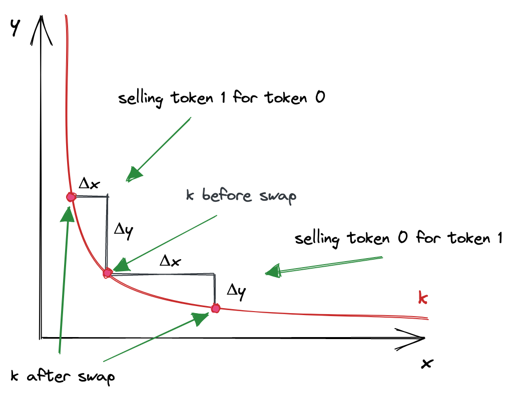
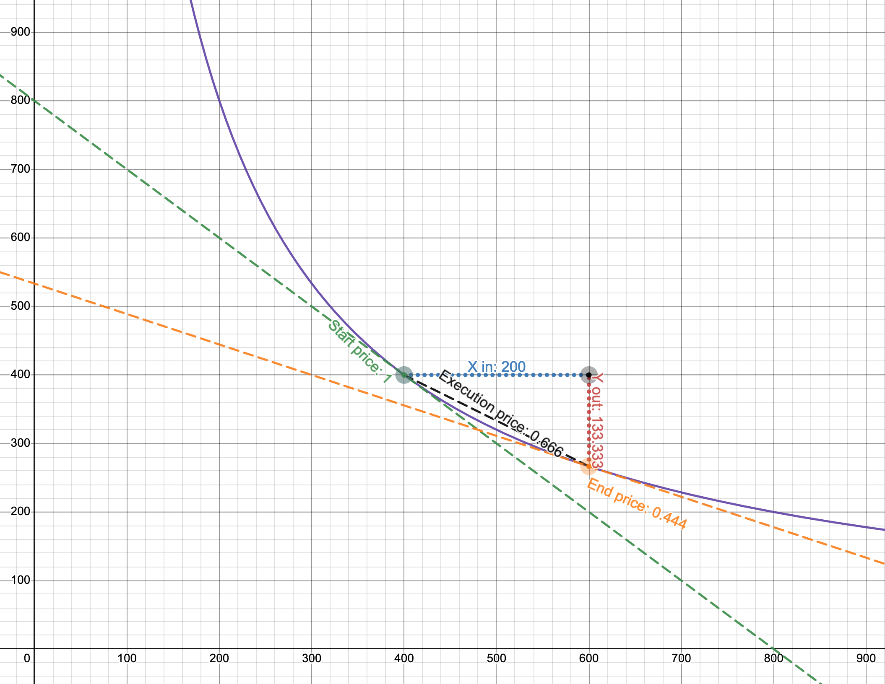

   # UniswapV3 技术学习系列（二）：恒定函数做市商

   ## 系列介绍

   本文是 UniswapV3 技术学习系列的第二篇。在上一篇文章中，我们了解了传统交易所的订单簿机制，以及去中心化交易所的 AMM 创新。现在，我们将深入探讨 Uniswap 的数学核心——**恒定函数做市商（Constant Function Market Maker, CFMM）**。

   本文基于 [Uniswap V2 白皮书](https://uniswap.org/whitepaper.pdf) 的数学原理，这些原理也是理解 UniswapV3 的基础。即使您暂时无法完全理解所有数学细节也没关系，在后续的实战开发中，这些概念会逐渐变得清晰。

   > **原文链接：** [Constant Function Market Maker - Uniswap V3 Development Book](https://uniswapv3book.com/milestone_0/constant-function-market-maker.html)

   ---

   ## 一、什么是恒定函数做市商？

   ### 1.1 核心公式

   在各种 AMM 实现方式中，Uniswap 选择了一种特别优雅且强大的模型——**恒定函数做市商（CFMM）**。别被它冗长的名字吓到，其核心只是一个极其简单的数学公式：

   $$
   x \times y = k
   $$

   **就是这样，这就是 AMM 的全部！**

   让我们解析一下这个公式中的每个变量：

   - **`x`**：池中第一种代币的储备量（如 ETH 的数量）
   - **`y`**：池中第二种代币的储备量（如 USDC 的数量）
   - **`k`**：常数，等于 `x` 和 `y` 的乘积，具体数值本身不重要

   > 💡 **为什么只有两个储备量？**  
   > 每个 Uniswap 池只能容纳两种代币。我们用 `x` 和 `y` 分别表示这两种代币的储备量。在代码实现中，它们分别被称为 `token0` 和 `token1`，顺序由代币地址的大小决定。

   ### 1.2 不变性原则

   恒定函数公式的核心含义是：**在每次交易后，`k` 值必须保持不变**（忽略手续费的情况下）。

   当交易者进行兑换时：
   1. 向池中存入一定数量的代币 A（想要卖出的）
   2. 从池中取出一定数量的代币 B（想要购买的）
   3. 这会改变池的储备量 `x` 和 `y`
   4. 但它们的乘积 `k = x × y` 必须保持不变

   **这个简单的约束条件就是 Uniswap 运作的核心算法。** 正如我们将在本系列中多次看到的，这个看似简单的要求蕴含着极其深刻的经济学意义。

   ---

   ## 二、交易函数：价格如何形成？

   ### 2.1 推导交易公式

   现在我们知道了池的组成，让我们推导交易时的完整公式。假设我们想用 `token0` 兑换 `token1`：

   $$
   (x + r \cdot \Delta x) \times (y - \Delta y) = k
   $$

   让我们逐步解析这个公式：

   1. **初始状态**：池中有 `x` 数量的 `token0`，`y` 数量的 `token1`
   2. **存入代币**：交易者存入 `Δx` 数量的 `token0` 到池中
   3. **手续费扣除**：池会收取一小部分手续费，所以实际参与计算的金额是 `r · Δx`，其中 `r = 1 - 手续费率`
      - 例如，如果手续费是 0.3%，那么 `r = 0.997`
   4. **取出代币**：交易者从池中取出 `Δy` 数量的 `token1`
   5. **储备变化**：
      - `token0` 储备从 `x` 变为 `x + r · Δx`
      - `token1` 储备从 `y` 变为 `y - Δy`
   6. **不变性约束**：更新后的储备乘积仍然等于 `k`

   > 📝 **术语说明**  
   > 我们使用 `token0` 和 `token1` 来称呼池中的两种代币，这是代码中的标准命名方式。在实际场景中，它们可能是 ETH/USDC、WBTC/ETH 等任意代币对。

   ### 2.2 池决定价格

   从上述公式可以得出一个关键结论：**池子决定了交易价格**。

   交易者的工作很简单：
   - 给池子一定数量的 `token0`
   - 期望得到合理数量的 `token1`

   池子的工作则复杂得多：
   - 根据当前储备量
   - 根据存入的数量
   - 计算出应该给予交易者多少 `token1`
   - 确保价格反映当前的供需关系

   这就是为什么说"**AMM 中，价格由池子算法决定，而不是由订单簿的买卖双方匹配决定**"。

   ---

   ## 三、定价机制：供需如何平衡？

   ### 3.1 现货价格

   既然 Uniswap 的池子是独立的智能合约，那么**池中的代币只能以彼此为单位进行定价**。

   举个例子，在 ETH/USDC 池中：
   - ETH 以 USDC 为单位定价
   - USDC 以 ETH 为单位定价

   如果 1 ETH = 1000 USDC，那么反过来 1 USDC = 0.001 ETH。这对任何代币对都成立，无论是稳定币对还是波动性资产对。

   在 AMM 中，代币的 **现货价格（Spot Price）** 由储备量的比率决定：

   $$
   P_x = \frac{y}{x}, \quad P_y = \frac{x}{y}
   $$

   其中：
   - Px：`token0` 的价格（用 `token1` 表示）
   - Py：`token1` 的价格（用 `token0` 表示）

   > 🔍 **重要概念**  
   > 现货价格只反映**当前时刻**的市场价格，是一个瞬时值。但实际交易的成交价格会有所不同，我们稍后会详细解释。

   ### 3.2 供需关系的数学表达

   在现实世界中，一切商品的定价都遵循**供求规律（Law of Supply and Demand）**。对 AMM 来说也是如此。

   让我们分别考虑供需两个因素：

   **供应（Supply）**

   - 由池的储备量决定
   - 储备量越大，供应越充足

   **需求（Demand）**
   - 由交易者想要购买的数量决定
   - 购买量越大，需求越强

   供求规律告诉我们：
   - 当需求高（供应不变）时 → 价格上涨
   - 当需求低（供应不变）时 → 价格下跌

   **这是一个市场必须具备的特性**，尤其是在无需许可的去中心化系统中。我们需要价格能够自动反映供需变化，而 Uniswap 的恒定函数公式神奇地实现了这一机制！

   ### 3.3 输出量计算公式

   让我们从交易公式出发，推导出更实用的计算公式。

   回顾交易公式：
   $$
   (x + r \cdot \Delta x) \times (y - \Delta y) = x \times y
   $$

   我们可以从中解出 `Δy` 和`Δx`：

   **已知输入量，求输出量：**
   $$
   \Delta y = \frac{y \cdot r \cdot \Delta x}{x + r \cdot \Delta x}
   $$

   **已知输出量，求输入量：**
   $$
   \Delta x = \frac{x \cdot \Delta y}{r \cdot (y - \Delta y)}
   $$

   这两个公式的意义非常重大：
   - **无需计算价格**！我们可以直接计算交易的输入/输出量
   - 公式中包含了储备量的比率（`x/y` 或 `y/x`），代表了供应关系
   - 公式中包含了交易量（`Δx` 或 `Δy`），代表了需求关系
   - **这就是同时考虑供需的定价函数**

   ### 3.4 公式推导过程

   为了帮助理解，这里展示完整的推导步骤。

   **推导输出量公式 `Δy`：**

   从基础公式开始：
   $$
   (x + r \cdot \Delta x) \times (y - \Delta y) = x \times y
   $$

   展开并整理：
   $$
   y - \Delta y = \frac{x \cdot y}{x + r \cdot \Delta x}
   $$

   $$
   -\Delta y = \frac{x \cdot y}{x + r \cdot \Delta x} - y
   $$

   $$
   -\Delta y = \frac{x \cdot y - y \cdot (x + r \cdot \Delta x)}{x + r \cdot \Delta x}
   $$

   $$
   -\Delta y = \frac{x \cdot y - x \cdot y - y \cdot r \cdot \Delta x}{x + r \cdot \Delta x}
   $$

   $$
   -\Delta y = \frac{-y \cdot r \cdot \Delta x}{x + r \cdot \Delta x}
   $$

   因此：
   $$
   \Delta y = \frac{y \cdot r \cdot \Delta x}{x + r \cdot \Delta x}
   $$

   **推导输入量公式`Δx`：**

   同样从基础公式：
   $$
   (x + r \cdot \Delta x) \times (y - \Delta y) = x \times y
   $$

   $$
   x + r \cdot \Delta x = \frac{x \cdot y}{y - \Delta y}
   $$

   $$
   r \cdot \Delta x = \frac{x \cdot y}{y - \Delta y} - x
   $$

   $$
   r \cdot \Delta x = \frac{x \cdot y - x \cdot (y - \Delta y)}{y - \Delta y}
   $$

   $$
   r \cdot \Delta x = \frac{x \cdot y - x \cdot y + x \cdot \Delta y}{y - \Delta y}
   $$

   $$
   r \cdot \Delta x = \frac{x \cdot \Delta y}{y - \Delta y}
   $$

   因此：
   $$
   \Delta x = \frac{x \cdot \Delta y}{r \cdot (y - \Delta y)}
   $$

   ---

   ## 四、曲线可视化：直观理解价格机制

   ### 4.1 双曲线的形状

   前面的数学公式可能显得抽象和枯燥。让我们通过可视化来建立更直观的理解。

   当我们将恒定乘积函数 `x · y = k` 画在坐标系上时，得到的是一条 **双曲线（Hyperbola）**：

   

   曲线的关键特性：
   - **坐标轴**：代表池的两种代币储备量
   - **曲线上的点**：每个点代表一个可能的储备状态，每笔交易都从曲线上与当前储备比率对应的点开始
   - **交易过程**：沿着曲线从一点移动到另一点

   ### 4.2 交易的几何表示

   让我们用一个具体例子来理解交易过程：

   

   **初始状态：**
   - 紫线是曲线，轴是池的储备（注意它们在起始价格时是相等的）
   - 池中有 1000 ETH（x）和 1,000 USDC（y）
   - 当前价格（start price）：1 ETH = 1 USDC（1:1）

   **执行交易：**

   - 交易者存入 200 ETH（Δx = 200）
   - 新的 x 坐标：1000 + 200 = 1200
   - 我们需要找到曲线上 x = 1200 对应的点
   - 读取该点的 y 坐标，计算出 Δy

   **价格影响：**
   - 如果按初始价格（1:1），应该得到 200 USDC
   - 但实际上只能得到约 133 USDC
   - 实际成交价格约为 1 ETH = 0.666 USDC

   ### 4.3 交互式学习

   这个经典示例来自 Uniswap 创始人之一 Dan Robinson 制作的 [Desmos 图表](https://www.desmos.com/calculator/4uvjl9bfvc)。

   > 💡 **学习建议**  
   > 为了建立更好的直觉，强烈建议您访问上述链接，尝试以下练习：
   >
   > - 修改储备量，观察曲线形状的变化
   > - 尝试不同的交易数量，看看价格如何变化
   > - 对比小额交易和大额交易的价格差异

   传说Uniswap 就是在 Desmos 上被"发明"出来的！

   ### 4.4 为什么使用这种曲线？

   您可能会疑惑：为什么要使用双曲线？它似乎"惩罚"了大额交易。

   **这恰恰是一个理想的特性！** 原因如下：

   **供求规律的自然体现**

   - 需求高（想买大量）→ 供应相对不足 → 价格上涨
   - 需求低（想买少量）→ 供应相对充足 → 价格稳定

   **市场机制的数学实现**

   - 交易量大（相对于储备）→ 对价格影响大
   - 交易量小（相对于储备）→ 对价格影响小

   **防止池子被耗尽**
   - 随着某种代币被大量买走，其价格会快速上涨
   - 理论上池子永远不会完全耗尽（虽然价格可能变得极端）

   神奇的是，**一个简单的恒定乘积公式就自动实现了这些复杂的市场机制**！

   ---

   ## 五、多个价格的共存

   ### 5.1 三种价格概念

   尽管 Uniswap 不需要显式计算价格，我们仍然可以从曲线上识别出多个价格概念：

   **1. 交易前的现货价格**
   - 等于储备比率：P = y / x 或 x / y

   - 在曲线上表现为**起点处的切线斜率**

   - 代表当前瞬时价格

   **2. 交易后的现货价格**
   - 在曲线的新点上
   - 是**新点处的切线斜率**
   - 代表交易后的新价格

   **3. 实际成交价格**

   - 既不是交易前价格，也不是交易后价格
   - 而是**连接两点的直线的斜率**
   - 代表整笔交易的平均价格

   ### 5.2 价格滑点

   实际成交价格与初始现货价格之间的差异就是**价格滑点（Price Slippage）**：

   $$
   滑点 = \frac{实际成交价格 - 初始现货价格}{初始现货价格} \times 100\%
   $$

   **影响滑点的因素：**

   1. **交易量相对大小**
      - 相对于池子储备越大 → 滑点越大
      - 相对于池子储备越小 → 滑点越小

   2. **池子流动性深度**
      - 储备量大（深度好）→ 同样交易量的滑点较小
      - 储备量小（深度差）→ 同样交易量的滑点较大

   **示例对比：**

   | 池子储备 | 交易量 | 滑点 |
   |---------|--------|------|
   | 1,000 ETH | 10 ETH | 约 1% |
   | 1,000 ETH | 100 ETH | 约 10% |
   | 10,000 ETH | 100 ETH | 约 1% |

   ---

   ## 六、数学原理总结

   ### 6.1 核心公式回顾

   恭喜！您已经掌握了 Uniswap 的全部数学基础！让我们总结一下关键公式：

   **1. 恒定函数公式**
   $$
   x \times y = k
   $$

   **2. 包含手续费的交易公式**
   $$
   (x + r \cdot \Delta x) \times (y - \Delta y) = k
   $$

   **3. 现货价格**
   $$
   P_x = \frac{y}{x}, \quad P_y = \frac{x}{y}
   $$

   **4. 输出量计算**
   $$
   \Delta y = \frac{y \cdot r \cdot \Delta x}{x + r \cdot \Delta x}
   $$

   **5. 输入量计算**
   $$
   \Delta x = \frac{x \cdot \Delta y}{r \cdot (y - \Delta y)}
   $$

   ### 6.2 关键洞察

   这套数学系统蕴含着深刻的经济学和工程学智慧：

   **经济学视角**
   - ✅ 自动实现供需平衡
   - ✅ 大额交易面临价格滑点（防止操纵）
   - ✅ 小额交易享受稳定价格（用户友好）
   - ✅ 流动性提供者通过手续费获利

   **工程学视角**
   - ✅ 无需维护订单簿（节省 Gas）
   - ✅ 算法简单高效（易于审计）
   - ✅ 永远有流动性（虽然价格可能极端）
   - ✅ 可组合性强（其他合约可调用）

   ### 6.3 从 V2 到 V3：数学的演进

   **重要提示：** 本文讲解的是 UniswapV2 的数学原理，它是理解 V3 的基础。

   UniswapV3 在此基础上引入了革命性的改进：
   - **集中流动性**：流动性不再均匀分布在全价格区间
   - **Tick 机制**：价格空间被离散化为一个个 Tick
   - **虚拟流动性**：在特定价格区间内模拟更深的流动性
   - **复杂的数学运算**：涉及平方根价格、定点数运算等

   在接下来的系列文章中，我们将深入探讨这些高级概念。但请记住，**V2 的恒定乘积公式永远是理解 AMM 的基石**。

   ---

   ## 七、实践思考题

   为了加深理解，请思考以下问题（答案会在后续文章中揭晓）：

   1. **流动性深度**：如果一个池子的储备量翻倍，对价格滑点有什么影响？

   2. **价格预言机**：如果攻击者通过大额交易操纵价格，其他合约应该如何安全地读取价格？

   3. **无常损失**：当市场价格变化时，LP 持有的代币价值会如何变化？相比简单持有代币，损失还是盈利？

   4. **资金效率**：如果 ETH 的价格总是在 1800-2200 USDC 之间波动，那么分布在 0-∞ 的流动性是否是一种浪费？

   这些问题都将在 UniswapV3 的集中流动性机制中得到解答！

   ---

   ## 八、下一步学习

   在下一篇文章中，我们将：

   - **探索 UniswapV3 的数学创新**：集中流动性如何工作
   - **理解 Tick 机制**：价格空间的离散化
   - **学习平方根价格**：为什么 V3 使用 √P 而不是 P

   敬请期待！

   ---

   ## 相关资源

   ### 官方文档
   - [Uniswap V2 白皮书](https://uniswap.org/whitepaper.pdf) - V2 数学原理详解
   - [Uniswap V3 白皮书](https://uniswap.org/whitepaper-v3.pdf) - V3 创新机制
   - [Uniswap V3 开发文档](https://docs.uniswap.org/protocol/concepts/V3-overview/concentrated-liquidity)

   ### 学习教程
   - [Uniswap V3 Development Book](https://uniswapv3book.com/) - 本系列主要参考教程
   - [Desmos 恒定乘积计算器](https://www.desmos.com/calculator/4uvjl9bfvc) - 交互式可视化

   ### 系列项目对比学习
   - [UniswapV1 技术学习](https://github.com/RyanWeb31110/uniswapv1_tech) - 理解基础 AMM
   - [UniswapV2 技术学习](https://github.com/RyanWeb31110/uniswapv2_tech) - 学习恒定乘积公式
   - [UniswapV3 技术学习](https://github.com/RyanWeb31110/uniswapv3_tech) - 掌握集中流动性

   ### 拓展阅读
   - [An analysis of Uniswap markets](https://arxiv.org/abs/1911.03380) - 学术论文
   - [Pintail's Uniswap Analysis](https://pintail.medium.com/) - 深度分析文章
   - [Understanding Automated Market Makers](https://medium.com/dragonfly-research/what-explains-the-rise-of-amms-7d008af1c399) - AMM 综述

   ---

   ## 项目仓库

   https://github.com/RyanWeb31110/uniswapv3_tech

