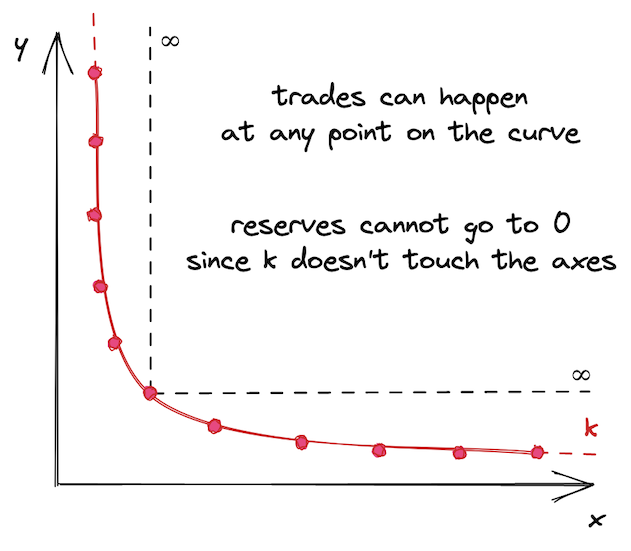
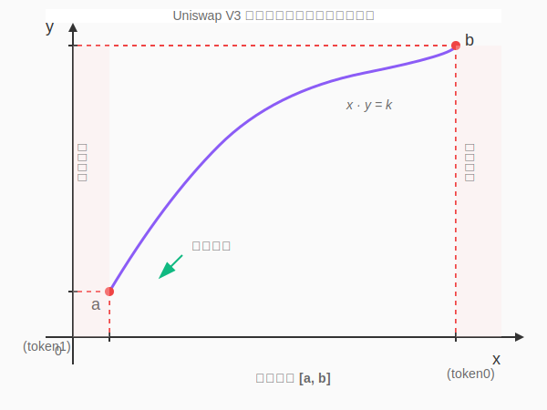
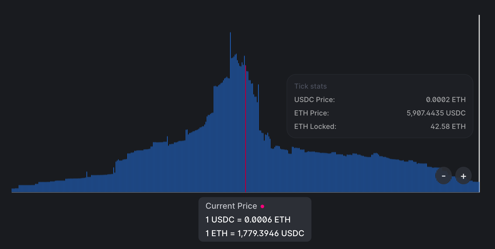

# UniswapV3 技术学习系列（三）：UniswapV3 核心创新

## 系列介绍

本文是 UniswapV3 技术学习系列的第三篇。在前两篇文章中,我们学习了 AMM 的基本原理和恒定乘积公式的数学基础。现在，我们将深入探讨 **Uniswap V3 的革命性创新**——集中流动性（Concentrated Liquidity）机制。

本文基于 [Uniswap V3 白皮书](https://uniswap.org/whitepaper-v3.pdf) 的核心思想进行讲解。即使您暂时无法完全理解所有概念也没关系，在后续将这些理论转化为代码的过程中，一切都会变得更加清晰。

> **原文链接：** [Introduction to Uniswap V3 - Uniswap V3 Development Book](https://uniswapv3book.com/milestone_0/uniswap-v3.html)

---

## 一、V2 的局限性：资金效率问题

### 1.1 通用化的代价

Uniswap V2 是一个**通用型交易所**，它使用单一的 AMM 算法处理所有交易对。这种设计简洁优雅，但也带来了一个根本性问题：**并非所有交易对都是平等的**。

我们可以根据**价格波动性**将交易对分为两大类：

**1. 中高波动性代币对**
- 包含大多数加密货币
- 价格不与任何资产挂钩
- 受市场供需剧烈影响
- 示例：ETH/USDC、WBTC/ETH、UNI/ETH

**2. 低波动性代币对**
- 主要是锚定资产（Pegged Assets）
- 价格相对稳定，波动极小
- 示例：
  - 稳定币对：USDC/USDT、USDC/DAI、USDT/DAI
  - 衍生品对：ETH/stETH、ETH/rETH（质押 ETH 的变体）

### 1.2 稳定币交易的特殊需求

这两类交易对需要**完全不同的池子配置**。以稳定币对为例：

**核心需求：**
- USDC 和 USDT 的价格必须始终接近 1:1
- 即使是大额交易（百万级美元），价格也不能偏离太多
- 需要**极高的流动性深度**来减少需求效应（我们在上一章学过）

**V2 的困境：**
- V2 的通用 AMM 算法不能很好地支持稳定币交易
- 相同资金量，价格滑点比专业稳定币 DEX（如 Curve）大得多
- 这导致稳定币交易者更倾向于使用 Curve

### 1.3 无限流动性的悖论

造成这个问题的根本原因是：**Uniswap V2 的流动性在全价格范围（0 → ∞）均匀分布**。



**看似优点，实则浪费：**

这可能看起来不是坏事——池子可以支持任何价格的交易。但这导致了**极低的资金利用率**。

让我们看一个现实数据：
- **ETH 历史价格区间**：$0.75 - $4,800（根据 CoinMarketCap）
- **当前价格**（2022年6月）：$1,800
- **理论价格区间**：$0 - $∞

**思考一个问题：**
- 今天，会有人以 $5,000 的价格买 1 ETH 吗？
- 会有人以 $0.10 的价格卖 ETH 吗？

答案显然是**不会**。那么，在这些永远不会到达的价格区间提供流动性有什么意义呢？

> 💭 **信仰与现实**  
> 当然，我们都相信 ETH 总有一天会到达 $10,000！但在那之前，$8,000 - $15,000 区间的流动性确实是闲置的。

### 1.4 资金效率问题

**V2 的资金利用困境：**

假设一个 ETH/USDC 池：
- 总流动性：1,000 ETH + 1,800,000 USDC
- 当前价格：$1,800
- 90% 的交易发生在 $1,600 - $2,000 区间
- 但流动性均匀分布在 $0 - $∞

**结果：**
- 只有约 **5% 的流动性**在活跃交易区间
- 其余 95% 的资金处于"待命"状态
- LP 的资金效率极低

这就是 V3 要解决的核心问题！

---

## 二、集中流动性：V3 的革命性创新

### 2.1 核心理念

Uniswap V3 引入了**集中流动性（Concentrated Liquidity）**机制，其核心思想极其简单却异常强大：

> **让流动性提供者（LP）自主选择提供流动性的价格区间**

这个看似简单的改变，带来了三大革命性突破：

**1. 资金效率飞跃**
- 将流动性集中在活跃交易区间
- 相同资金获得更高的手续费收入
- 理论上可实现 **4000 倍** 资金效率提升

**2. 多样化配置**
- 稳定币对：集中在 0.99 - 1.01 的窄区间
- 主流币对：集中在当前价格附近的宽区间
- 长尾币对：根据预期波动灵活配置

**3. 个性化策略**
- 激进策略：窄区间，高收益，高风险
- 保守策略：宽区间，稳定收益，低风险
- 专业策略：多个区间组合，精细化管理

### 2.2 V3 是"许多小 V2"的组合

理解 V3 的最佳角度是：

> **一个 V3 交易对 = 许多个小的 V2 交易对的集合**

**V2 与 V3 的核心差异：**

| 特性 | Uniswap V2 | Uniswap V3 |
|------|-----------|-----------|
| **价格区间** | 1 个（0 → ∞） | 多个有限区间 |
| **储备量** | 无限延伸 | 每个区间有限 |
| **流动性分布** | 均匀分布 | 按需分布 |
| **工作原理** | x·y = k | 在每个小区间内仍是 x·y = k |

**关键洞察：**
- V3 将 0 → ∞ 拆分成多个短区间：[0, 100], [100, 200], [200, 300]...
- 每个短区间都有独立的流动性
- **在单个区间内部，运作方式与 V2 完全相同**
- 只是区间边界明确，储备量有限

### 2.3 价格区间的可视化

让我们将抽象概念转化为直观的图形。我们不希望曲线无限延伸，而是在点 `a` 和 `b` 处截断它，并将这些点定义为曲线的边界。此外，我们将曲线平移，使边界位于坐标轴上：



**这就是一个 V3 的价格区间！**

> 🙂 **它看起来有点孤单，不是吗？**  
> 这就是为什么 V3 中有**很多**这样的价格区间——这样它们就不会孤单了！

### 2.4 区间耗尽与价格滑移

**流动性耗尽机制：**

回顾上一篇文章，买卖代币会使价格沿着曲线移动。在 V3 中，价格区间**限制了价格的移动范围**。

**当价格触及区间边界时会发生什么？**

假设当前价格在曲线中点：

**移动到边界 a（下限）：**
- 需要买入所有可用的 `y`（token1）
- 最大化区间内的 `x`（token0）
- 此时区间内**只剩下 token0**
- 无法继续购买 token1

**移动到边界 b（上限）：**
- 需要买入所有可用的 `x`（token0）
- 最大化区间内的 `y`（token1）
- 此时区间内**只剩下 token1**
- 无法继续购买 token0

**区间耗尽的结果：**
- 池子进入"单边状态"（只有一种代币）
- 该区间无法继续支持当前方向的交易
- 价格必须滑移到下一个区间

> 💡 **创新应用：限价单功能**  
> 这个特性使得 V3 的价格区间可以被用作**限价订单**！LP 可以在特定价格区间提供单边流动性，当价格穿过时自动完成兑换。

### 2.5 跨区间交易

**当交易过程中区间耗尽怎么办？**

**场景一：下一个区间存在**
- 价格自动滑移到下一个价格区间
- 继续使用下一区间的流动性完成交易
- 交易者可能面临更大的滑点

**场景二：下一个区间不存在**

- 交易**部分成交**
- 只能兑换当前区间允许的最大数量
- 剩余部分无法成交

我们将在后续章节详细实现这一机制。

### 2.6 真实世界的流动性分布

让我们看看 Uniswap V3 主网上真实的流动性分布情况：

**USDC/ETH 池的流动性图：**



**关键观察：**

1. **当前价格附近流动性极高**
   - LP 希望在活跃交易区获得更多手续费
   
2. **离当前价格越远，流动性越少**
   - 远离价格的区间被触及概率低
   - LP 追求更高的资金效率

3. **价格范围是有限的**
   - 不再是 0 → ∞
   - 上限和下限清晰可见

4. **呈现正态分布特征**
   - 符合概率分布规律
   - 市场化的自然选择结果

---

## 三、V3 的数学原理：增强版公式

### 3.1 数学基础：继承与创新

Uniswap V3 的数学基础仍然是 V2，但进行了**巧妙的增强**：

**保持不变：**

- 恒定乘积公式 `x · y = k` 仍然是核心
- 供需平衡的经济学原理不变
- 价格发现机制保持一致

**创新增强：**

- 引入新的数学抽象
- 优化跨区间转换
- 简化流动性管理
- 避免舍入误差

### 3.2 流动性 L：几何平均数

为了处理价格区间转换、简化流动性管理并避免舍入误差，Uniswap V3 引入了新的数学概念：

**新概念：流动性的量化指标**
$$
L = \sqrt{x \cdot y}
$$

**理解 L 的含义：**

在 V2 中，我们知道：
- 流动性由两个代币储备量 `(x, y)` 表示
- 它们的乘积是常数 `k`
- 但两个数字不便于统一描述

在 V3 中，L 提供了一个**单一数值**来表示流动性：
- L 是 `x` 和 `y` 的**几何平均数**
- 满足 `L² = x · y = k`
- 是一个更优雅的流动性度量

**为什么使用几何平均数？**

| 平均数类型 | 公式 | 特点 |
|----------|------|------|
| 算术平均 | (x + y) / 2 | 对极值敏感 |
| 几何平均 | √(x · y) | 保持乘积不变性 |

几何平均数完美匹配恒定乘积的性质！

### 3.3 平方根价格 √P：巧妙的设计

**新概念：使用价格的平方根**
$$
\sqrt{P} = \sqrt{\frac{y}{x}}
$$

其中：
- `y/x` 是 `token0` 以 `token1` 表示的价格
- 由于池中代币价格互为倒数，我们只需使用其中一个（按照惯例 V3 使用 `y/x`）
- token1 相对于 token0 的价格是 `1/(y/x) = x/y`
- 同样地，`√P` 的倒数是 `1/√P = √(x/y)`

**为什么要使用 √P 而不是 P？**

这个设计有两个深刻的原因：

**原因 1：避免精度损失**

- 平方根计算会产生舍入误差
- 如果每次都计算 √P，误差会累积
- 直接**存储 √P**，避免重复计算
- 合约中不需要存储 `x` 和 `y`

**原因 2：与 L 的优雅关系**

√P 与 L 之间有一个美妙的数学关系：

$$
L = \frac{\Delta y}{\Delta \sqrt{P}}
$$

**这意味着：**
- L 是输出量变化与 √P 变化的比率
- 给定 L 和 Δ√P，可以直接算出 Δy
- 无需追踪和更新 x、y 储备量

### 3.4 数学证明：L 与 √P 的关系

让我们严格证明上述关系：

**目标：**
证明
$$
L = \frac{\Delta y}{\Delta \sqrt{P}}
$$
**证明过程：**
$$
\begin{align}
L &= \frac{\Delta y}{\Delta \sqrt{P}} \\
\sqrt{x \cdot y} &= \frac{y_1 - y_0}{\sqrt{P_1} - \sqrt{P_0}} \\
\sqrt{x \cdot y} \cdot (\sqrt{P_1} - \sqrt{P_0}) &= y_1 - y_0 \\
\end{align}
$$

将 
$$
\sqrt{P} = \sqrt{\frac{y}{x}}
$$
代入
$$
\sqrt{x \cdot y} \cdot \left(\sqrt{\frac{y_1}{x_1}} - \sqrt{\frac{y_0}{x_0}}\right) = y_1 - y_0
$$

由于恒定乘积性质：

$$
\sqrt{x_1 \cdot y_1} = \sqrt{x_0 \cdot y_0} = L
$$


$$
\begin{align}
L \cdot \left(\frac{\sqrt{y_1}}{\sqrt{x_1}} - \frac{\sqrt{y_0}}{\sqrt{x_0}}\right) &= y_1 - y_0 \\
\frac{L \sqrt{y_1}}{\sqrt{x_1}} - \frac{L \sqrt{y_0}}{\sqrt{x_0}} &= y_1 - y_0 \\
\end{align}
$$

由于
$$
L = \sqrt{x_1 \cdot y_1} = \sqrt{x_0 \cdot y_0}
$$


$$
\begin{align}
\frac{\sqrt{x_1 y_1} \sqrt{y_1}}{\sqrt{x_1}} - \frac{\sqrt{x_0 y_0} \sqrt{y_0}}{\sqrt{x_0}} &= y_1 - y_0 \\
\sqrt{y_1^2} - \sqrt{y_0^2} &= y_1 - y_0 \\
y_1 - y_0 &= y_1 - y_0 \quad \checkmark
\end{align}
$$

**证毕！**

---

## 四、V3 定价公式：基于 L 和 √P

### 4.1 告别储备量追踪

在 V2 中，我们需要：
- 存储并更新 `x` 和 `y`
- 每次交易后重新计算储备量
- 维护两个状态变量

在 V3 中，我们只需要：
- 存储 `L`（流动性）
- 存储 `√P`（平方根价格）
- 所有计算基于这两个值

**优势：**
- ✅ 减少状态变量
- ✅ 简化存储更新
- ✅ 避免重复开方运算
- ✅ 提高计算精度

### 4.2 输出量计算公式

从前面证明的关系式，我们可以直接得出：

**当已知输入导致的价格变化时，计算输出量：**

$$
\Delta y = \Delta \sqrt{P} \cdot L
$$

> 参见上面证明中的第三步

**解读：**
- `Δy`：输出的 token1 数量
- `Δ√P`：平方根价格的变化量
- `L`：当前价格区间的流动性

**示例计算：**

假设：
- L = 1,000,000
- 初始 √P = 50
- 交易后 √P = 51
- Δ√P = 1

则输出量：
$$
\Delta y = 1 \times 1,000,000 = 1,000,000 \text{ token1}
$$

### 4.3 输入量计算公式

由于池中两种代币的价格互为倒数，我们有：

$$
\Delta x = L \cdot \Delta \left(\frac{1}{\sqrt{P}}\right)
$$

**解读：**
- `Δx`：输入的 token0 数量
- 使用 1/√P 的变化量
- 保持与 Δy 公式的对称性

### 4.4 无需重复计算 √P

**关键优化：**

L 和 √P 使我们无需存储和更新池的储备量。此外，我们不需要每次都计算 √P，因为我们总能找到 Δ√P 及其倒数。

**计算流程：**

```
1. 读取当前 √P₀
2. 计算交易后的 √P₁
3. 计算 Δ√P = √P₁ - √P₀
4. 使用公式计算 Δy 或 Δx
5. 更新存储的 √P 为 √P₁
```

这种设计极大地提高了 Gas 效率！

---

## 五、Tick 机制：离散化价格空间

### 5.1 Tick 的基本概念

在本章开头，我们学习了 V3 如何将无限价格区间拆分成有限的短区间。现在的问题是：**如何追踪这些区间的边界？**

Uniswap V3 使用 **Tick（刻度）** 系统来标记价格区间的边界。

**Tick 系统的特点：**
- 整个价格范围被**均匀分布的离散刻度**划分
- 每个 Tick 有一个**索引 `i`**
- 每个 Tick 对应一个**确定的价格**

### 5.2 Tick 与价格的关系

**核心公式：**

$$
p(i) = 1.0001^i
$$

其中：
- `p(i)` 是 Tick `i` 对应的价格
- `i` 是 Tick 的索引（可以是正数或负数）

**为什么选择 1.0001？**

取 1.0001 的幂次有一个理想的特性：**相邻两个 Tick 之间的价格差异是 0.01%，即 1 个基点（Basis Point）**。

> 📊 **金融术语：基点（Basis Point）**  
> - 1 基点 = 1/100 的 1% = 0.01% = 0.0001
> - 是金融领域中百分比的标准计量单位
> - 您可能在央行宣布利率变动时听说过"加息 25 个基点"

**Tick 间隔示例：**


| Tick 索引 | 价格 p(i) | 与前一个 Tick 的差异 |
|----------|----------|-------------------|
| -2 | 1.0001⁻² ≈ 0.99980 | - |
| -1 | 1.0001⁻¹ ≈ 0.99990 | +0.01% |
| 0 | 1.0001⁰ = 1.00000 | +0.01% |
| 1 | 1.0001¹ ≈ 1.00010 | +0.01% |
| 2 | 1.0001² ≈ 1.00020 | +0.01% |

### 5.3 使用 √P 的 Tick 公式

正如我们前面讨论的，Uniswap V3 存储的是 √P，而不是 P。因此，实际的公式是：

$$
\sqrt{p(i)} = \sqrt{1.0001^i} = \sqrt{1.0001}^i = 1.0001^{i/2}
$$

**具体数值：**

$$
\begin{align}
\sqrt{p(0)} &= 1.0001^0 = 1 \\
\sqrt{p(1)} &= \sqrt{1.0001} \approx 1.00005 \\
\sqrt{p(-1)} &= \frac{1}{\sqrt{1.0001}} \approx 0.99995 \\
\end{align}
$$

### 5.4 Tick 的范围限制

**Tick 不是无限的：**

Tick 是整数，可以是正数或负数，但有其范围限制。

**存储格式：Q64.96 定点数**

Uniswap V3 将 √P 存储为 **Q64.96 定点数**，这是一种有理数表示法：
- **64 位**用于整数部分
- **96 位**用于小数部分
- 总共 160 位

**价格范围：**

由于 
$$
P = (\sqrt{P})^2
$$
价格范围是：

$$
P \in [2^{-128}, 2^{128}]
$$

这是一个极其宽广的范围：
- 最小价格：约 
$$
2.9 \times 10^{-39}
$$
（接近0）
- 最大价格：约 
$$
3.4 \times 10^{38}
$$
（天文数字）

**Tick 范围：**

相应地，Tick 的索引范围是：

$$
i \in [\log_{1.0001} 2^{-128}, \log_{1.0001} 2^{128}] = [-887272, 887272]
$$

**解读：**
- 最小 Tick：-887,272
- 最大 Tick：+887,272
- 总共约 177 万个可用 Tick
- 足以覆盖任何现实世界的资产价格

### 5.5 Tick Spacing：间隔优化

在实际实现中，并不是所有 Tick 都会被使用。Uniswap V3 引入了 **Tick Spacing（Tick 间隔）** 的概念：

**根据费率档次，使用不同的 Tick 间隔：**

| 费率档次 | Tick Spacing | 适用场景 |
|---------|-------------|---------|
| 0.05% | 10 | 稳定币对（USDC/USDT） |
| 0.30% | 60 | 主流币对（ETH/USDC） |
| 1.00% | 200 | 高波动/低流动性币对 |

**Tick Spacing 的作用：**

1. **减少存储需求**
   - 只有间隔倍数的 Tick 可用
   - 例如 spacing=10，则只有 ..., -20, -10, 0, 10, 20, ... 可用

2. **Gas 优化**
   - 减少需要遍历的 Tick 数量
   - 降低跨 Tick 交易的计算成本

3. **流动性聚合**
   - 将流动性集中到更少的 Tick 上
   - 提高单个 Tick 的流动性深度

---

## 六、V3 核心创新总结

### 6.1 关键概念回顾

恭喜！您已经掌握了 Uniswap V3 的核心创新理念。让我们回顾一下关键要点：

**1. 集中流动性（Concentrated Liquidity）**

- LP 可以选择特定价格区间提供流动性
- 资金效率提升高达 4000 倍
- 支持稳定币、主流币、长尾币的差异化配置

**2. 数学创新**

- 流动性 L = √(x · y)：几何平均数表示法
- 平方根价格 √P = √(y/x)：避免重复计算
- 优雅关系 L = Δy / Δ√P

**3. Tick 机制**
- 价格空间离散化为均匀分布的 Tick
- p(i) = 1.0001^i，相邻 Tick 差 0.01%
- Tick 范围：[-887272, 887272]

**4. 定价公式**
- Δy = Δ√P · L（token1 输出）
- Δx = L · Δ(1/√P)（token0 输入）
- 无需存储和更新 x、y 储备量

### 6.2 V2 与 V3 对比总结

| 维度 | Uniswap V2 | Uniswap V3 |
|------|-----------|-----------|
| **价格区间** | 0 → ∞ | 多个有限区间 |
| **流动性分布** | 均匀分布 | 集中在选定区间 |
| **LP Token** | ERC20（同质化） | ERC721（非同质化 NFT） |
| **资金效率** | 基准 | 最高 4000x |
| **手续费档次** | 固定 0.30% | 0.05%/0.30%/1.00% |
| **存储变量** | x, y | L, √P |
| **Gas 成本** | 较低 | 稍高（但功能更强大） |
| **复杂度** | 简单 | 复杂 |

### 6.3 V3 的权衡取舍

**优势：**
- ✅ 显著提升资金利用率
- ✅ 灵活的个性化策略
- ✅ 更好的稳定币交易体验
- ✅ NFT 形式的可组合流动性

**挑战：**

- ⚠️ LP 管理复杂度增加
- ⚠️ 需要主动管理价格区间
- ⚠️ 价格移出区间时收益停止
- ⚠️ 无常损失可能更明显

---

## 七、深入学习资源

### 7.1 数学原理深度解析

如果您想更深入地理解 Uniswap V3 的数学原理，强烈推荐阅读：

📄 **[Uniswap V3 的数学 - Atis Elsts 技术笔记](https://atiselsts.github.io/pdfs/uniswap-v3-liquidity-math.pdf)**

这篇技术笔记提供了：
- 完整的数学推导
- 定点数运算的详细解释
- 流动性计算的算法实现
- 实用的编程指南

### 7.2 理解定点数运算

V3 大量使用定点数（Fixed-Point Numbers），特别是 Q64.96 和 Q128.128 格式：

**为什么需要定点数？**

- Solidity 不原生支持浮点数
- 整数运算会损失精度
- 定点数提供固定精度的小数表示

**Q64.96 格式：**
- 总共 160 位（20 字节）
- 前 64 位：整数部分
- 后 96 位：小数部分
- 精度：约小数点后 29 位

我们将在后续章节详细讲解定点数运算的实现。

---

## 八、实践思考题

在进入代码实现之前，请思考以下问题：

**1. 流动性集中策略**

- 如果您是 LP，会选择多宽的价格区间？
- 如何平衡收益与风险？
- 多个小区间 vs 一个大区间，哪个更好？

**2. 数学实现**
- Solidity 中如何实现平方根运算？
- 定点数乘法如何避免溢出？
- Tick 到价格的转换如何优化？

**3. Gas 优化**
- 跨 Tick 交换如何减少 Gas 消耗？
- 存储读写如何优化？
- 批量操作如何设计？

**4. 极端情况**
- 如果价格移出所有流动性区间会怎样？
- 如果单个 Tick 包含巨量流动性呢？
- 价格快速波动时如何保护 LP？

---

## 相关资源

### 官方文档
- [Uniswap V3 白皮书](https://uniswap.org/whitepaper-v3.pdf) - V3 完整技术规范
- [Uniswap V3 官方文档](https://docs.uniswap.org/protocol/concepts/V3-overview/concentrated-liquidity) - 集中流动性详解
- [Uniswap V3 Core 代码库](https://github.com/Uniswap/v3-core) - 核心合约源码

### 学习教程
- [Uniswap V3 Development Book](https://uniswapv3book.com/) - **本系列主要参考教程**
- [Uniswap V3 数学原理](https://atiselsts.github.io/pdfs/uniswap-v3-liquidity-math.pdf) - Atis Elsts 技术笔记
- [定点数运算详解](https://en.wikipedia.org/wiki/Fixed-point_arithmetic) - Wikipedia

### 系列项目对比学习
- [UniswapV1 技术学习](https://github.com/RyanWeb31110/uniswapv1_tech) - 理解基础 AMM
- [UniswapV2 技术学习](https://github.com/RyanWeb31110/uniswapv2_tech) - 学习恒定乘积公式
- [UniswapV3 技术学习](https://github.com/RyanWeb31110/uniswapv3_tech) - **掌握集中流动性**

### 拓展阅读
- [Uniswap V3: The Universal AMM](https://uniswap.org/blog/uniswap-v3) - 官方发布博客
- [Understanding Uniswap V3](https://research.paradigm.xyz/uniswapv3) - Paradigm 研究报告
- [Uniswap V3 安全审计](https://github.com/Uniswap/v3-core/tree/main/audits) - 多家审计报告

---

## 项目仓库

https://github.com/RyanWeb31110/uniswapv3_tech
