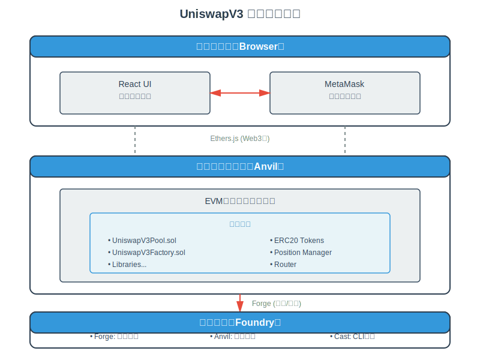

# UniswapV3 技术学习系列（四）：开发环境搭建

## 系列介绍

本文是 UniswapV3 技术学习系列的第四篇。在前三篇文章中，我们深入学习了 AMM 的理论基础、恒定乘积公式的数学原理，以及 Uniswap V3 的革命性创新。从本文开始，我们将进入**实战开发阶段**！

在正式编写智能合约代码之前，我们需要搭建一个完整的开发环境。本文将详细介绍以太坊智能合约开发的核心工具链，特别是 **Foundry 框架**——目前最现代化、最高效的 Solidity 开发工具。

> **原文链接：** [Development Environment - Uniswap V3 Development Book](https://uniswapv3book.com/milestone_0/dev-environment.html)

---

## 一、项目架构概览

### 1.1 双层应用架构

我们将构建一个完整的去中心化交易所，它由两个独立但相互协作的应用组成：

**链上应用（On-chain）**

- **本质**：部署在以太坊区块链上的智能合约集合
- **语言**：Solidity
- **特点**：不可变、去中心化、透明可审计
- **核心内容**：
  - UniswapV3Pool：核心池子合约
  - UniswapV3Factory：工厂合约
  - 各种数学库和辅助合约

**链下应用（Off-chain）**
- **本质**：运行在用户浏览器中的前端界面
- **语言**：JavaScript/TypeScript + React
- **特点**：可随时更新、用户友好
- **核心功能**：
  - 可视化交易界面
  - 钱包连接
  - 交易数据展示

### 1.2 前端应用的定位

> 📌 **重要说明**  
> 虽然前端应用开发是本系列的一部分，但**不是我们的核心关注点**。我们构建前端应用的主要目的是：
> - 演示如何与智能合约交互
> - 提供直观的测试界面
> - 理解 DApp 的完整工作流程
>
> 前端代码是**可选的**，但我会提供完整的实现代码供参考。

### 1.3 技术栈全景



---

## 二、以太坊基础知识

### 2.1 以太坊不是云服务器

很多开发者初次接触以太坊时，会将它类比为 AWS 或阿里云。但以太坊与传统云服务有着本质区别：

| 对比维度 | 传统云服务（AWS/阿里云） | 以太坊区块链 |
|---------|------------------------|-------------|
| **托管费用** | 按时间/流量付费 | 不收取托管费 |
| **部署成本** | 免费或极低 | 需支付 Gas 费用 |
| **代码更新** | 随时更新 | 部署后不可修改（不可变性） |
| **使用计费** | 开发者承担 | 用户为每次交易付费 |
| **数据存储** | 中心化数据库 | 分布式账本 |
| **访问控制** | 需要授权 | 无需许可（Permissionless） |

### 2.2 以太坊的核心组成

**数据库层：账户状态**

以太坊的核心是一个**分布式数据库**，其中最重要的数据是**账户状态（Account State）**。每个以太坊地址都是一个账户，包含以下信息：

```solidity
// 账户的数据结构（概念示意）
struct Account {
    uint256 balance;      // 余额：账户的 ETH 余额
    bytes code;           // 代码：智能合约的字节码
    mapping storage;      // 存储：合约的状态变量
    uint256 nonce;        // Nonce：防止重放攻击的计数器
}
```

**1. Balance（余额）**

- 账户持有的 ETH 数量
- 以 Wei 为单位（1 ETH = 10^18 Wei）

**2. Code（代码）**
- 如果是合约账户，存储合约的字节码
- 外部账户（EOA）此字段为空

**3. Storage（存储）**
- 合约的状态变量存储空间
- 键值对形式，持久化存储

**4. Nonce（随机数）**
- 外部账户：已发送的交易数量
- 合约账户：创建的合约数量

**安全保障：**

以太坊的主要职责是以**安全的方式**构建和维护这些数据，确保：
- 不允许未经授权的访问
- 任何修改都经过验证和共识
- 数据不可篡改和伪造

### 2.3 去中心化网络

以太坊不仅是一个数据库，更是一个**去中心化的计算机网络**：

**网络特点：**
- 由全球数千个独立节点组成
- 每个节点独立维护完整的状态副本
- 通过共识机制达成一致

**去中心化的核心目标：**

> **没有任何单一权威可以单方面修改数据库中的任何内容**

这是通过**共识机制（Consensus）** 实现的：
- 所有节点遵循相同的规则集
- 任何试图违反规则的节点会被网络排斥
- 修改需要网络的集体同意

> 💡 **有趣的事实**  
> 区块链可以使用 MySQL 作为底层数据库！理论上没有任何技术障碍，只是性能问题。实际上，以太坊使用的是 **LevelDB**——一个由 Google 开发的高性能键值数据库。

### 2.4 以太坊虚拟机（EVM）

**EVM 的本质：**

每个以太坊节点都运行 **EVM（Ethereum Virtual Machine，以太坊虚拟机）**：
- 虚拟机是"运行其他程序的程序"
- EVM 是专门执行智能合约的虚拟机
- 所有节点运行相同的 EVM，确保结果一致

**交易与智能合约：**

用户通过**交易（Transaction）** 与合约交互：

```javascript
// 交易的组成部分
{
  from: "0x发送者地址",
  to: "0x合约地址",
  value: "0", // 发送的 ETH 数量
  data: "0x函数选择器+参数编码", // 调用数据
  gasLimit: 100000,
  gasPrice: "20000000000"
}
```

**交易数据包含：**
1. **函数选择器**：要调用的合约函数（编码后的函数名）
2. **参数编码**：函数的输入参数（ABI 编码）

**交易流程：**
1. 交易被打包到区块中
2. 矿工（或验证者）挖矿/验证区块
3. 网络中的每个节点都可以验证交易和区块
4. 交易被执行，状态被更新

### 2.5 智能合约 vs JSON API

理解智能合约的最佳类比是 **JSON API**：

| JSON API | 智能合约 |
|----------|----------|
| HTTP 端点 | 合约地址 |
| GET/POST 请求 | 交易 |
| 调用函数 | 调用合约函数 |
| 传递参数 | 提供函数参数 |
| 后端逻辑 | 合约代码 |
| 修改数据库 | 修改合约存储 |

**关键区别：**

| 特性 | JSON API | 智能合约 |
|-----|---------|----------|
| **状态修改** | 直接调用 | 需要发送交易 |
| **费用** | 通常免费或固定费用 | 每次交易付 Gas 费 |
| **响应速度** | 毫秒级 | 秒到分钟级 |
| **数据读取** | HTTP GET | 免费的合约调用 |
| **修改权限** | 开发者控制 | 代码逻辑控制 |

### 2.6 JSON-RPC API

以太坊节点对外暴露 **JSON-RPC API**，允许我们：

**查询操作（免费）：**

- `eth_getBalance`：获取账户余额
- `eth_getBlockByNumber`：获取区块信息
- `eth_call`：模拟合约调用（不发送交易）
- `eth_estimateGas`：估算交易的 Gas 消耗

**交易操作（需要付费）：**
- `eth_sendTransaction`：发送交易
- `eth_sendRawTransaction`：发送已签名的原始交易

**完整的 API 列表：** [Ethereum JSON-RPC API](https://ethereum.org/en/developers/docs/apis/json-rpc/)

---

## 三、智能合约开发工具

### 3.1 主流开发框架对比

目前以太坊生态中有三大主流开发框架：

**1. Truffle（老牌框架）**
- 历史最悠久（2015年发布）
- 使用 JavaScript 编写测试
- 社区活跃度下降
- ❌ 不推荐新项目使用

**2. Hardhat（主流选择）**
- Truffle 的现代化改进版
- 目前使用最广泛
- 丰富的插件生态
- ⚠️ 测试需要在 JavaScript 和 Solidity 之间切换

**3. Foundry（新锐框架）** ⭐ **本项目选择**

- 新一代开发工具（2021年发布）
- 使用 Solidity 编写测试
- 极快的编译和测试速度
- ✅ 强烈推荐，正在成为新标准

### 3.2 为什么选择 Foundry？

虽然 Hardhat 仍然是最流行的解决方案，但越来越多的项目正在迁移到 Foundry。原因如下：

**优势 1：Solidity 原生测试**

```solidity
// Foundry 测试（Solidity）
function testMint() public {
    uint256 amount = 1000;
    pool.mint(address(this), amount);
    assertEq(pool.balanceOf(address(this)), amount);
}
```

vs

```javascript
// Hardhat 测试（JavaScript）
it("should mint tokens", async () => {
    const amount = ethers.BigNumber.from("1000");
    await pool.mint(await signer.getAddress(), amount);
    expect(await pool.balanceOf(await signer.getAddress()))
        .to.equal(amount);
});
```

**Foundry 的优势：**

- ✅ 无需在 JS 和 Solidity 之间切换
- ✅ 不需要特殊的 `BigNumber` 类型
- ✅ 原生支持所有 Solidity 特性
- ✅ 类型安全，编译时检查错误

**优势 2：极速测试执行**

| 框架 | 测试方式 | 速度 |
|------|---------|------|
| Hardhat/Truffle | 启动本地节点 → 发送交易 → 挖矿 | 慢 🐢 |
| Foundry | 在内置 EVM 中直接执行 | 快 🚀 |

**性能对比：**
- Hardhat：100个测试需要 ~30秒
- Foundry：100个测试需要 ~2秒

**优势 3：强大的状态模拟**

Foundry 提供丰富的 **Cheatcodes（作弊码）** 来模拟区块链状态：

```solidity
// 模拟账户余额
vm.deal(alice, 100 ether);

// 模拟从其他地址调用
vm.prank(alice);
pool.swap(...);

// 在任意地址部署合约
vm.etch(address(pool), bytecode);

// 时间旅行
vm.warp(block.timestamp + 1 days);

// 快照和回滚
uint256 snapshot = vm.snapshot();
// ... 执行一些操作
vm.revertTo(snapshot);
```

### 3.3 Foundry 工具链

Foundry 是一个**工具集合**，包含三个核心工具：

**1. Forge（测试框架）** 🔨

核心功能：
- 编译 Solidity 合约
- 运行测试（使用 Solidity）
- 生成 Gas 报告
- 代码覆盖率分析
- Fuzzing 测试

常用命令：
```bash
forge build              # 编译合约
forge test               # 运行所有测试
forge test -vvv          # 详细输出
forge test --gas-report  # Gas 使用报告
forge coverage           # 代码覆盖率
```

**2. Anvil（本地节点）** ⚓

特点：
- 专为开发设计的本地以太坊节点
- 即时挖矿（0秒出块）
- 预置测试账户（带有大量 ETH）
- 支持 Fork 主网状态

启动方式：
```bash
anvil                    # 启动本地节点
anvil --fork-url $RPC    # Fork 主网
```

**3. Cast（命令行工具）** 🎯

实用功能：
- 发送交易
- 查询链上数据
- 编码/解码 ABI
- 单位转换

常用命令：
```bash
cast send <address> <sig> <args>     # 发送交易
cast call <address> <sig> <args>     # 调用函数（不发交易）
cast balance <address>               # 查询余额
cast block-number                    # 当前区块号
cast abi-encode "mint(uint256)" 100  # ABI 编码
```

---

## 四、前端开发工具

### 4.1 Ethers.js：Web3 标准库

**Ethers.js** 是以太坊的 JavaScript SDK，提供了完整的区块链交互能力。

**主要功能：**

```javascript
import { ethers } from 'ethers';

// 1. 连接到节点
const provider = new ethers.providers.JsonRpcProvider(
    'http://localhost:8545'
);

// 2. 创建钱包
const wallet = new ethers.Wallet(privateKey, provider);

// 3. 连接合约
const pool = new ethers.Contract(
    poolAddress,
    poolABI,
    wallet
);

// 4. 读取数据（免费）
const balance = await pool.balanceOf(userAddress);

// 5. 发送交易（需付费）
const tx = await pool.mint(amount);
await tx.wait(); // 等待确认

// 6. 监听事件
pool.on('Mint', (sender, amount) => {
    console.log(`${sender} minted ${amount}`);
});
```

**Ethers.js vs Web3.js：**

| 特性 | Ethers.js | Web3.js |
|------|----------|---------|
| 包大小 | 88 KB | 260 KB |
| API 设计 | 现代、简洁 | 传统、复杂 |
| 文档质量 | 优秀 | 较好 |
| 社区趋势 | 快速增长 | 稳定 |
| 推荐度 | ⭐⭐⭐⭐⭐ | ⭐⭐⭐ |

### 4.2 MetaMask：浏览器钱包

**MetaMask** 是最流行的以太坊浏览器钱包：

**核心功能：**

- 🔐 创建和存储私钥
- 💼 管理多个账户
- 🌐 连接不同网络（主网、测试网、本地节点）
- ✍️ 签署交易和消息
- 🔌 与 DApp 交互

**在我们的项目中：**

- 连接到本地 Anvil 节点
- 签署交易并发送到合约
- 显示交易状态和余额

**添加本地网络到 MetaMask：**

```
网络名称: Localhost 8545
RPC URL: http://localhost:8545
链 ID: 31337
货币符号: ETH
```

### 4.3 React：前端框架

**React** 是最流行的 JavaScript 前端框架之一。

> 📌 **无需担心**  
> 您不需要深入了解 React！我会提供完整的模板应用，您只需要：
>
> - 安装依赖
> - 运行开发服务器
> - 了解如何调用合约函数

**项目结构预览：**
```
ui/
├── src/
│   ├── App.js              # 主应用组件
│   ├── components/
│   │   ├── Pool.js         # 池子交互界面
│   │   ├── Swap.js         # 交换界面
│   │   └── Mint.js         # 添加流动性界面
│   └── hooks/
│       └── useContract.js  # 合约交互 Hook
├── package.json
└── public/
```

---

## 五、项目搭建实战

### 5.1 安装 Foundry

**macOS / Linux：**

```bash
# 使用官方安装脚本
curl -L https://foundry.paradigm.xyz | bash

# 安装最新版本
foundryup
```

**Windows：**

```bash
# 使用 WSL2（推荐）
# 或者下载预编译的二进制文件
# https://github.com/foundry-rs/foundry/releases
```

**验证安装：**

```bash
forge --version
# forge 0.2.0 (...)

anvil --version
# anvil 0.2.0 (...)

cast --version
# cast 0.2.0 (...)
```

### 5.2 创建 Foundry 项目

**步骤 1：初始化项目**

```bash
# 创建项目目录
mkdir uniswapv3_tech
cd uniswapv3_tech

# 初始化 Foundry 项目
forge init
```

> 💡 **VS Code 用户提示**  
> 如果您使用 Visual Studio Code，添加 `--vscode` 参数：
> ```bash
> forge init --vscode
> ```
> Forge 会自动生成 VS Code 的配置文件，提供更好的开发体验。

**步骤 2：项目结构**

Forge 会创建以下目录结构：

```
uniswapv3_tech/
├── foundry.toml           # Foundry 配置文件
├── src/                   # 合约源代码
│   └── Counter.sol        # 示例合约（可删除）
├── test/                  # 测试文件
│   └── Counter.t.sol      # 示例测试（可删除）
├── script/                # 部署脚本
│   └── Counter.s.sol      # 示例脚本（可删除）
└── lib/                   # 依赖库
    └── forge-std/         # Foundry 标准库
```

**步骤 3：清理示例文件**

```bash
# 删除示例文件，为我们的项目腾出空间
rm src/Counter.sol
rm test/Counter.t.sol
rm script/Counter.s.sol
```

### 5.3 配置 foundry.toml

编辑 `foundry.toml` 文件，添加项目配置：

```toml
[profile.default]
src = "src"
out = "out"
libs = ["lib"]
solc_version = "0.8.20"

# 优化器设置
optimizer = true
optimizer_runs = 200

# Gas 报告
gas_reports = ["*"]

# 测试配置
verbosity = 3

# 格式化
[fmt]
line_length = 100
tab_width = 4
bracket_spacing = true

# RPC 端点（用于 Fork 测试）
[rpc_endpoints]
mainnet = "${MAINNET_RPC_URL}"
```

### 5.4 创建前端应用

**步骤 1：使用 Create React App**

```bash
# 在项目根目录执行
npx create-react-app ui
```

> ⏳ **请稍候**  
> 这个过程可能需要几分钟，会下载和安装大量依赖包。

**步骤 2：安装 Ethers.js**

```bash
cd ui
npm install ethers@^5.7.0
```

**步骤 3：验证安装**

```bash
# 启动开发服务器
npm start

# 浏览器会自动打开 http://localhost:3000
# 看到 React 欢迎页面表示安装成功
```

**步骤 4：项目结构**

```
ui/
├── public/
│   ├── index.html
│   └── favicon.ico
├── src/
│   ├── App.js            # 我们将修改这个文件
│   ├── App.css
│   └── index.js
├── package.json
└── node_modules/
```

### 5.5 安装 MetaMask

**步骤 1：安装浏览器扩展**

访问 [MetaMask 官网](https://metamask.io/) 并安装对应浏览器的扩展：
- Chrome/Brave: Chrome Web Store
- Firefox: Firefox Add-ons
- Edge: Edge Add-ons

**步骤 2：创建钱包**

1. 点击"创建钱包"
2. 设置密码
3. **备份助记词**（非常重要！）
4. 确认助记词

**步骤 3：添加本地网络**

1. 点击 MetaMask 顶部的网络下拉菜单
2. 选择"添加网络" → "手动添加网络"
3. 填写以下信息：
   ```
   网络名称: Localhost 8545
   新 RPC URL: http://127.0.0.1:8545
   链 ID: 31337
   货币符号: ETH
   ```
4. 保存

---

## 六、验证开发环境

### 6.1 测试 Forge

**创建一个简单的合约：**

```bash
# 在项目根目录
cat > src/Hello.sol << 'EOF'
// SPDX-License-Identifier: MIT
pragma solidity ^0.8.20;

contract Hello {
    string public greeting = "Hello, Uniswap V3!";
    
    function setGreeting(string memory _greeting) public {
        greeting = _greeting;
    }
}
EOF
```

**编译合约：**

```bash
forge build

# 输出：
# [⠊] Compiling...
# [⠒] Compiling 1 files with 0.8.20
# [⠢] Solc 0.8.20 finished in 1.23s
# Compiler run successful!
```

**创建测试：**

```bash
cat > test/Hello.t.sol << 'EOF'
// SPDX-License-Identifier: MIT
pragma solidity ^0.8.20;

import "forge-std/Test.sol";
import "../src/Hello.sol";

contract HelloTest is Test {
    Hello hello;
    
    function setUp() public {
        hello = new Hello();
    }
    
    function testInitialGreeting() public {
        assertEq(hello.greeting(), "Hello, Uniswap V3!");
    }
    
    function testSetGreeting() public {
        hello.setGreeting("Hello, World!");
        assertEq(hello.greeting(), "Hello, World!");
    }
}
EOF
```

**运行测试：**

```bash
forge test -vv

# 输出：
# Running 2 tests for test/Hello.t.sol:HelloTest
# [PASS] testInitialGreeting() (gas: 12345)
# [PASS] testSetGreeting() (gas: 23456)
# Suite result: ok. 2 passed; 0 failed; 0 skipped; finished in 4.52ms (2.11ms CPU time)
```

### 6.2 测试 Anvil

**启动本地节点：**

```bash
anvil

# 输出：
#                              _   _
#                             (_) | |
#       __ _   _ __   __   __  _  | |
#      / _` | | '_ \  \ \ / / | | | |
#     | (_| | | | | |  \ V /  | | | |
#      \__,_| |_| |_|   \_/   |_| |_|
#
# Available Accounts
# ==================
# (0) 0xf39Fd6e51aad88F6F4ce6aB8827279cffFb92266 (10000 ETH)
# (1) 0x70997970C51812dc3A010C7d01b50e0d17dc79C8 (10000 ETH)
# ...
#
# Listening on 127.0.0.1:8545
```

**在新终端测试连接：**

```bash
# 查询区块号
cast block-number
# 输出：0

# 查询账户余额
cast balance 0xf39Fd6e51aad88F6F4ce6aB8827279cffFb92266
# 输出：10000000000000000000000（10000 ETH in Wei）
```

### 6.3 测试完整工作流

**部署合约到本地节点：**

```bash
# 确保 Anvil 正在运行

# 部署 Hello 合约（注意：必须添加 --broadcast 参数才能真正部署）
forge create src/Hello.sol:Hello \
    --rpc-url http://localhost:8545 \
    --private-key 0xac0974bec39a17e36ba4a6b4d238ff944bacb478cbed5efcae784d7bf4f2ff80 \
    --broadcast
```

**输出示例：**

```
[⠊] Compiling...
No files changed, compilation skipped
Deployer: 0xf39Fd6e51aad88F6F4ce6aB8827279cffFb92266
Deployed to: 0x5FbDB2315678afecb367f032d93F642f64180aa3
Transaction hash: 0x...
```

> 📌 **重要提示**
>
> - **必须添加 `--broadcast` 参数**，否则只会模拟部署（Dry run）而不会真正发送交易
> - 如果忘记添加 `--broadcast`，会看到警告：`Warning: Dry run enabled, not broadcasting transaction`
> - `--private-key` 参数使用的是 Anvil 提供的第一个测试账户私钥

**使用 Cast 与合约交互：**

```bash
# 读取 greeting（免费）
cast call 0x5FbDB2315678afecb367f032d93F642f64180aa3 "greeting()" | cast --to-ascii

# 输出：Hello, Uniswap V3!

# 修改 greeting（需要发交易）
cast send --rpc-url http://localhost:8545 \
    --private-key 0xac0974bec39a17e36ba4a6b4d238ff944bacb478cbed5efcae784d7bf4f2ff80 \
    0x5FbDB2315678afecb367f032d93F642f64180aa3 \
    'setGreeting(string)' \
    'Hello from Cast!'

# 输出：
# blockHash            0x...
# blockNumber          2
# status               1 (success)
# transactionHash      0x...

# 再次读取验证
cast call 0x5FbDB2315678afecb367f032d93F642f64180aa3 "greeting()" | cast --to-ascii

# 输出：Hello from Cast!
```

> ⚠️ **引号使用注意事项**
>
> - 在 `cast send` 命令中，**建议使用单引号** `'...'` 而不是双引号 `"..."`
> - 某些 shell（特别是 zsh）中，双引号可能导致命令行解析问题
> - 如果命令后出现 `\` 并卡住，说明 shell 在等待多行输入，这时请按 `Ctrl+C` 取消并使用单引号重试
> - 函数签名（如 `'setGreeting(string)'`）和字符串参数都应使用单引号

---

## 七、开发工作流最佳实践

### 7.1 推荐的开发流程

```
1. 编写合约
   └─> src/*.sol

2. 编写测试
   └─> test/*.t.sol

3. 运行测试
   └─> forge test

4. 修复问题
   └─> 回到步骤 1

5. 部署到本地节点
   └─> anvil + forge create

6. 前端集成测试
   └─> npm start（在 ui/ 目录）

7. 部署到测试网
   └─> forge script

8. 部署到主网
   └─> forge script --broadcast
```

### 7.2 常用 Forge 命令速查

```bash
# 编译
forge build                        # 编译所有合约
forge build --force                # 强制重新编译

# 测试
forge test                         # 运行所有测试
forge test -vv                     # 详细输出
forge test -vvvv                   # 超详细输出（包含trace）
forge test --match-test testMint   # 运行特定测试
forge test --match-contract Pool   # 运行特定合约的测试
forge test --gas-report            # 显示 Gas 报告

# 代码格式化
forge fmt                          # 格式化所有文件
forge fmt src/Pool.sol             # 格式化指定文件

# 代码覆盖率
forge coverage                     # 生成覆盖率报告
forge coverage --report lcov       # 生成 LCOV 格式报告

# Gas 快照
forge snapshot                     # 创建 Gas 快照
forge snapshot --diff              # 对比快照差异

# 依赖管理
forge install <org>/<repo>         # 安装依赖
forge update                       # 更新所有依赖
forge remove <dep>                 # 删除依赖
```

### 7.3 VS Code 推荐插件

安装以下插件提升开发体验：

**1. Solidity（作者：Juan Blanco）** ⭐ 必装
- 🔍 搜索关键词：`Solidity` 或 `JuanBlanco.solidity`
- 功能：语法高亮、代码补全、错误检查、Linting
- 这是最流行的 Solidity 插件，下载量超过 100 万

**2. Prettier - Code formatter（作者：Prettier）**

- 🔍 搜索关键词：`Prettier` 或 `esbenp.prettier-vscode`
- 功能：代码自动格式化，支持多种语言
- 需要配合 `prettier-plugin-solidity` 使用

**3. GitLens（作者：GitKraken）**

- 🔍 搜索关键词：`GitLens` 或 `eamodio.gitlens`
- 功能：Git 历史查看、代码作者追踪、行内 blame 信息
- Git 增强工具，非 Solidity 专用但极其有用

**4. Error Lens（作者：Alexander）** 推荐

- 🔍 搜索关键词：`Error Lens` 或 `usernamehw.errorlens`
- 功能：在代码行内直接显示错误和警告
- 极大提升调试效率

### 7.4 调试技巧

**使用 `console.log` 调试：**

```solidity
// 在合约中导入
import "forge-std/console.sol";

contract Pool {
    function swap(uint256 amount) public {
        // 输出调试信息
        console.log("Swapping amount:", amount);
        console.log("Current price:", price);
        
        // ... 合约逻辑
    }
}
```

**运行测试时查看输出：**

```bash
forge test -vv  # 会显示 console.log 的输出
```

**使用 Gas 报告发现问题：**

```bash
forge test --gas-report

# 输出：
# | Function | Min | Avg | Max |
# |----------|-----|-----|-----|
# | mint     | 100 | 150 | 200 |
# | swap     | 200 | 300 | 400 |
```

---

## 八、常见问题解决

### 8.1 Foundry 相关问题

**问题 1：`forge` 命令未找到**

```bash
# 解决方案：确保添加到 PATH
export PATH="$HOME/.foundry/bin:$PATH"

# 添加到 ~/.bashrc 或 ~/.zshrc 永久生效
echo 'export PATH="$HOME/.foundry/bin:$PATH"' >> ~/.zshrc
source ~/.zshrc
```

**问题 2：编译失败**

```bash
# 检查 Solidity 版本
forge --version

# 更新到最新版本
foundryup

# 清理缓存重新编译
forge clean
forge build
```

**问题 3：测试失败但没有详细信息**

```bash
# 使用更高的详细度级别
forge test -vvvv
```

### 8.2 MetaMask 相关问题

**问题 1：无法连接到本地网络**

- 确保 Anvil 正在运行
- 检查网络配置中的 RPC URL
- 尝试重启 MetaMask

**问题 2：交易失败 "insufficient funds"**

- 使用 Anvil 提供的测试账户
- 导入 Anvil 输出的私钥到 MetaMask

**问题 3：Nonce too high 错误**

- 在 MetaMask 中重置账户：
  设置 → 高级 → 重置账户

### 8.3 前端相关问题

**问题 1：`npm start` 端口被占用**

```bash
# 指定其他端口
PORT=3001 npm start
```

**问题 2：无法连接到合约**

- 检查合约地址是否正确
- 确认 ABI 文件是否最新
- 验证网络是否正确

---

## 相关资源

### 开发工具文档
- [Foundry Book](https://book.getfoundry.sh/) - **Foundry 完整文档**
- [Ethers.js 文档](https://docs.ethers.org/v5/) - Web3 库文档
- [MetaMask 文档](https://docs.metamask.io/) - 钱包开发指南
- [Solidity 文档](https://docs.soliditylang.org/) - Solidity 语言参考

### 学习教程
- [Uniswap V3 Development Book](https://uniswapv3book.com/) - **本系列主要参考教程**
- [Foundry 教程](https://github.com/foundry-rs/foundry-book) - 官方教程
- [Solidity by Example](https://solidity-by-example.org/) - Solidity 示例代码

### 系列项目对比学习
- [UniswapV1 技术学习](https://github.com/RyanWeb31110/uniswapv1_tech) - 理解基础 AMM
- [UniswapV2 技术学习](https://github.com/RyanWeb31110/uniswapv2_tech) - 学习恒定乘积公式
- [UniswapV3 技术学习](https://github.com/RyanWeb31110/uniswapv3_tech) - **掌握集中流动性**

### 开发工具
- [Foundry GitHub](https://github.com/foundry-rs/foundry) - Foundry 源码和问题追踪
- [Anvil 使用指南](https://book.getfoundry.sh/anvil/) - 本地节点详细说明
- [Cast 命令参考](https://book.getfoundry.sh/cast/) - CLI 工具完整命令

### 社区资源
- [Foundry Discord](https://discord.gg/foundry) - 官方社区
- [Ethereum Stack Exchange](https://ethereum.stackexchange.com/) - 技术问答
- [r/ethdev](https://www.reddit.com/r/ethdev/) - Reddit 开发者社区

---

## 项目仓库

https://github.com/RyanWeb31110/uniswapv3_tech

