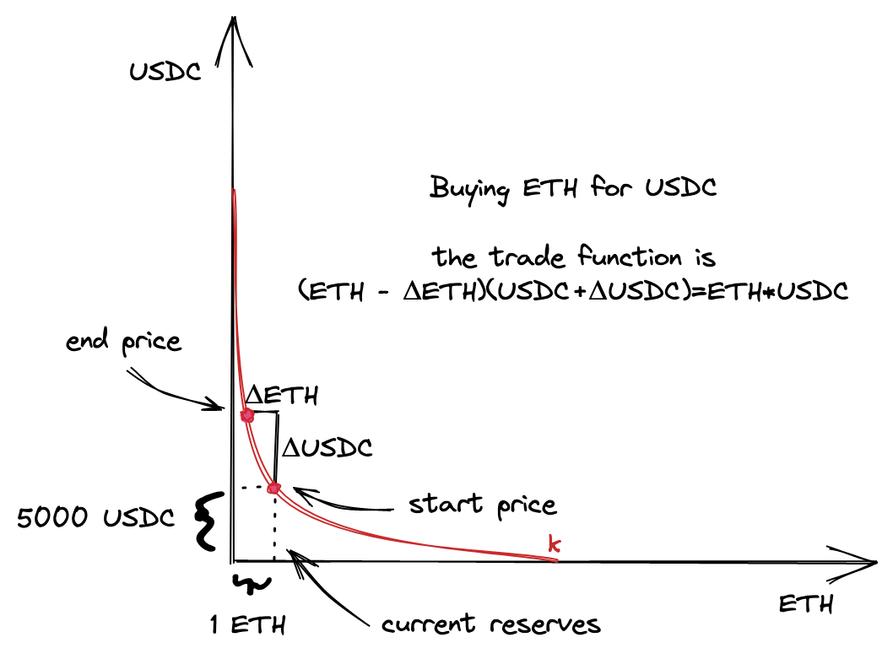
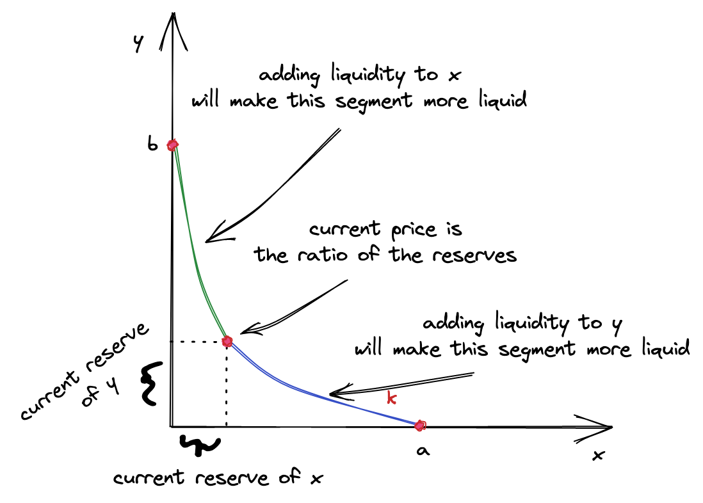

# UniswapV3 技术学习系列（五）：流动性计算

## 里程碑 1 介绍

欢迎来到 UniswapV3 开发的第一个里程碑！在完成了前期的背景知识学习和开发环境搭建后，我们终于要开始实现核心功能了。

### 本里程碑目标

在这个里程碑中，我们将构建一个能够接收用户流动性并在特定价格区间内执行交换的池子合约。为了保持简单易懂，我们会做以下简化：

- ✅ **单一价格区间**：只在一个价格区间内提供流动性
- ✅ **单向交换**：只允许单个方向的交换（买入 ETH）
- ✅ **手动计算**：先用 Python 手动计算所有数学参数，再实现 Solidity 代码
- ✅ **硬编码金额**：在智能合约中硬编码金额，快速实现 MVP

这种渐进式的方法能让我们专注于核心数学原理，而不必一开始就处理 Solidity 中数学运算的复杂细节。

### 实战场景设定

让我们设定一个具体的交易场景：



**池子配置：**

- **交易对**：ETH/USDC 池子
- **储备定义**：ETH 作为 x 储备，USDC 作为 y 储备
- **当前价格**：5000 USDC = 1 ETH
- **流动性范围**：4545 - 5500 USDC/ETH

**交易操作：**
- 从池子中**买入 ETH**（支付 USDC）
- 价格会因为购买而上涨
- 确保交易后价格仍在流动性范围内


### 开发策略

**阶段一：Python 原型**（本文重点）
1. 计算价格区间的 Tick 值
2. 确定需要提供的代币数量
3. 计算流动性参数 L
4. 验证所有计算结果

**阶段二：Solidity 实现**（后续文章）
1. 实现池子合约
2. 添加流动性功能
3. 实现交换逻辑
4. 编写完整测试

> 💡 **提示**
>
> 本文所有的 Python 计算代码都可以在项目的 `unimath.py` 文件中找到。建议您在阅读时同步运行代码，加深理解。

---

## 一、流动性基础概念

### 1.1 为什么需要流动性？

**流动性是交易的前提**。没有流动性，去中心化交易所就无法运作。要向池子添加流动性，我们需要准备两个关键信息：

1. **价格区间（Price Range）**
   - 作为流动性提供者（LP），我们需要选择一个特定的价格区间
   - 我们提供的流动性只会在这个区间内被使用
   - 这是 V3 相比 V1/V2 的核心创新

2. **代币数量（Token Amounts）**
   - 需要存入两种代币：ETH 和 USDC
   - 数量必须符合当前价格的比例
   - 合约会根据流动性公式重新计算精确数量

在本文中，我们将手动完成这些计算。在后续章节中，智能合约会自动化这些过程。

### 1.2 从 V2 到 V3 的演进

让我们快速回顾 V2 和 V3 在流动性管理上的差异：

**Uniswap V2：**
```
流动性范围: [0, ∞]
资金利用率: 低
LP 收益: 分散在整个价格曲线
```

**Uniswap V3：**
```
流动性范围: [自定义下限, 自定义上限]
资金利用率: 高（最高 4000x）
LP 收益: 集中在选定区间
```

这种集中流动性的设计大大提高了资金效率。

---

## 二、价格区间与 Tick 计算

### 2.1 什么是 Tick？

在 Uniswap V3 中，连续的价格空间被离散化为一系列的 **Tick（刻度）**。每个 Tick：
- 对应一个特定的价格
- 拥有一个整数索引
- 相邻 Tick 之间价格相差 0.01%（即 1.0001 倍）

**价格与 Tick 的数学关系：**

```
P(i) = 1.0001^i
```

其中：
- `i` 是 Tick 索引
- `P(i)` 是对应的价格

### 2.2 确定三个关键 Tick

对于我们的场景，需要找到三个 Tick：

| Tick 类型 | 价格 (USDC/ETH) | 说明 |
|----------|----------------|------|
| 当前 Tick | 5000 | 起始价格点 |
| 下限 Tick | 4545 | 流动性区间下界 |
| 上限 Tick | 5500 | 流动性区间上界 |

### 2.3 计算平方根价格

Uniswap 使用 `√P` 而不是 `P` 来存储价格。这是因为在后续的数学计算中，使用平方根价格可以简化公式，避免多次开方运算。

**根据恒定乘积公式：**

```
P = y / x
```

**由于我们使用 ETH 为 x，USDC 为 y，所以：**

```
√P_current = √(5000/1) = √5000 ≈ 70.71
√P_lower   = √(4545/1) = √4545 ≈ 67.42
√P_upper   = √(5500/1) = √5500 ≈ 74.16
```

其中：
- `P_current` = 当前价格（5000）
- `P_lower` = 下限价格（4545）
- `P_upper` = 上限价格（5500）

**Python 实现：**

```python
import math

def price_to_sqrtp(p):
    """将价格转换为平方根价格"""
    return math.sqrt(p)

sqrtp_current = price_to_sqrtp(5000)  # ≈ 70.71
sqrtp_lower = price_to_sqrtp(4545)    # ≈ 67.42
sqrtp_upper = price_to_sqrtp(5500)    # ≈ 74.16
```

### 2.4 从价格计算 Tick 索引

使用对数公式反推 Tick 索引：

```
i = log₁.₀₀₀₁(√P)
```

换句话说，就是以 1.0001 为底，对 √P 求对数。

**Python 实现：**

```python
def price_to_tick(p):
    """将价格转换为 Tick 索引"""
    return math.floor(math.log(p, 1.0001))

# 计算三个关键 Tick
tick_current = price_to_tick(5000)  # = 85176
tick_lower = price_to_tick(4545)    # = 84222
tick_upper = price_to_tick(5500)    # = 86129

print(f"当前 Tick: {tick_current}")
print(f"下限 Tick: {tick_lower}")
print(f"上限 Tick: {tick_upper}")
```

### 2.5 Q64.96 定点数格式

Solidity 不支持浮点数，Uniswap 使用 **Q64.96** 定点数格式存储 `√P`：

- **64 位**用于整数部分
- **96 位**用于小数部分

**转换方法：**
```
Q64.96 格式的值 = 浮点数 × 2^96
```

**Python 实现：**

```python
Q96 = 2**96  # Q64.96 格式的基数

def price_to_sqrtp_q96(p):
    """将价格转换为 Q64.96 格式的平方根价格"""
    return int(math.sqrt(p) * Q96)

# 转换为 Q64.96 格式
sqrtp_current_q96 = price_to_sqrtp_q96(5000)
sqrtp_lower_q96 = price_to_sqrtp_q96(4545)
sqrtp_upper_q96 = price_to_sqrtp_q96(5500)

print(f"当前价格 (Q64.96): {sqrtp_current_q96}")
# 输出: 5602277097478614198912276234240

print(f"下限价格 (Q64.96): {sqrtp_lower_q96}")
# 输出: 5314786713428871004159001755648

print(f"上限价格 (Q64.96): {sqrtp_upper_q96}")
# 输出: 5875717789736564987741329162240
```

> ⚠️ **精度警告**
>
> 必须先乘以 `2^96`，再转换为整数。如果先转换为整数再乘，会丢失小数部分的精度！

---

## 三、代币数量确定

### 3.1 选择初始数量

在这个示例中，我们决定提供：

- **1 ETH**
- **5000 USDC**

这些数量的选择考虑了以下因素：

1. **价格比例**：5000 USDC / 1 ETH = 5000，符合当前价格
2. **交易规模**：足够进行一次有意义的交换
3. **价格稳定性**：交换后价格不会离开流动性区间

### 3.2 比例的重要性

**关键原则：新增流动性不能改变当前价格**

当前池子的储备比例决定了价格：
```
P = y / x = USDC / ETH
```

如果要在保持价格不变的情况下增加流动性，新增代币数量必须保持相同比例：

| 场景 | ETH 数量 | USDC 数量 | 价格 (USDC/ETH) |
|------|---------|----------|-----------------|
| 基础 | 1 | 5000 | 5000 |
| 2倍  | 2 | 10000 | 5000 ✅ |
| 10倍 | 10 | 50000 | 5000 ✅ |
| 错误 | 1 | 6000 | 6000 ❌ |

---

## 四、流动性参数 L 的计算

### 4.1 从无限曲线到有限区间

在 Uniswap 中，**流动性（Liquidity）** 用符号 `L` 表示，它是一个数学量，描述了价格区间内可用于交易的"深度"。

**在 V1/V2 的无限曲线中：**

```
L = √(x × y)
```

这个公式很简单，因为流动性分布在整个价格曲线 `[0, ∞]` 上。

**但在 V3 的有限价格区间中：**

我们只想在一个**有限的价格区间**（例如 4545-5500）内提供流动性。这只是无限曲线的一个片段，因此需要更复杂的计算方法。

### 4.2 关键概念：价格区间可以被耗尽

理解 V3 流动性计算的核心是：**价格区间可以在交易中被完全耗尽**。

什么意思呢？在交易过程中，可能会出现以下情况：
- 买家可以买光区间内的某一种代币
- 导致池子里只剩下另一种代币


观察上图中的三个关键点：

- **点 a（下限）**：池子只剩 ETH，USDC 已被买光
- **点 b（上限）**：池子只剩 USDC，ETH 已被买光  
- **点 c（当前）**：两种代币都存在，正常交易状态

**我们计算 L 的目标：**

我们需要找到一个合适的 L 值，使得：
- 价格**能够到达**区间的任一边界（点 a 或点 b）
- 提供**足够的流动性**支撑价格在整个区间内移动
- 基于我们提供的代币数量（Δx 和 Δy）来计算

换句话说，我们希望提供的流动性刚好能让价格在 [P_a, P_b] 区间内自由移动。

### 4.3 价格与代币储备的关系

在深入公式之前，我们需要理解价格在不同点的变化规律：

**价格的定义：**
```
P = y / x = USDC / ETH
```

**价格的变动方向：**
- 当有人**买入 ETH** 时 → ETH 流出池子（x↓），USDC 流入池子（y↑） → P = y/x **上涨**
- 当有人**买入 USDC** 时 → USDC 流出池子（y↓），ETH 流入池子（x↑） → P = y/x **下跌**

因此三个点的价格大小关系为：
```
P_a（下限）< P_c（当前）< P_b（上限）
```

**关键洞察：**
- 在**点 b**（上限）附近：价格最高，ETH 已被买光，池子只剩 USDC
- 在**点 a**（下限）附近：价格最低，USDC 已被买光，池子只剩 ETH  
- 在**点 c**（当前）：价格居中，两种代币都存在

### 4.4 为什么要分段计算 L？

现在来看最关键的问题：**为什么需要计算两个 L？**

让我们把曲线从当前价格点分成两段：



**左侧段（从点 a 到点 c）：**

- 当价格**下跌**（从 P_c 向 P_a 移动）时使用
- 交易者在**买入 USDC**（从池子中取走 USDC）
- 池子需要**接收 ETH**（作为支付）
- 因此这段流动性**完全由 ETH 组成**
- 只需要 ETH 数量来计算这段的 L

**右侧段（从点 c 到点 b）：**
- 当价格**上涨**（从 P_c 向 P_b 移动）时使用
- 交易者在**买入 ETH**（从池子中取走 ETH）
- 池子需要**接收 USDC**（作为支付）
- 因此这段流动性**完全由 USDC 组成**
- 只需要 USDC 数量来计算这段的 L

**简化理解：**
- 价格向左移动（下跌）→ USDC 被取走 → 池子剩下 ETH → 用 ETH 计算 L
- 价格向右移动（上涨）→ ETH 被取走 → 池子剩下 USDC → 用 USDC 计算 L

这就是为什么我们需要：
- **L_x**：基于 ETH 数量计算（左侧曲线段）
- **L_y**：基于 USDC 数量计算（右侧曲线段）

### 4.5 为什么选择较小的 L？

计算出两个 L 后，我们需要选择**较小的那个**。为什么？

**核心原则：新增流动性不能改变当前价格**

1. **均匀分布要求**
   - 流动性必须在价格曲线上均匀分布
   - 当前价格左右两侧的流动性深度必须相同
   - 因此需要使用**相同的 L**

2. **较大的 L 已经包含了较小的 L**
   - 如果 L_x = 1519，L_y = 1517
   - 较大的 1519 意味着需要更多的 ETH
   - 但 USDC 只能提供 1517 的流动性
   - 选择 1519 会导致流动性分布不均

3. **保持价格比例**
   - 选择较小的 L（1517）后
   - 将较大 L 对应的代币数量调整下来
   - 这样两种代币都基于 L = 1517
   - 价格比例得以保持

**实际操作：**
```
假设计算结果:
  L_eth  = 1519 (基于 1 ETH)
  L_usdc = 1517 (基于 5000 USDC)

选择 L = 1517 (较小值):
  ✅ 两侧流动性深度相等（都是 1517）
  ✅ 价格保持不变
  ✅ 会返还少量多余的 ETH
  ✅ 实际使用：约 0.999 ETH + 5000 USDC
```

如果选择较大的 L（1519），用户需要提供更多 USDC 来弥补差额，这会让合约变得更复杂。

### 4.6 流动性公式推导

现在我们已经理解了**为什么**要计算两个 L，接下来看**如何**计算它们。

**回顾基础公式：**

我们知道在价格区间内，代币数量的变化可以用以下公式表示：

```
Δx = Δ(1/√P) × L
Δy = Δ(√P) × L
```

**展开为具体价格：**

将抽象的 Δ(√P) 替换为我们知道的具体价格点（a、b、c）：

```
Δx = (1/√P_c - 1/√P_b) × L
Δy = (√P_c - √P_a) × L
```

简化后：

```
Δx = L × (√P_b - √P_c) / (√P_b × √P_c)

Δy = L × (√P_c - √P_a)
```

其中：
- `P_a` = 下限价格（4545）
- `P_b` = 上限价格（5500）
- `P_c` = 当前价格（5000）

**反推 L 的公式：**

从上面的公式可以推导出：

```
L_x = Δx × (√P_b × √P_c) / (√P_b - √P_c)

L_y = Δy / (√P_c - √P_a)
```

这就是我们要用的两个 L 计算公式！

**代入实际数值：**

```
L_x = 1 ETH × (√5500 × √5000) / (√5500 - √5000)
    = 1 ETH × (74.16 × 70.71) / (74.16 - 70.71)
    ≈ 1519437308014769733632

L_y = 5000 USDC / (√5000 - √4545)
    = 5000 USDC / (70.71 - 67.42)
    ≈ 1517882343751509868544
```

选择较小的：**L = 1517882343751509868544**

### 4.7 Python 实现

```python
# 定义常量
Q96 = 2**96
ETH = 10**18  # 1 ETH in wei

# 价格转换
sqrtp_low = price_to_sqrtp_q96(4545)
sqrtp_cur = price_to_sqrtp_q96(5000)
sqrtp_upp = price_to_sqrtp_q96(5500)

def liquidity_from_x(amount, pa, pb):
    """
    从 ETH 数量计算流动性
    
    参数:
        amount: ETH 数量（wei）
        pa: 下限平方根价格（Q64.96）
        pb: 上限平方根价格（Q64.96）
    
    返回:
        流动性值 L
    """
    if pa > pb:
        pa, pb = pb, pa
    return (amount * (pa * pb) / Q96) / (pb - pa)

def liquidity_from_y(amount, pa, pb):
    """
    从 USDC 数量计算流动性
    
    参数:
        amount: USDC 数量（wei）
        pa: 下限平方根价格（Q64.96）
        pb: 当前平方根价格（Q64.96）
    
    返回:
        流动性值 L
    """
    if pa > pb:
        pa, pb = pb, pa
    return amount * Q96 / (pb - pa)

# 计算两个 L 值
amount_eth = 1 * ETH           # 1 ETH
amount_usdc = 5000 * ETH       # 5000 USDC (使用 18 位精度)

liq_from_eth = liquidity_from_x(amount_eth, sqrtp_cur, sqrtp_upp)
liq_from_usdc = liquidity_from_y(amount_usdc, sqrtp_cur, sqrtp_low)

print(f"基于 ETH 的流动性: {liq_from_eth}")
# 输出: 1519437308014769733632

print(f"基于 USDC 的流动性: {liq_from_usdc}")
# 输出: 1517882343751509868544

# 选择较小的值
liquidity = int(min(liq_from_eth, liq_from_usdc))
print(f"最终流动性 L: {liquidity}")
# 输出: 1517882343751509868544
```

完美！我们得到了 L = 1517882343751509868544，这将用于后续的所有计算。

---

## 五、精确代币数量计算

### 5.1 为什么需要重新计算？

虽然我们选择了存入 1 ETH 和 5000 USDC，但合约需要重新计算精确数量，原因包括：

1. **舍入误差**：计算过程中的浮点数舍入
2. **比例调整**：确保与选定的 L 完全匹配
3. **均匀分布**：保证流动性沿曲线均匀分布

### 5.2 反向计算公式

已知 L，反推代币数量：

```
Δx = L × (√P_b - √P_c) / (√P_b × √P_c)

Δy = L × (√P_c - √P_a)
```

### 5.3 Python 实现

```python
def calc_amount_x(liq, pa, pb):
    """
    根据流动性计算 ETH 数量
    
    参数:
        liq: 流动性值
        pa: 当前平方根价格（Q64.96）
        pb: 上限平方根价格（Q64.96）
    
    返回:
        ETH 数量（wei）
    """
    if pa > pb:
        pa, pb = pb, pa
    return int(liq * Q96 * (pb - pa) / pa / pb)

def calc_amount_y(liq, pa, pb):
    """
    根据流动性计算 USDC 数量
    
    参数:
        liq: 流动性值
        pa: 下限平方根价格（Q64.96）
        pb: 当前平方根价格（Q64.96）
    
    返回:
        USDC 数量（wei）
    """
    if pa > pb:
        pa, pb = pb, pa
    return int(liq * (pb - pa) / Q96)

# 计算精确数量
amount_eth_precise = calc_amount_x(liquidity, sqrtp_cur, sqrtp_upp)
amount_usdc_precise = calc_amount_y(liquidity, sqrtp_low, sqrtp_cur)

print(f"精确 ETH 数量 (wei): {amount_eth_precise}")
# 输出: 998976618347425408

print(f"精确 USDC 数量 (wei): {amount_usdc_precise}")
# 输出: 5000000000000000000000
```

### 5.4 转换为人类可读格式

```python
# 使用 cast 命令转换
# cast --from-wei 998976618347425408
# 输出: 0.998976618347425408 ETH

# cast --from-wei 5000000000000000000000
# 输出: 5000.0 USDC
```

**对比分析：**

| 代币 | 预期数量 | 精确数量 | 差异 |
|-----|---------|---------|-----|
| ETH | 1.0 | 0.998976... | -0.001023 ETH |
| USDC | 5000.0 | 5000.0 | 0 USDC |

可以看到：
- USDC 数量完全匹配
- ETH 略微减少（约 0.1%）
- 这个差异是正常的舍入结果

---

## 六、完整计算示例

让我们将所有步骤整合到一个完整的 Python 脚本中：

```python
#!/usr/bin/env python3
"""
Uniswap V3 流动性计算示例
计算为 ETH/USDC 池子提供流动性所需的精确参数
"""

import math

# 常量定义
Q96 = 2**96
ETH = 10**18

# 工具函数
def price_to_tick(p):
    """价格转 Tick 索引"""
    return math.floor(math.log(p, 1.0001))

def price_to_sqrtp_q96(p):
    """价格转 Q64.96 格式的平方根价格"""
    return int(math.sqrt(p) * Q96)

def liquidity_from_x(amount, pa, pb):
    """从 x 代币数量计算流动性"""
    if pa > pb:
        pa, pb = pb, pa
    return (amount * (pa * pb) / Q96) / (pb - pa)

def liquidity_from_y(amount, pa, pb):
    """从 y 代币数量计算流动性"""
    if pa > pb:
        pa, pb = pb, pa
    return amount * Q96 / (pb - pa)

def calc_amount_x(liq, pa, pb):
    """从流动性计算 x 代币数量"""
    if pa > pb:
        pa, pb = pb, pa
    return int(liq * Q96 * (pb - pa) / pa / pb)

def calc_amount_y(liq, pa, pb):
    """从流动性计算 y 代币数量"""
    if pa > pb:
        pa, pb = pb, pa
    return int(liq * (pb - pa) / Q96)

# 主流程
if __name__ == "__main__":
    # 步骤 1: 计算 Tick
    print("=" * 60)
    print("步骤 1: 计算价格区间的 Tick 值")
    print("=" * 60)
    
    tick_current = price_to_tick(5000)
    tick_lower = price_to_tick(4545)
    tick_upper = price_to_tick(5500)
    
    print(f"当前价格 5000 USDC/ETH -> Tick {tick_current}")
    print(f"下限价格 4545 USDC/ETH -> Tick {tick_lower}")
    print(f"上限价格 5500 USDC/ETH -> Tick {tick_upper}")
    
    # 步骤 2: 转换为 Q64.96 格式
    print("\n" + "=" * 60)
    print("步骤 2: 转换为 Q64.96 格式")
    print("=" * 60)
    
    sqrtp_low = price_to_sqrtp_q96(4545)
    sqrtp_cur = price_to_sqrtp_q96(5000)
    sqrtp_upp = price_to_sqrtp_q96(5500)
    
    print(f"下限 sqrtP: {sqrtp_low}")
    print(f"当前 sqrtP: {sqrtp_cur}")
    print(f"上限 sqrtP: {sqrtp_upp}")
    
    # 步骤 3: 计算流动性
    print("\n" + "=" * 60)
    print("步骤 3: 计算流动性 L")
    print("=" * 60)
    
    amount_eth = 1 * ETH
    amount_usdc = 5000 * ETH
    
    liq_x = liquidity_from_x(amount_eth, sqrtp_cur, sqrtp_upp)
    liq_y = liquidity_from_y(amount_usdc, sqrtp_cur, sqrtp_low)
    liquidity = int(min(liq_x, liq_y))
    
    print(f"基于 ETH:  L = {int(liq_x)}")
    print(f"基于 USDC: L = {int(liq_y)}")
    print(f"选择较小值: L = {liquidity}")
    
    # 步骤 4: 计算精确数量
    print("\n" + "=" * 60)
    print("步骤 4: 计算精确代币数量")
    print("=" * 60)
    
    amount_eth_final = calc_amount_x(liquidity, sqrtp_cur, sqrtp_upp)
    amount_usdc_final = calc_amount_y(liquidity, sqrtp_low, sqrtp_cur)
    
    print(f"精确 ETH:  {amount_eth_final} wei")
    print(f"         = {amount_eth_final / ETH:.18f} ETH")
    print(f"精确 USDC: {amount_usdc_final} wei")
    print(f"         = {amount_usdc_final / ETH:.2f} USDC")
    
    # 总结
    print("\n" + "=" * 60)
    print("计算完成！下一步可用于合约部署")
    print("=" * 60)
```

**运行输出：**

```
============================================================
步骤 1: 计算价格区间的 Tick 值
============================================================
当前价格 5000 USDC/ETH -> Tick 85176
下限价格 4545 USDC/ETH -> Tick 84222
上限价格 5500 USDC/ETH -> Tick 86129

============================================================
步骤 2: 转换为 Q64.96 格式
============================================================
下限 sqrtP: 5314786713428871004159001755648
当前 sqrtP: 5602277097478614198912276234240
上限 sqrtP: 5875717789736564987741329162240

============================================================
步骤 3: 计算流动性 L
============================================================
基于 ETH:  L = 1519437308014769733632
基于 USDC: L = 1517882343751509868544
选择较小值: L = 1517882343751509868544

============================================================
步骤 4: 计算精确代币数量
============================================================
精确 ETH:  998976618347425408 wei
         = 0.998976618347425408 ETH
精确 USDC: 5000000000000000000000 wei
         = 5000.00 USDC

============================================================
计算完成！下一步可用于合约部署
============================================================
```

---

## 七、本章小结

### 核心知识点回顾

1. **Tick 机制**
   - 价格空间被离散化为 Tick
   - `P(i) = 1.0001^i`
   - 方便流动性聚合和高效查找

2. **Q64.96 定点数**
   - Solidity 中存储浮点数的方法
   - 整数部分 64 位，小数部分 96 位
   - 转换公式：`浮点数 × 2^96`

3. **流动性计算**
   - 需要计算两个 L 值（基于 ETH 和 USDC）
   - 选择较小的 L 保证均匀分布
   - 合约会重新计算精确代币数量

4. **价格区间**
   - V3 的核心创新是集中流动性
   - 左侧曲线由 ETH 提供流动性
   - 右侧曲线由 USDC 提供流动性

### 实践要点

✅ **准备工作**
- 确定交易对和价格区间
- 计算 Tick 索引
- 转换为 Q64.96 格式

✅ **流动性计算**
- 使用 Python 原型验证数学
- 分别计算基于两种代币的 L
- 选择较小值确保比例正确

✅ **精度处理**
- 先乘后转整数，避免精度损失
- 合约会重新计算精确数量
- 允许小幅度的舍入误差

### 下一步计划

在下一篇文章中，我们将：

1. **实现池子合约** - 将数学转换为 Solidity 代码
2. **添加流动性功能** - 实现 `mint` 函数
3. **管理仓位数据** - 存储流动性提供者的信息
4. **编写测试** - 使用 Foundry 验证功能

---

## 相关资源

### 官方文档
- [Uniswap V3 Development Book - Introduction](https://uniswapv3book.com/milestone_1/introduction.html)
- [Uniswap V3 Development Book - Calculating Liquidity](https://uniswapv3book.com/milestone_1/calculating-liquidity.html)
- [Uniswap V3 白皮书](https://uniswap.org/whitepaper-v3.pdf)

### 系列项目
- [UniswapV1 技术学习](https://github.com/RyanWeb31110/uniswapv1_tech) - 基础 AMM
- [UniswapV2 技术学习](https://github.com/RyanWeb31110/uniswapv2_tech) - 任意代币对
- [UniswapV3 技术学习](https://github.com/RyanWeb31110/uniswapv3_tech) - 集中流动性

### 代码仓库
本文的完整 Python 代码可以在项目的 `scripts/unimath.py` 中找到。

---

## 项目仓库

https://github.com/RyanWeb31110/uniswapv3_tech

