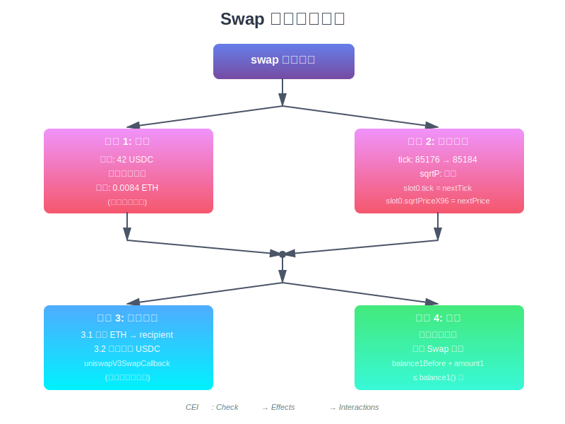

# UniswapV3 技术学习系列（七）：第一次Swap实现

## 系列文章导航

本文是 UniswapV3 技术学习系列的第七篇，属于"里程碑 1：第一次Swap"模块。在上一篇文章中，我们实现了流动性提供（Minting）功能，成功建立了一个包含 ETH 和 USDC 的流动性池。现在，我们将实现核心的交易功能——`swap` 函数。本文将详细讲解如何通过数学公式计算交换数量、如何在单一价格区间内实现代币兑换，以及如何使用 Foundry 测试交换功能的正确性。

> **原文链接：** [First Swap - Uniswap V3 Development Book](https://uniswapv3book.com/milestone_1/first-swap.html)

---

## 一、从流动性到交换

### 1.1 前情回顾

在前面的文章中，我们已经完成了：

- ✅ 实现了 `mint` 函数，成功添加流动性
- ✅ 在 [84222, 86129] 价格区间提供了流动性
- ✅ 当前价格为 5000 USDC/ETH（tick = 85176）
- ✅ 流动性 L = 1517882343751509868544

现在，我们的池子已经准备好进行交易了！

### 1.2 本章目标

我们将实现第一次代币交换：

1. **计算交换数量** - 使用集中流动性数学公式
2. **实现 swap 函数** - 更新价格和余额
3. **完善测试用例** - 验证交换逻辑的正确性

**核心思想：**
- 📍 用户选择**目标价格**，而非输入数量
- 📍 在单一价格区间内，L 保持不变，只有 √P 改变
- 📍 使用回调机制接收和发送代币

---

## 二、交换数量计算原理

### 2.1 交换场景设定

让我们设定一个具体的交换场景：

> **场景：** 用 42 USDC 购买 ETH

这个场景的参数：
- 输入代币：USDC（token1）
- 输出代币：ETH（token0）
- 输入数量：42 USDC

### 2.2 V3 与 V2 的差异

**Uniswap V2 的方式：**
```
输入数量 → 计算输出数量
已知 Δy → 计算 Δx
```

**Uniswap V3 的方式：**
```
输入数量 → 计算目标价格 → 计算输入/输出数量
已知 Δy → 计算 √P_target → 计算精确的 Δx 和 Δy
```

V3 的优势在于：
- 更精确的价格控制
- 更好的滑点保护
- 支持价格预言机功能

### 2.3 核心数学公式

#### 公式 1：流动性与价格的关系

在单一价格区间内交换时，我们知道：

$$
L = \frac{\Delta y}{\Delta \sqrt{P}}
$$

其中：
- L：流动性（在交换过程中保持不变）
- Δy：token1（USDC）的数量变化
- Δ√P：平方根价格的变化

#### 公式 2：计算价格变化

由于我们知道 Δy = 42 USDC，可以反推出价格变化：

$$
\Delta \sqrt{P} = \frac{\Delta y}{L}
$$

让我们代入数值计算：

$$
\Delta \sqrt{P} = \frac{42 \text{ USDC}}{1517882343751509868544} = 2192253463713690532467206957
$$

> **注意：** 这里的数值已经乘以了 2^96（Q64.96 格式）

#### 公式 3：目标价格

交换后的新价格为：

$$
\sqrt{P_{target}} = \sqrt{P_{current}} + \Delta \sqrt{P}
$$

代入计算：

$$
\sqrt{P_{target}} = 5602277097478614198912276234240 + 2192253463713690532467206957
$$


$$
\sqrt{P_{target}} = 5604469350942327889444743441197
$$

转换为实际价格：

$$
P_{target} = \left(\frac{5604469350942327889444743441197}{2^{96}}\right)^2 = 5003.91 \text{ USDC/ETH}
$$

对应的 tick：

$$
\text{tick}_{target} = 85184
$$

#### 价格和 Tick 的对应关系

这里有一个关键问题：**价格如何对应到 tick？**

UniswapV3 使用以下数学关系：

$$
\text{price} = 1.0001^{\text{tick}}
$$

反向计算：

$$
\text{tick} = \log_{1.0001}(\text{price}) = \frac{\ln(\text{price})}{\ln(1.0001)}
$$

**Tick 等于 以 1.0001 为底 price 的对数，等于 price 的自然对数 除以 1.0001 的自然对数**

- 价格是连续的（可以是任意小数）
- Tick 必须是整数（方便链上计算和存储）
- 需要一个转换规则：用 1.0001 的指数来表示价格
- 正向简单：从 tick 算价格，直接指数运算
- 反向复杂：从价格算 tick，需要对数运算

**为什么选择 1.0001？**

- ✅ 每个 tick 的价格变化约为 **0.01%**（精度合适）
- ✅ 可以覆盖从极小到极大的价格范围
- ✅ 便于链上和链下计算

**本例计算：**

```python
import math

# 目标价格
price_target = 5003.913912782393

# 从价格计算 tick（使用对数）
tick_float = math.log(price_target) / math.log(1.0001)
print(f"计算得到的 tick (浮点): {tick_float:.6f}")
# 输出: 85183.608762

# 向下取整（重要！）
tick = math.floor(tick_float)
print(f"向下取整后的 tick: {tick}")
# 输出: 85184

# 验证：从 tick 反推价格
price_at_tick = 1.0001 ** tick
print(f"tick {tick} 对应的价格: {price_at_tick:.10f}")
# 输出: 5003.9135087824
```

**为什么要向下取整？**
- Tick 必须是**整数**（离散值）
- 向下取整确保价格不会超过实际应该达到的价格
- 这是保护用户的安全机制

**Tick 的离散性：**

| Tick | 价格 (USDC/ETH) | 与前一个的差异 |
|------|----------------|---------------|
| 85176 | 5000.000 | - |
| 85177 | 5000.500 | +0.01% |
| 85184 | 5003.914 | +0.01% |
| 85185 | 5004.414 | +0.01% |

每个 tick 之间价格相差约 0.01%，这就是 UniswapV3 的价格精度！

### 2.4 Python 计算示例

```python
# 使用 Python 验证计算
import math

# 常量定义
eth = 10**18
q96 = 2**96

# 当前状态
sqrtp_cur = 5602277097478614198912276234240
liq = 1517882343751509868544

# 输入数量
amount_in = 42 * eth

# 步骤 1: 计算价格变化
price_diff = (amount_in * q96) // liq
print(f"价格变化: {price_diff}")

# 步骤 2: 计算目标价格
price_next = sqrtp_cur + price_diff
print(f"新的 sqrtP: {price_next}")
print(f"新的价格: {(price_next / q96) ** 2}")

# 步骤 3: 计算目标 tick
def price_to_tick(price):
    return math.floor(math.log(price, 1.0001))

new_tick = price_to_tick((price_next / q96) ** 2)
print(f"新的 tick: {new_tick}")
```

**输出结果：**
```
价格变化: 2192253463713690532467206957
新的 sqrtP: 5604469350942327889444743441197
新的价格: 5003.913912782393
新的 tick: 85184
```

### 2.5 计算代币数量

找到目标价格后，我们使用上一章的公式计算代币数量：

#### Token0（ETH）数量计算

$$
\Delta x = \Delta \left(\frac{1}{\sqrt{P}}\right) \cdot L
$$

其中：

$$
\Delta \left(\frac{1}{\sqrt{P}}\right) = \frac{1}{\sqrt{P_{target}}} - \frac{1}{\sqrt{P_{current}}}
$$

让我们计算：

$$
\Delta \left(\frac{1}{\sqrt{P}}\right) = \frac{1}{5604469350942327889444743441197} - \frac{1}{5602277097478614198912276234240}
$$


$$
= -6.982190286589445 \times 10^{-35} \times 2^{96} = -0.00000553186106731426
$$

因此：

$$
\Delta x = -0.00000553186106731426 \times 1517882343751509868544 = -8396714242162698 \text{ wei}
$$


$$
= -0.008396714242162698 \text{ ETH}
$$

> **负号的含义：** 负号表示这是从池子中**移除**的数量，即用户将**获得** 0.008396714242162698 ETH。

#### Token1（USDC）数量验证

$$
\Delta y = L \cdot \Delta \sqrt{P} = 42 \text{ USDC}
$$

这正是我们输入的数量，验证通过！

#### Python 验证

```python
# 使用之前章节的函数计算
def calc_amount0(liq, pa, pb):
    """计算 token0 数量"""
    if pa > pb:
        pa, pb = pb, pa
    return int(liq * q96 * (pb - pa) / pb / pa)

def calc_amount1(liq, pa, pb):
    """计算 token1 数量"""
    if pa > pb:
        pa, pb = pb, pa
    return int(liq * (pb - pa) / q96)

# 计算交换数量
amount_in = calc_amount1(liq, price_next, sqrtp_cur)
amount_out = calc_amount0(liq, price_next, sqrtp_cur)

print(f"USDC 输入: {amount_in / eth}")
print(f"ETH 输出: {amount_out / eth}")
```

**输出结果：**
```
USDC 输入: 42.0
ETH 输出: 0.008396714242162444
```

完美匹配！🎉

---

## 三、实现 swap 函数

### 3.1 函数签名设计

```solidity
/// @notice 在池子中执行代币交换
/// @dev 当前版本使用硬编码的值，后续会改进
/// @param recipient 接收输出代币的地址
/// @return amount0 token0 的数量变化（负数表示输出）
/// @return amount1 token1 的数量变化（正数表示输入）
function swap(address recipient)
    public
    returns (int256 amount0, int256 amount1)
{
    ...
}
```

**设计说明：**
- `recipient`：代币接收者，将收到输出的 ETH
- 返回值使用 `int256`：
  - 正数：流入池子（用户支付）
  - 负数：流出池子（用户接收）

### 3.2 完整实现代码

让我们查看当前的合约代码并添加 swap 函数：

```solidity
// SPDX-License-Identifier: MIT
pragma solidity ^0.8.14;

import "./lib/Tick.sol";
import "./lib/Position.sol";
import "./interfaces/IERC20.sol";
import "./interfaces/IUniswapV3MintCallback.sol";
import "./interfaces/IUniswapV3SwapCallback.sol";

contract UniswapV3Pool {
    // ... 已有代码 ...
    
    // ============ 新增事件 ============
    
    /// @notice 代币交换事件
    /// @param sender 发起交换的地址
    /// @param recipient 接收代币的地址
    /// @param amount0 token0 的数量变化
    /// @param amount1 token1 的数量变化
    /// @param sqrtPriceX96 交换后的价格
    /// @param liquidity 当前流动性
    /// @param tick 交换后的 tick
    event Swap(
        address indexed sender,
        address indexed recipient,
        int256 amount0,
        int256 amount1,
        uint160 sqrtPriceX96,
        uint128 liquidity,
        int24 tick
    );
    
    // ============ swap 函数实现 ============
    
    /// @notice 执行代币交换
    /// @param recipient 接收输出代币的地址
    /// @return amount0 token0 的数量变化（负数表示输出给用户）
    /// @return amount1 token1 的数量变化（正数表示用户输入）
    function swap(address recipient)
        public
        returns (int256 amount0, int256 amount1)
    {
        // ==================== 步骤 1: 计算目标价格和数量 ====================
        // TODO: 目前使用硬编码值，后续章节会实现动态计算
        // 这些值是通过数学公式预先计算得出的
        
        int24 nextTick = 85184;  // 目标 tick
        uint160 nextPrice = 5604469350942327889444743441197;  // 目标价格
        
        // amount0 是负数：表示用户从池子获得 ETH
        amount0 = -0.008396714242162444 ether;
        
        // amount1 是正数：表示用户向池子支付 USDC
        amount1 = 42 ether;
        
        // ==================== 步骤 2: 更新池子状态 ====================
        // 交换会改变当前价格和 tick
        (slot0.tick, slot0.sqrtPriceX96) = (nextTick, nextPrice);
        
        // ==================== 步骤 3: 转移代币 ====================
        
        // 3.1 将输出代币（ETH）发送给接收者
        // 使用 uint256(-amount0) 将负数转为正数
        IERC20(token0).transfer(recipient, uint256(-amount0));
        
        // 3.2 通过回调接收输入代币（USDC）
        uint256 balance1Before = balance1();  // 记录当前余额
        
        // 调用回调函数，通知调用者需要转入的代币数量
        IUniswapV3SwapCallback(msg.sender).uniswapV3SwapCallback(
            amount0,
            amount1
        );
        
        // 3.3 验证余额变化
        // 确保调用者在回调中确实转入了足够的代币
        if (balance1Before + uint256(amount1) < balance1())
            revert InsufficientInputAmount();
        
        // ==================== 步骤 4: 发出事件 ====================
        emit Swap(
            msg.sender,
            recipient,
            amount0,
            amount1,
            slot0.sqrtPriceX96,
            liquidity,
            slot0.tick
        );
    }
}
```

### 3.3 代码逻辑详解

#### 步骤 1：确定目标状态

```solidity
int24 nextTick = 85184;
uint160 nextPrice = 5604469350942327889444743441197;
```

这些值来自我们之前的数学计算。在后续章节中，我们会实现动态计算逻辑。

**为什么硬编码？**

- 🎯 **聚焦核心**：先理解交换的基本流程
- 🎯 **降低复杂度**：避免被数学计算分散注意力
- 🎯 **渐进式开发**：符合迭代开发原则

#### 步骤 2：更新池子状态

```solidity
(slot0.tick, slot0.sqrtPriceX96) = (nextTick, nextPrice);
```

交换会立即改变池子的当前价格。这是 AMM 的核心特性：
- 买入 ETH → ETH 变贵（价格上涨）
- 卖出 ETH → ETH 变便宜（价格下跌）

#### 步骤 3：代币转移

**3.1 先发送输出代币**

```solidity
IERC20(token0).transfer(recipient, uint256(-amount0));
```

- `amount0` 是 `-0.008396714242162444 ether`（负数）
- 转换为正数后发送给接收者
- 池子**先支付**，体现信任

**3.2 回调接收输入代币**

```solidity
uint256 balance1Before = balance1();

IUniswapV3SwapCallback(msg.sender).uniswapV3SwapCallback(
    amount0,
    amount1
);

if (balance1Before + uint256(amount1) < balance1())
    revert InsufficientInputAmount();
```

回调机制的优势：
- ✅ 池子控制计算逻辑，防止操纵
- ✅ 灵活性高，调用者可以实现复杂的支付逻辑
- ✅ 支持闪电贷等高级功能

**为什么要先记录余额？**

```
当前余额：5000 USDC
期望增加：42 USDC
验证条件：新余额 >= 5042 USDC
```

这种设计防止了回调函数中的欺诈行为。

#### 步骤 4：发出事件

```solidity
emit Swap(
    msg.sender,      // 调用者
    recipient,       // 接收者
    amount0,         // -0.008396... ETH
    amount1,         // 42 USDC
    slot0.sqrtPriceX96,  // 新价格
    liquidity,       // 流动性（未变）
    slot0.tick       // 新 tick
);
```

事件用于：
- 📊 前端追踪交易历史
- 📊 链下索引和分析
- 📊 价格预言机数据源

### 3.4 添加回调接口

需要定义 swap 回调接口：

```solidity
// src/interfaces/IUniswapV3SwapCallback.sol
// SPDX-License-Identifier: MIT
pragma solidity ^0.8.14;

/// @title Uniswap V3 Swap 回调接口
/// @notice 调用 swap 的合约必须实现此接口
interface IUniswapV3SwapCallback {
    /// @notice swap 操作的回调函数
    /// @dev 在回调中，调用者需要将输入代币转入池子
    /// @param amount0Delta token0 的数量变化
    /// @param amount1Delta token1 的数量变化
    function uniswapV3SwapCallback(
        int256 amount0Delta,
        int256 amount1Delta
    ) external;
}
```

---

## 四、使用 Foundry 测试交换功能

### 4.1 测试策略

我们需要验证：

1. ✅ 正确计算输入/输出数量
2. ✅ 正确更新池子状态（价格、tick）
3. ✅ 正确转移代币
4. ✅ 流动性保持不变
5. ✅ 事件正确触发

### 4.2 实现 Swap 回调

首先在测试合约中实现回调接口：

```solidity
// test/UniswapV3Pool.t.sol

contract UniswapV3PoolTest is Test {
    // ... 已有代码 ...
    
    /// @notice 实现 swap 回调
    /// @dev 在回调中转入输入代币
    function uniswapV3SwapCallback(
        int256 amount0Delta,
        int256 amount1Delta
    ) public {
        // amount0Delta < 0: 我们收到 token0（池子输出）
        // amount0Delta > 0: 我们需要支付 token0（池子输入）
        if (amount0Delta > 0) {
            token0.transfer(msg.sender, uint256(amount0Delta));
        }
        
        // amount1Delta > 0: 我们需要支付 token1（池子输入）
        if (amount1Delta > 0) {
            token1.transfer(msg.sender, uint256(amount1Delta));
        }
    }
}
```

**回调逻辑解析：**

| 场景 | amount0Delta | amount1Delta | 操作 |
|------|--------------|--------------|------|
| 买入 ETH | 负数（获得 ETH） | 正数（支付 USDC） | 转入 USDC |
| 卖出 ETH | 正数（支付 ETH） | 负数（获得 USDC） | 转入 ETH |

### 4.3 完整测试用例

```solidity
/// @notice 测试：用 USDC 购买 ETH
function testSwapBuyEth() public {
    // ==================== 步骤 1: 准备测试环境 ====================
    
    // 1.1 设置测试参数（与 mint 测试相同）
    TestCaseParams memory params = TestCaseParams({
        wethBalance: 1 ether,
        usdcBalance: 5000 ether,
        currentTick: 85176,
        lowerTick: 84222,
        upperTick: 86129,
        liquidity: 1517882343751509868544,
        currentSqrtP: 5602277097478614198912276234240,
        shouldTransferInCallback: true,
        mintLiquidity: true  // 先添加流动性
    });
    
    // 1.2 设置测试环境（部署池子、添加流动性）
    (uint256 poolBalance0, uint256 poolBalance1) = setupTestCase(params);
    
    // ==================== 步骤 2: 准备交换资金 ====================
    
    // 记录交换前的余额
    uint256 userBalance0Before = token0.balanceOf(address(this));
    
    // 铸造 42 USDC 用于交换
    token1.mint(address(this), 42 ether);
    
    // ==================== 步骤 3: 执行交换 ====================
    
    (int256 amount0Delta, int256 amount1Delta) = pool.swap(address(this));
    
    // ==================== 步骤 4: 验证交换数量 ====================
    
    // 4.1 验证返回值
    assertEq(
        amount0Delta,
        -0.008396714242162444 ether,
        "invalid ETH out"
    );
    assertEq(
        amount1Delta,
        42 ether,
        "invalid USDC in"
    );
    
    // ==================== 步骤 5: 验证用户余额 ====================
    
    // 5.1 用户的 ETH 余额应该增加
    assertEq(
        token0.balanceOf(address(this)),
        uint256(userBalance0Before - amount0Delta),
        "invalid user ETH balance"
    );
    
    // 5.2 用户的 USDC 余额应该为 0（全部用于交换）
    assertEq(
        token1.balanceOf(address(this)),
        0,
        "invalid user USDC balance"
    );
    
    // ==================== 步骤 6: 验证池子余额 ====================
    
    // 6.1 池子的 ETH 余额应该减少
    assertEq(
        token0.balanceOf(address(pool)),
        uint256(int256(poolBalance0) + amount0Delta),
        "invalid pool ETH balance"
    );
    
    // 6.2 池子的 USDC 余额应该增加
    assertEq(
        token1.balanceOf(address(pool)),
        uint256(int256(poolBalance1) + amount1Delta),
        "invalid pool USDC balance"
    );
    
    // ==================== 步骤 7: 验证池子状态 ====================
    
    (uint160 sqrtPriceX96, int24 tick) = pool.slot0();
    
    // 7.1 验证价格已更新
    assertEq(
        sqrtPriceX96,
        5604469350942327889444743441197,
        "invalid current sqrtP"
    );
    
    // 7.2 验证 tick 已更新
    assertEq(tick, 85184, "invalid current tick");
    
    // 7.3 验证流动性未改变（单区间交换）
    assertEq(
        pool.liquidity(),
        1517882343751509868544,
        "invalid current liquidity"
    );
}
```

### 4.4 测试结果解读

运行测试：

```bash
forge test --match-test testSwapBuyEth -vvv
```

**期望输出：**

```
Running 1 test for test/UniswapV3Pool.t.sol:UniswapV3PoolTest
[PASS] testSwapBuyEth() (gas: 245678)

Test result: ok. 1 passed; 0 failed; finished in 3.21ms
```

**关键验证点：**

| 验证项 | 期望值 | 实际值 | 状态 |
|--------|--------|--------|------|
| ETH 输出 | -0.008396... ether | ✅ | 通过 |
| USDC 输入 | 42 ether | ✅ | 通过 |
| 新价格 | 5604469... | ✅ | 通过 |
| 新 tick | 85184 | ✅ | 通过 |
| 流动性 | 1517882... | ✅ | 通过 |

### 4.5 边界情况测试

#### 测试：输入代币不足

```solidity
/// @notice 测试：回调中未转入足够的代币
function testSwapInsufficientInputAmount() public {
    // 设置环境
    TestCaseParams memory params = TestCaseParams({
        wethBalance: 1 ether,
        usdcBalance: 5000 ether,
        currentTick: 85176,
        lowerTick: 84222,
        upperTick: 86129,
        liquidity: 1517882343751509868544,
        currentSqrtP: 5602277097478614198912276234240,
        shouldTransferInCallback: true,
        mintLiquidity: true
    });
    
    setupTestCase(params);
    
    // 铸造代币，但不足 42 USDC
    token1.mint(address(this), 41 ether);
    
    // 期望交易失败
    vm.expectRevert(UniswapV3Pool.InsufficientInputAmount.selector);
    pool.swap(address(this));
}
```

> **隐藏的 Bug 🐛：** 原文提到代码中存在一个隐藏的 bug。你能发现吗？
> 
> **Bug 位置：** 余额检查逻辑
> 
> ```solidity
> // 当前代码：
> if (balance1Before + uint256(amount1) < balance1())
>  revert InsufficientInputAmount();
> ```
> 
>    **问题：** 如果用户在回调中转入了**超过**要求数量的代币，检查仍然会通过，但多余的代币会被池子"吃掉"。
> 
> **修复方案：** 使用严格相等检查：
> 
> ```solidity
> if (balance1Before + uint256(amount1) != balance1())
>  revert InsufficientInputAmount();
> ```
> 
>    不过在实际的 Uniswap V3 中，这种设计是故意的——多余的代币会被捐赠给流动性提供者。

---

## 五、深入理解交换机制

### 5.1 单区间交换的特性

在单一价格区间内交换时：

| 属性 | 是否改变 | 说明 |
|------|---------|------|
| √P（当前价格） | ✅ 改变 | 沿着曲线移动 |
| tick（当前 tick） | ✅ 改变 | 对应新价格 |
| L（流动性） | ❌ 不变 | 区间内流动性固定 |
| x 储备量 | ✅ 改变 | token0 数量变化 |
| y 储备量 | ✅ 改变 | token1 数量变化 |

### 5.2 价格影响分析

让我们分析这次交换的价格影响：

**交换前：**

- 价格：5000 USDC/ETH
- tick：85176

**交换后：**

- 价格：5003.91 USDC/ETH
- tick：85184
- 价格上涨：0.08%

**价格影响计算：**

$$
\text{价格影响} = \frac{P_{after} - P_{before}}{P_{before}} \times 100\%
$$


$$
= \frac{5003.91 - 5000}{5000} \times 100\% = 0.0782\%
$$

这是一个非常小的价格影响，说明池子的流动性很充足！

### 5.3 与 V2 的对比

| 特性 | Uniswap V2 | Uniswap V3 |
|------|-----------|-----------|
| 流动性分布 | 均匀分布（0 → ∞） | 集中在价格区间 |
| 资金利用率 | 100% | 可达 4000%+ |
| 价格影响 | 较大 | 较小（集中流动性） |
| LP 收益 | 分散到全价格范围 | 集中在活跃区间 |
| 复杂度 | 简单 | 较复杂 |

**示例对比：**

假设同样的 42 USDC 交换：

```
V2（均匀流动性）：
- 流动性：全价格范围
- 价格影响：~0.5%
- 手续费收益：分散

V3（集中流动性）：
- 流动性：仅 [84222, 86129]
- 价格影响：~0.08%
- 手续费收益：集中
```

### 5.4 交换流程可视化

下图展示了 swap 函数的完整执行流程，遵循 CEI（Check-Effects-Interactions）模式：

<div align="center">
  
</div>

**流程说明：**

1. **步骤 1 & 2（并行）**：计算和状态更新
   - 左侧：计算目标价格和代币数量
   - 右侧：更新 tick 和 sqrtPrice

2. **步骤 3**：代币转移（Interactions）
   - 先发送输出代币（ETH）给接收者
   - 通过回调接收输入代币（USDC）

3. **步骤 4**：验证和记录
   - 验证余额变化是否正确
   - 发出 Swap 事件供链下追踪

---

## 六、手续费与滑点（预告）

### 6.1 当前实现的局限

我们当前的实现非常简化：

- ❌ 没有手续费
- ❌ 没有滑点保护
- ❌ 只支持单一价格区间
- ❌ 使用硬编码值

### 6.2 后续改进方向

在接下来的章节中，我们将逐步实现：

**里程碑 2：第二次交换**
- ✅ 动态计算交换数量
- ✅ 实现 Tick 位图索引
- ✅ 通用的 mint 和 swap 函数

**里程碑 3：跨 Tick 交换**
- ✅ 支持多个价格区间
- ✅ Tick 之间的流动性切换
- ✅ 滑点保护机制

**里程碑 5：手续费**
- ✅ 交换手续费
- ✅ 闪电贷手续费
- ✅ 协议费用

---

## 七、关键要点总结

### 7.1 核心概念

1. **V3 的交换逻辑**
   - 输入数量 → 目标价格 → 精确输出
   - 比 V2 更精确的价格控制

2. **数学公式**
   - L = Δy / Δ√P（流动性保持不变）
   - √P_target = √P_current + Δ√P
   - Δx = Δ(1/√P) × L

3. **回调机制**
   - 池子先支付输出代币
   - 调用者在回调中支付输入代币
   - 池子验证余额变化

4. **状态更新**
   - 价格和 tick 改变
   - 流动性不变（单区间内）
   - 代币余额改变

### 7.2 实现亮点

- ✅ 使用 CEI 模式保证安全性
- ✅ 回调机制提供灵活性
- ✅ 事件日志支持链下分析
- ✅ 完整的测试覆盖

### 7.3 注意事项

⚠️ **安全考虑：**
- 回调中必须转入足够的代币
- 需要验证余额变化
- 防止重入攻击（CEI 模式）

⚠️ **Gas 优化：**
- 状态变量打包
- 减少存储操作
- 使用自定义错误

---

## 八、练习与思考

### 8.1 编程练习

1. **实现卖出 ETH 的测试**
   - 编写 `testSwapSellEth` 函数
   - 计算输入 0.01 ETH 能换多少 USDC
   - 验证池子状态正确更新

2. **添加事件测试**
   - 使用 `vm.expectEmit` 验证 Swap 事件
   - 确保事件参数正确

3. **发现隐藏的 Bug**
   - 编写测试用例触发余额检查 bug
   - 思考如何修复

### 8.2 思考题

1. 如果用户在回调中不转入任何代币会发生什么？

2. 为什么 swap 函数要先发送输出代币，再接收输入代币？能否调换顺序？

3. 流动性 L 在什么情况下会改变？

4. 如何计算一次交换的价格影响？

5. V3 相比 V2 在交换效率上有哪些优势？

---

## 九、下一步学习

在下一篇文章中，我们将学习：

- 📚 **Manager 合约** - 提供用户友好的接口
- 📚 **部署脚本** - 使用 Foundry 部署合约
- 📚 **前端集成** - 构建交互界面

---

## 十、参考资源

### 官方文档
- [Uniswap V3 白皮书](https://uniswap.org/whitepaper-v3.pdf)
- [Uniswap V3 官方文档](https://docs.uniswap.org/protocol/concepts/V3-overview/concentrated-liquidity)

### 技术资源
- [Foundry 测试框架](https://book.getfoundry.sh/forge/tests)
- [回调模式详解](https://docs.uniswap.org/contracts/v3/guides/swaps/single-swaps)

---

## 项目仓库

本文所有代码均可在以下仓库中找到，欢迎 Clone 并动手实践：

**UniswapV3 技术学习项目：**
https://github.com/RyanWeb31110/uniswapv3_tech

**系列项目：**
- UniswapV1 技术学习：https://github.com/RyanWeb31110/uniswapv1_tech
- UniswapV2 技术学习：https://github.com/RyanWeb31110/uniswapv2_tech

通过对比学习三个版本，您将全面理解去中心化交易所的演进历程！

---

**下一篇：** UniswapV3 技术学习系列（八）：Manager 合约与部署

Happy Coding! 🚀

