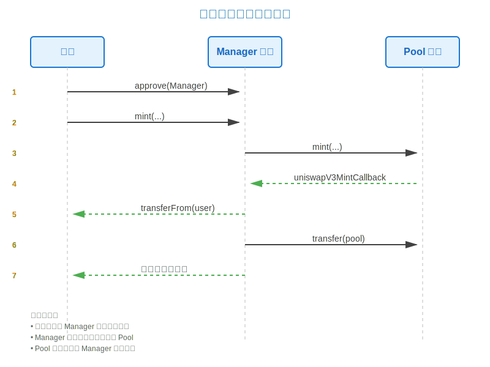
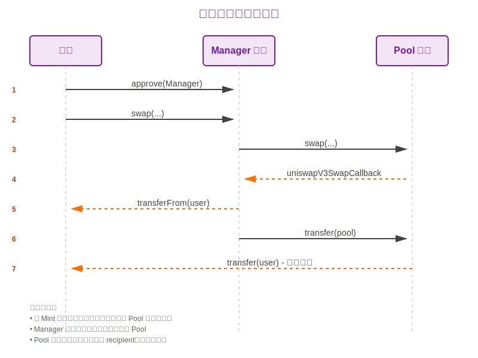
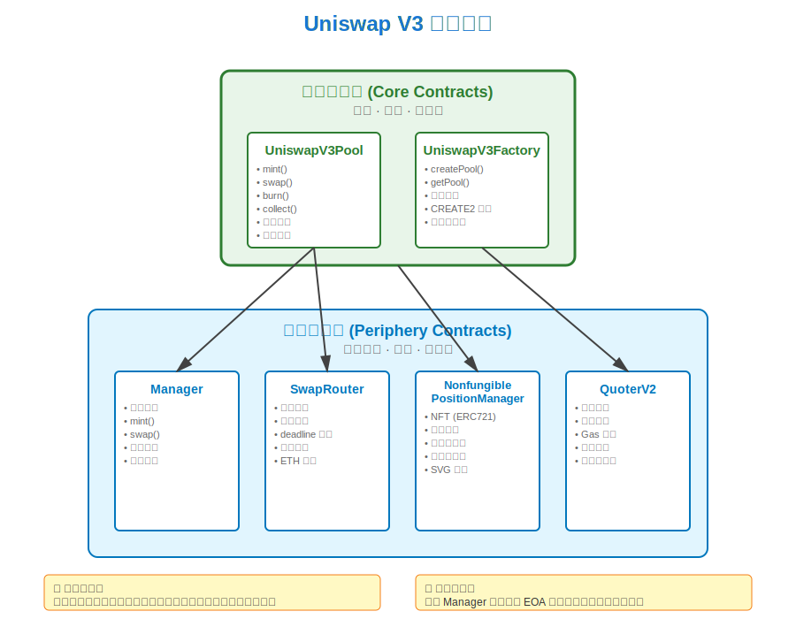

# UniswapV3 技术学习系列（八）：管理合约 Manager 实现

## 系列文章导航

本文是 UniswapV3 技术学习系列的第八篇，属于"里程碑 1：第一次Swap"模块。在前面的文章中，我们实现了核心的流动性提供（Minting）和代币交换（Swap）功能，但这些核心合约并不适合普通用户直接调用。本文将实现一个管理合约（Manager Contract），作为核心池合约和用户之间的中介层，提供更加友好和灵活的交互接口。我们将学习回调数据传递机制、合约架构设计模式，以及为什么需要将核心合约和外围合约分离。

> **原文链接：** [Manager Contract - Uniswap V3 Development Book](https://uniswapv3book.com/milestone_1/manager-contract.html)

---

## 一、为什么需要管理合约？

### 1.1 回顾核心合约的设计哲学

在开始实现管理合约之前，让我们回顾一下 Uniswap V3 的合约架构设计：

**核心合约（Core Contracts）**
- 🎯 **职责**：实现核心业务逻辑
- ⚡ **特点**：精简、高效、底层
- 🔒 **目标**：单一职责、极致安全
- 📦 **包括**：`UniswapV3Pool`、`UniswapV3Factory`

**外围合约（Periphery Contracts）**
- 🎯 **职责**：提供用户友好的接口
- ⚡ **特点**：灵活、便捷、高层
- 🔒 **目标**：易用性、可扩展性
- 📦 **包括**：`SwapRouter`、`NonfungiblePositionManager`、`Quoter`

### 1.2 核心合约的"不友好"之处

`UniswapV3Pool` 作为核心合约，有以下特点：

1. **需要精确的计算参数**
   - 要求调用者自行计算价格、数量、Tick 等参数
   - 不提供任何辅助计算或校验功能

2. **使用回调机制接收代币**
   - 不使用标准的 `transferFrom` 接收代币
   - 而是通过回调函数 `uniswapV3MintCallback` 和 `uniswapV3SwapCallback`
   - 只有合约才能实现回调接口

3. **普通用户（EOA）无法直接调用**
   - EOA（Externally Owned Account，外部账户）无法实现回调接口
   - 必须通过智能合约作为中介

### 1.3 下一步计划

我们即将完成以下任务：

- ✅ 已完成核心池合约的实现
- ✅ 已完成测试合约中的回调实现
- 🎯 **本章目标**：实现管理合约，让普通用户也能与池合约交互
- 🎯 **下一步**：部署到本地区块链，集成前端应用

---

## 二、管理合约的工作流程

### 2.1 添加流动性的完整流程



**详细步骤说明：**

1. **授权（Approve）**
   - 用户批准 Manager 合约花费其代币
   - 调用 `token0.approve(manager, amount0)` 和 `token1.approve(manager, amount1)`

2. **调用 Manager 的 mint**
   - 用户调用 `manager.mint(poolAddress, lowerTick, upperTick, liquidity, data)`
   - 传递所有必要的铸造参数

3. **Manager 调用 Pool 的 mint**
   - Manager 将调用转发到指定的池合约
   - 保持参数不变

4. **Pool 回调 Manager**
   - Pool 需要接收代币时，调用 `uniswapV3MintCallback`
   - Manager 实现了这个回调接口

5. **Manager 从用户转移代币**
   - Manager 使用 `transferFrom` 从用户账户提取代币
   - 这就是为什么第 1 步需要 approve

6. **Manager 将代币发送给 Pool**
   - Manager 使用 `transfer` 将代币发送到池合约
   - 完成流动性提供

7. **返回结果**
   - 用户获得流动性凭证

### 2.2 代币交换的完整流程



**关键点：**

- 与 Minting 流程类似
- Pool 会将输出代币直接发送给用户（recipient）
- Manager 负责接收输入代币并转给 Pool

### 2.3 Manager 合约的核心职责

Manager 合约作为中介，承担以下职责：

1. **接口适配**：将用户友好的调用转换为核心合约调用
2. **回调实现**：实现 `uniswapV3MintCallback` 和 `uniswapV3SwapCallback`
3. **代币管理**：使用 `transferFrom` 从用户获取代币，使用 `transfer` 发送给池
4. **参数转发**：将用户参数转发给池合约

---

## 三、升级池合约的回调机制

### 3.1 当前回调的局限性

在测试合约中，我们实现了这样的回调：

```solidity
function uniswapV3MintCallback(uint256 amount0, uint256 amount1) public {
    if (transferInMintCallback) {
        token0.transfer(msg.sender, amount0);
        token1.transfer(msg.sender, amount1);
    }
}
```

**存在的问题：**

❌ **问题 1：代币来源固定**
- 函数只能转移测试合约自己的代币
- 无法从其他地址（如用户地址）转移代币

❌ **问题 2：代币地址硬编码**
- 函数直接使用 `token0` 和 `token1` 状态变量
- Manager 需要支持任意池，每个池的代币都不同

❌ **问题 3：缺少灵活性**
- 无法传递用户地址、池地址等额外信息

### 3.2 解决方案：通过回调传递额外数据

**核心思想：** 使用 `bytes calldata data` 参数传递编码后的额外数据。

#### 步骤 1：定义回调数据结构

在 `UniswapV3Pool.sol` 中定义：

```solidity
// src/UniswapV3Pool.sol

/// @notice 回调函数的额外数据结构
/// @dev 使用 abi.encode 编码后传递给回调函数
struct CallbackData {
    /// @notice 池中的 token0 地址
    address token0;
    
    /// @notice 池中的 token1 地址
    address token1;
    
    /// @notice 支付代币的用户地址
    address payer;
}
```

**字段说明：**
- `token0`：池中的第一个代币地址（按地址排序）
- `token1`：池中的第二个代币地址
- `payer`：实际支付代币的用户地址（用于 `transferFrom`）

#### 步骤 2：修改 mint 函数签名

```solidity
/// @notice 提供流动性
/// @param owner 流动性拥有者地址
/// @param lowerTick 价格区间下界
/// @param upperTick 价格区间上界
/// @param amount 流动性数量
/// @param data 回调函数的额外数据（编码后的 CallbackData）
/// @return amount0 实际需要的 token0 数量
/// @return amount1 实际需要的 token1 数量
function mint(
    address owner,
    int24 lowerTick,
    int24 upperTick,
    uint128 amount,
    bytes calldata data // <--- 新增参数
) external returns (uint256 amount0, uint256 amount1) {
    // ... 流动性计算逻辑 ...
    
    // 调用回调函数，传递编码后的额外数据
    IUniswapV3MintCallback(msg.sender).uniswapV3MintCallback(
        amount0,
        amount1,
        data // <--- 将数据传递给回调
    );
    
    // ... 余额验证逻辑 ...
}
```

#### 步骤 3：修改 swap 函数签名

```solidity
/// @notice 执行代币交换
/// @param recipient 接收输出代币的地址
/// @param data 回调函数的额外数据（编码后的 CallbackData）
/// @return amount0 token0 的变化量（正数表示需要支付，负数表示接收）
/// @return amount1 token1 的变化量
function swap(
    address recipient,
    bytes calldata data // <--- 新增参数
) public returns (int256 amount0, int256 amount1) {
    // ... 交换逻辑 ...
    
    // 调用回调函数，传递编码后的额外数据
    IUniswapV3SwapCallback(msg.sender).uniswapV3SwapCallback(
        amount0,
        amount1,
        data // <--- 将数据传递给回调
    );
    
    // ... 余额验证逻辑 ...
}
```

#### 步骤 4：更新回调接口定义

```solidity
// src/interfaces/IUniswapV3MintCallback.sol

/// @notice Mint 回调接口
/// @dev 任何调用 UniswapV3Pool.mint 的合约都必须实现此接口
interface IUniswapV3MintCallback {
    /// @notice Uniswap V3 池在 mint 时调用的回调函数
    /// @dev 在回调中，调用者必须向池转移所需的代币数量
    /// @param amount0 需要支付的 token0 数量
    /// @param amount1 需要支付的 token1 数量
    /// @param data mint 函数调用时传递的额外数据
    function uniswapV3MintCallback(
        uint256 amount0,
        uint256 amount1,
        bytes calldata data // <--- 新增参数
    ) external;
}
```

```solidity
// src/interfaces/IUniswapV3SwapCallback.sol

/// @notice Swap 回调接口
/// @dev 任何调用 UniswapV3Pool.swap 的合约都必须实现此接口
interface IUniswapV3SwapCallback {
    /// @notice Uniswap V3 池在 swap 时调用的回调函数
    /// @dev 在回调中，调用者必须向池转移所需的代币数量
    /// @param amount0 token0 的变化量（正数表示需要支付）
    /// @param amount1 token1 的变化量（正数表示需要支付）
    /// @param data swap 函数调用时传递的额外数据
    function uniswapV3SwapCallback(
        int256 amount0,
        int256 amount1,
        bytes calldata data // <--- 新增参数
    ) external;
}
```

### 3.3 更新测试合约中的回调实现

现在，我们需要更新测试合约中的回调实现，使其能够解码额外数据：

```solidity
// test/UniswapV3Pool.t.sol

/// @notice Mint 回调的实现
/// @dev 从用户地址转移代币到池合约
function uniswapV3MintCallback(
    uint256 amount0,
    uint256 amount1,
    bytes calldata data
) public {
    if (transferInMintCallback) {
        // 解码额外数据
        UniswapV3Pool.CallbackData memory extra = abi.decode(
            data,
            (UniswapV3Pool.CallbackData)
        );
        
        // 使用 transferFrom 从 payer 地址转移代币到池合约（msg.sender）
        IERC20(extra.token0).transferFrom(extra.payer, msg.sender, amount0);
        IERC20(extra.token1).transferFrom(extra.payer, msg.sender, amount1);
    }
}
```

**关键改进：**

1. **解码数据**
   ```solidity
   UniswapV3Pool.CallbackData memory extra = abi.decode(
       data,
       (UniswapV3Pool.CallbackData)
   );
   ```
   - 使用 `abi.decode` 将 `bytes` 数据解码为 `CallbackData` 结构
   - 现在可以访问 `token0`、`token1`、`payer` 地址

2. **使用 transferFrom**
   ```solidity
   IERC20(extra.token0).transferFrom(extra.payer, msg.sender, amount0);
   ```
   - 从 `extra.payer`（用户地址）转移代币
   - 转移到 `msg.sender`（池合约地址）
   - 不再从测试合约自己的余额转移

3. **动态代币地址**
   ```solidity
   IERC20(extra.token0) // 使用传递的 token0 地址，而非硬编码
   ```

**Swap 回调的更新：**

```solidity
/// @notice Swap 回调的实现
/// @dev 从用户地址转移代币到池合约
function uniswapV3SwapCallback(
    int256 amount0,
    int256 amount1,
    bytes calldata data
) public {
    if (transferInSwapCallback) {
        // 解码额外数据
        UniswapV3Pool.CallbackData memory extra = abi.decode(
            data,
            (UniswapV3Pool.CallbackData)
        );
        
        // 如果 amount0 > 0，需要支付 token0
        if (amount0 > 0) {
            IERC20(extra.token0).transferFrom(
                extra.payer,
                msg.sender,
                uint256(amount0)
            );
        }
        
        // 如果 amount1 > 0，需要支付 token1
        if (amount1 > 0) {
            IERC20(extra.token1).transferFrom(
                extra.payer,
                msg.sender,
                uint256(amount1)
            );
        }
    }
}
```

### 3.4 测试用例的调整

现在需要更新测试用例，在调用 `mint` 和 `swap` 时传递编码后的数据：

```solidity
function testMint() public {
    // ... 设置代码 ...
    
    // 编码回调数据
    bytes memory data = abi.encode(
        UniswapV3Pool.CallbackData({
            token0: address(token0),
            token1: address(token1),
            payer: address(this) // 测试合约作为支付者
        })
    );
    
    // 调用 mint，传递编码后的数据
    (uint256 amount0, uint256 amount1) = pool.mint(
        address(this),
        lowerTick,
        upperTick,
        liquidity,
        data // <--- 传递编码数据
    );
    
    // ... 断言代码 ...
}
```

---

## 四、实现 Manager 合约

### 4.1 合约结构设计

Manager 合约的职责非常清晰：

1. 提供用户友好的 `mint` 和 `swap` 接口
2. 将调用转发到指定的池合约
3. 实现回调接口，处理代币转移

让我们创建 Manager 合约：

```solidity
// src/UniswapV3Manager.sol
// SPDX-License-Identifier: MIT
pragma solidity ^0.8.14;

import "./UniswapV3Pool.sol";
import "./interfaces/IERC20.sol";

/// @title Uniswap V3 管理合约
/// @notice 为核心池合约提供用户友好的接口
/// @dev 作为用户和池合约之间的中介，处理代币授权和转移
contract UniswapV3Manager {
    
    // ==================== 错误定义 ====================
    
    /// @notice 滑点保护失败
    error SlippageCheckFailed(uint256 amount0, uint256 amount1);
    
    /// @notice 无效的调用者
    error TooLittleReceived(uint256 amountOut);
    
    // ==================== 外部函数 ====================
    
    /// @notice 向指定池提供流动性
    /// @dev 用户需要先 approve 足够的代币给本合约
    /// @param poolAddress_ 目标池合约地址
    /// @param lowerTick 价格区间下界（Tick）
    /// @param upperTick 价格区间上界（Tick）
    /// @param liquidity 流动性数量
    /// @param data 额外数据（传递给池合约的回调）
    /// @return amount0 实际使用的 token0 数量
    /// @return amount1 实际使用的 token1 数量
    function mint(
        address poolAddress_,
        int24 lowerTick,
        int24 upperTick,
        uint128 liquidity,
        bytes calldata data
    ) public returns (uint256 amount0, uint256 amount1) {
        // 将调用转发到池合约
        // msg.sender 是用户地址，会被记录为流动性拥有者
        (amount0, amount1) = UniswapV3Pool(poolAddress_).mint(
            msg.sender,  // owner: 用户地址
            lowerTick,
            upperTick,
            liquidity,
            data
        );
    }
    
    /// @notice 在指定池中执行代币交换
    /// @dev 用户需要先 approve 足够的输入代币给本合约
    /// @param poolAddress_ 目标池合约地址
    /// @param data 额外数据（传递给池合约的回调）
    /// @return amount0 token0 的变化量
    /// @return amount1 token1 的变化量
    function swap(
        address poolAddress_,
        bytes calldata data
    ) public returns (int256 amount0, int256 amount1) {
        // 将调用转发到池合约
        // msg.sender 是用户地址，会接收输出代币
        (amount0, amount1) = UniswapV3Pool(poolAddress_).swap(
            msg.sender,  // recipient: 用户地址
            data
        );
    }
    
    // ==================== 回调实现 ====================
    
    /// @notice Mint 回调函数实现
    /// @dev 由池合约调用，用于接收代币
    /// @param amount0 需要支付的 token0 数量
    /// @param amount1 需要支付的 token1 数量
    /// @param data 编码的 CallbackData
    function uniswapV3MintCallback(
        uint256 amount0,
        uint256 amount1,
        bytes calldata data
    ) public {
        // 解码回调数据
        UniswapV3Pool.CallbackData memory extra = abi.decode(
            data,
            (UniswapV3Pool.CallbackData)
        );
        
        // 从用户地址转移 token0 到池合约
        // extra.payer 是用户地址（已经 approve 给本合约）
        // msg.sender 是池合约地址
        IERC20(extra.token0).transferFrom(
            extra.payer,
            msg.sender,
            amount0
        );
        
        // 从用户地址转移 token1 到池合约
        IERC20(extra.token1).transferFrom(
            extra.payer,
            msg.sender,
            amount1
        );
    }
    
    /// @notice Swap 回调函数实现
    /// @dev 由池合约调用，用于接收输入代币
    /// @param amount0 token0 的变化量（正数表示需要支付）
    /// @param amount1 token1 的变化量（正数表示需要支付）
    /// @param data 编码的 CallbackData
    function uniswapV3SwapCallback(
        int256 amount0,
        int256 amount1,
        bytes calldata data
    ) public {
        // 解码回调数据
        UniswapV3Pool.CallbackData memory extra = abi.decode(
            data,
            (UniswapV3Pool.CallbackData)
        );
        
        // 如果 amount0 > 0，说明用户需要支付 token0
        if (amount0 > 0) {
            IERC20(extra.token0).transferFrom(
                extra.payer,
                msg.sender,
                uint256(amount0)
            );
        }
        
        // 如果 amount1 > 0，说明用户需要支付 token1
        if (amount1 > 0) {
            IERC20(extra.token1).transferFrom(
                extra.payer,
                msg.sender,
                uint256(amount1)
            );
        }
    }
}
```

### 4.2 代码详解

#### 4.2.1 mint 函数的实现逻辑

```solidity
function mint(
    address poolAddress_,
    int24 lowerTick,
    int24 upperTick,
    uint128 liquidity,
    bytes calldata data
) public returns (uint256 amount0, uint256 amount1) {
    (amount0, amount1) = UniswapV3Pool(poolAddress_).mint(
        msg.sender,  // ⚠️ 关键：用户作为 owner
        lowerTick,
        upperTick,
        liquidity,
        data
    );
}
```

**关键点：**

1. **poolAddress_ 参数**
   - 允许 Manager 与任意池合约交互
   - 用户可以选择不同的交易对
   
2. **msg.sender 作为 owner**
   - 在 Manager 调用池合约时，`msg.sender` 是用户地址
   - 流动性仓位会记录在用户名下，而不是 Manager 名下
   
3. **data 参数透传**
   - Manager 不解析 `data`，直接传递给池合约
   - 池合约会将 `data` 传递给回调函数

#### 4.2.2 uniswapV3MintCallback 的实现逻辑

```solidity
function uniswapV3MintCallback(
    uint256 amount0,
    uint256 amount1,
    bytes calldata data
) public {
    // 1. 解码数据
    UniswapV3Pool.CallbackData memory extra = abi.decode(
        data,
        (UniswapV3Pool.CallbackData)
    );
    
    // 2. 从用户转移到池
    IERC20(extra.token0).transferFrom(extra.payer, msg.sender, amount0);
    IERC20(extra.token1).transferFrom(extra.payer, msg.sender, amount1);
}
```

**执行流程：**

```
1. 池合约调用 Manager.uniswapV3MintCallback
   ├─ msg.sender = 池合约地址
   └─ data = 编码的 CallbackData

2. Manager 解码数据
   ├─ extra.token0 = 池中的 token0 地址
   ├─ extra.token1 = 池中的 token1 地址
   └─ extra.payer = 用户地址

3. Manager 执行 transferFrom
   ├─ 从 extra.payer（用户）
   ├─ 转移到 msg.sender（池合约）
   └─ 前提：用户已经 approve 给 Manager
```

#### 4.2.3 swap 函数的实现逻辑

```solidity
function swap(
    address poolAddress_,
    bytes calldata data
) public returns (int256 amount0, int256 amount1) {
    (amount0, amount1) = UniswapV3Pool(poolAddress_).swap(
        msg.sender,  // ⚠️ 关键：用户作为 recipient
        data
    );
}
```

**关键点：**

- `msg.sender` 作为 `recipient`，输出代币会直接发送给用户
- Manager 不持有任何代币，只是转发调用

#### 4.2.4 uniswapV3SwapCallback 的实现逻辑

```solidity
function uniswapV3SwapCallback(
    int256 amount0,
    int256 amount1,
    bytes calldata data
) public {
    UniswapV3Pool.CallbackData memory extra = abi.decode(
        data,
        (UniswapV3Pool.CallbackData)
    );
    
    // 只有正数才需要支付
    if (amount0 > 0) {
        IERC20(extra.token0).transferFrom(
            extra.payer,
            msg.sender,
            uint256(amount0)
        );
    }
    
    if (amount1 > 0) {
        IERC20(extra.token1).transferFrom(
            extra.payer,
            msg.sender,
            uint256(amount1)
        );
    }
}
```

**amount 的符号含义：**

- **正数**：用户需要支付（输入代币）
- **负数**：用户会接收（输出代币）
- **零**：无变化

### 4.3 与测试合约的对比

让我们对比一下 Manager 合约和测试合约的回调实现：

| 特性 | 测试合约 | Manager 合约 |
|------|---------|-------------|
| **代币来源** | 测试合约自己的余额 | 用户地址（通过 `transferFrom`） |
| **代币地址** | 硬编码的状态变量 | 从 `data` 解码获取 |
| **转移标志** | 有 `transferInMintCallback` | 无标志，总是转移 |
| **使用场景** | 仅用于测试 | 生产环境，面向真实用户 |
| **灵活性** | 固定的池和用户 | 支持任意池和用户 |

---

## 五、使用 Foundry 测试 Manager 合约

### 5.1 测试用例设计

让我们为 Manager 合约编写完整的测试用例：

```solidity
// test/UniswapV3Manager.t.sol
// SPDX-License-Identifier: MIT
pragma solidity ^0.8.14;

import "forge-std/Test.sol";
import "../src/UniswapV3Manager.sol";
import "../src/UniswapV3Pool.sol";
import "./ERC20Mintable.sol";

contract UniswapV3ManagerTest is Test {
    ERC20Mintable token0;
    ERC20Mintable token1;
    UniswapV3Pool pool;
    UniswapV3Manager manager;
    
    // 测试用户地址
    address alice = address(0x1);
    address bob = address(0x2);
    
    function setUp() public {
        // 1. 部署代币
        token0 = new ERC20Mintable("Ether", "ETH", 18);
        token1 = new ERC20Mintable("USDC", "USDC", 18);
        
        // 2. 部署池合约
        pool = new UniswapV3Pool(
            address(token0),
            address(token1),
            uint160(79228162514264337593543950336), // sqrtPriceX96 = 1
            0
        );
        
        // 3. 部署 Manager 合约
        manager = new UniswapV3Manager();
    }
    
    /// @notice 测试通过 Manager 提供流动性
    function testMintThroughManager() public {
        // 准备测试参数
        int24 lowerTick = -100;
        int24 upperTick = 100;
        uint128 liquidity = 1000000;
        
        // 为 Alice 铸造代币
        token0.mint(alice, 10 ether);
        token1.mint(alice, 10 ether);
        
        // Alice 授权 Manager
        vm.startPrank(alice);
        token0.approve(address(manager), 10 ether);
        token1.approve(address(manager), 10 ether);
        
        // 编码回调数据
        bytes memory data = abi.encode(
            UniswapV3Pool.CallbackData({
                token0: address(token0),
                token1: address(token1),
                payer: alice
            })
        );
        
        // Alice 通过 Manager 添加流动性
        (uint256 amount0, uint256 amount1) = manager.mint(
            address(pool),
            lowerTick,
            upperTick,
            liquidity,
            data
        );
        
        vm.stopPrank();
        
        // 验证代币已转移
        assertEq(token0.balanceOf(alice), 10 ether - amount0);
        assertEq(token1.balanceOf(alice), 10 ether - amount1);
        assertEq(token0.balanceOf(address(pool)), amount0);
        assertEq(token1.balanceOf(address(pool)), amount1);
        
        // 验证流动性已记录在 Alice 名下
        // （这需要在 Pool 合约中添加查询函数）
    }
    
    /// @notice 测试通过 Manager 执行交换
    function testSwapThroughManager() public {
        // 1. 先提供流动性（使用测试合约）
        _setupLiquidity();
        
        // 2. 为 Bob 铸造代币
        token1.mint(bob, 100 ether);
        
        // 3. Bob 授权 Manager
        vm.startPrank(bob);
        token1.approve(address(manager), 100 ether);
        
        // 4. 编码回调数据
        bytes memory data = abi.encode(
            UniswapV3Pool.CallbackData({
                token0: address(token0),
                token1: address(token1),
                payer: bob
            })
        );
        
        // 5. Bob 通过 Manager 执行交换
        uint256 bobToken0Before = token0.balanceOf(bob);
        uint256 bobToken1Before = token1.balanceOf(bob);
        
        (int256 amount0, int256 amount1) = manager.swap(
            address(pool),
            data
        );
        
        vm.stopPrank();
        
        // 6. 验证交换结果
        // Bob 支付了 token1（正数）
        assertGt(amount1, 0);
        assertEq(
            token1.balanceOf(bob),
            bobToken1Before - uint256(amount1)
        );
        
        // Bob 接收了 token0（负数）
        assertLt(amount0, 0);
        assertEq(
            token0.balanceOf(bob),
            bobToken0Before + uint256(-amount0)
        );
    }
    
    /// @notice 辅助函数：设置初始流动性
    function _setupLiquidity() internal {
        token0.mint(address(this), 10 ether);
        token1.mint(address(this), 10 ether);
        
        token0.approve(address(manager), 10 ether);
        token1.approve(address(manager), 10 ether);
        
        bytes memory data = abi.encode(
            UniswapV3Pool.CallbackData({
                token0: address(token0),
                token1: address(token1),
                payer: address(this)
            })
        );
        
        manager.mint(
            address(pool),
            -100,
            100,
            1000000,
            data
        );
    }
}
```

### 5.2 运行测试

```bash
# 运行所有 Manager 测试
forge test --match-contract UniswapV3ManagerTest -vvv

# 运行特定测试
forge test --match-test testMintThroughManager -vvvv

# 生成 Gas 报告
forge test --match-contract UniswapV3ManagerTest --gas-report
```

### 5.3 测试要点说明

**1. 用户模拟**
```solidity
address alice = address(0x1);
vm.startPrank(alice);  // 模拟 Alice 的调用
```

**2. 代币授权**
```solidity
token0.approve(address(manager), 10 ether);
```
- 用户必须先授权 Manager 合约
- Manager 才能使用 `transferFrom` 转移用户的代币

**3. 回调数据编码**
```solidity
bytes memory data = abi.encode(
    UniswapV3Pool.CallbackData({
        token0: address(token0),
        token1: address(token1),
        payer: alice  // 关键：指定支付者
    })
);
```

**4. 余额验证**
```solidity
assertEq(token0.balanceOf(alice), 10 ether - amount0);
assertEq(token0.balanceOf(address(pool)), amount0);
```

---

## 六、Manager 合约的进阶功能

### 6.1 当前 Manager 的局限性

我们实现的 Manager 合约非常简化，只包含最基本的功能。真实的 Uniswap V3 外围合约（如 SwapRouter）提供了更多功能：

❌ **缺少滑点保护**
- 用户无法指定最小输出数量
- 可能在价格剧烈波动时遭受损失

❌ **缺少截止时间**
- 交易可能在很久之后才被执行
- 此时价格可能已经不合适

❌ **不支持多跳交换**
- 只能在单一池中交换
- 无法实现 A → B → C 的路径

❌ **不支持 ETH**
- 只支持 ERC20 代币
- 需要额外处理 WETH 包装

### 6.2 添加滑点保护

让我们为 Manager 添加简单的滑点保护：

```solidity
/// @notice 带滑点保护的交换
/// @param poolAddress_ 目标池合约地址
/// @param minAmountOut 最小输出数量（滑点保护）
/// @param data 额外数据
/// @return amount0 token0 的变化量
/// @return amount1 token1 的变化量
function swapWithSlippage(
    address poolAddress_,
    uint256 minAmountOut,
    bytes calldata data
) public returns (int256 amount0, int256 amount1) {
    // 执行交换
    (amount0, amount1) = UniswapV3Pool(poolAddress_).swap(
        msg.sender,
        data
    );
    
    // 计算实际输出数量（负数的绝对值）
    uint256 actualOut = amount0 < 0 ? uint256(-amount0) : uint256(-amount1);
    
    // 滑点保护检查
    if (actualOut < minAmountOut) {
        revert TooLittleReceived(actualOut);
    }
}
```

### 6.3 添加截止时间保护

```solidity
/// @notice 带截止时间的交换
/// @param poolAddress_ 目标池合约地址
/// @param deadline 交易截止时间戳
/// @param data 额外数据
/// @return amount0 token0 的变化量
/// @return amount1 token1 的变化量
function swapWithDeadline(
    address poolAddress_,
    uint256 deadline,
    bytes calldata data
) public returns (int256 amount0, int256 amount1) {
    // 检查是否过期
    require(block.timestamp <= deadline, "Transaction expired");
    
    // 执行交换
    return UniswapV3Pool(poolAddress_).swap(msg.sender, data);
}
```

---

## 七、架构设计的深入分析

### 7.1 为什么要分离核心合约和外围合约？

**1. 安全性（Security）**

核心合约：
- 包含关键的资金逻辑
- 尽可能简化，减少攻击面
- 经过严格审计
- 升级困难（或不可升级）

外围合约：
- 提供便捷功能
- 可以随时部署新版本
- 即使有漏洞，也不影响核心资金安全

**2. 灵活性（Flexibility）**

```
核心合约（不可变）
    ↓
外围合约 V1 → 外围合约 V2 → 外围合约 V3
    ↓              ↓              ↓
基础功能       增加功能       更多功能
```

- 核心合约保持不变
- 可以部署多个版本的外围合约
- 不同的外围合约满足不同的需求

**3. 可组合性（Composability）**

```
┌─────────────┐
│ 核心池合约  │
└──────┬──────┘
       │
   ┌───┴────┬──────────┬───────────┐
   ↓        ↓          ↓           ↓
Router  Manager   Quoter    CustomContract
```

- 任何人都可以编写自己的外围合约
- 与核心合约交互
- 实现定制化的功能

### 7.2 Manager vs Router vs Position Manager

Uniswap V3 有多个外围合约，各有不同的职责：



| 合约 | 职责 | 主要功能 |
|------|------|---------|
| **Manager**（本文） | 基础中介 | 最简单的转发功能 |
| **SwapRouter** | 交易路由 | 多跳交易、滑点保护、deadline |
| **NonfungiblePositionManager** | 仓位管理 | 将流动性封装为 NFT，支持修改和收取手续费 |
| **Quoter** | 报价查询 | 链下查询，模拟交易结果 |

### 7.3 回调模式 vs transferFrom 模式

**传统模式（Uniswap V2）：**
```solidity
function addLiquidity(...) external {
    // 直接使用 transferFrom
    token0.transferFrom(msg.sender, address(this), amount0);
    token1.transferFrom(msg.sender, address(this), amount1);
    
    // ... 添加流动性逻辑 ...
}
```

**回调模式（Uniswap V3）：**
```solidity
function mint(...) external {
    // ... 计算 amount0, amount1 ...
    
    // 调用回调，让调用者转移代币
    IUniswapV3MintCallback(msg.sender).uniswapV3MintCallback(
        amount0,
        amount1,
        data
    );
    
    // 验证代币已到账
    require(balance0After >= balance0Before + amount0);
    require(balance1After >= balance1Before + amount1);
}
```

**回调模式的优势：**

1. **灵活性**
   - 调用者可以在回调中实现任意逻辑
   - 支持闪电贷（先借后还）
   
2. **Gas 优化**
   - 可以批量操作，减少状态变更
   - 在某些场景下更高效

3. **扩展性**
   - 支持更复杂的交互模式
   - 可以组合多个操作

**回调模式的代价：**

1. **用户体验**
   - EOA 无法直接调用
   - 必须通过合约交互

2. **复杂性**
   - 需要额外的合约（如 Manager）
   - 增加了理解难度

---

## 八、总结与展望

### 8.1 本章要点回顾

在本章中，我们学习了：

✅ **合约架构设计**
- 核心合约与外围合约的分离原则
- Manager 作为中介的角色和职责
- 为什么需要两层架构

✅ **回调机制的升级**
- 定义 `CallbackData` 结构传递额外信息
- 修改 `mint` 和 `swap` 函数签名
- 使用 `abi.encode/decode` 编码和解码数据

✅ **Manager 合约实现**
- 实现 `mint` 和 `swap` 函数
- 实现 `uniswapV3MintCallback` 和 `uniswapV3SwapCallback`
- 使用 `transferFrom` 处理用户代币

✅ **测试驱动开发**
- 使用 Foundry 编写完整测试用例
- 模拟多个用户的交互
- 验证代币转移和余额变化

### 8.2 关键技术点

**1. 数据编码与解码**
```solidity
// 编码
bytes memory data = abi.encode(CallbackData({...}));

// 解码
CallbackData memory extra = abi.decode(data, (CallbackData));
```

**2. 透传参数**
```solidity
function mint(..., bytes calldata data) external {
    // Manager 不解析 data，直接传递给 Pool
    pool.mint(..., data);
}
```

**3. transferFrom vs transfer**
```solidity
// Manager 使用 transferFrom 从用户获取
token.transferFrom(user, pool, amount);

// Pool 使用 transfer 发送给用户
token.transfer(recipient, amount);
```

### 8.3 实践建议

**1. 理解回调模式**
- 尝试修改 Manager 合约，实现更多功能
- 思考：如何在回调中实现闪电贷？

**2. 实验不同场景**
- 多个用户同时提供流动性
- 在不同价格区间添加流动性
- 测试边界情况（金额为 0、极大值等）

**3. 对比 V2 和 V3**
- V2 使用 `transferFrom` 直接转移代币
- V3 使用回调模式
- 各有什么优缺点？

**4. 探索真实代码**
- 查看 Uniswap V3 的 `SwapRouter` 实现
- 了解 `NonfungiblePositionManager` 如何管理 NFT
- 学习滑点保护、多跳交易等进阶功能

---

## 九、常见问题解答

### Q1: 为什么不直接在池合约中使用 transferFrom？

**A:** 主要有以下原因：

1. **灵活性** - 回调模式允许调用者实现任意逻辑（如闪电贷）
2. **安全性** - 池合约不需要持有 approve 权限
3. **可组合性** - 支持更复杂的多合约交互

### Q2: Manager 合约会持有用户的代币吗？

**A:** 不会。Manager 只是作为中介：
- 用户 → Manager（授权）
- Manager → Pool（transferFrom）
- 代币直接从用户转移到 Pool

### Q3: 如果用户没有 approve 给 Manager 会怎样？

**A:** `transferFrom` 会失败，整个交易会 revert。

### Q4: 可以有多个 Manager 合约吗？

**A:** 可以！任何人都可以部署自己的 Manager 合约，只要实现了回调接口。

### Q5: Manager 合约需要审计吗？

**A:** 如果是生产环境使用，强烈建议审计。虽然 Manager 不持有资金，但逻辑错误可能导致用户损失。

---

## 项目仓库

**UniswapV3 技术学习项目：**
https://github.com/RyanWeb31110/uniswapv3_tech

**相关系列项目：**
- UniswapV1 技术学习：https://github.com/RyanWeb31110/uniswapv1_tech
- UniswapV2 技术学习：https://github.com/RyanWeb31110/uniswapv2_tech

欢迎克隆代码，跟随教程一起实践学习！如果觉得有帮助，请给项目点个 Star ⭐️

