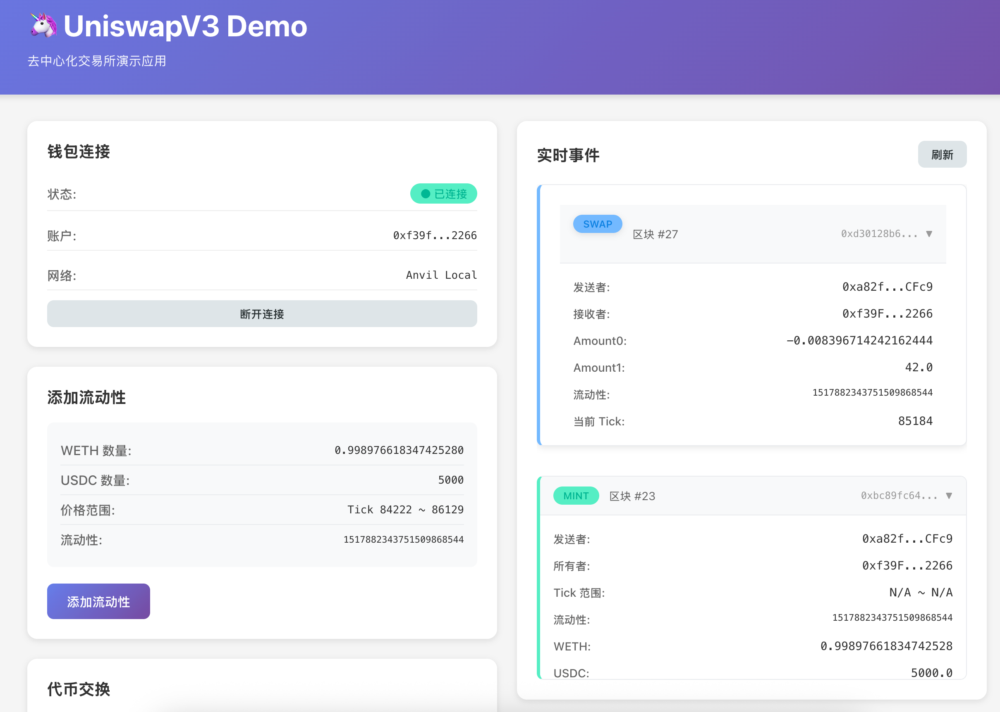

# UniswapV3 开发实战（十）：用户界面构建与 MetaMask 集成

## 系列回顾与本章导读

在前一章中，我们完成了智能合约的本地部署和测试，现在已经拥有了一个功能完整的去中心化交易池。本章作为里程碑一的收官之作，将带您构建一个友好的前端界面，实现与智能合约的完整交互。我们将学习如何使用 MetaMask 作为钱包和交易签名工具，通过 Ethers.js 库实现添加流动性、代币交换等核心功能，并订阅链上事件实时更新界面状态。通过本章学习，您将掌握去中心化应用（DApp）前端开发的完整工作流程。

> **注意**：本书的重点是智能合约开发，因此本章不会从零开始讲解前端应用的构建细节，而是聚焦于如何使用 MetaMask 和 Ethers.js 与智能合约进行交互。

## 前端演示与项目运行

### 界面预览

我们要构建的用户界面如下图所示：



这是一个简洁的 React 应用，提供了以下核心功能：
- **连接钱包**：连接 MetaMask 并显示当前账户地址和链 ID
- **添加流动性**：向池子提供流动性并铸造仓位 NFT
- **代币交换**：在指定价格区间内进行代币兑换
- **事件监听**：实时显示链上 Mint 和 Swap 事件

### 本地运行指南

如果您想亲自体验并运行这个应用，请按照以下完整步骤操作：

#### 第一步：启动本地区块链节点

首先启动 Anvil 本地开发节点：

```bash
# 在项目根目录下启动 Anvil
anvil --code-size-limit 50000
```

Anvil 将在 `http://localhost:8545` 启动，默认账户信息：
- **账户 0**: `0xf39Fd6e51aad88F6F4ce6aB8827279cffFb92266`
- **私钥**: `0xac0974bec39a17e36ba4a6b4d238ff944bacb478cbed5efcae784d7bf4f2ff80`
- **链 ID**: `31337`

#### 第二步：部署智能合约

在新的终端窗口中，部署所有必要的合约：

```bash
# 确保在项目根目录
cd /path/to/uniswapv3_tech

# 部署合约到本地网络
forge script scripts/DeployDevelopment.s.sol:DeployDevelopment \
  --rpc-url http://localhost:8545 \
  --private-key 0xac0974bec39a17e36ba4a6b4d238ff944bacb478cbed5efcae784d7bf4f2ff80 \
  --broadcast
```

部署成功后，记录输出的合约地址，例如：
```
=== 部署成功 ===
WETH 地址: 0x5FbDB2315678afecb367f032d93F642f64180aa3
USDC 地址: 0xe7f1725E7734CE288F8367e1Bb143E90bb3F0512
Pool 地址: 0x9fE46736679d2D9a65F0992F2272dE9f3c7fa6e0
Manager 地址: 0xCf7Ed3AccA5a467e9e704C703E8D87F634fB0Fc9
```

#### 第三步：配置前端合约地址

编辑前端配置文件，更新合约地址：

```bash
# 编辑合约配置文件
vim ui/src/config/contracts.js
```

将 `CONTRACTS` 对象中的地址更新为部署后的实际地址：

```javascript
export const CONTRACTS = {
  // ERC20 代币地址
  WETH: '0x5FbDB2315678afecb367f032d93F642f64180aa3',
  USDC: '0xe7f1725E7734CE288F8367e1Bb143E90bb3F0512',
  
  // UniswapV3 合约地址
  Pool: '0x9fE46736679d2D9a65F0992F2272dE9f3c7fa6e0',
  Manager: '0xCf7Ed3AccA5a467e9e704C703E8D87F634fB0Fc9',
};
```

#### 第四步：安装前端依赖并启动

```bash
# 进入前端目录
cd ui

# 安装依赖
npm install

# 启动开发服务器
npm start
```

应用将在 `http://localhost:3000` 启动。

#### 第五步：配置 MetaMask

1. **安装 MetaMask 扩展**（如果尚未安装）
2. **导入测试账户**：
   - 点击 MetaMask 账户图标
   - 选择"导入账户"
   - 输入私钥：`0xac0974bec39a17e36ba4a6b4d238ff944bacb478cbed5efcae784d7bf4f2ff80`
3. **添加本地网络**：
   - 网络名称：`Anvil Local`
   - RPC URL：`http://localhost:8545`
   - 链 ID：`31337`
   - 货币符号：`ETH`

#### 第六步：测试应用功能

1. **连接钱包**：在应用中点击"连接 MetaMask"
2. **添加流动性**：点击"添加流动性"按钮，确认交易
3. **执行交换**：在交换界面输入数量，执行代币交换
4. **查看事件**：右侧面板会实时显示链上事件

#### 常见问题排查

**问题 1：合约调用失败**
- 检查 Anvil 节点是否正在运行
- 确认合约地址配置是否正确
- 查看浏览器控制台错误信息

**问题 2：MetaMask 连接失败**

- 确认 MetaMask 已安装并解锁
- 检查网络配置是否正确
- 尝试刷新页面重新连接

**问题 3：交易被拒绝**

- 检查账户是否有足够的 ETH 作为 Gas 费
- 确认代币余额是否充足
- 检查交易参数是否正确

#### 开发提示

- **重置状态**：重启 Anvil 节点会重置所有状态，需要重新部署合约
- **Gas 费用**：本地网络 Gas 费用很低，可以设置较高的 Gas Limit
- **调试工具**：使用浏览器开发者工具查看网络请求和错误信息
- **合约验证**：可以使用 `forge verify-contract` 验证合约代码

## 工具链概述

### MetaMask：去中心化钱包

#### 什么是 MetaMask？

MetaMask 是目前最流行的以太坊钱包，以浏览器扩展程序的形式提供服务。它为用户提供了完整的钱包功能：

- **密钥管理**：安全地创建和存储私钥，支持助记词恢复
- **资产管理**：查看代币余额，支持 ERC20、ERC721 等多种代币标准
- **网络切换**：轻松连接到主网、测试网或本地开发网络
- **资产转账**：发送和接收以太币及各种代币

#### MetaMask 的双重角色

除了基本的钱包功能，MetaMask 还扮演着两个关键角色：

**1. 提供者（Provider）**

MetaMask 作为提供者，连接到以太坊节点并暴露标准的 JSON-RPC API 接口。这使得前端应用能够：
- 查询区块链状态（账户余额、合约数据等）
- 监听区块链事件
- 估算交易 Gas 费用
- 获取网络信息（链 ID、区块高度等）

**2. 签名者（Signer）**

MetaMask 作为签名者，提供安全的交易签名功能。关键特性包括：
- 使用本地私钥对交易进行签名，私钥永不离开浏览器
- 在签名前向用户展示交易详情，确保用户知情同意
- 支持多种签名类型（交易签名、消息签名、类型化数据签名等）

#### 工作流程示意

```
┌─────────────┐      ┌─────────────┐      ┌─────────────┐
│   前端应用   │─────▶│  MetaMask   │─────▶│  以太坊节点  │
│  (DApp UI)  │      │  (钱包扩展)  │      │   (RPC)     │
└─────────────┘      └─────────────┘      └─────────────┘
      │                     │                     │
      │  1. 请求交易        │                     │
      │──────────────────▶ │                     │
      │                     │  2. 用户确认签名    │
      │                     │──────────────────▶ │
      │                     │                     │  3. 广播交易
      │                     │◀──────────────────  │
      │  4. 返回交易哈希     │                     │
      │◀────────────────── │                     │
```

### Ethers.js：智能合约交互库

#### 为什么需要 Ethers.js？

虽然 MetaMask 提供了基础的账户管理和交易发送功能，但它并不提供便捷的合约交互接口。直接使用原始 JSON-RPC 调用会非常繁琐，需要手动处理：

- **ABI 编码/解码**：函数参数和返回值的编码转换
- **大数运算**：JavaScript 原生不支持 `uint256` 等大整数类型
- **单位转换**：Wei、Gwei、Ether 等单位的转换
- **交易构建**：手动组装交易对象的各个字段

#### 主流库对比

当前有两个主流的以太坊 JavaScript 库：

| 特性 | Web3.js | Ethers.js |
|------|---------|-----------|
| 包大小 | 较大（~700KB） | 较小（~300KB） |
| API 设计 | 传统面向对象 | 现代化、模块化 |
| 文档质量 | 完善但略显混乱 | 清晰、结构化 |
| 类型支持 | TypeScript 支持一般 | 完整的 TypeScript 支持 |
| 社区活跃度 | 历史悠久 | 快速增长 |

在本项目中，我们选择 **Ethers.js**，主要原因是：
- API 设计更清晰，合约交互接口更直观
- 完善的 TypeScript 类型定义
- 更小的包体积，加载速度更快
- 活跃的社区和持续的维护

#### Ethers.js 核心概念

```javascript
// 1. Provider：连接到区块链网络
const provider = new ethers.providers.Web3Provider(window.ethereum);

// 2. Signer：用于签名交易
const signer = provider.getSigner();

// 3. Contract：合约实例，用于调用合约函数
const contract = new ethers.Contract(address, abi, signer);

// 4. BigNumber：大整数运算
const amount = ethers.BigNumber.from("1000000000000000000"); // 1 ETH in Wei

// 5. 工具函数
ethers.utils.parseEther("1.0");        // 将 Ether 转换为 Wei
ethers.utils.formatEther(weiValue);    // 将 Wei 转换为 Ether
```

## 完整交互工作流

### 第一步：连接本地 Anvil 节点

#### 配置 MetaMask 网络

要与本地部署的合约交互，首先需要将 MetaMask 连接到本地 Anvil 节点：

1. **打开 MetaMask**，点击顶部的网络下拉列表
2. **点击"添加网络"**或"手动添加网络"
3. **填写网络配置**：
   ```
   网络名称：Anvil Local
   RPC URL：http://localhost:8545
   链 ID：31337
   货币符号：ETH
   区块浏览器 URL：（可选，留空）
   ```
4. **保存并切换**到新添加的网络

MetaMask 会自动检测链 ID。Anvil 的默认链 ID 是 `31337`，这是一个专门为本地开发保留的链 ID。

#### 导入测试账户

Anvil 启动时会生成 10 个预置的测试账户，每个账户都有 10,000 ETH 的余额。我们需要将部署合约时使用的账户导入到 MetaMask：

1. **点击账户图标**，选择"导入账户"
2. **选择导入类型**为"私钥"
3. **粘贴私钥**：
   ```
   # Anvil 默认账户 #0 的私钥
   0xac0974bec39a17e36ba4a6b4d238ff944bacb478cbed5efcae784d7bf4f2ff80
   ```
4. **点击导入**，账户将显示在钱包中

> **安全警告**：这些是测试网络的私钥，仅用于本地开发。**永远不要在主网使用这些私钥**，也不要向这些地址发送真实资产。

#### 添加代币资产

为了在 MetaMask 中查看代币余额，我们需要手动添加代币地址：

1. **切换到"资产"标签页**
2. **点击"导入代币"**
3. **选择"自定义代币"**
4. **填写代币合约地址**：
   - 从部署脚本输出或 `broadcast/DeployDevelopment.s.sol/31337/run-latest.json` 中获取 WETH 和 USDC 的地址
   - MetaMask 会自动读取代币名称、符号和精度
5. **点击"添加自定义代币"**

现在您应该能看到 WETH 和 USDC 的余额了。

#### 常见问题：缓存问题

MetaMask 在连接 `localhost` 时会缓存区块链状态。这可能导致以下问题：

- **重启 Anvil 后余额不更新**
- **交易 nonce 错误**
- **合约状态显示异常**

**解决方案**：

1. 点击账户图标，进入"设置"
2. 选择"高级"选项卡
3. 找到"重置账户"按钮并点击
4. 确认重置操作

> **注意**：每次重启 Anvil 节点后，都需要执行一次"重置账户"操作。这会清除本地缓存的交易历史和 nonce，但不会影响您的私钥和账户。

### 第二步：前端应用连接 MetaMask

#### 检测 MetaMask 安装

在前端应用中，首先需要检测用户是否安装了 MetaMask：

```javascript
// ui/src/contexts/MetaMask.js

/**
 * 连接 MetaMask 钱包
 * 
 * 功能说明：
 * 1. 检测 MetaMask 是否已安装
 * 2. 请求用户授权访问账户
 * 3. 获取当前连接的链 ID
 * 4. 更新应用状态
 */
const connect = () => {
  // 检查 window.ethereum 对象是否存在
  // 这个对象由 MetaMask 注入到浏览器环境中
  if (typeof (window.ethereum) === 'undefined') {
    // MetaMask 未安装
    return setStatus('not_installed');
  }

  // 并行发送两个请求到 MetaMask
  Promise.all([
    // 请求访问用户账户（会弹出授权窗口）
    window.ethereum.request({ method: 'eth_requestAccounts' }),
    // 获取当前连接的链 ID
    window.ethereum.request({ method: 'eth_chainId' }),
  ])
    .then(function ([accounts, chainId]) {
      // 保存第一个账户地址
      setAccount(accounts[0]);
      // 保存链 ID
      setChain(chainId);
      // 更新连接状态
      setStatus('connected');
    })
    .catch(function (error) {
      // 用户拒绝授权或其他错误
      console.error('连接 MetaMask 失败:', error);
      setStatus('error');
    });
}
```

#### 核心 API 说明

**`window.ethereum` 对象**

这是 MetaMask 提供的全局对象，实现了 EIP-1193 标准的以太坊提供者接口。通过这个对象，前端应用可以：
- 请求用户授权
- 发送 JSON-RPC 请求
- 监听账户和网络变化

**`eth_requestAccounts` 方法**

这是连接 MetaMask 的标准方式：
- 首次调用时，会弹出授权窗口，用户可以选择要授权的账户
- 后续调用会直接返回已授权的账户列表
- 返回值是账户地址数组，通常使用第一个地址

**`eth_chainId` 方法**

获取当前连接网络的链 ID：
- 返回十六进制格式的链 ID（如 `"0x7a69"` 代表 31337）
- 用于确认用户连接到了正确的网络
- 在发送交易前应该验证链 ID

#### 显示连接状态

获取账户和链 ID 后，良好的用户体验是在界面上清晰地显示这些信息：

```javascript
// 显示连接状态的组件示例
function WalletInfo({ account, chainId }) {
  // 格式化显示地址（显示前 6 位和后 4 位）
  const formatAddress = (addr) => {
    return `${addr.slice(0, 6)}...${addr.slice(-4)}`;
  };

  // 将十六进制链 ID 转换为十进制
  const chainIdDecimal = parseInt(chainId, 16);

  return (
    <div className="wallet-info">
      <div>账户: {formatAddress(account)}</div>
      <div>网络: {chainIdDecimal === 31337 ? 'Anvil Local' : `Chain ${chainIdDecimal}`}</div>
      <div className="status-indicator connected">● 已连接</div>
    </div>
  );
}
```

#### 监听账户和网络变化

MetaMask 允许用户随时切换账户或网络，前端应用需要监听这些变化：

```javascript
// 监听账户变化
window.ethereum.on('accountsChanged', (accounts) => {
  if (accounts.length === 0) {
    // 用户断开了连接
    setAccount(null);
    setStatus('disconnected');
  } else {
    // 用户切换了账户
    setAccount(accounts[0]);
  }
});

// 监听网络变化
window.ethereum.on('chainChanged', (chainId) => {
  // 建议重新加载页面以确保状态同步
  window.location.reload();
});
```

### 第三步：添加流动性

#### 创建合约实例

在与合约交互之前，需要创建合约实例。Ethers.js 的 `Contract` 类提供了优雅的合约调用接口：

```javascript
/**
 * 创建 ERC20 代币合约实例
 * 
 * @param {string} address - 合约部署地址
 * @param {Array} abi - 合约 ABI（应用程序二进制接口）
 * @param {Signer} signer - 交易签名者
 */
const token0 = new ethers.Contract(
  props.config.token0Address,  // WETH 合约地址
  props.config.ABIs.ERC20,     // ERC20 标准 ABI
  new ethers.providers.Web3Provider(window.ethereum).getSigner()
);

const token1 = new ethers.Contract(
  props.config.token1Address,  // USDC 合约地址
  props.config.ABIs.ERC20,
  new ethers.providers.Web3Provider(window.ethereum).getSigner()
);

const manager = new ethers.Contract(
  props.config.managerAddress,     // Manager 合约地址
  props.config.ABIs.Manager,       // Manager 合约 ABI
  new ethers.providers.Web3Provider(window.ethereum).getSigner()
);
```

**关键参数说明**：

1. **合约地址**：合约在区块链上的唯一标识符
2. **ABI**：描述合约接口的 JSON 数组，包含所有函数、事件的签名
3. **Signer**：用于签名交易，通过 `getSigner()` 从 MetaMask 获取

#### 完整的添加流动性流程

```javascript
/**
 * 添加流动性到 UniswapV3 池子
 * 
 * 流程说明：
 * 1. 准备参数（金额、Tick 范围、流动性等）
 * 2. 检查代币授权额度
 * 3. 如果额度不足，请求用户批准
 * 4. 调用 Manager 合约的 mint 函数
 * 
 * @param {string} account - 用户账户地址
 * @param {Object} contracts - 合约实例集合
 * @param {Object} addresses - 合约地址集合
 */
const addLiquidity = (account, { token0, token1, manager }, { managerAddress, poolAddress }) => {
  // ===== 1. 准备参数 =====
  
  // 将 Ether 单位转换为 Wei（1 ETH = 10^18 Wei）
  const amount0 = ethers.utils.parseEther("0.998976618347425280");
  const amount1 = ethers.utils.parseEther("5000"); // 5000 USDC
  
  // Tick 范围（价格区间）
  const lowerTick = 84222;
  const upperTick = 86129;
  
  // 流动性数量（L = sqrt(x * y)）
  const liquidity = ethers.BigNumber.from("1517882343751509868544");
  
  // 编码回调数据（Manager 合约会在回调中解析这些数据）
  const extra = ethers.utils.defaultAbiCoder.encode(
    ["address", "address", "address"],  // 参数类型
    [token0.address, token1.address, account]  // 参数值
  );

  // ===== 2. 检查当前授权额度 =====
  
  Promise.all([
    // 查询 token0 对 Manager 合约的授权额度
    token0.allowance(account, managerAddress),
    // 查询 token1 对 Manager 合约的授权额度
    token1.allowance(account, managerAddress)
  ])
    .then(([allowance0, allowance1]) => {
      // ===== 3. 请求授权（如果需要）=====
      
      return Promise.resolve()
        .then(() => {
          // 检查 token0 的授权额度是否足够
          if (allowance0.lt(amount0)) {  // lt = less than (BigNumber 的方法)
            console.log('正在请求 token0 授权...');
            // 请求用户批准 Manager 合约使用 amount0 数量的 token0
            return token0.approve(managerAddress, amount0)
              .then(tx => {
                console.log('token0 授权交易已发送:', tx.hash);
                // 等待交易被挖矿确认
                return tx.wait();
              })
              .then(receipt => {
                console.log('token0 授权完成，区块:', receipt.blockNumber);
              });
          } else {
            console.log('token0 授权额度充足，无需再次授权');
          }
        })
        .then(() => {
          // 检查 token1 的授权额度是否足够
          if (allowance1.lt(amount1)) {
            console.log('正在请求 token1 授权...');
            return token1.approve(managerAddress, amount1)
              .then(tx => {
                console.log('token1 授权交易已发送:', tx.hash);
                return tx.wait();
              })
              .then(receipt => {
                console.log('token1 授权完成，区块:', receipt.blockNumber);
              });
          } else {
            console.log('token1 授权额度充足，无需再次授权');
          }
        })
        .then(() => {
          // ===== 4. 调用 Manager 合约添加流动性 =====
          
          console.log('正在添加流动性...');
          return manager.mint(poolAddress, lowerTick, upperTick, liquidity, extra)
            .then(tx => {
              console.log('Mint 交易已发送:', tx.hash);
              return tx.wait();
            })
            .then(receipt => {
              console.log('流动性添加完成！');
              console.log('Gas 消耗:', receipt.gasUsed.toString());
              alert('流动性添加成功！');
            });
        });
    })
    .catch((error) => {
      console.error('添加流动性失败:', error);
      
      // 解析错误信息
      if (error.code === 4001) {
        alert('用户拒绝了交易签名');
      } else if (error.code === 'INSUFFICIENT_FUNDS') {
        alert('账户余额不足');
      } else {
        alert('交易失败: ' + error.message);
      }
    });
};
```

#### 关键技术点详解

**1. BigNumber 的使用**

JavaScript 的 `Number` 类型最大只能安全表示 `2^53 - 1`，而以太坊的 `uint256` 类型可以表示 `2^256 - 1`。因此 Ethers.js 使用 `BigNumber` 类来处理大整数：

```javascript
// 创建 BigNumber
const bn1 = ethers.BigNumber.from("1000000000000000000");
const bn2 = ethers.BigNumber.from(1000);

// 数学运算
bn1.add(bn2);        // 加法
bn1.sub(bn2);        // 减法
bn1.mul(bn2);        // 乘法
bn1.div(bn2);        // 除法
bn1.mod(bn2);        // 取模

// 比较运算
bn1.eq(bn2);         // 等于
bn1.lt(bn2);         // 小于
bn1.lte(bn2);        // 小于等于
bn1.gt(bn2);         // 大于
bn1.gte(bn2);        // 大于等于

// 转换
bn1.toString();      // 转为字符串
bn1.toNumber();      // 转为 JavaScript number（可能丢失精度）
```

**2. 代币授权机制（Approve）**

ERC20 代币采用"授权-转账"两步模式：

```
用户账户          Manager 合约         Pool 合约
    │                  │                 │
    │  1. approve()    │                 │
    │─────────────────>│                 │
    │                  │                 │
    │  2. mint()       │                 │
    │─────────────────>│                 │
    │                  │  3. transferFrom()
    │                  │────────────────>│
    │<─────────────────────────────────  │
              代币转账完成
```

这种设计的优势：
- 用户只需授权一次，后续多次转账无需重复授权
- 合约无法擅自转走超出授权额度的代币
- 用户可以随时撤销授权（approve 0）

**3. 交易等待（Wait）**

```javascript
const tx = await contract.someFunction();
// 此时交易已发送到内存池，但尚未确认

const receipt = await tx.wait();
// 等待交易被挖矿并确认，receipt 包含交易收据
```

`wait()` 方法还可以指定确认区块数：

```javascript
// 等待 3 个区块确认（更安全）
const receipt = await tx.wait(3);
```

**4. ABI 编码**

在调用合约时，我们需要将 `extra` 参数编码为字节数组：

```javascript
const extra = ethers.utils.defaultAbiCoder.encode(
  ["address", "address", "address"],           // 类型数组
  [token0.address, token1.address, account]    // 值数组
);

// 解码示例（在合约回调中）
const [addr0, addr1, user] = ethers.utils.defaultAbiCoder.decode(
  ["address", "address", "address"],
  extra
);
```

### 第四步：执行代币交换

#### 代币交换实现

交换代币的流程与添加流动性类似，但更加简洁：

```javascript
/**
 * 执行代币交换
 * 
 * @param {string} amountIn - 输入代币数量（以 Ether 为单位）
 * @param {string} account - 用户账户地址
 * @param {Object} contracts - 合约实例集合
 * @param {Object} addresses - 合约地址集合
 */
const swap = (amountIn, account, { tokenIn, manager, token0, token1 }, { managerAddress, poolAddress }) => {
  // ===== 1. 准备参数 =====
  
  // 将用户输入的金额转换为 Wei
  const amountInWei = ethers.utils.parseEther(amountIn);
  
  // 编码回调数据
  const extra = ethers.utils.defaultAbiCoder.encode(
    ["address", "address", "address"],
    [token0.address, token1.address, account]
  );

  // ===== 2. 检查授权并执行交换 =====
  
  // 查询当前授权额度
  tokenIn.allowance(account, managerAddress)
    .then((allowance) => {
      // 如果授权额度不足，请求授权
      if (allowance.lt(amountInWei)) {
        console.log('授权额度不足，请求用户授权...');
        return tokenIn.approve(managerAddress, amountInWei)
          .then(tx => {
            console.log('授权交易已发送:', tx.hash);
            return tx.wait();
          })
          .then(receipt => {
            console.log('授权完成');
          });
      } else {
        console.log('授权额度充足');
      }
    })
    .then(() => {
      // 执行交换
      console.log('正在执行交换...');
      return manager.swap(poolAddress, extra)
        .then(tx => {
          console.log('Swap 交易已发送:', tx.hash);
          return tx.wait();
        })
        .then(receipt => {
          console.log('交换成功！');
          console.log('Gas 消耗:', receipt.gasUsed.toString());
          
          // 从交易收据中解析事件
          const swapEvent = receipt.events.find(e => e.event === 'Swap');
          if (swapEvent) {
            console.log('交换详情:');
            console.log('  输入数量:', swapEvent.args.amount0.toString());
            console.log('  输出数量:', swapEvent.args.amount1.toString());
            console.log('  新价格:', swapEvent.args.sqrtPriceX96.toString());
          }
          
          alert('交换成功！');
        });
    })
    .catch((err) => {
      console.error('交换失败:', err);
      
      // 友好的错误提示
      if (err.code === 4001) {
        alert('您取消了交易');
      } else if (err.message.includes('insufficient')) {
        alert('余额不足或流动性不足');
      } else {
        alert('交换失败: ' + err.message);
      }
    });
};
```

#### 单位转换函数

Ethers.js 提供了便捷的单位转换工具：

```javascript
// ===== 以太单位转换 =====

// Ether -> Wei
ethers.utils.parseEther("1.0");           // "1000000000000000000"
ethers.utils.parseEther("0.001");         // "1000000000000000"

// Wei -> Ether
ethers.utils.formatEther("1000000000000000000");  // "1.0"

// ===== 其他单位转换 =====

// Gwei -> Wei（用于 Gas 价格）
ethers.utils.parseUnits("100", "gwei");   // "100000000000"

// 自定义精度（如 USDC 使用 6 位小数）
ethers.utils.parseUnits("100", 6);        // "100000000"
ethers.utils.formatUnits("100000000", 6); // "100.0"

// ===== 通用转换 =====

// 任意精度转换
ethers.utils.parseUnits("123.456", 18);   // "123456000000000000000"
ethers.utils.formatUnits("123456000000000000000", 18); // "123.456"
```

#### 交换前的最佳实践

在实际应用中，执行交换前应该：

**1. 计算预期输出**

```javascript
// 调用只读函数估算输出
const quoter = new ethers.Contract(quoterAddress, quoterABI, provider);
const quote = await quoter.callStatic.quote(
  poolAddress,
  amountIn,
  zeroForOne
);

console.log('预期输出:', ethers.utils.formatEther(quote.amountOut));
console.log('预期价格:', quote.sqrtPriceX96After.toString());
```

**2. 设置滑点保护**

```javascript
// 用户可接受的最大滑点（如 0.5%）
const slippageTolerance = 0.005;

// 计算最小输出
const minAmountOut = quote.amountOut.mul(
  ethers.BigNumber.from(Math.floor((1 - slippageTolerance) * 10000))
).div(10000);

// 在合约调用中传递最小输出参数
await manager.swap(poolAddress, amountIn, minAmountOut, extra);
```

**3. 检查余额**

```javascript
// 检查用户余额是否充足
const balance = await tokenIn.balanceOf(account);
if (balance.lt(amountInWei)) {
  alert(`余额不足。当前余额: ${ethers.utils.formatEther(balance)}`);
  return;
}
```

### 第五步：订阅链上事件

#### 为什么需要事件订阅？

去中心化应用需要实时反映区块链状态，原因包括：

- **数据一致性**：确保前端显示的数据与链上状态同步
- **用户体验**：实时更新交易状态和余额变化
- **滑点保护**：基于最新价格计算交易，避免失败
- **多用户场景**：监听其他用户的操作，更新全局状态

传统的轮询方式效率低下且浪费资源，而事件订阅提供了高效的解决方案。

#### 事件订阅基础

Ethers.js 提供了简洁的事件监听接口：

```javascript
/**
 * 订阅池子合约的事件
 * 
 * @param {Contract} pool - Pool 合约实例
 * @param {Function} callback - 事件处理回调函数
 */
const subscribeToEvents = (pool, callback) => {
  // 监听 Mint 事件（添加流动性）
  pool.on("Mint", (sender, owner, tickLower, tickUpper, amount, amount0, amount1, event) => {
    console.log('检测到 Mint 事件:');
    console.log('  发送者:', sender);
    console.log('  所有者:', owner);
    console.log('  Tick 范围:', tickLower, '-', tickUpper);
    console.log('  流动性:', amount.toString());
    console.log('  Token0 数量:', ethers.utils.formatEther(amount0));
    console.log('  Token1 数量:', ethers.utils.formatUnits(amount1, 6));
    console.log('  交易哈希:', event.transactionHash);
    console.log('  区块号:', event.blockNumber);
    
    // 调用回调函数，更新 UI
    callback(event);
  });

  // 监听 Swap 事件（代币交换）
  pool.on("Swap", (sender, recipient, amount0, amount1, sqrtPriceX96, liquidity, tick, event) => {
    console.log('检测到 Swap 事件:');
    console.log('  发送者:', sender);
    console.log('  接收者:', recipient);
    console.log('  Amount0:', amount0.toString());
    console.log('  Amount1:', amount1.toString());
    console.log('  新价格 (sqrtPriceX96):', sqrtPriceX96.toString());
    console.log('  当前流动性:', liquidity.toString());
    console.log('  当前 Tick:', tick);
    console.log('  交易哈希:', event.transactionHash);
    
    callback(event);
  });

  console.log('事件订阅已启动');
};
```

#### 事件回调函数参数说明

事件回调函数的参数分为两类：

1. **事件字段参数**：对应 Solidity 事件定义中的参数
2. **事件对象参数**：包含交易和区块信息的元数据

```javascript
// Solidity 事件定义
event Swap(
    address indexed sender,
    address indexed recipient,
    int256 amount0,
    int256 amount1,
    uint160 sqrtPriceX96,
    uint128 liquidity,
    int24 tick
);

// JavaScript 回调
pool.on("Swap", (
  sender,          // 事件字段 1
  recipient,       // 事件字段 2
  amount0,         // 事件字段 3
  amount1,         // 事件字段 4
  sqrtPriceX96,    // 事件字段 5
  liquidity,       // 事件字段 6
  tick,            // 事件字段 7
  event            // 事件对象（元数据）
) => {
  // event 对象包含：
  // - transactionHash: 交易哈希
  // - blockNumber: 区块号
  // - blockHash: 区块哈希
  // - logIndex: 日志索引
  // - args: 所有参数的数组和对象形式
});
```

#### 查询历史事件

除了订阅新事件，我们还可以查询历史事件：

```javascript
/**
 * 查询历史事件
 * 
 * @param {Contract} pool - Pool 合约实例
 * @param {number} fromBlock - 起始区块（'earliest' 表示创世区块）
 * @param {number} toBlock - 结束区块（'latest' 表示最新区块）
 */
const fetchHistoricalEvents = async (pool, fromBlock = 'earliest', toBlock = 'latest') => {
  console.log(`查询历史事件: ${fromBlock} -> ${toBlock}`);
  
  // 并行查询多种事件
  const [mints, swaps] = await Promise.all([
    pool.queryFilter("Mint", fromBlock, toBlock),
    pool.queryFilter("Swap", fromBlock, toBlock),
  ]);
  
  console.log(`找到 ${mints.length} 个 Mint 事件`);
  console.log(`找到 ${swaps.length} 个 Swap 事件`);
  
  // 合并并按区块号排序
  const allEvents = [...mints, ...swaps].sort((a, b) => {
    if (a.blockNumber !== b.blockNumber) {
      return a.blockNumber - b.blockNumber;
    }
    return a.logIndex - b.logIndex;
  });
  
  // 处理事件
  allEvents.forEach(event => {
    console.log(`[区块 ${event.blockNumber}] ${event.event}:`, event.args);
  });
  
  return allEvents;
};

// 使用示例
const events = await fetchHistoricalEvents(pool);
```

#### 索引字段与事件过滤

Solidity 事件中可以将字段标记为 `indexed`，这样的字段可以用于高效过滤：

```solidity
// Solidity 事件定义
event Swap(
    address indexed sender,      // 可索引
    address indexed recipient,   // 可索引
    int256 amount0,              // 不可索引
    int256 amount1,              // 不可索引
    uint160 sqrtPriceX96,
    uint128 liquidity,
    int24 tick
);
```

使用 Ethers.js 过滤索引字段：

```javascript
/**
 * 按条件过滤事件
 */

// 1. 创建过滤器
const swapFilter = pool.filters.Swap(
  senderAddress,     // 筛选指定发送者（null 表示不限制）
  recipientAddress   // 筛选指定接收者（null 表示不限制）
);

// 2. 查询过滤后的事件
const filteredSwaps = await pool.queryFilter(
  swapFilter,
  startBlock,
  endBlock
);

console.log('筛选结果:', filteredSwaps);

// 3. 订阅过滤后的事件
pool.on(swapFilter, (sender, recipient, amount0, amount1, sqrtPriceX96, liquidity, tick, event) => {
  console.log('收到符合条件的 Swap 事件');
});

// ===== 更多过滤示例 =====

// 只监听特定用户的交换
const userSwapFilter = pool.filters.Swap(userAddress, null);

// 只监听特定接收者的交换
const recipientFilter = pool.filters.Swap(null, recipientAddress);

// 监听特定用户之间的交换
const pairFilter = pool.filters.Swap(user1Address, user2Address);
```

#### 实现事件动态列表

在前端显示实时更新的事件列表：

```javascript
/**
 * 事件展示组件示例
 */
import { useState, useEffect } from 'react';

function EventFeed({ pool }) {
  const [events, setEvents] = useState([]);

  useEffect(() => {
    // 加载历史事件
    const loadHistoricalEvents = async () => {
      const [mints, swaps] = await Promise.all([
        pool.queryFilter("Mint", -1000, 'latest'),  // 最近 1000 个区块
        pool.queryFilter("Swap", -1000, 'latest'),
      ]);
      
      const combined = [...mints, ...swaps]
        .sort((a, b) => b.blockNumber - a.blockNumber)  // 新事件在前
        .slice(0, 50);  // 只显示最近 50 条
      
      setEvents(combined);
    };

    loadHistoricalEvents();

    // 订阅新事件
    const handleMint = (...args) => {
      const event = args[args.length - 1];
      setEvents(prevEvents => [event, ...prevEvents].slice(0, 50));
    };

    const handleSwap = (...args) => {
      const event = args[args.length - 1];
      setEvents(prevEvents => [event, ...prevEvents].slice(0, 50));
    };

    pool.on("Mint", handleMint);
    pool.on("Swap", handleSwap);

    // 清理函数：取消订阅
    return () => {
      pool.off("Mint", handleMint);
      pool.off("Swap", handleSwap);
    };
  }, [pool]);

  return (
    <div className="event-feed">
      <h3>实时事件</h3>
      <div className="event-list">
        {events.map((event, index) => (
          <EventItem key={`${event.transactionHash}-${event.logIndex}`} event={event} />
        ))}
      </div>
    </div>
  );
}

function EventItem({ event }) {
  const formatTimestamp = (blockNumber) => {
    // 估算时间（假设每个区块 12 秒）
    const now = Date.now();
    const blockAge = (latestBlock - blockNumber) * 12 * 1000;
    const eventTime = new Date(now - blockAge);
    return eventTime.toLocaleString();
  };

  return (
    <div className={`event-item ${event.event.toLowerCase()}`}>
      <div className="event-header">
        <span className="event-type">{event.event}</span>
        <span className="event-time">{formatTimestamp(event.blockNumber)}</span>
      </div>
      <div className="event-details">
        <div>区块: {event.blockNumber}</div>
        <div>交易: {event.transactionHash.slice(0, 10)}...</div>
        {event.event === 'Swap' && (
          <>
            <div>Amount0: {ethers.utils.formatEther(event.args.amount0)}</div>
            <div>Amount1: {ethers.utils.formatUnits(event.args.amount1, 6)}</div>
          </>
        )}
        {event.event === 'Mint' && (
          <>
            <div>流动性: {event.args.amount.toString()}</div>
            <div>Tick: {event.args.tickLower} - {event.args.tickUpper}</div>
          </>
        )}
      </div>
    </div>
  );
}
```

#### 事件订阅的性能优化

**1. 避免重复订阅**

```javascript
// ❌ 错误：每次渲染都会创建新的订阅
function MyComponent() {
  pool.on("Swap", handleSwap);  // 内存泄漏！
}

// ✅ 正确：使用 useEffect 并在清理函数中取消订阅
function MyComponent() {
  useEffect(() => {
    const handleSwap = (...args) => {
      // 处理事件
    };
    
    pool.on("Swap", handleSwap);
    
    return () => {
      pool.off("Swap", handleSwap);  // 组件卸载时取消订阅
    };
  }, [pool]);
}
```

**2. 批量查询历史事件**

```javascript
// ❌ 低效：多次查询小范围
for (let i = startBlock; i < endBlock; i += 100) {
  const events = await pool.queryFilter("Swap", i, i + 100);
}

// ✅ 高效：一次查询大范围
const events = await pool.queryFilter("Swap", startBlock, endBlock);
```

**3. 使用 WebSocket 提供者**

```javascript
// HTTP 提供者：需要轮询
const httpProvider = new ethers.providers.JsonRpcProvider('http://localhost:8545');

// WebSocket 提供者：实时推送
const wsProvider = new ethers.providers.WebSocketProvider('ws://localhost:8545');

// 使用 WebSocket 创建合约实例
const pool = new ethers.Contract(poolAddress, poolABI, wsProvider);

// 事件会实时推送，无需轮询
pool.on("Swap", handleSwap);
```

## 错误处理与最佳实践

### 常见错误及解决方案

#### 1. 用户拒绝交易

```javascript
try {
  const tx = await contract.someFunction();
  await tx.wait();
} catch (error) {
  if (error.code === 4001) {
    // 用户在 MetaMask 中点击了"拒绝"
    alert('您取消了交易');
  }
}
```

#### 2. Gas 估算失败

```javascript
try {
  const tx = await contract.someFunction();
} catch (error) {
  if (error.code === 'UNPREDICTABLE_GAS_LIMIT') {
    // 交易会失败（如余额不足、条件不满足）
    alert('交易将会失败，请检查参数和余额');
    console.error('Gas 估算失败:', error.reason);
  }
}
```

#### 3. 交易回滚

```javascript
try {
  const tx = await contract.someFunction();
  const receipt = await tx.wait();
  
  if (receipt.status === 0) {
    // 交易被回滚
    throw new Error('交易已回滚');
  }
} catch (error) {
  // 解析回滚原因
  if (error.reason) {
    alert(`交易失败: ${error.reason}`);
  } else if (error.message) {
    alert(`交易失败: ${error.message}`);
  }
}
```

#### 4. 网络错误

```javascript
try {
  const tx = await contract.someFunction();
  await tx.wait();
} catch (error) {
  if (error.code === 'NETWORK_ERROR') {
    alert('网络连接失败，请检查 MetaMask 设置');
  } else if (error.code === 'TIMEOUT') {
    alert('交易超时，请稍后重试');
  }
}
```

### 用户体验优化建议

#### 1. 交易状态提示

```javascript
// 使用状态管理交易进度
const [txStatus, setTxStatus] = useState('idle'); // idle, pending, confirming, success, error

const handleSwap = async () => {
  try {
    setTxStatus('pending');
    const tx = await manager.swap(poolAddress, extra);
    
    setTxStatus('confirming');
    const receipt = await tx.wait();
    
    setTxStatus('success');
    setTimeout(() => setTxStatus('idle'), 3000);
  } catch (error) {
    setTxStatus('error');
    console.error(error);
  }
};

// 在 UI 中显示不同状态
{txStatus === 'pending' && <Spinner text="请在 MetaMask 中确认交易..." />}
{txStatus === 'confirming' && <Spinner text="等待交易确认..." />}
{txStatus === 'success' && <SuccessMessage text="交易成功！" />}
{txStatus === 'error' && <ErrorMessage text="交易失败，请重试" />}
```

#### 2. 预估 Gas 费用

```javascript
// 在用户确认前显示预估 Gas
const estimateGas = async () => {
  try {
    // 估算 Gas 用量
    const gasLimit = await manager.estimateGas.swap(poolAddress, extra);
    
    // 获取当前 Gas 价格
    const gasPrice = await provider.getGasPrice();
    
    // 计算总费用
    const gasCost = gasLimit.mul(gasPrice);
    
    console.log('预估 Gas 用量:', gasLimit.toString());
    console.log('Gas 价格:', ethers.utils.formatUnits(gasPrice, 'gwei'), 'Gwei');
    console.log('预估总费用:', ethers.utils.formatEther(gasCost), 'ETH');
    
    return {
      gasLimit,
      gasPrice,
      gasCost: ethers.utils.formatEther(gasCost)
    };
  } catch (error) {
    console.error('Gas 估算失败:', error);
    return null;
  }
};
```

#### 3. 输入验证

```javascript
const validateSwapInput = (amountIn, tokenInBalance) => {
  // 检查输入是否为有效数字
  if (isNaN(amountIn) || parseFloat(amountIn) <= 0) {
    return { valid: false, error: '请输入有效的数量' };
  }
  
  // 检查余额是否充足
  const amountWei = ethers.utils.parseEther(amountIn);
  if (amountWei.gt(tokenInBalance)) {
    return { 
      valid: false, 
      error: `余额不足。当前余额: ${ethers.utils.formatEther(tokenInBalance)}` 
    };
  }
  
  // 检查是否低于最小交易额
  const minAmount = ethers.utils.parseEther("0.001");
  if (amountWei.lt(minAmount)) {
    return { valid: false, error: '交易金额过小' };
  }
  
  return { valid: true };
};
```

#### 4. 交易链接

```javascript
// 提供区块浏览器链接
const getExplorerUrl = (txHash, chainId) => {
  const explorers = {
    1: 'https://etherscan.io',
    5: 'https://goerli.etherscan.io',
    31337: null, // 本地网络无浏览器
  };
  
  const baseUrl = explorers[chainId];
  return baseUrl ? `${baseUrl}/tx/${txHash}` : null;
};

// 在 UI 中显示
{receipt && (
  <div>
    交易成功！
    {explorerUrl && (
      <a href={explorerUrl} target="_blank" rel="noopener noreferrer">
        在区块浏览器中查看
      </a>
    )}
  </div>
)}
```

## 技术要点总结

### MetaMask 集成要点

1. **连接检测**：始终检查 `window.ethereum` 是否存在
2. **权限请求**：使用 `eth_requestAccounts` 获取用户授权
3. **网络验证**：确认用户连接到正确的网络（链 ID）
4. **事件监听**：监听账户和网络变化，及时更新 UI
5. **缓存处理**：连接 localhost 时注意重置账户缓存

### Ethers.js 使用要点

1. **BigNumber**：所有涉及 `uint256` 的数值都使用 BigNumber
2. **单位转换**：使用 `parseEther` 和 `formatEther` 处理单位
3. **交易等待**：调用 `tx.wait()` 确保交易确认后再继续
4. **错误处理**：捕获并友好地显示各种错误情况
5. **Gas 优化**：合理设置 gasLimit 和 gasPrice

### 代币授权要点

1. **检查额度**：每次转账前检查当前授权额度
2. **按需授权**：只在额度不足时请求授权
3. **授权额度**：可以授权大于实际需要的额度，减少授权次数
4. **安全考虑**：对不信任的合约谨慎授权大额度

### 事件订阅要点

1. **及时订阅**：应用启动时立即订阅关键事件
2. **清理订阅**：组件卸载时取消订阅，避免内存泄漏
3. **历史事件**：使用 `queryFilter` 查询历史数据
4. **索引过滤**：利用 `indexed` 字段高效过滤事件
5. **WebSocket**：生产环境推荐使用 WebSocket 提供者

## 里程碑一回顾

恭喜您完成里程碑一的学习！让我们回顾一下完整的开发流程：

### 知识体系总览

```
里程碑一：实现第一次交换
│
├── 1. 理论基础
│   ├── AMM 原理与恒定函数做市商
│   ├── UniswapV3 集中流动性创新
│   └── Tick 机制与价格范围
│
├── 2. 数学计算
│   ├── 流动性计算（L = √(x * y)）
│   ├── 价格与 Tick 的转换（price = 1.0001^tick）
│   └── 平方根价格（sqrtPriceX96）
│
├── 3. 智能合约开发
│   ├── UniswapV3Pool 核心池子合约
│   │   ├── mint() - 添加流动性
│   │   └── swap() - 代币交换
│   ├── UniswapV3Manager 管理合约
│   │   ├── 简化用户交互
│   │   └── 实现回调接口
│   └── 数据结构库
│       ├── Tick.sol - Tick 数据管理
│       └── Position.sol - 仓位管理
│
├── 4. 测试与部署
│   ├── Foundry 测试框架
│   ├── 单元测试与集成测试
│   ├── 部署脚本编写
│   └── 本地 Anvil 节点测试
│
└── 5. 前端集成（本章）
    ├── MetaMask 钱包集成
    ├── Ethers.js 合约交互
    ├── 事件订阅与状态同步
    └── 用户界面实现
```

### 核心成就

✅ **理解了 UniswapV3 的核心机制**：集中流动性、Tick 系统、价格区间
✅ **实现了基础的交易池**：支持单价格区间的流动性提供和交换
✅ **掌握了 Solidity 开发**：合约设计、库的使用、回调模式
✅ **学会了 Foundry 工具**：测试、部署、调试
✅ **完成了前端集成**：MetaMask 连接、合约调用、事件监听

### 当前功能限制

目前的实现还存在一些限制，这些将在后续里程碑中解决：

- ⏳ **单价格区间限制**：只支持一个流动性区间，不支持多区间
- ⏳ **缺少滑点保护**：没有最小输出金额保护
- ⏳ **不支持跨 Tick 交换**：交换只能在当前 Tick 范围内进行
- ⏳ **没有手续费机制**：LP 无法获得手续费收益
- ⏳ **缺少价格预言机**：无法查询历史价格数据

## 实践建议

### 动手实验

1. **修改参数**：尝试不同的价格区间和流动性数量
2. **添加日志**：在关键步骤添加 console.log，观察数据流
3. **错误测试**：故意触发各种错误，学习错误处理
4. **Gas 优化**：比较不同实现方式的 Gas 消耗
5. **UI 改进**：美化界面，添加更多功能

### 深入学习资源

- **Uniswap V3 开发文档**：[https://docs.uniswap.org/protocol/guides/quick-start](https://docs.uniswap.org/protocol/guides/quick-start)
- **Ethers.js 文档**：[https://docs.ethers.io/](https://docs.ethers.io/)
- **Foundry 教程**：[https://book.getfoundry.sh/](https://book.getfoundry.sh/)
- **Solidity 最佳实践**：[https://consensys.github.io/smart-contract-best-practices/](https://consensys.github.io/smart-contract-best-practices/)

## 项目仓库

本系列完整代码和文档托管在 GitHub：

**UniswapV3 技术学习项目**：
https://github.com/RyanWeb31110/uniswapv3_tech

**系列项目回顾**：
- UniswapV1 技术学习：https://github.com/RyanWeb31110/uniswapv1_tech
- UniswapV2 技术学习：https://github.com/RyanWeb31110/uniswapv2_tech

建议您克隆仓库到本地，跟随教程亲手实践每一个步骤。实践是最好的老师，只有动手编写代码、运行测试、调试问题，才能真正掌握 UniswapV3 的精髓。


