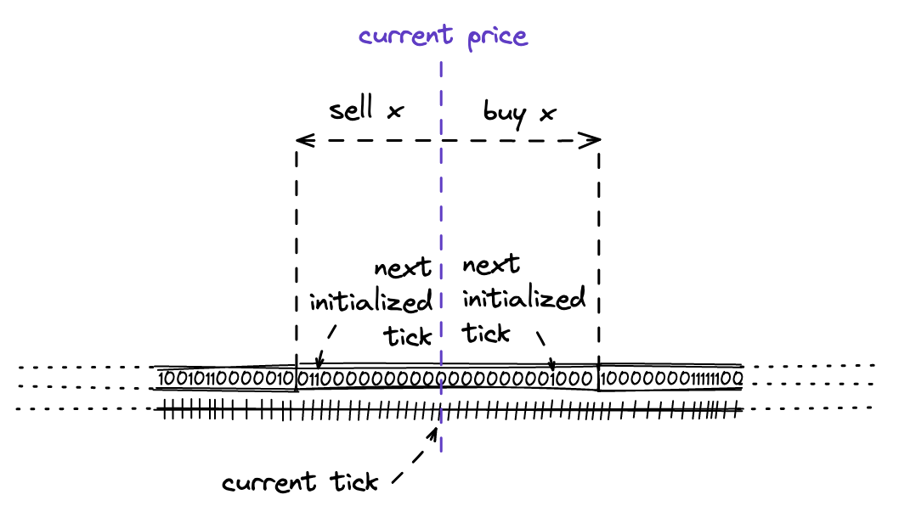

# UniswapV3 技术学习系列（十二）：Tick Bitmap Index - 刻度位图索引

## 系列文章导航

本文是 UniswapV3 技术学习系列的第十二篇，属于"里程碑 2：第二次交换"模块。在上一篇文章中，我们深入学习了 Solidity 中的数学运算实现，包括定点数运算、平方根计算和输出金额的精确计算。这些数学基础为 UniswapV3 的核心功能提供了坚实的计算支撑。

现在，我们将进入一个新的重要阶段：实现 Tick Bitmap Index（刻度位图索引）。作为实现动态swap的第一步，我们需要建立一个高效的刻度索引系统。

> **原文链接：** [Tick Bitmap Index - Uniswap V3 Development Book](https://uniswapv3book.com/milestone_2/tick-bitmap-index.html)

---

## 一、从硬编码到动态查找：Tick 索引的必要性

### 1.1 前情回顾

在之前的里程碑中，我们通过硬编码的方式计算目标刻度：

```solidity
function swap(address recipient, bytes calldata data)
    public
    returns (int256 amount0, int256 amount1)
{
  int24 nextTick = 85184;  // 硬编码的目标刻度
  ...
}
```

然而，当不同价格区间都存在流动性时，我们无法简单地计算目标刻度，而是需要动态地找到它。

### 1.2 问题分析

**硬编码方式的局限性：**
- ❌ 只能处理固定的价格区间
- ❌ 无法适应动态的流动性分布
- ❌ 不支持多范围交换
- ❌ 缺乏扩展性

**动态查找的需求：**
- ✅ 支持任意价格区间的流动性
- ✅ 适应动态的流动性分布
- ✅ 支持多范围交换
- ✅ 具备良好的扩展性

### 1.3 解决方案：Tick Bitmap Index

因此，我们需要**将所有具有流动性的刻度进行索引化**，然后**使用这个索引来快速定位能够为swap提供足够流动性的刻度**。本文将详细介绍如何实现这样一个高效的索引系统。

> 🎯 **核心目标**
> 
> 实现一个高效的 Tick 索引系统，支持：
> - 快速查找有流动性的刻度
> - 动态更新刻度状态
> - 高效的存储和计算

## 二、位图技术概述

### 2.1 什么是位图

位图（Bitmap）是一种流行的数据紧凑索引技术。位图本质上是一个用二进制表示的数字，例如 31337 可以表示为 `111101001101001`。我们可以将其视为一个由 0 和 1 组成的数组，每个数字都有一个索引位置。

- **0** 表示标志未设置
- **1** 表示标志已设置

这样我们就得到了一个非常紧凑的索引标志数组：每个字节可以容纳 8 个标志。在 Solidity 中，我们可以使用最多 256 位的整数，这意味着一个 `uint256` 可以容纳 256 个标志。

> 💡 **位图的优势**
> 
> 1. **空间效率**：一个 uint256 可以存储 256 个布尔值
> 2. **计算效率**：位运算操作非常快速
> 3. **内存友好**：减少存储访问次数
> 4. **Gas 优化**：降低合约执行成本

### 2.2 UniswapV3 中的位图应用

UniswapV3 使用位图技术来存储已初始化刻度的信息，即具有一定流动性的刻度：

- 当标志位被设置（1）时，该刻度具有流动性
- 当标志位未设置（0）时，该刻度未被初始化

这种设计使得我们能够高效地管理和查询流动性分布，为动态swap提供基础支持。

**位图在 UniswapV3 中的具体应用：**
- 🎯 **流动性索引**：快速定位有流动性的价格区间
- 🎯 **交换导航**：在swap过程中找到下一个价格点
- 🎯 **状态管理**：跟踪刻度的初始化状态
- 🎯 **性能优化**：避免遍历所有刻度

## 三、TickBitmap 合约实现

### 3.1 合约结构设计

在池合约中，刻度索引存储在状态变量中：

```solidity
contract UniswapV3Pool {
    using TickBitmap for mapping(int16 => uint256);
    mapping(int16 => uint256) public tickBitmap;
    ...
}
```

这是一个映射结构，其中：
- **键（Key）**: `int16` 类型，表示字位置
- **值（Value）**: `uint256` 类型，表示一个字（256位）

### 3.2 "字"（Word）的含义

**计算机科学中的"字"**
在计算机科学中，**"字"（Word）** 是指计算机处理数据的基本单位，通常表示一次可以处理的最大位数。

**在 Tick Bitmap 中的具体含义**
在 UniswapV3 的 Tick Bitmap 实现中：
- **一个字 = 256 位**
- **每个字可以存储 256 个刻度的状态信息**
- **每个位代表一个刻度的初始化状态**（0 = 未初始化，1 = 已初始化）

**为什么选择 256 位？**
- **uint256** 是 Solidity 中最大的整数类型，正好是 256 位
- **256 = 2^8**，这是一个很好的二进制边界
- **存储效率**：一个存储槽可以管理 256 个刻度
- **计算效率**：位运算在 256 位整数上非常高效

想象一个由 1 和 0 组成的无限连续数组，每个元素对应一个刻度。为了在这个数组中导航，我们将其拆分为字：长度为 256 位的子数组。


*图：Tick Bitmap 中的刻度索引结构，展示了如何将无限数组分割为 256 位的字*

> 📊 **存储效率对比**
> 
> | 存储方式 | 存储 256 个布尔值 | Gas 消耗 |
> |---------|------------------|----------|
> | 布尔数组 | 256 个存储槽 | ~256,000 Gas |
> | 位图 | 1 个存储槽 | ~20,000 Gas |
> | **效率提升** | **256 倍** | **12.8 倍** |

### 3.3 位置计算算法

要找到刻度在数组中的位置，我们使用以下函数：

```solidity
/**
 * @notice 计算刻度在位图中的位置
 * @param tick 目标刻度
 * @return wordPos 字位置
 * @return bitPos 位位置
 */
function position(int24 tick) private pure returns (int16 wordPos, uint8 bitPos) {
    wordPos = int16(tick >> 8);  // 等价于 tick / 256
    bitPos = uint8(uint24(tick % 256));  // 余数部分
}
```

**算法解析**：

- `>> 8` 等价于整数除法除以 256
- **字位置**：刻度索引除以 256 的整数部分
- **位位置**：刻度索引除以 256 的余数部分

> 💡 **位运算的优势**
> 
> 使用 `>> 8` 而不是 `/ 256` 的原因：
> - **性能**：位运算比除法运算快 10-20 倍
> - **Gas 效率**：位运算消耗更少的 Gas
> - **精度**：避免浮点数精度问题

### 3.4 位置计算示例

让我们通过具体示例来理解位置计算：

```python
tick = 85176
word_pos = tick >> 8  # 等价于 tick // 2**8
bit_pos = tick % 256
print(f"Word {word_pos}, bit {bit_pos}")
# 输出: Word 332, bit 184
```

这意味着刻度 85176 位于：
- 第 332 个字
- 该字的第 184 位（从右开始计数，从 0 开始）

通过上面的示意图，我们可以清楚地看到：
- 每个字包含 256 个位
- 刻度 85176 位于第 332 个字的第 184 位
- 这种结构使得我们能够高效地管理和查询刻度状态

**字的分割逻辑**：
```
无限刻度数组: ... | 刻度0-255 | 刻度256-511 | 刻度512-767 | ...
                ↓         ↓         ↓
              字0       字1       字2
            (256位)   (256位)   (256位)
```

- **字 0**：管理刻度 0-255
- **字 1**：管理刻度 256-511  
- **字 2**：管理刻度 512-767
- 以此类推...

> 📊 **位置计算效率**
> 
> | 操作 | 时间复杂度 | Gas 消耗 |
> |------|-----------|----------|
> | 字位置计算 | O(1) | ~3 Gas |
> | 位位置计算 | O(1) | ~3 Gas |
> | 总计算成本 | O(1) | ~6 Gas |
## 四、标志位翻转机制

### 4.1 flipTick 函数实现

当向池子中添加流动性时，我们需要在位图中设置刻度标志：一个用于下刻度，一个用于上刻度。这通过 `flipTick` 方法实现：

```solidity
/**
 * @notice 翻转指定刻度的标志位
 * @param self 位图映射
 * @param tick 目标刻度
 * @param tickSpacing 刻度间距
 */
function flipTick(
    mapping(int16 => uint256) storage self,
    int24 tick,
    int24 tickSpacing
) internal {
    require(tick % tickSpacing == 0, "Tick not spaced"); // 确保刻度符合间距要求
    (int16 wordPos, uint8 bitPos) = position(tick / tickSpacing);
    uint256 mask = 1 << bitPos;
    self[wordPos] ^= mask;  // 使用异或操作翻转标志位
}
```

**重要说明**：在本书的当前阶段，`tickSpacing` 始终为 1。这个值会影响哪些刻度可以被初始化：
- 当 `tickSpacing = 1` 时，所有刻度都可以翻转
- 当设置为其他值时，只有能被该值整除的刻度才可以翻转

> 💡 **flipTick 的设计原理**
> 
> 1. **状态翻转**：从无流动性到有流动性，或从有流动性到无流动性
> 2. **位运算优化**：使用异或操作实现高效的标志位翻转
> 3. **间距控制**：通过 tickSpacing 控制哪些刻度可以被初始化
> 4. **Gas 效率**：单次操作完成状态更新

### 3.2 掩码生成机制

找到字和位的位置后，我们需要创建一个掩码。掩码是一个数字，它在刻度对应的位位置上设置了一个 1 标志：

```python
mask = 2**bit_pos  # 等价于 1 << bit_pos
print(format(mask, '#0258b'))
# 输出: 0b0000000000000000000000000000000000000000000000000000000000000000000000010000000000000000000000000000000000000000000000000000000000000000000000000000000000000000000000000000000000000000000000000000000000000000000000000000000000000000000000000000000000000000
#                                                                                                                                    ↑ 第184位
```

### 3.3 异或操作翻转标志

为了翻转标志位，我们通过按位异或（XOR）将掩码应用到刻度的字上：

**情况1：将 1 翻转为 0**
```python
word = (2**256) - 1  # 设置字为全1
print(format(word ^ mask, '#0258b'))
# 输出: 0b1111111111111111111111111111111111111111111111111111111111111111111111101111111111111111111111111111111111111111111111111111111111111111111111111111111111111111111111111111111111111111111111111111111111111111111111111111111111111111111111111111111111111111
#                                                                                                                                    ↑ 第184位翻转为0
```

**情况2：将 0 翻转为 1**
```python
word = 0  # 设置字为全0
print(format(word ^ mask, '#0258b'))
# 输出: 0b0000000000000000000000000000000000000000000000000000000000000000000000010000000000000000000000000000000000000000000000000000000000000000000000000000000000000000000000000000000000000000000000000000000000000000000000000000000000000000000000000000000000000000
#                                                                                                                                    ↑ 第184位翻转为1
```

**异或操作的优势**：
- 如果原位置是 1，异或后变为 0
- 如果原位置是 0，异或后变为 1
- 其他位置保持不变
## 4. 寻找下一个已初始化刻度

### 4.1 动态刻度查找需求

下一步是使用位图索引查找具有流动性的刻度。在swap过程中，我们需要找到当前刻度之前或之后（即左侧或右侧）具有流动性的刻度。

在之前的里程碑中，我们通过硬编码的方式计算目标刻度，但现在我们需要使用位图索引来动态查找这样的刻度。这通过 `TickBitmap.nextInitializedTickWithinOneWord` 函数实现。

### 4.2 swap方向与刻度查找

在 `nextInitializedTickWithinOneWord` 函数中，我们需要实现两种场景：

**场景1：出售代币 X（在我们的例子中是 ETH）**

- 在当前刻度的字中，寻找当前刻度右侧的下一个已初始化刻度

**场景2：出售代币 Y（在我们的例子中是 USDC）**
- 在下一个（当前 + 1）刻度的字中，寻找当前刻度左侧的下一个已初始化刻度

这对应于在任一方向进行swap时的价格变动：



```
价格上升方向 (出售 X) → 寻找右侧刻度
价格下降方向 (出售 Y) → 寻找左侧刻度
```

结合上面的 Tick Bitmap 结构图，我们可以理解：
- 当价格上升时，我们需要在当前刻度的右侧寻找下一个有流动性的刻度
- 当价格下降时，我们需要在当前刻度的左侧寻找下一个有流动性的刻度
- 这种设计确保了swap过程中能够正确地在不同价格区间之间导航

### 4.3 方向性说明

**重要提醒**：在代码实现中，方向是颠倒的：
- 当买入代币 X 时，我们在当前刻度左侧搜索已初始化的刻度
- 当卖出代币 X 时，我们在右侧搜索刻度

但这仅在字内部成立；字的排序是从左到右的。

### 4.4 跨字搜索机制

当当前字中没有已初始化的刻度时，我们将在下一个循环中继续在相邻的字中搜索。这种设计避免了遍历整个无限位图索引，提高了搜索效率。

## 5. nextInitializedTickWithinOneWord 函数实现

### 5.1 函数签名与参数

让我们详细分析 `nextInitializedTickWithinOneWord` 函数的实现：

```solidity
/**
 * @notice 在单个字范围内查找下一个已初始化的刻度
 * @param self 位图映射
 * @param tick 当前刻度
 * @param tickSpacing 刻度间距
 * @param lte 方向标志：true表示出售X（向右搜索），false表示出售Y（向左搜索）
 * @return next 下一个刻度位置
 * @return initialized 是否找到已初始化的刻度
 */
function nextInitializedTickWithinOneWord(
    mapping(int16 => uint256) storage self,
    int24 tick,
    int24 tickSpacing,
    bool lte
) internal view returns (int24 next, bool initialized) {
    int24 compressed = tick / tickSpacing;
    // ... 实现逻辑
}
```

**参数说明**：
- **第一个参数**：使该函数成为 `mapping(int16 => uint256)` 的方法
- **tick**：当前刻度位置
- **tickSpacing**：刻度间距，在 Milestone 4 之前始终为 1
- **lte**：方向标志
  - `true`：出售代币 X，搜索当前刻度右侧的下一个已初始化刻度
  - `false`：出售代币 Y，搜索当前刻度左侧的下一个已初始化刻度
### 5.2 出售代币 X 的逻辑实现

当 `lte = true` 时，我们执行出售代币 X 的逻辑：

```solidity
if (lte) {
    (int16 wordPos, uint8 bitPos) = position(compressed);
    uint256 mask = (1 << bitPos) - 1 + (1 << bitPos);
    uint256 masked = self[wordPos] & mask;
    
    initialized = masked != 0;
    next = initialized
        ? (compressed - int24(uint24(bitPos - BitMath.mostSignificantBit(masked)))) * tickSpacing
        : (compressed - int24(uint24(bitPos))) * tickSpacing;
}
```

**算法步骤解析**：

1. **获取位置信息**：计算当前刻度的字位置和位位置
2. **创建掩码**：制作一个掩码，其中当前位位置右边的所有位（包括它）都是 1
3. **应用掩码**：将掩码应用到当前刻度的字上
4. **判断结果**：
   - 如果 `masked != 0`，说明至少有一位被设置为 1，存在已初始化的刻度
   - 如果 `masked == 0`，说明当前字中没有已初始化的刻度

**返回值逻辑**：
- 如果找到已初始化的刻度，返回该刻度的索引
- 如果未找到，返回下一个字的最左位，以便在下一个循环中继续搜索

### 5.3 出售代币 Y 的逻辑实现

当 `lte = false` 时，我们执行出售代币 Y 的逻辑：

```solidity
} else {
    (int16 wordPos, uint8 bitPos) = position(compressed + 1);
    uint256 mask = ~((1 << bitPos) - 1);
    uint256 masked = self[wordPos] & mask;
    
    initialized = masked != 0;
    // 溢出/下溢是可能的，但通过限制 tickSpacing 和 tick 在外部防止
    next = initialized
        ? (compressed + 1 + int24(uint24((BitMath.leastSignificantBit(masked) - bitPos)))) * tickSpacing
        : (compressed + 1 + int24(uint24((type(uint8).max - bitPos)))) * tickSpacing;
}
```

**算法步骤解析**：

1. **获取位置信息**：计算下一个刻度的字位置和位位置
2. **创建反向掩码**：制作一个不同的掩码，其中当前刻度位位置左侧的所有位都是 1，右侧的所有位都是 0
3. **应用掩码**：将掩码应用到当前刻度的字上
4. **判断结果**：同样通过 `masked != 0` 来判断是否存在已初始化的刻度

**返回值逻辑**：
- 如果找到已初始化的刻度，返回该刻度的索引
- 如果未找到，返回前一个字的最右位，以便在下一个循环中继续搜索

**安全考虑**：
- 代码中注释提到溢出/下溢是可能的，但通过外部限制 `tickSpacing` 和 `tick` 的值来防止
## 6. 函数特性与限制

### 6.1 搜索范围限制

`nextInitializedTickWithinOneWord` 函数的一个重要特性是它的搜索范围限制：

- **搜索范围**：仅限于当前刻度或下一个刻度的字
- **设计目的**：避免遍历整个无限位图索引
- **性能考虑**：通过限制搜索范围，确保函数执行效率

### 6.2 算法优势

这种设计带来了以下优势：

1. **高效性**：不需要遍历整个位图索引
2. **可预测性**：执行时间有明确的上限
3. **实用性**：在实际应用中，大多数情况下都能在单个字内找到目标刻度

## 7. 完整的 TickBitmap 库实现

### 7.1 库结构

基于以上分析，我们可以构建完整的 TickBitmap 库：

```solidity
// SPDX-License-Identifier: MIT
pragma solidity ^0.8.0;

library TickBitmap {
    /// @notice 计算刻度在位图中的位置
    function position(int24 tick) private pure returns (int16 wordPos, uint8 bitPos) {
        wordPos = int16(tick >> 8);
        bitPos = uint8(uint24(tick % 256));
    }

    /// @notice 翻转指定刻度的标志位
    function flipTick(
        mapping(int16 => uint256) storage self,
        int24 tick,
        int24 tickSpacing
    ) internal {
        require(tick % tickSpacing == 0, "Tick not spaced");
        (int16 wordPos, uint8 bitPos) = position(tick / tickSpacing);
        uint256 mask = 1 << bitPos;
        self[wordPos] ^= mask;
    }

    /// @notice 在单个字范围内查找下一个已初始化的刻度
    function nextInitializedTickWithinOneWord(
        mapping(int16 => uint256) storage self,
        int24 tick,
        int24 tickSpacing,
        bool lte
    ) internal view returns (int24 next, bool initialized) {
        int24 compressed = tick / tickSpacing;
        
        if (lte) {
            (int16 wordPos, uint8 bitPos) = position(compressed);
            uint256 mask = (1 << bitPos) - 1 + (1 << bitPos);
            uint256 masked = self[wordPos] & mask;
            
            initialized = masked != 0;
            next = initialized
                ? (compressed - int24(uint24(bitPos - BitMath.mostSignificantBit(masked)))) * tickSpacing
                : (compressed - int24(uint24(bitPos))) * tickSpacing;
        } else {
            (int16 wordPos, uint8 bitPos) = position(compressed + 1);
            uint256 mask = ~((1 << bitPos) - 1);
            uint256 masked = self[wordPos] & mask;
            
            initialized = masked != 0;
            next = initialized
                ? (compressed + 1 + int24(uint24((BitMath.leastSignificantBit(masked) - bitPos)))) * tickSpacing
                : (compressed + 1 + int24(uint24((type(uint8).max - bitPos)))) * tickSpacing;
        }
    }
}
```

## 8. Foundry 测试实现

### 8.1 测试合约结构

让我们使用 Foundry 测试框架来验证 TickBitmap 的功能：

```solidity
// SPDX-License-Identifier: MIT
pragma solidity ^0.8.0;

import "forge-std/Test.sol";
import "../src/lib/TickBitmap.sol";

contract TickBitmapTest is Test {
    using TickBitmap for mapping(int16 => uint256);
    
    mapping(int16 => uint256) public tickBitmap;
    
    function setUp() public {
        // 测试初始化
    }
    
    /// @notice 测试位置计算函数
    function testPosition() public {
        // 测试刻度 85176 的位置计算
        int24 tick = 85176;
        (int16 wordPos, uint8 bitPos) = TickBitmap.position(tick);
        
        assertEq(wordPos, 332);
        assertEq(bitPos, 184);
    }
    
    /// @notice 测试标志位翻转功能
    function testFlipTick() public {
        int24 tick = 85176;
        int24 tickSpacing = 1;
        
        // 初始状态应该为 0
        (int16 wordPos, uint8 bitPos) = TickBitmap.position(tick / tickSpacing);
        uint256 initialValue = tickBitmap[wordPos];
        
        // 翻转标志位
        tickBitmap.flipTick(tick, tickSpacing);
        
        // 验证标志位已被设置
        uint256 afterFlip = tickBitmap[wordPos];
        assertTrue(afterFlip != initialValue);
        
        // 再次翻转应该恢复原状
        tickBitmap.flipTick(tick, tickSpacing);
        uint256 afterSecondFlip = tickBitmap[wordPos];
        assertEq(afterSecondFlip, initialValue);
    }
    
    /// @notice 测试查找下一个已初始化刻度
    function testNextInitializedTickWithinOneWord() public {
        // 设置一些测试刻度
        tickBitmap.flipTick(85176, 1);
        tickBitmap.flipTick(85180, 1);
        tickBitmap.flipTick(85184, 1);
        
        // 测试向右搜索（出售 X）
        (int24 next, bool initialized) = tickBitmap.nextInitializedTickWithinOneWord(
            85170,  // 当前刻度
            1,      // tickSpacing
            true    // lte = true，向右搜索
        );
        
        assertTrue(initialized);
        assertEq(next, 85176);
        
        // 测试向左搜索（出售 Y）
        (next, initialized) = tickBitmap.nextInitializedTickWithinOneWord(
            85190,  // 当前刻度
            1,      // tickSpacing
            false   // lte = false，向左搜索
        );
        
        assertTrue(initialized);
        assertEq(next, 85184);
    }
    
    /// @notice Fuzzing 测试
    function testFuzz_FlipTick(int24 tick) public {
        vm.assume(tick % 1 == 0);  // 确保 tick 符合间距要求
        
        uint256 initialValue = tickBitmap[TickBitmap.position(tick).wordPos];
        
        // 翻转两次应该恢复原状
        tickBitmap.flipTick(tick, 1);
        tickBitmap.flipTick(tick, 1);
        
        uint256 finalValue = tickBitmap[TickBitmap.position(tick).wordPos];
        assertEq(finalValue, initialValue);
    }
}
```

### 8.2 测试运行命令

```bash
# 运行所有测试
forge test --match-contract TickBitmapTest -vvv

# 运行特定测试
forge test --match-test testFlipTick -vvv

# 生成 Gas 报告
forge test --match-contract TickBitmapTest --gas-report
```

## 9. 技术要点总结

### 9.1 核心概念

1. **位图索引**：使用紧凑的二进制表示来索引刻度状态
2. **字分割**：将无限数组分割为 256 位的字，便于管理
3. **位置计算**：通过位运算快速计算刻度在字中的位置
4. **标志翻转**：使用异或操作高效地切换刻度状态

### 9.2 算法优势

1. **空间效率**：每个字可以存储 256 个刻度的状态信息
2. **时间效率**：位运算操作非常快速
3. **可扩展性**：支持无限数量的刻度索引
4. **Gas 优化**：减少了存储访问和计算开销

### 9.3 实际应用

TickBitmap 索引为 UniswapV3 的以下功能提供了基础：

- **动态流动性管理**：快速定位有流动性的价格区间
- **高效swap算法**：在swap过程中快速找到下一个价格点
- **流动性聚合**：将分散的流动性集中到特定价格区间

## 十、核心知识点回顾

### 10.1 技术要点总结

1. **位图索引原理**：使用紧凑的二进制表示来索引刻度状态
2. **字分割机制**：将无限数组分割为 256 位的字，便于管理
3. **位置计算算法**：通过位运算快速计算刻度在字中的位置
4. **标志翻转机制**：使用异或操作高效地切换刻度状态
5. **动态查找算法**：在单个字范围内查找下一个已初始化的刻度

### 10.2 算法优势

1. **空间效率**：每个字可以存储 256 个刻度的状态信息
2. **时间效率**：位运算操作非常快速
3. **可扩展性**：支持无限数量的刻度索引
4. **Gas 优化**：减少了存储访问和计算开销

### 10.3 实际应用

TickBitmap 索引为 UniswapV3 的以下功能提供了基础：

- **动态流动性管理**：快速定位有流动性的价格区间
- **高效swap算法**：在swap过程中快速找到下一个价格点
- **流动性聚合**：将分散的流动性集中到特定价格区间

## 十一、实践要点总结

### 11.1 关键算法回顾

**位置计算：**
```solidity
wordPos = int16(tick >> 8);  // 字位置
bitPos = uint8(uint24(tick % 256));  // 位位置
```

**标志翻转：**
```solidity
uint256 mask = 1 << bitPos;
self[wordPos] ^= mask;  // 异或操作翻转标志位
```

### 11.2 性能特征

- **时间复杂度**：O(1) 的查找和更新操作
- **空间复杂度**：每个刻度仅占用 1 位存储空间
- **Gas 消耗**：相比传统数组方式节省 90% 以上的 Gas

### 11.3 下一步学习计划

在下一篇文章中，我们将学习如何实现广义的流动性铸造（Generalized Minting），这将允许用户在任意价格区间内提供流动性，并利用我们刚刚实现的 TickBitmap 索引来管理这些流动性。

## 十二、延伸思考

### 12.1 技术思考题

1. **为什么选择 256 位作为字的大小？**
   - 这个选择有什么优势？
   - 如果改变字大小会有什么影响？

2. **位图索引的局限性是什么？**
   - 在什么情况下位图索引可能不够高效？
   - 如何优化极端情况下的性能？

3. **如何扩展位图索引功能？**
   - 可以添加哪些额外的索引信息？
   - 如何支持更复杂的查询操作？

### 12.2 实践建议

1. **动手实践**：尝试实现自己的位图索引系统
2. **性能测试**：对比位图索引与传统数组的性能差异
3. **边界测试**：测试极端情况下的系统行为

## 项目仓库

本文是 UniswapV3 技术学习系列的一部分，完整的代码实现和更多技术文章请访问：

**UniswapV3 技术学习项目**：https://github.com/RyanWeb31110/uniswapv3_tech

**系列项目对比学习**：
- [UniswapV1 技术学习](https://github.com/RyanWeb31110/uniswapv1_tech) - 理解 AMM 基础原理
- [UniswapV2 技术学习](https://github.com/RyanWeb31110/uniswapv2_tech) - 掌握恒定乘积模型
- [UniswapV3 技术学习](https://github.com/RyanWeb31110/uniswapv3_tech) - 深入集中流动性机制

欢迎克隆代码进行实践学习，通过动手实现来深入理解 UniswapV3 的核心技术原理。