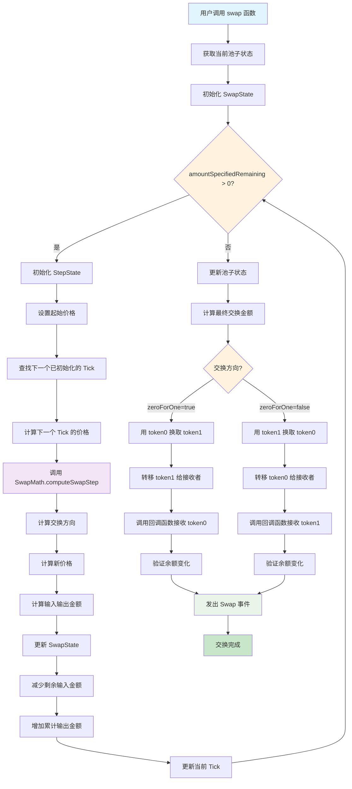
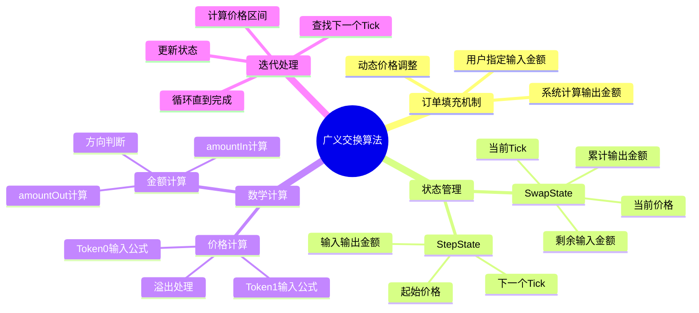
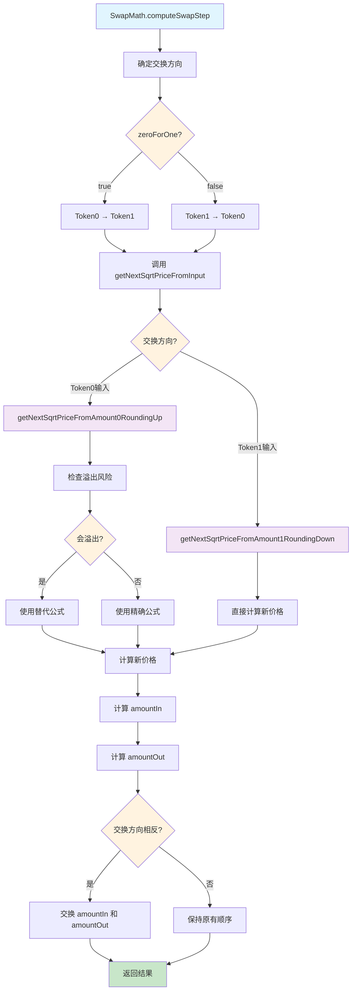
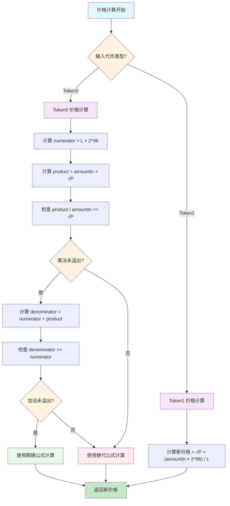
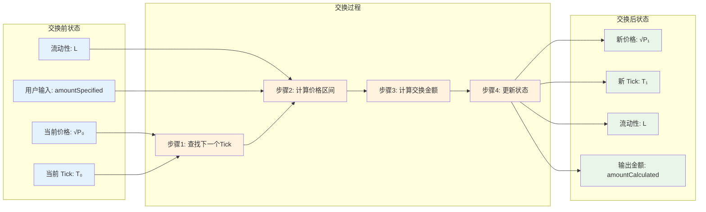
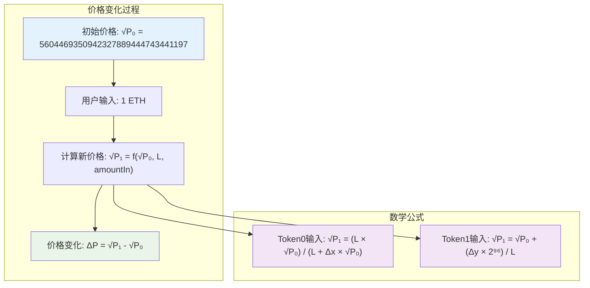

# UniswapV3 技术学习系列（十四）：广义交换（Generalized Swapping）

## 系列文章导航

本文是 UniswapV3 技术学习系列的第十四篇，属于"里程碑 2：第二次交换"模块。在前面的章节中，我们实现了输出金额计算、Tick Bitmap 索引系统和广义铸币功能，为 UniswapV3 的集中流动性机制奠定了坚实的数学基础。

现在，我们将把这些理论应用到实际的代币交换过程中，实现广义的交换功能。本章将重点介绍如何将硬编码的交换逻辑替换为动态的数学计算，实现真正的"订单填充"机制，为后续的跨 Tick 交换功能做好准备。

> **原文链接：** [Generalized Swapping - Uniswap V3 Development Book](https://uniswapv3book.com/milestone_2/generalize-swapping.html#generalized-swapping)

---

## 一、从硬编码到动态交换：广义交换的演进

### 1.1 前情回顾

在 Milestone 1 中，我们使用硬编码的数值来实现代币交换功能：

```solidity
// 硬编码的数值（Milestone 1）
amount0 = -0.008396714242162444 ether;  // 用户获得 ETH
amount1 = 42 ether;                     // 用户支付 USDC
```

现在，我们将更新 `swap` 函数，使其能够根据用户指定的输入金额动态计算输出金额，并实现真正的"订单填充"机制。

### 1.2 本章目标

通过本章的学习，您将深入理解：

1. **订单填充机制**：如何将交换视为订单执行过程
2. **动态价格计算**：如何根据输入金额计算新的价格
3. **交换状态管理**：如何跟踪交换过程中的状态变化
4. **数学库集成**：如何将复杂的交换数学计算集成到智能合约中

### 1.3 技术挑战

**从硬编码到动态交换的挑战：**
- ❌ 硬编码方式缺乏灵活性
- ❌ 无法适应不同的输入金额
- ❌ 不支持用户自定义的交换策略
- ❌ 缺乏扩展性

**动态交换的优势：**
- ✅ 支持任意输入金额的交换
- ✅ 适应动态的市场条件
- ✅ 提供更好的用户体验
- ✅ 具备良好的扩展性

> 🎯 **核心目标**
> 
> 实现真正的"订单填充"机制，让用户能够指定想要交换的输入金额，系统自动计算输出金额和新的价格。

---

## 二、交换算法：订单填充机制

### 2.1 交换的本质：订单填充

在 Uniswap V3 中，交换可以理解为**订单填充**过程：

1. **用户提交订单**：用户指定想要出售的代币数量
2. **池子寻找流动性**：池子使用可用流动性来"转换"输入金额
3. **动态价格调整**：交换会改变当前价格，影响后续交易
4. **跨区间流动性**：如果当前价格区间流动性不足，会寻找其他价格区间

### 2.2 交换函数的新参数

```solidity
function swap(
    address recipient,        // 接收输出代币的地址
    bool zeroForOne,         // 交换方向标志
    uint256 amountSpecified, // 用户指定的输入金额
    bytes calldata data      // 回调函数的额外数据
) public returns (int256 amount0, int256 amount1)
```

**参数详解：**

- **`zeroForOne`**：交换方向控制标志
  - `true`：用 `token0` 换取 `token1`（例如：用 ETH 买入 USDC）
  - `false`：用 `token1` 换取 `token0`（例如：用 USDC 买入 ETH）

- **`amountSpecified`**：用户想要出售的代币数量
  - 这是用户指定的输入金额，系统会根据此金额计算输出金额

### 2.3 交换状态管理

为了实现动态交换，我们需要定义两个关键的数据结构：

```solidity
/// @notice 交换状态结构
/// @dev 维护整个交换过程的状态
struct SwapState {
    uint256 amountSpecifiedRemaining; // 剩余需要处理的输入金额
    uint256 amountCalculated;         // 已计算出的输出金额
    uint160 sqrtPriceX96;             // 当前价格（Q64.96 格式）
    int24 tick;                       // 当前 Tick
}

/// @notice 交换步骤状态结构
/// @dev 维护单次迭代的状态
struct StepState {
    uint160 sqrtPriceStartX96; // 步骤开始时的价格
    int24 nextTick;            // 下一个已初始化的 Tick
    uint160 sqrtPriceNextX96;  // 下一个 Tick 的价格
    uint256 amountIn;          // 当前步骤的输入金额
    uint256 amountOut;         // 当前步骤的输出金额
}
```

**状态管理说明：**

- **`SwapState`**：维护整个交换过程的状态
  - `amountSpecifiedRemaining`：跟踪剩余需要处理的输入金额
  - `amountCalculated`：累计计算出的输出金额
  - `sqrtPriceX96` 和 `tick`：交换完成后的新价格和 Tick

- **`StepState`**：维护单次迭代的状态
  - 跟踪一次"订单填充"迭代的状态
  - 记录价格区间和可提供的流动性

---

## 三、交换算法实现

### 3.1 交换算法流程图

为了更好地理解广义交换的复杂流程，让我们先通过流程图来了解整个交换算法的执行过程：



**流程图说明：**

1. **初始化阶段**：获取池子状态，初始化交换状态结构
2. **主循环阶段**：迭代处理输入金额，直到完全处理完毕
3. **步骤计算**：每次迭代计算当前价格区间可提供的交换金额
4. **状态更新**：更新交换状态，包括剩余金额、累计输出、价格和 Tick
5. **代币转移**：根据交换方向执行代币转移和回调验证
6. **事件发出**：发出交换事件，完成整个交换过程

### 3.1.1 交换算法核心概念图



**核心概念说明：**

- **订单填充**：将交换视为订单执行过程，用户提交订单，系统填充订单
- **状态管理**：使用两个结构体管理复杂的交换状态
- **数学计算**：基于集中流动性公式进行精确的价格和金额计算
- **迭代处理**：通过循环逐步处理输入金额，直到完全处理完毕

### 3.2 交换步骤详细流程图

让我们进一步了解单次交换步骤的详细计算过程：



### 3.3 价格计算流程图

最后，让我们了解价格计算的核心逻辑：



### 3.4 交换过程示意图

为了更好地理解交换过程中价格和流动性的变化，让我们通过一个具体的例子来展示：



**交换过程说明：**

1. **交换前**：池子处于初始状态，有固定的价格、Tick 和流动性
2. **交换过程**：通过迭代计算，逐步处理用户的输入金额
3. **交换后**：价格发生变化，但流动性保持不变（在当前实现中）

### 3.5 价格变化示意图

让我们通过一个具体的数值例子来展示价格变化：



### 3.6 交换主循环

```solidity
/// @notice 执行代币交换
/// @dev 实现动态的订单填充机制
/// @param recipient 接收输出代币的地址
/// @param zeroForOne 交换方向标志
/// @param amountSpecified 用户指定的输入金额
/// @param data 回调函数的额外数据
/// @return amount0 token0 的数量变化
/// @return amount1 token1 的数量变化
function swap(
    address recipient,
    bool zeroForOne,
    uint256 amountSpecified,
    bytes calldata data
) public returns (int256 amount0, int256 amount1) {
    // 获取当前池子状态
    Slot0 memory slot0_ = slot0;

    // 初始化交换状态
    SwapState memory state = SwapState({
        amountSpecifiedRemaining: amountSpecified,
        amountCalculated: 0,
        sqrtPriceX96: slot0_.sqrtPriceX96,
        tick: slot0_.tick
    });

    // 主循环：直到处理完所有输入金额
    while (state.amountSpecifiedRemaining > 0) {
        StepState memory step;

        // 设置当前步骤的起始价格
        step.sqrtPriceStartX96 = state.sqrtPriceX96;

        // 查找下一个已初始化的 Tick
        (step.nextTick, ) = tickBitmap.nextInitializedTickWithinOneWord(
            state.tick,
            1,        // tickSpacing = 1
            zeroForOne
        );

        // 计算下一个 Tick 的价格
        step.sqrtPriceNextX96 = TickMath.getSqrtRatioAtTick(step.nextTick);

        // 计算当前价格区间可提供的交换金额
        (state.sqrtPriceX96, step.amountIn, step.amountOut) = SwapMath
            .computeSwapStep(
                state.sqrtPriceX96,
                step.sqrtPriceNextX96,
                liquidity,
                state.amountSpecifiedRemaining
            );

        // 更新交换状态
        state.amountSpecifiedRemaining -= step.amountIn;
        state.amountCalculated += step.amountOut;
        state.tick = TickMath.getTickAtSqrtRatio(state.sqrtPriceX96);
    }

    // 更新池子状态
    if (state.tick != slot0_.tick) {
        (slot0.sqrtPriceX96, slot0.tick) = (state.sqrtPriceX96, state.tick);
    }

    // 计算最终的交换金额
    (amount0, amount1) = zeroForOne
        ? (
            int256(amountSpecified - state.amountSpecifiedRemaining),
            -int256(state.amountCalculated)
        )
        : (
            -int256(state.amountCalculated),
            int256(amountSpecified - state.amountSpecifiedRemaining)
        );

    // 执行代币转移
    if (zeroForOne) {
        // 用 token0 换取 token1
        IERC20(token1).transfer(recipient, uint256(-amount1));
        
        uint256 balance0Before = balance0();
        IUniswapV3SwapCallback(msg.sender).uniswapV3SwapCallback(
            amount0,
            amount1,
            data
        );
        if (balance0Before + uint256(amount0) > balance0())
            revert InsufficientInputAmount();
    } else {
        // 用 token1 换取 token0
        IERC20(token0).transfer(recipient, uint256(-amount0));
        
        uint256 balance1Before = balance1();
        IUniswapV3SwapCallback(msg.sender).uniswapV3SwapCallback(
            amount0,
            amount1,
            data
        );
        if (balance1Before + uint256(amount1) > balance1())
            revert InsufficientInputAmount();
    }

    // 发出交换事件
    emit Swap(
        msg.sender, recipient, amount0, amount1, 
        slot0.sqrtPriceX96, liquidity, slot0.tick
    );
}
```

### 3.2 交换步骤计算

```solidity
/// @notice 计算单次交换步骤
/// @dev 计算在给定价格区间内的交换金额
/// @param sqrtPriceCurrentX96 当前价格
/// @param sqrtPriceTargetX96 目标价格
/// @param liquidity 可用流动性
/// @param amountRemaining 剩余输入金额
/// @return sqrtPriceNextX96 交换后的新价格
/// @return amountIn 实际使用的输入金额
/// @return amountOut 计算出的输出金额
function computeSwapStep(
    uint160 sqrtPriceCurrentX96,
    uint160 sqrtPriceTargetX96,
    uint128 liquidity,
    uint256 amountRemaining
)
    internal
    pure
    returns (
        uint160 sqrtPriceNextX96,
        uint256 amountIn,
        uint256 amountOut
    )
{
    // 确定交换方向
    bool zeroForOne = sqrtPriceCurrentX96 >= sqrtPriceTargetX96;

    // 计算交换后的新价格
    sqrtPriceNextX96 = Math.getNextSqrtPriceFromInput(
        sqrtPriceCurrentX96,
        liquidity,
        amountRemaining,
        zeroForOne
    );

    // 计算输入和输出金额
    amountIn = Math.calcAmount0Delta(
        sqrtPriceCurrentX96,
        sqrtPriceNextX96,
        liquidity
    );
    amountOut = Math.calcAmount1Delta(
        sqrtPriceCurrentX96,
        sqrtPriceNextX96,
        liquidity
    );

    // 如果交换方向相反，交换金额
    if (!zeroForOne) {
        (amountIn, amountOut) = (amountOut, amountIn);
    }
}
```

---

## 四、价格计算：根据交换金额计算新价格

### 4.1 价格计算函数

```solidity
/// @notice 根据输入金额计算新的价格
/// @dev 实现价格与交换金额的数学关系
/// @param sqrtPriceX96 当前价格
/// @param liquidity 可用流动性
/// @param amountIn 输入金额
/// @param zeroForOne 交换方向
/// @return sqrtPriceNextX96 交换后的新价格
function getNextSqrtPriceFromInput(
    uint160 sqrtPriceX96,
    uint128 liquidity,
    uint256 amountIn,
    bool zeroForOne
) internal pure returns (uint160 sqrtPriceNextX96) {
    sqrtPriceNextX96 = zeroForOne
        ? getNextSqrtPriceFromAmount0RoundingUp(
            sqrtPriceX96,
            liquidity,
            amountIn
        )
        : getNextSqrtPriceFromAmount1RoundingDown(
            sqrtPriceX96,
            liquidity,
            amountIn
        );
}
```

### 4.2 Token0 输入的价格计算

```solidity
/// @notice 根据 Token0 输入金额计算新价格
/// @dev 实现公式：P_target = (L * √P) / (L + Δx * √P)
/// @param sqrtPriceX96 当前价格
/// @param liquidity 可用流动性
/// @param amountIn Token0 输入金额
/// @return 新的价格
function getNextSqrtPriceFromAmount0RoundingUp(
    uint160 sqrtPriceX96,
    uint128 liquidity,
    uint256 amountIn
) internal pure returns (uint160) {
    uint256 numerator = uint256(liquidity) << FixedPoint96.RESOLUTION;
    uint256 product = amountIn * sqrtPriceX96;

    // 检查是否会发生溢出
    if (product / amountIn == sqrtPriceX96) {
        uint256 denominator = numerator + product;
        if (denominator >= numerator) {
            return uint160(
                mulDivRoundingUp(numerator, sqrtPriceX96, denominator)
            );
        }
    }

    // 使用替代公式避免溢出
    return uint160(
        divRoundingUp(numerator, (numerator / sqrtPriceX96) + amountIn)
    );
}
```

### 4.3 Token1 输入的价格计算

```solidity
/// @notice 根据 Token1 输入金额计算新价格
/// @dev 实现公式：P_target = √P + (Δy * 2^96) / L
/// @param sqrtPriceX96 当前价格
/// @param liquidity 可用流动性
/// @param amountIn Token1 输入金额
/// @return 新的价格
function getNextSqrtPriceFromAmount1RoundingDown(
    uint160 sqrtPriceX96,
    uint128 liquidity,
    uint256 amountIn
) internal pure returns (uint160) {
    return sqrtPriceX96 + 
        uint160((amountIn << FixedPoint96.RESOLUTION) / liquidity);
}
```

### 4.4 数学公式详解

**Token0 输入的价格公式：**

```
P_target = (L * √P) / (L + Δx * √P)
```

**Token1 输入的价格公式：**

```
P_target = √P + (Δy * 2^96) / L
```

**公式说明：**
- `L`：可用流动性
- `√P`：当前价格的平方根
- `Δx`：Token0 的输入金额
- `Δy`：Token1 的输入金额
- `2^96`：Q64.96 格式的精度因子

---

## 五、完整实现：SwapMath 库

### 5.1 SwapMath 库结构

```solidity
// SPDX-License-Identifier: MIT
pragma solidity ^0.8.14;

import "./Math.sol";
import "./FixedPoint96.sol";

/// @title SwapMath 交换数学库
/// @notice 提供交换相关的数学计算函数
/// @dev 基于 Uniswap V3 的交换数学库实现
library SwapMath {
    // ============ 错误定义 ============
    
    error DivisionByZero();
    error Overflow();

    // ============ 交换计算函数 ============

    /// @notice 计算单次交换步骤
    /// @dev 计算在给定价格区间内的交换金额
    /// @param sqrtPriceCurrentX96 当前价格
    /// @param sqrtPriceTargetX96 目标价格
    /// @param liquidity 可用流动性
    /// @param amountRemaining 剩余输入金额
    /// @return sqrtPriceNextX96 交换后的新价格
    /// @return amountIn 实际使用的输入金额
    /// @return amountOut 计算出的输出金额
    function computeSwapStep(
        uint160 sqrtPriceCurrentX96,
        uint160 sqrtPriceTargetX96,
        uint128 liquidity,
        uint256 amountRemaining
    )
        internal
        pure
        returns (
            uint160 sqrtPriceNextX96,
            uint256 amountIn,
            uint256 amountOut
        )
    {
        // 确定交换方向
        bool zeroForOne = sqrtPriceCurrentX96 >= sqrtPriceTargetX96;

        // 计算交换后的新价格
        sqrtPriceNextX96 = Math.getNextSqrtPriceFromInput(
            sqrtPriceCurrentX96,
            liquidity,
            amountRemaining,
            zeroForOne
        );

        // 计算输入和输出金额
        amountIn = Math.calcAmount0Delta(
            sqrtPriceCurrentX96,
            sqrtPriceNextX96,
            liquidity
        );
        amountOut = Math.calcAmount1Delta(
            sqrtPriceCurrentX96,
            sqrtPriceNextX96,
            liquidity
        );

        // 如果交换方向相反，交换金额
        if (!zeroForOne) {
            (amountIn, amountOut) = (amountOut, amountIn);
        }
    }
}
```

### 5.2 Math 库扩展

```solidity
/// @notice 根据输入金额计算新的价格
/// @dev 实现价格与交换金额的数学关系
/// @param sqrtPriceX96 当前价格
/// @param liquidity 可用流动性
/// @param amountIn 输入金额
/// @param zeroForOne 交换方向
/// @return sqrtPriceNextX96 交换后的新价格
function getNextSqrtPriceFromInput(
    uint160 sqrtPriceX96,
    uint128 liquidity,
    uint256 amountIn,
    bool zeroForOne
) internal pure returns (uint160 sqrtPriceNextX96) {
    sqrtPriceNextX96 = zeroForOne
        ? getNextSqrtPriceFromAmount0RoundingUp(
            sqrtPriceX96,
            liquidity,
            amountIn
        )
        : getNextSqrtPriceFromAmount1RoundingDown(
            sqrtPriceX96,
            liquidity,
            amountIn
        );
}

/// @notice 根据 Token0 输入金额计算新价格
/// @dev 实现公式：P_target = (L * √P) / (L + Δx * √P)
/// @param sqrtPriceX96 当前价格
/// @param liquidity 可用流动性
/// @param amountIn Token0 输入金额
/// @return 新的价格
function getNextSqrtPriceFromAmount0RoundingUp(
    uint160 sqrtPriceX96,
    uint128 liquidity,
    uint256 amountIn
) internal pure returns (uint160) {
    uint256 numerator = uint256(liquidity) << FixedPoint96.RESOLUTION;
    uint256 product = amountIn * sqrtPriceX96;

    // 检查是否会发生溢出
    if (product / amountIn == sqrtPriceX96) {
        uint256 denominator = numerator + product;
        if (denominator >= numerator) {
            return uint160(
                mulDivRoundingUp(numerator, sqrtPriceX96, denominator)
            );
        }
    }

    // 使用替代公式避免溢出
    return uint160(
        divRoundingUp(numerator, (numerator / sqrtPriceX96) + amountIn)
    );
}

/// @notice 根据 Token1 输入金额计算新价格
/// @dev 实现公式：P_target = √P + (Δy * 2^96) / L
/// @param sqrtPriceX96 当前价格
/// @param liquidity 可用流动性
/// @param amountIn Token1 输入金额
/// @return 新的价格
function getNextSqrtPriceFromAmount1RoundingDown(
    uint160 sqrtPriceX96,
    uint128 liquidity,
    uint256 amountIn
) internal pure returns (uint160) {
    return sqrtPriceX96 + 
        uint160((amountIn << FixedPoint96.RESOLUTION) / liquidity);
}
```

---

## 六、测试实现

### 6.1 测试合约结构

```solidity
// SPDX-License-Identifier: MIT
pragma solidity ^0.8.14;

import "forge-std/Test.sol";
import "forge-std/console.sol";
import "../src/UniswapV3Pool.sol";
import "../src/UniswapV3Manager.sol";
import "../test/ERC20Mintable.sol";

/// @title UniswapV3PoolTest 测试合约
/// @notice 测试 UniswapV3 池子的核心功能
/// @dev 使用 Foundry 测试框架
contract UniswapV3PoolTest is Test {
    // ============ 测试变量 ============
    
    UniswapV3Pool pool;
    UniswapV3Manager manager;
    ERC20Mintable token0;
    ERC20Mintable token1;
    
    address alice = address(0x1);
    address bob = address(0x2);
    
    // ============ 测试设置 ============
    
    function setUp() public {
        // 部署代币合约
        token0 = new ERC20Mintable("Token0", "TK0");
        token1 = new ERC20Mintable("Token1", "TK1");
        
        // 部署池子合约
        pool = new UniswapV3Pool(address(token0), address(token1));
        
        // 部署管理器合约
        manager = new UniswapV3Manager();
        
        // 设置初始价格
        pool.initialize(5604469350942327889444743441197); // 初始价格
        
        // 给用户分配代币
        token0.mint(alice, 100 ether);
        token1.mint(alice, 100 ether);
        token0.mint(bob, 100 ether);
        token1.mint(bob, 100 ether);
    }
}
```

### 6.2 广义交换测试

```solidity
/// @notice 测试广义交换功能
/// @dev 测试动态的订单填充机制
function testGeneralizedSwap() public {
    // 准备测试数据
    vm.startPrank(alice);
    
    // 1. 先添加流动性
    int24 lowerTick = 85184;
    int24 upperTick = 86129;
    uint128 liquidity = 1517882343751509868544;
    
    // 编码回调数据
    UniswapV3Pool.CallbackData memory extra = UniswapV3Pool.CallbackData({
        token0: address(token0),
        token1: address(token1),
        payer: alice
    });
    bytes memory data = abi.encode(extra);
    
    // 添加流动性
    (uint256 amount0, uint256 amount1) = manager.mint(
        address(pool),
        alice,
        lowerTick,
        upperTick,
        liquidity,
        data
    );
    
    console.log("Mint amount0:", amount0);
    console.log("Mint amount1:", amount1);
    
    // 2. 执行交换
    uint256 swapAmount = 1 ether; // 用户想要出售 1 ETH
    
    // 编码交换回调数据
    bytes memory swapData = abi.encode(extra);
    
    // 执行交换
    (int256 amount0Out, int256 amount1Out) = manager.swap(
        address(pool),
        true,        // zeroForOne = true，用 token0 换取 token1
        swapAmount,  // 用户指定的输入金额
        swapData
    );
    
    console.log("Swap amount0Out:", amount0Out);
    console.log("Swap amount1Out:", amount1Out);
    
    // 3. 验证结果
    // amount0Out 应该是负数（用户获得 token0）
    // amount1Out 应该是正数（用户支付 token1）
    assertTrue(amount0Out < 0, "amount0Out should be negative");
    assertTrue(amount1Out > 0, "amount1Out should be positive");
    
    vm.stopPrank();
}

/// @notice 测试反向交换
/// @dev 测试用 token1 换取 token0 的情况
function testReverseSwap() public {
    // 准备测试数据
    vm.startPrank(alice);
    
    // 1. 先添加流动性
    int24 lowerTick = 85184;
    int24 upperTick = 86129;
    uint128 liquidity = 1517882343751509868544;
    
    // 编码回调数据
    UniswapV3Pool.CallbackData memory extra = UniswapV3Pool.CallbackData({
        token0: address(token0),
        token1: address(token1),
        payer: alice
    });
    bytes memory data = abi.encode(extra);
    
    // 添加流动性
    manager.mint(
        address(pool),
        alice,
        lowerTick,
        upperTick,
        liquidity,
        data
    );
    
    // 2. 执行反向交换
    uint256 swapAmount = 1000 ether; // 用户想要出售 1000 USDC
    
    // 编码交换回调数据
    bytes memory swapData = abi.encode(extra);
    
    // 执行交换
    (int256 amount0Out, int256 amount1Out) = manager.swap(
        address(pool),
        false,       // zeroForOne = false，用 token1 换取 token0
        swapAmount,  // 用户指定的输入金额
        swapData
    );
    
    console.log("Reverse swap amount0Out:", amount0Out);
    console.log("Reverse swap amount1Out:", amount1Out);
    
    // 3. 验证结果
    // amount0Out 应该是正数（用户支付 token0）
    // amount1Out 应该是负数（用户获得 token1）
    assertTrue(amount0Out > 0, "amount0Out should be positive");
    assertTrue(amount1Out < 0, "amount1Out should be negative");
    
    vm.stopPrank();
}
```

### 6.3 边界情况测试

```solidity
/// @notice 测试小金额交换
/// @dev 测试极小输入金额的交换
function testSmallAmountSwap() public {
    vm.startPrank(alice);
    
    // 准备流动性
    int24 lowerTick = 85184;
    int24 upperTick = 86129;
    uint128 liquidity = 1517882343751509868544;
    
    UniswapV3Pool.CallbackData memory extra = UniswapV3Pool.CallbackData({
        token0: address(token0),
        token1: address(token1),
        payer: alice
    });
    bytes memory data = abi.encode(extra);
    
    manager.mint(address(pool), alice, lowerTick, upperTick, liquidity, data);
    
    // 测试极小金额交换
    uint256 smallAmount = 1 wei;
    
    (int256 amount0Out, int256 amount1Out) = manager.swap(
        address(pool),
        true,
        smallAmount,
        data
    );
    
    // 验证结果
    assertTrue(amount0Out < 0, "amount0Out should be negative");
    assertTrue(amount1Out > 0, "amount1Out should be positive");
    
    vm.stopPrank();
}

/// @notice 测试价格变化
/// @dev 验证交换后价格的变化
function testPriceChange() public {
    vm.startPrank(alice);
    
    // 准备流动性
    int24 lowerTick = 85184;
    int24 upperTick = 86129;
    uint128 liquidity = 1517882343751509868544;
    
    UniswapV3Pool.CallbackData memory extra = UniswapV3Pool.CallbackData({
        token0: address(token0),
        token1: address(token1),
        payer: alice
    });
    bytes memory data = abi.encode(extra);
    
    manager.mint(address(pool), alice, lowerTick, upperTick, liquidity, data);
    
    // 记录交换前的价格
    (uint160 sqrtPriceX96Before, int24 tickBefore) = pool.slot0();
    
    // 执行交换
    uint256 swapAmount = 1 ether;
    
    manager.swap(address(pool), true, swapAmount, data);
    
    // 记录交换后的价格
    (uint160 sqrtPriceX96After, int24 tickAfter) = pool.slot0();
    
    // 验证价格变化
    assertTrue(sqrtPriceX96After != sqrtPriceX96Before, "Price should change");
    assertTrue(tickAfter != tickBefore, "Tick should change");
    
    console.log("Price before:", sqrtPriceX96Before);
    console.log("Price after:", sqrtPriceX96After);
    console.log("Tick before:", tickBefore);
    console.log("Tick after:", tickAfter);
    
    vm.stopPrank();
}
```

### 6.4 Fuzzing 测试

```solidity
/// @notice Fuzzing 测试：随机输入金额
/// @dev 测试各种随机输入金额的交换
function testFuzz_SwapAmount(uint256 amount) public {
    // 限制输入金额范围
    vm.assume(amount > 0 && amount < 10 ether);
    
    vm.startPrank(alice);
    
    // 准备流动性
    int24 lowerTick = 85184;
    int24 upperTick = 86129;
    uint128 liquidity = 1517882343751509868544;
    
    UniswapV3Pool.CallbackData memory extra = UniswapV3Pool.CallbackData({
        token0: address(token0),
        token1: address(token1),
        payer: alice
    });
    bytes memory data = abi.encode(extra);
    
    manager.mint(address(pool), alice, lowerTick, upperTick, liquidity, data);
    
    // 执行交换
    (int256 amount0Out, int256 amount1Out) = manager.swap(
        address(pool),
        true,
        amount,
        data
    );
    
    // 验证结果
    assertTrue(amount0Out < 0, "amount0Out should be negative");
    assertTrue(amount1Out > 0, "amount1Out should be positive");
    
    vm.stopPrank();
}
```

---

## 七、技术要点总结

### 7.1 核心创新点

1. **订单填充机制**：将交换视为订单执行过程，用户指定输入金额，系统计算输出金额
2. **动态价格计算**：根据输入金额和流动性动态计算新的价格
3. **状态管理**：使用结构体管理交换过程中的复杂状态
4. **数学精度**：使用定点数运算确保计算精度

### 7.2 实现难点

1. **溢出处理**：在价格计算中处理可能的溢出情况
2. **精度控制**：使用向上取整和向下取整确保精度
3. **状态同步**：确保交换过程中的状态一致性
4. **Gas 优化**：优化存储访问和计算效率

### 7.3 安全考虑

1. **重入攻击防护**：使用 CEI 模式防止重入攻击
2. **输入验证**：严格验证用户输入参数
3. **余额检查**：验证回调函数中的代币转移
4. **溢出保护**：使用 SafeCast 进行类型转换

---

## 八、实践要点

### 8.1 开发建议

1. **渐进式开发**：先实现基础功能，再添加复杂特性
2. **充分测试**：使用 Fuzzing 测试覆盖边界情况
3. **Gas 优化**：关注存储访问和计算效率
4. **文档完善**：为所有函数添加详细的 NatSpec 注释

### 8.2 调试技巧

1. **日志输出**：使用 `console.log` 输出关键变量
2. **事件监听**：监听交换事件了解执行过程
3. **状态检查**：检查池子状态的变化
4. **数学验证**：使用 Python 脚本验证数学计算

### 8.3 性能优化

1. **存储优化**：合理组织状态变量，利用存储槽打包
2. **计算优化**：使用位运算和批量操作
3. **Gas 优化**：减少外部合约调用次数
4. **缓存策略**：缓存频繁访问的存储变量

---

## 九、下一步学习计划

### 9.1 即将实现的功能

1. **跨 Tick 交换**：实现跨多个价格区间的交换
2. **滑点保护**：添加滑点保护机制
3. **手续费计算**：实现交换手续费的计算和收取
4. **价格预言机**：实现时间加权平均价格（TWAP）

### 9.2 学习重点

1. **数学原理**：深入理解集中流动性的数学原理
2. **架构设计**：学习可扩展的智能合约架构
3. **安全实践**：掌握 DeFi 协议的安全开发实践
4. **性能优化**：学习 Gas 优化和性能调优技巧

---

## 十、相关资源

### 10.1 官方文档
- [Uniswap V3 官方文档](https://docs.uniswap.org/protocol/concepts/V3-overview/concentrated-liquidity)
- [Uniswap V3 白皮书](https://uniswap.org/whitepaper-v3.pdf)

### 10.2 学习教程
- [Uniswap V3 Development Book](https://uniswapv3book.com/index.html)
- [Foundry Book](https://book.getfoundry.sh/)

### 10.3 系列项目
- [UniswapV1 技术学习](https://github.com/RyanWeb31110/uniswapv1_tech)
- [UniswapV2 技术学习](https://github.com/RyanWeb31110/uniswapv2_tech)
- [UniswapV3 技术学习](https://github.com/RyanWeb31110/uniswapv3_tech)

---

## 项目仓库

https://github.com/RyanWeb31110/uniswapv3_tech
