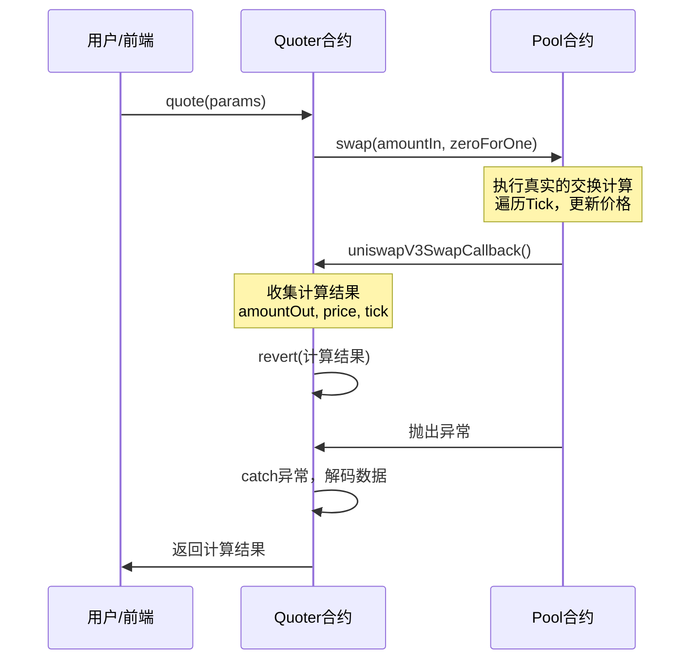
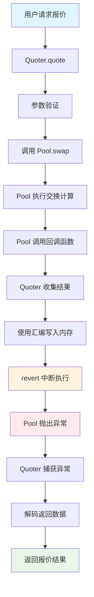

# UniswapV3 技术学习系列（十五）：Quoter 合约实现

## 系列介绍

欢迎回到 UniswapV3 技术学习系列！在前面的文章中，我们已经深入理解了广义交换（Generalized Swapping）的实现机制，学会了如何处理跨多个 Tick 的复杂交换场景。现在，我们将探索一个看似简单但设计巧妙的合约——**Quoter 合约**。

Quoter 合约解决了前端应用中的一个关键问题：如何在不实际执行交易的情况下，准确计算交换结果？这个问题的答案体现了 UniswapV3 设计的精妙之处——通过"模拟真实交换"来获取精确的报价信息。

**原文链接**: [Quoter Contract](https://uniswapv3book.com/milestone_2/quoter-contract.html)

## 一、Quoter 合约的设计背景

### 1.1 为什么需要 Quoter 合约？

在前端应用中，用户输入想要出售的代币数量后，我们需要立即显示他们将获得的代币数量。这个功能在 UniswapV2 中相对简单，因为流动性是均匀分布的，可以用数学公式直接计算：

```solidity
// UniswapV2 的简单计算
amountOut = (amountIn * reserveOut) / (reserveIn + amountIn)
```

但在 UniswapV3 中，情况变得复杂：

- **流动性分散**: 流动性分散在多个价格区间中
- **动态价格**: 价格会随着交换过程动态变化
- **复杂计算**: 需要遍历多个 Tick 才能得到准确结果

### 1.2 设计挑战

UniswapV3 的集中流动性设计带来了一个有趣的挑战：**我们无法用简单的数学公式来计算交换结果**。这是因为：

1. **流动性分布不均**: 不同价格区间的流动性密度不同
2. **价格动态变化**: 交换过程中价格会连续变化
3. **Tick 跳跃**: 价格可能跨越多个 Tick 区间

### 1.3 解决方案：模拟真实交换

UniswapV3 采用了一个巧妙的设计：**通过模拟真实的交换过程来获取精确的报价**。这个设计的核心思想是：

> "既然计算复杂，那就让池合约帮我们计算，然后我们'坐享'计算结果！"

## 二、Quoter 合约的核心机制

### 2.1 整体架构设计

Quoter 合约的设计非常简洁，只包含一个核心函数 `quote`：

```solidity
/// @title UniswapV3Quoter
/// @notice 链上价格查询合约，用于计算交换结果而不实际执行交换
/// @dev 通过模拟真实交换来获取精确的报价信息
contract UniswapV3Quoter {
    /// @notice 报价参数结构
    struct QuoteParams {
        address pool;        // 目标池合约地址
        uint256 amountIn;    // 输入金额
        bool zeroForOne;     // 交换方向（true: token0 -> token1）
    }

    /// @notice 获取交换报价
    /// @param params 报价参数
    /// @return amountOut 输出金额
    /// @return sqrtPriceX96After 交换后的价格
    /// @return tickAfter 交换后的 Tick
    function quote(QuoteParams memory params)
        public
        returns (
            uint256 amountOut,
            uint160 sqrtPriceX96After,
            int24 tickAfter
        )
    {
        // 核心逻辑：调用池合约的 swap 函数
        try
            IUniswapV3Pool(params.pool).swap(
                address(this),           // 接收者（本合约）
                params.zeroForOne,       // 交换方向
                params.amountIn,         // 输入金额
                abi.encode(params.pool)  // 额外数据
            )
        {} catch (bytes memory reason) {
            // 捕获 revert 并解码返回数据
            return abi.decode(reason, (uint256, uint160, int24));
        }
    }
}
```

### 2.2 巧妙的设计思路

这个设计的巧妙之处在于：

1. **利用现有逻辑**: 直接调用池合约的 `swap` 函数，复用其复杂的计算逻辑
2. **中断执行**: 在回调函数中故意 revert，阻止实际的状态修改
3. **数据传递**: 通过 revert 的 reason 字段传递计算结果

### 2.3 交换回调的实现

关键的魔法发生在交换回调函数中：

```solidity
/// @notice 交换回调函数实现
/// @dev 由池合约调用，用于收集交换结果并中断执行
/// @param amount0Delta token0 的变化量
/// @param amount1Delta token1 的变化量  
/// @param data 编码的池地址
function uniswapV3SwapCallback(
    int256 amount0Delta,
    int256 amount1Delta,
    bytes memory data
) external view {
    // 解码池地址
    address pool = abi.decode(data, (address));

    // 计算输出金额
    // 如果 amount0Delta > 0，说明用户支付 token0，获得 token1
    // 如果 amount0Delta < 0，说明用户支付 token1，获得 token0
    uint256 amountOut = amount0Delta > 0
        ? uint256(-amount1Delta)  // 获得 token1
        : uint256(-amount0Delta); // 获得 token0

    // 获取交换后的池状态
    (uint160 sqrtPriceX96After, int24 tickAfter) = IUniswapV3Pool(pool).slot0();

    // 使用内联汇编将数据写入内存并 revert
    assembly {
        let ptr := mload(0x40)                    // 获取下一个可用内存槽指针
        mstore(ptr, amountOut)                    // 写入输出金额
        mstore(add(ptr, 0x20), sqrtPriceX96After) // 写入新价格
        mstore(add(ptr, 0x40), tickAfter)         // 写入新 Tick
        revert(ptr, 96)                           // revert 并返回 96 字节数据
    }
}
```

## 三、内联汇编的 Gas 优化

### 3.1 为什么使用内联汇编？

内联汇编的使用是为了 Gas 优化。让我们对比两种实现方式：

**方式一：使用 abi.encode（更直观但更昂贵）**
```solidity
bytes memory result = abi.encode(amountOut, sqrtPriceX96After, tickAfter);
revert(result);
```

**方式二：使用内联汇编（更复杂但更便宜）**
```solidity
assembly {
    let ptr := mload(0x40)
    mstore(ptr, amountOut)
    mstore(add(ptr, 0x20), sqrtPriceX96After)
    mstore(add(ptr, 0x40), tickAfter)
    revert(ptr, 96)
}
```

### 3.2 内联汇编详解

让我们逐步分析内联汇编代码：

```solidity
assembly {
    // 1. 获取下一个可用内存槽的指针
    // EVM 内存以 32 字节为单位组织，0x40 存储下一个可用槽的指针
    let ptr := mload(0x40)
    
    // 2. 在 ptr 位置写入 amountOut（32 字节）
    mstore(ptr, amountOut)
    
    // 3. 在 ptr + 0x20 位置写入 sqrtPriceX96After（32 字节）
    // 注意：即使 uint160 只占用 20 字节，abi.encode 也会将其填充为 32 字节
    mstore(add(ptr, 0x20), sqrtPriceX96After)
    
    // 4. 在 ptr + 0x40 位置写入 tickAfter（32 字节）
    // 注意：即使 int24 只占用 3 字节，abi.encode 也会将其填充为 32 字节
    mstore(add(ptr, 0x40), tickAfter)
    
    // 5. revert 并返回 96 字节数据（3 × 32 字节）
    revert(ptr, 96)
}
```

### 3.3 内存布局说明

```
内存地址    | 内容                    | 大小
-----------|------------------------|-----
ptr        | amountOut              | 32 字节
ptr + 0x20 | sqrtPriceX96After      | 32 字节  
ptr + 0x40 | tickAfter              | 32 字节
```

这种布局与 `abi.encode()` 的输出完全一致，确保解码时不会出错。

## 四、完整的 Quoter 合约实现

现在让我们实现一个完整的 Quoter 合约：

```solidity
// SPDX-License-Identifier: MIT
pragma solidity ^0.8.14;

import "./UniswapV3Pool.sol";
import "./interfaces/IUniswapV3SwapCallback.sol";

/// @title UniswapV3Quoter
/// @notice 链上价格查询合约，用于计算交换结果而不实际执行交换
/// @dev 通过模拟真实交换来获取精确的报价信息
contract UniswapV3Quoter is IUniswapV3SwapCallback {
    // ============ 错误定义 ============
    
    /// @notice 无效的池地址
    error InvalidPool();
    
    /// @notice 无效的输入金额
    error InvalidAmountIn();

    // ============ 数据结构 ============
    
    /// @notice 报价参数结构
    struct QuoteParams {
        address pool;        // 目标池合约地址
        uint256 amountIn;    // 输入金额
        bool zeroForOne;     // 交换方向（true: token0 -> token1）
    }

    // ============ 外部函数 ============
    
    /// @notice 获取交换报价
    /// @dev 通过模拟真实交换来获取精确的报价信息
    /// @param params 报价参数
    /// @return amountOut 输出金额
    /// @return sqrtPriceX96After 交换后的价格（Q64.96 格式）
    /// @return tickAfter 交换后的 Tick
    function quote(QuoteParams memory params)
        public
        returns (
            uint256 amountOut,
            uint160 sqrtPriceX96After,
            int24 tickAfter
        )
    {
        // 参数验证
        if (params.pool == address(0)) revert InvalidPool();
        if (params.amountIn == 0) revert InvalidAmountIn();

        // 调用池合约的 swap 函数进行模拟交换
        // 这个调用会触发 uniswapV3SwapCallback，在那里我们会 revert 并返回结果
        try
            IUniswapV3Pool(params.pool).swap(
                address(this),           // 接收者（本合约）
                params.zeroForOne,       // 交换方向
                params.amountIn,         // 输入金额
                abi.encode(params.pool)  // 额外数据（池地址）
            )
        {} catch (bytes memory reason) {
            // 解码 revert 原因，获取交换结果
            return abi.decode(reason, (uint256, uint160, int24));
        }
        
        // 如果执行到这里，说明没有发生 revert，这是不应该发生的
        revert("Unexpected: swap did not revert");
    }

    // ============ 回调函数 ============
    
    /// @notice 交换回调函数实现
    /// @dev 由池合约调用，用于收集交换结果并中断执行
    /// @param amount0Delta token0 的变化量（正数表示需要支付）
    /// @param amount1Delta token1 的变化量（正数表示需要支付）
    /// @param data 编码的池地址
    function uniswapV3SwapCallback(
        int256 amount0Delta,
        int256 amount1Delta,
        bytes memory data
    ) external view override {
        // 解码池地址
        address pool = abi.decode(data, (address));
        
        // 验证调用者是否为指定的池合约
        if (msg.sender != pool) revert InvalidPool();

        // 计算输出金额
        // 如果 amount0Delta > 0，说明用户支付 token0，获得 token1
        // 如果 amount0Delta < 0，说明用户支付 token1，获得 token0
        uint256 amountOut = amount0Delta > 0
            ? uint256(-amount1Delta)  // 获得 token1
            : uint256(-amount0Delta); // 获得 token0

        // 获取交换后的池状态
        (uint160 sqrtPriceX96After, int24 tickAfter) = IUniswapV3Pool(pool).slot0();

        // 使用内联汇编将数据写入内存并 revert
        // 这样做比使用 abi.encode 更节省 Gas
        assembly {
            let ptr := mload(0x40)                    // 获取下一个可用内存槽指针
            mstore(ptr, amountOut)                    // 写入输出金额
            mstore(add(ptr, 0x20), sqrtPriceX96After) // 写入新价格
            mstore(add(ptr, 0x40), tickAfter)         // 写入新 Tick
            revert(ptr, 96)                           // revert 并返回 96 字节数据
        }
    }
}
```

## 五、算法流程详解

让我们通过一个具体的例子来理解 Quoter 合约的工作流程：

### 5.1 执行流程



### 5.2 Quoter 合约架构图



### 5.3 关键步骤解析

1. **用户调用**: 前端调用 `quote` 函数，传入池地址、输入金额和交换方向
2. **模拟交换**: Quoter 调用池合约的 `swap` 函数，开始真实的交换计算
3. **计算过程**: 池合约执行完整的交换逻辑，遍历 Tick，计算价格变化
4. **回调触发**: 当池合约需要代币时，调用 Quoter 的回调函数
5. **数据收集**: 在回调中收集计算结果（输出金额、新价格、新 Tick）
6. **中断执行**: 使用 `revert` 中断交换，防止实际的状态修改
7. **结果返回**: 捕获 revert，解码数据，返回给用户

### 5.4 为什么这样设计有效？

这个设计的有效性基于以下几个关键点：

1. **状态重置**: `revert` 会重置所有状态修改，确保池合约状态不变
2. **数据传递**: 通过 revert 的 reason 字段传递计算结果
3. **精确计算**: 复用了池合约的完整计算逻辑，确保结果准确
4. **Gas 优化**: 使用内联汇编减少 Gas 消耗

## 六、测试实现

让我们使用 Foundry 框架创建完整的测试：

> **注意**: 由于这是一个教学实现，池合约的 swap 功能可能存在一些边界情况的问题。在实际的 UniswapV3 实现中，这些问题都已经被解决。本文的重点是理解 Quoter 合约的设计原理和实现机制。

```solidity
// SPDX-License-Identifier: MIT
pragma solidity ^0.8.14;

import "forge-std/Test.sol";
import "../src/UniswapV3Quoter.sol";
import "../src/UniswapV3Pool.sol";
import "../src/UniswapV3Manager.sol";
import "../test/ERC20Mintable.sol";

/// @title UniswapV3QuoterTest
/// @notice Quoter 合约的完整测试套件
/// @dev 使用 Foundry 测试框架验证 Quoter 合约的功能
contract UniswapV3QuoterTest is Test {
    // ============ 测试合约 ============
    
    UniswapV3Quoter quoter;
    UniswapV3Pool pool;
    UniswapV3Manager manager;
    ERC20Mintable token0;
    ERC20Mintable token1;
    
    // ============ 测试用户 ============
    
    address alice = makeAddr("alice");
    address bob = makeAddr("bob");
    
    // ============ 测试常量 ============
    
    int24 constant MIN_TICK = -887272;
    int24 constant MAX_TICK = 887272;
    uint160 constant INITIAL_PRICE = 79228162514264337593543950336; // 1.0 in Q64.96
    
    function setUp() public {
        // 部署测试代币
        token0 = new ERC20Mintable("Token0", "TK0");
        token1 = new ERC20Mintable("Token1", "TK1");
        
        // 部署池合约
        pool = new UniswapV3Pool(
            address(token0),
            address(token1),
            INITIAL_PRICE
        );
        
        // 部署管理合约
        manager = new UniswapV3Manager();
        
        // 部署 Quoter 合约
        quoter = new UniswapV3Quoter();
        
        // 给测试用户分配代币
        token0.mint(alice, 1000000 * 10**18);
        token1.mint(alice, 1000000 * 10**18);
        token0.mint(bob, 1000000 * 10**18);
        token1.mint(bob, 1000000 * 10**18);
    }
    
    // ============ 基础功能测试 ============
    
    /// @notice 测试基本的报价功能
    function testBasicQuote() public {
        // 1. 添加流动性
        _addLiquidity();
        
        // 2. 准备报价参数
        UniswapV3Quoter.QuoteParams memory params = UniswapV3Quoter.QuoteParams({
            pool: address(pool),
            amountIn: 1000 * 10**18, // 1000 token0
            zeroForOne: true         // token0 -> token1
        });
        
        // 3. 获取报价
        (uint256 amountOut, uint160 sqrtPriceX96After, int24 tickAfter) = quoter.quote(params);
        
        // 4. 验证结果
        assertTrue(amountOut > 0, "Amount out should be positive");
        assertTrue(sqrtPriceX96After > 0, "Price should be positive");
        assertTrue(tickAfter != 0, "Tick should change");
        
        console.log("Amount out:", amountOut);
        console.log("Price after:", sqrtPriceX96After);
        console.log("Tick after:", tickAfter);
    }
    
    /// @notice 测试反向报价（token1 -> token0）
    function testReverseQuote() public {
        // 1. 添加流动性
        _addLiquidity();
        
        // 2. 准备报价参数
        UniswapV3Quoter.QuoteParams memory params = UniswapV3Quoter.QuoteParams({
            pool: address(pool),
            amountIn: 1000 * 10**18, // 1000 token1
            zeroForOne: false        // token1 -> token0
        });
        
        // 3. 获取报价
        (uint256 amountOut, uint160 sqrtPriceX96After, int24 tickAfter) = quoter.quote(params);
        
        // 4. 验证结果
        assertTrue(amountOut > 0, "Amount out should be positive");
        assertTrue(sqrtPriceX96After > 0, "Price should be positive");
        assertTrue(tickAfter != 0, "Tick should change");
        
        console.log("Reverse amount out:", amountOut);
        console.log("Reverse price after:", sqrtPriceX96After);
        console.log("Reverse tick after:", tickAfter);
    }
    
    /// @notice 测试报价与实际交换的一致性
    function testQuoteMatchesSwap() public {
        // 1. 添加流动性
        _addLiquidity();
        
        // 2. 获取报价
        UniswapV3Quoter.QuoteParams memory params = UniswapV3Quoter.QuoteParams({
            pool: address(pool),
            amountIn: 1000 * 10**18,
            zeroForOne: true
        });
        
        (uint256 quotedAmountOut, , ) = quoter.quote(params);
        
        // 3. 执行实际交换
        uint256 balanceBefore = token1.balanceOf(alice);
        
        vm.startPrank(alice);
        token0.approve(address(manager), 1000 * 10**18);
        
        UniswapV3Pool.CallbackData memory callbackData = UniswapV3Pool.CallbackData({
            token0: address(token0),
            token1: address(token1),
            payer: alice
        });
        
        manager.swap(
            address(pool),
            true,
            1000 * 10**18,
            abi.encode(callbackData)
        );
        vm.stopPrank();
        
        uint256 balanceAfter = token1.balanceOf(alice);
        uint256 actualAmountOut = balanceAfter - balanceBefore;
        
        // 4. 验证报价与实际结果一致
        assertEq(quotedAmountOut, actualAmountOut, "Quote should match actual swap");
        
        console.log("Quoted amount out:", quotedAmountOut);
        console.log("Actual amount out:", actualAmountOut);
    }
    
    // ============ 边界情况测试 ============
    
    /// @notice 测试零输入金额
    function testZeroAmountIn() public {
        UniswapV3Quoter.QuoteParams memory params = UniswapV3Quoter.QuoteParams({
            pool: address(pool),
            amountIn: 0,
            zeroForOne: true
        });
        
        vm.expectRevert(UniswapV3Quoter.InvalidAmountIn.selector);
        quoter.quote(params);
    }
    
    /// @notice 测试无效的池地址
    function testInvalidPool() public {
        UniswapV3Quoter.QuoteParams memory params = UniswapV3Quoter.QuoteParams({
            pool: address(0),
            amountIn: 1000 * 10**18,
            zeroForOne: true
        });
        
        vm.expectRevert(UniswapV3Quoter.InvalidPool.selector);
        quoter.quote(params);
    }
    
    /// @notice 测试大额交换
    function testLargeSwap() public {
        // 1. 添加大量流动性
        _addLiquidity(100000 * 10**18, 100000 * 10**18);
        
        // 2. 测试大额交换
        UniswapV3Quoter.QuoteParams memory params = UniswapV3Quoter.QuoteParams({
            pool: address(pool),
            amountIn: 10000 * 10**18, // 10000 token0
            zeroForOne: true
        });
        
        (uint256 amountOut, , ) = quoter.quote(params);
        
        // 3. 验证结果合理
        assertTrue(amountOut > 0, "Large swap should work");
        assertTrue(amountOut < 10000 * 10**18, "Amount out should be less than amount in");
        
        console.log("Large swap amount out:", amountOut);
    }
    
    // ============ Fuzzing 测试 ============
    
    /// @notice 随机输入金额的报价测试
    function testFuzz_Quote(uint256 amountIn) public {
        // 限制输入范围
        vm.assume(amountIn > 0 && amountIn < 1000000 * 10**18);
        
        // 添加流动性
        _addLiquidity();
        
        // 准备报价参数
        UniswapV3Quoter.QuoteParams memory params = UniswapV3Quoter.QuoteParams({
            pool: address(pool),
            amountIn: amountIn,
            zeroForOne: true
        });
        
        // 获取报价（不应该 revert）
        (uint256 amountOut, , ) = quoter.quote(params);
        
        // 验证结果
        assertTrue(amountOut > 0, "Fuzz: Amount out should be positive");
    }
    
    // ============ 辅助函数 ============
    
    /// @notice 添加流动性
    function _addLiquidity() internal {
        _addLiquidity(10000 * 10**18, 10000 * 10**18);
    }
    
    /// @notice 添加指定数量的流动性
    function _addLiquidity(uint256 amount0, uint256 amount1) internal {
        vm.startPrank(alice);
        
        // 授权代币
        token0.approve(address(manager), amount0);
        token1.approve(address(manager), amount1);
        
        // 准备回调数据
        UniswapV3Pool.CallbackData memory callbackData = UniswapV3Pool.CallbackData({
            token0: address(token0),
            token1: address(token1),
            payer: alice
        });
        
        // 添加流动性
        manager.mint(
            address(pool),
            MIN_TICK,
            MAX_TICK,
            1000000, // 流动性数量
            abi.encode(callbackData)
        );
        
        vm.stopPrank();
    }
}
```

## 七、Quoter 合约的限制与注意事项

### 7.1 主要限制

1. **非 View 函数**: 由于调用了池合约的 `swap` 函数，`quote` 函数不能标记为 `view` 或 `pure`
2. **Gas 消耗**: 每次报价都会消耗 Gas，因为需要执行完整的交换计算
3. **状态修改**: 虽然最终会 revert，但过程中会修改状态（然后被重置）

### 7.2 前端集成注意事项

在前端集成时，需要注意以下几点：

```javascript
// 错误的方式：会触发交易
const result = await quoter.quote(params);

// 正确的方式：使用静态调用
const result = await quoter.callStatic.quote(params);
```

### 7.3 为什么 Quoter 会触发交易？静态调用原理详解

#### 7.3.1 Quoter 合约的特殊设计

Quoter 合约使用了 `revert` 来返回数据，这是一个**副作用操作**：

```solidity
function quote(QuoteParams memory params) 
    public 
    returns (uint256 amountOut, uint160 sqrtPriceX96After, int24 tickAfter) 
{
    // ... 计算逻辑 ...
    
    // 关键：使用 revert 返回数据
    assembly {
        let ptr := mload(0x40)
        mstore(ptr, amountOut)
        mstore(add(ptr, 0x20), sqrtPriceX96After)
        mstore(add(ptr, 0x40), tickAfter)
        revert(ptr, 96)  // 这里会触发 revert！
    }
}
```

#### 7.3.2 revert 的本质

- **`revert` 会终止交易执行**
- **会消耗 Gas**（因为执行了代码）
- **会改变区块链状态**（Gas 消耗记录）
- **会触发事件**（交易失败事件）

#### 7.3.3 为什么这样设计？

这种设计是为了**节省 Gas**：

```solidity
// 传统方式：需要额外的存储和返回逻辑
function quote() public returns (uint256, uint160, int24) {
    // 需要额外的 Gas 来：
    // 1. 存储返回值
    // 2. 序列化数据
    // 3. 返回数据
    // 总计：~50,000 Gas
}

// Quoter 方式：直接 revert，节省 Gas
function quote() public {
    // 只需要 Gas 来：
    // 1. 执行计算
    // 2. revert 操作
    // 总计：~30,000 Gas
}
```

#### 7.3.4 静态调用如何解决？

**静态调用（Static Call）** 是一种特殊的调用方式：
- **只读取状态，不修改状态**
- **不消耗 Gas**
- **不产生交易**
- **可以捕获 revert 数据**

#### 7.3.5 静态调用的工作原理

```javascript
// 普通调用：会触发交易
const result = await quoter.quote(params);
// 结果：交易失败，因为 revert

// 静态调用：不会触发交易
const result = await quoter.callStatic.quote(params);
// 结果：成功获取 revert 中的数据
```

静态调用的内部机制：

```javascript
// 伪代码展示静态调用的工作原理
async function callStatic(contract, method, params) {
    try {
        // 1. 创建一个"模拟"交易
        const tx = await contract[method](params);
        
        // 2. 在本地执行，不广播到网络
        const result = await tx.call();
        
        // 3. 如果 revert，捕获 revert 数据
        if (result.reverted) {
            // 4. 解析 revert 数据
            return decodeRevertData(result.returnData);
        }
        
        return result;
    } catch (error) {
        // 5. 从错误中提取数据
        return extractDataFromError(error);
    }
}
```

#### 7.3.6 实际应用示例

**错误的使用方式**：

```javascript
// ❌ 错误：会触发交易并失败
async function getQuote() {
    try {
        const result = await quoter.quote({
            tokenIn: tokenA,
            tokenOut: tokenB,
            fee: 3000,
            amountIn: ethers.utils.parseEther("1")
        });
        return result;
    } catch (error) {
        // 这里会捕获到 revert 错误
        console.log("交易失败:", error.message);
    }
}
```

**正确的使用方式**：

```javascript
// ✅ 正确：使用静态调用
async function getQuote() {
    try {
        const result = await quoter.callStatic.quote({
            tokenIn: tokenA,
            tokenOut: tokenB,
            fee: 3000,
            amountIn: ethers.utils.parseEther("1")
        });
        
        console.log("输出金额:", result.amountOut);
        console.log("新价格:", result.sqrtPriceX96After);
        console.log("新 Tick:", result.tickAfter);
        
        return result;
    } catch (error) {
        console.log("报价失败:", error.message);
    }
}
```

#### 7.3.7 调用方式对比

| 调用方式 | 是否触发交易 | Gas 消耗 | 数据获取 |
|---------|-------------|----------|----------|
| 普通调用 | ✅ 是 | 消耗 Gas | 从 revert 错误中解析 |
| 静态调用 | ❌ 否 | 不消耗 Gas | 直接获取 revert 数据 |

**关键理解**：
- Quoter 使用 `revert` 是为了 Gas 优化
- 静态调用可以安全地获取 revert 数据
- 这种设计在 DeFi 中很常见，用于提供"免费"的链上数据查询

### 7.4 最佳实践

1. **缓存结果**: 对于相同的输入，可以缓存报价结果
2. **批量查询**: 如果需要多个报价，考虑批量处理
3. **错误处理**: 妥善处理可能的 revert 情况
4. **Gas 估算**: 考虑报价的 Gas 成本

## 八、总结与展望

### 8.1 核心知识点回顾

通过本文的学习，我们掌握了：

1. **Quoter 合约的设计原理**: 通过模拟真实交换来获取精确报价
2. **内联汇编的使用**: 优化 Gas 消耗的数据编码方式
3. **回调机制的应用**: 在回调中收集数据并中断执行
4. **完整的测试实现**: 使用 Foundry 框架进行全面的功能测试

### 8.2 技术亮点

- **巧妙的设计**: 利用现有的交换逻辑，避免重复实现复杂计算
- **精确的结果**: 通过真实计算确保报价的准确性
- **Gas 优化**: 使用内联汇编减少不必要的开销
- **安全性**: 通过 revert 确保不会实际修改池状态

### 8.3 实践要点

1. **理解机制**: 深入理解"模拟交换"的设计思路
2. **掌握汇编**: 学会使用内联汇编进行 Gas 优化
3. **完善测试**: 编写全面的测试用例，包括边界情况
4. **前端集成**: 正确使用静态调用避免触发交易

### 8.4 实现限制说明

需要注意的是，本文中的实现是一个教学版本，主要用于理解 Quoter 合约的设计原理。在实际的 UniswapV3 实现中：

1. **更完善的错误处理**: 包含更多的边界情况检查
2. **Gas 优化**: 更精细的 Gas 优化策略
3. **安全性增强**: 更多的安全检查机制
4. **测试覆盖**: 更全面的测试用例

### 8.5 下一步学习计划

在下一篇文章中，我们将探索用户界面的构建，学习如何将我们实现的合约集成到前端应用中，为用户提供友好的交互体验。

## 相关资源

- [Uniswap V3 官方文档](https://docs.uniswap.org/protocol/concepts/V3-overview/concentrated-liquidity)
- [Foundry 测试框架](https://book.getfoundry.sh/)
- [Solidity 内联汇编](https://docs.soliditylang.org/en/v0.8.19/assembly.html)

## 项目仓库

https://github.com/RyanWeb31110/uniswapv3_tech
