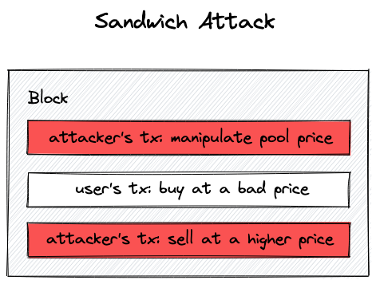

# UniswapV3 技术学习系列（十九）：滑点保护

## 系列介绍

在前面的文章中，我们已经实现了多池交换功能，让用户可以通过多个池子完成代币兑换。但在实际的去中心化交易中，还有一个至关重要的问题需要解决——**滑点保护**。

本文将深入探讨滑点的产生原因、三明治攻击的危害，以及如何在交换和添加流动性时实现有效的滑点保护机制。

**原文链接**：[Slippage Protection - Uniswap V3 Development Book](https://uniswapv3book.com/milestone_3/slippage-protection.html)

## 学习目标

通过本文，你将学习到：

- 🎯 理解滑点的产生原因和危害
- 🛡️ 了解三明治攻击的工作原理
- 💡 掌握在交换中实现滑点保护的方法
- ✨ 学会在添加流动性时保护用户资金
- 🔧 理解核心合约与外围合约的职责分离

---

## 一、什么是滑点？

### 1.1 滑点的定义

**滑点（Slippage）** 是去中心化交易所中一个非常重要的概念。简单来说，滑点就是：

> 你在浏览器中看到的价格 vs 交易实际执行时的价格，两者之间的差异。

### 1.2 滑点产生的原因

为什么会出现这种价格差异呢？主要有以下几个原因：

**（1）交易延迟**
- 从你点击"确认交易"到交易被矿工打包，中间存在时间延迟
- 这个延迟可能是几秒，也可能是几分钟（取决于网络拥堵和 Gas 费用）

**（2）区块链状态变化**
- 区块链的状态在每个区块都会发生变化
- 你的交易无法保证在特定的区块被执行
- 在你的交易被打包之前，可能已经有其他交易改变了池子的状态

**（3）价格波动**

- 在高波动性市场中，价格可能快速变化
- 等你的交易执行时，价格可能已经与预期相差很大

### 1.3 滑点的影响

如果没有滑点保护，用户可能会遭遇：

- 💸 以远低于预期的价格卖出代币
- 📉 以远高于预期的价格买入代币
- 🎭 成为三明治攻击的受害者（下文详述）

---

## 二、三明治攻击（Sandwich Attack）

### 2.1 什么是三明治攻击？

**三明治攻击**是针对去中心化交易所用户的一种常见攻击类型。攻击者就像做三明治一样，用自己的两笔交易"夹击"受害者的交易。



### 2.2 攻击流程

让我们用一个具体的例子来理解三明治攻击：

**初始状态**：

- 池子中有 100 ETH 和 100,000 USDC
- 当前价格：1 ETH = 1,000 USDC
- Alice 想要用 10 ETH 兑换 USDC

**攻击步骤**：

**第 1 步：攻击者的前置交易（Front-run）**
```
攻击者监控到 Alice 的交易
→ 攻击者抢先提交一笔交易，用更高的 Gas 费优先执行
→ 攻击者用 50 ETH 买入 USDC
→ 池子状态变化：150 ETH + 66,667 USDC
→ 价格上涨：1 ETH ≈ 444 USDC
```

**第 2 步：受害者的交易执行**
```
Alice 的交易被执行
→ 由于价格已被抬高，Alice 只能以更差的价格成交
→ Alice 用 10 ETH 只换到了约 4,000 USDC
→ 本应该换到约 9,091 USDC
→ Alice 损失约 5,000 USDC
```

**第 3 步：攻击者的后置交易（Back-run）**
```
攻击者立即卖出之前买入的 USDC
→ 由于价格已恢复（或接近恢复），攻击者获利
→ 攻击者获得的利润 ≈ Alice 的损失
```

### 2.3 三明治攻击的危害

三明治攻击的危害在于：

- 🎯 **精准狙击**：MEV（最大可提取价值）机器人可以自动识别和攻击目标交易
- 💰 **无风险套利**：攻击者几乎没有风险，只要 Gas 费用足够低
- 😢 **用户损失惨重**：大额交易可能损失数千甚至数万美元

---

## 三、交换中的滑点保护

### 3.1 滑点容忍度（Slippage Tolerance）

去中心化交易所通过**滑点容忍度**来保护用户：

> 允许用户设置一个可接受的价格下跌幅度，超过这个幅度就拒绝执行交易。

**Uniswap V3 的默认设置**：
- 默认滑点容忍度：**0.1%**
- 含义：只有当执行价格 ≥ 预期价格的 99.9% 时，交易才会执行
- 用户可以根据市场波动情况调整这个参数

### 3.2 实现方式：价格限制参数

在 `swap` 函数中，我们添加一个新参数 `sqrtPriceLimitX96`，让用户指定一个停止价格：

```solidity
/// @notice 执行代币交换
/// @param recipient 接收代币的地址
/// @param zeroForOne 交换方向：true = token0 → token1, false = token1 → token0
/// @param amountSpecified 指定的代币数量（正数表示精确输入，负数表示精确输出）
/// @param sqrtPriceLimitX96 价格限制（Q64.96 格式的平方根价格）
/// @param data 回调函数的附加数据
/// @return amount0 token0 的变化量（正数表示转入池子，负数表示转出池子）
/// @return amount1 token1 的变化量
function swap(
    address recipient,
    bool zeroForOne,
    uint256 amountSpecified,
    uint160 sqrtPriceLimitX96,  // 新增：价格限制参数
    bytes calldata data
) public returns (int256 amount0, int256 amount1) {
    // ... 交换逻辑
}
```

### 3.3 价格限制的验证逻辑

在函数开头，我们需要验证 `sqrtPriceLimitX96` 的有效性：

```solidity
// 验证价格限制的有效性
if (
    zeroForOne
        // 卖出 token0（zeroForOne = true）时，价格会下跌
        // 限制价格必须小于当前价格，且大于最小允许价格
        ? sqrtPriceLimitX96 > slot0_.sqrtPriceX96 ||
            sqrtPriceLimitX96 < TickMath.MIN_SQRT_RATIO
        // 卖出 token1（zeroForOne = false）时，价格会上涨
        // 限制价格必须大于当前价格，且小于最大允许价格
        : sqrtPriceLimitX96 < slot0_.sqrtPriceX96 &&
            sqrtPriceLimitX96 > TickMath.MAX_SQRT_RATIO
) revert InvalidPriceLimit();
```

**验证逻辑说明**：

| 交换方向 | 价格变化 | 限制价格范围 | 示例 |
|---------|---------|-------------|------|
| `zeroForOne = true`<br/>（卖出 token0） | 价格下跌 | `MIN_SQRT_RATIO < sqrtPriceLimitX96 < 当前价格` | 当前 1 ETH = 2000 USDC<br/>限制价格：1 ETH ≥ 1990 USDC |
| `zeroForOne = false`<br/>（卖出 token1） | 价格上涨 | `当前价格 < sqrtPriceLimitX96 < MAX_SQRT_RATIO` | 当前 1 ETH = 2000 USDC<br/>限制价格：1 ETH ≤ 2010 USDC |

### 3.4 在交换循环中应用价格限制

在 `while` 循环中，我们需要确保满足两个条件：

1. 交换金额尚未完全填充
2. 当前价格未达到限制价格

```solidity
// 交换主循环
while (
    state.amountSpecifiedRemaining > 0 &&
    (zeroForOne
      ? state.sqrtPriceX96 > sqrtPriceLimitX96  // 卖出 token0：价格下跌，只要当前价格 > 限制价格就继续
      : state.sqrtPriceX96 < sqrtPriceLimitX96) // 卖出 token1：价格上涨，只要当前价格 < 限制价格就继续
) {
    // ... 交换逻辑
}
```

**重要特性**：
> Uniswap V3 在遇到滑点限制时**不会直接失败**，而是执行**部分交换**。

这意味着：
- ✅ 用户仍然可以得到部分代币（在可接受的价格范围内）
- ✅ 超出滑点容忍度的部分不会被执行
- ✅ 避免了交易完全失败的情况

### 3.5 在计算交换步骤时应用价格限制

在调用 `SwapMath.computeSwapStep` 时，我们需要确保计算的目标价格不超过限制价格：

```solidity
(state.sqrtPriceX96, step.amountIn, step.amountOut) = SwapMath
    .computeSwapStep(
        state.sqrtPriceX96,  // 当前价格
        (
            zeroForOne
                // 卖出 token0 时，价格下跌
                // 如果下一个 tick 的价格低于限制价格，使用限制价格作为目标
                ? step.sqrtPriceNextX96 < sqrtPriceLimitX96
                // 卖出 token1 时，价格上涨
                // 如果下一个 tick 的价格高于限制价格，使用限制价格作为目标
                : step.sqrtPriceNextX96 > sqrtPriceLimitX96
        )
            ? sqrtPriceLimitX96      // 使用限制价格
            : step.sqrtPriceNextX96, // 使用下一个 tick 的价格
        state.liquidity,              // 当前流动性
        state.amountSpecifiedRemaining // 剩余待交换金额
    );
```

**关键点**：
- 确保 `computeSwapStep` 永远不会计算超出 `sqrtPriceLimitX96` 的交换金额
- 这保证了当前价格永远不会越过限制价格
- 在达到限制价格时，交换会自动停止

---

## 四、添加流动性时的滑点保护

### 4.1 为什么添加流动性也需要滑点保护？

添加流动性时同样存在滑点风险：

**原因**：
- 📌 添加流动性时，投入的代币比例必须与当前价格匹配
- ⏱️ 从用户发起交易到交易执行，池子的价格可能已经变化
- 💸 价格变化导致实际投入的代币数量与预期不符

**示例**：
```
初始状态：
- 用户期望投入 1 ETH + 2000 USDC（价格 1 ETH = 2000 USDC）

价格变化后：
- 池子价格变为 1 ETH = 1800 USDC
- 实际投入变为 1 ETH + 1800 USDC
- 用户的 USDC 投入比预期少 200
```

### 4.2 在 Manager 合约中实现保护

与 `swap` 函数不同，我们不在 Pool 合约中实现 `mint` 的滑点保护：

**设计原则**：

- **Pool 合约**：核心合约，只包含必要的核心逻辑
- **Manager 合约**：外围合约，提供便捷功能和额外保护

因此，我们在 Manager 合约中实现滑点保护。

### 4.3 定义 Mint 参数结构

为了支持滑点保护，我们需要更多参数，将它们组织成一个结构体：

```solidity
// src/UniswapV3Manager.sol
contract UniswapV3Manager {
    /// @notice 添加流动性的参数
    struct MintParams {
        address poolAddress;      // 池子地址
        int24 lowerTick;          // 价格区间下界（tick 值）
        int24 upperTick;          // 价格区间上界（tick 值）
        uint256 amount0Desired;   // 期望投入的 token0 数量
        uint256 amount1Desired;   // 期望投入的 token1 数量
        uint256 amount0Min;       // 最小可接受的 token0 数量（滑点保护）
        uint256 amount1Min;       // 最小可接受的 token1 数量（滑点保护）
    }

    /// @notice 添加流动性
    /// @param params 添加流动性的参数
    /// @return amount0 实际投入的 token0 数量
    /// @return amount1 实际投入的 token1 数量
    function mint(MintParams calldata params)
        public
        returns (uint256 amount0, uint256 amount1)
    {
        // ... 实现逻辑
    }
}
```

### 4.4 理解最小数量参数

`amount0Min` 和 `amount1Min` 是根据滑点容忍度计算的：

**计算公式**：
```
amount0Min = amount0Desired × (1 - slippageTolerance)
amount1Min = amount1Desired × (1 - slippageTolerance)
```

**示例**（滑点容忍度 0.5%）：

```
amount0Desired = 1 ETH = 1e18
amount1Desired = 2000 USDC = 2000e6
slippageTolerance = 0.5% = 0.005

amount0Min = 1e18 × (1 - 0.005) = 0.995e18 = 0.995 ETH
amount1Min = 2000e6 × (1 - 0.005) = 1990e6 = 1990 USDC
```

**含义**：
- 如果实际投入的 token0 < 0.995 ETH，交易回滚
- 如果实际投入的 token1 < 1990 USDC，交易回滚

### 4.5 计算平方根价格和流动性

在 `mint` 函数中，我们帮用户计算所需的参数：

```solidity
// 获取池子合约实例
IUniswapV3Pool pool = IUniswapV3Pool(params.poolAddress);

// 获取当前价格
(uint160 sqrtPriceX96, ) = pool.slot0();

// 计算价格区间的平方根价格
uint160 sqrtPriceLowerX96 = TickMath.getSqrtRatioAtTick(
    params.lowerTick
);
uint160 sqrtPriceUpperX96 = TickMath.getSqrtRatioAtTick(
    params.upperTick
);

// 根据期望投入的代币数量计算流动性
uint128 liquidity = LiquidityMath.getLiquidityForAmounts(
    sqrtPriceX96,          // 当前价格
    sqrtPriceLowerX96,     // 区间下界价格
    sqrtPriceUpperX96,     // 区间上界价格
    params.amount0Desired, // 期望投入的 token0
    params.amount1Desired  // 期望投入的 token1
);
```

**`LiquidityMath.getLiquidityForAmounts` 函数**：
- 这是一个新增的辅助函数
- 根据价格区间和期望投入的代币数量，反推出流动性值
- 我们将在下一章详细讨论其实现

### 4.6 执行铸造并验证结果

最后，我们调用池子的 `mint` 函数，并验证返回的代币数量：

```solidity
// 调用池子的 mint 函数添加流动性
(amount0, amount1) = pool.mint(
    msg.sender,         // 接收流动性凭证的地址
    params.lowerTick,   // 价格区间下界
    params.upperTick,   // 价格区间上界
    liquidity,          // 流动性数量
    abi.encode(
        IUniswapV3Pool.CallbackData({
            token0: pool.token0(),
            token1: pool.token1(),
            payer: msg.sender
        })
    )
);

// 滑点保护：验证实际投入的代币数量不低于最小值
if (amount0 < params.amount0Min || amount1 < params.amount1Min)
    revert SlippageCheckFailed(amount0, amount1);
```

**保护机制**：
- ✅ 如果实际投入的代币数量满足最小要求，交易成功
- ❌ 如果任一代币的实际投入低于最小值，交易回滚
- 🛡️ 用户的资金得到保护，不会因价格滑点遭受过大损失

---

## 五、完整代码示例

### 5.1 Pool 合约的 swap 函数（部分）

```solidity
// src/UniswapV3Pool.sol

/// @notice 执行代币交换
function swap(
    address recipient,
    bool zeroForOne,
    uint256 amountSpecified,
    uint160 sqrtPriceLimitX96,
    bytes calldata data
) public returns (int256 amount0, int256 amount1) {
    // 获取当前状态
    Slot0 memory slot0_ = slot0;

    // 验证价格限制的有效性
    if (
        zeroForOne
            ? sqrtPriceLimitX96 > slot0_.sqrtPriceX96 ||
                sqrtPriceLimitX96 < TickMath.MIN_SQRT_RATIO
            : sqrtPriceLimitX96 < slot0_.sqrtPriceX96 &&
                sqrtPriceLimitX96 > TickMath.MAX_SQRT_RATIO
    ) revert InvalidPriceLimit();

    // 初始化交换状态
    SwapState memory state = SwapState({
        amountSpecifiedRemaining: amountSpecified,
        amountCalculated: 0,
        sqrtPriceX96: slot0_.sqrtPriceX96,
        tick: slot0_.tick,
        liquidity: liquidity
    });

    // 交换主循环
    while (
        state.amountSpecifiedRemaining > 0 &&
        state.sqrtPriceX96 != sqrtPriceLimitX96  // 价格限制检查
    ) {
        StepState memory step;

        step.sqrtPriceStartX96 = state.sqrtPriceX96;

        // 查找下一个已初始化的 tick
        (step.nextTick, ) = tickBitmap.nextInitializedTickWithinOneWord(
            state.tick,
            1,
            zeroForOne
        );

        step.sqrtPriceNextX96 = TickMath.getSqrtRatioAtTick(step.nextTick);

        // 计算本步骤的交换结果
        (state.sqrtPriceX96, step.amountIn, step.amountOut) = SwapMath
            .computeSwapStep(
                state.sqrtPriceX96,
                (
                    zeroForOne
                        ? step.sqrtPriceNextX96 < sqrtPriceLimitX96
                        : step.sqrtPriceNextX96 > sqrtPriceLimitX96
                )
                    ? sqrtPriceLimitX96      // 使用限制价格
                    : step.sqrtPriceNextX96, // 使用下一个 tick 价格
                state.liquidity,
                state.amountSpecifiedRemaining
            );

        // 更新剩余金额
        state.amountSpecifiedRemaining -= step.amountIn;
        state.amountCalculated += step.amountOut;

        // 如果到达了下一个 tick，更新流动性
        if (state.sqrtPriceX96 == step.sqrtPriceNextX96) {
            int128 liquidityDelta = ticks.cross(step.nextTick);

            if (zeroForOne) liquidityDelta = -liquidityDelta;

            state.liquidity = LiquidityMath.addLiquidity(
                state.liquidity,
                liquidityDelta
            );

            state.tick = zeroForOne ? step.nextTick - 1 : step.nextTick;
        } else {
            state.tick = TickMath.getTickAtSqrtRatio(state.sqrtPriceX96);
        }
    }

    // ... 后续处理逻辑
}
```

### 5.2 Manager 合约的 mint 函数

```solidity
// src/UniswapV3Manager.sol

/// @notice 添加流动性的参数
struct MintParams {
    address poolAddress;
    int24 lowerTick;
    int24 upperTick;
    uint256 amount0Desired;
    uint256 amount1Desired;
    uint256 amount0Min;
    uint256 amount1Min;
}

/// @notice 添加流动性
/// @param params 添加流动性的参数
/// @return amount0 实际投入的 token0 数量
/// @return amount1 实际投入的 token1 数量
function mint(MintParams calldata params)
    public
    returns (uint256 amount0, uint256 amount1)
{
    // 获取池子合约
    IUniswapV3Pool pool = IUniswapV3Pool(params.poolAddress);

    // 获取当前价格
    (uint160 sqrtPriceX96, ) = pool.slot0();

    // 计算价格区间边界
    uint160 sqrtPriceLowerX96 = TickMath.getSqrtRatioAtTick(
        params.lowerTick
    );
    uint160 sqrtPriceUpperX96 = TickMath.getSqrtRatioAtTick(
        params.upperTick
    );

    // 根据期望金额计算流动性
    uint128 liquidity = LiquidityMath.getLiquidityForAmounts(
        sqrtPriceX96,
        sqrtPriceLowerX96,
        sqrtPriceUpperX96,
        params.amount0Desired,
        params.amount1Desired
    );

    // 调用池子的 mint 函数
    (amount0, amount1) = pool.mint(
        msg.sender,
        params.lowerTick,
        params.upperTick,
        liquidity,
        abi.encode(
            IUniswapV3Pool.CallbackData({
                token0: pool.token0(),
                token1: pool.token1(),
                payer: msg.sender
            })
        )
    );

    // 滑点保护：检查实际投入金额
    if (amount0 < params.amount0Min || amount1 < params.amount1Min)
        revert SlippageCheckFailed(amount0, amount1);
}

/// @notice 滑点检查失败错误
/// @param amount0 实际投入的 token0 数量
/// @param amount1 实际投入的 token1 数量
error SlippageCheckFailed(uint256 amount0, uint256 amount1);
```

---

## 六、核心知识点回顾

### 6.1 滑点保护的重要性

| 问题 | 影响 | 解决方案 |
|-----|------|---------|
| 交易延迟 | 价格可能在等待期间变化 | 设置价格限制 |
| 三明治攻击 | 攻击者操纵价格获利，用户遭受损失 | 设置滑点容忍度 |
| 价格波动 | 高波动市场中价格快速变化 | 允许用户调整容忍度 |

### 6.2 实现要点

**交换中的滑点保护**：
- ✅ 添加 `sqrtPriceLimitX96` 参数
- ✅ 验证限制价格的合理性
- ✅ 在循环中检查价格限制
- ✅ 在计算步骤时应用限制
- ✅ 达到限制时执行部分交换（不完全失败）

**添加流动性时的滑点保护**：
- ✅ 在外围合约（Manager）中实现
- ✅ 添加 `amount0Min` 和 `amount1Min` 参数
- ✅ 帮用户计算平方根价格和流动性
- ✅ 验证实际投入金额是否满足最小要求

### 6.3 设计原则

**职责分离**：
```
核心合约（Pool）
├── 只包含必要的核心逻辑
├── 价格限制在核心层面实现
└── 保持简洁和安全

外围合约（Manager）
├── 提供便捷的用户接口
├── 实现额外的保护机制
└── 简化复杂的参数计算
```

---

## 七、实践建议

### 7.1 用户使用建议

**设置滑点容忍度时**：
- 🔹 稳定币交易：使用较低的滑点容忍度（0.1% - 0.5%）
- 🔹 主流币交易：使用中等的滑点容忍度（0.5% - 1%）
- 🔹 高波动币种：可适当提高滑点容忍度（1% - 3%）
- 🔹 大额交易：特别注意三明治攻击风险

**避免三明治攻击**：
- ⚠️ 不要设置过高的滑点容忍度
- ⚠️ 避免在高波动期进行大额交易
- ⚠️ 可以使用 Flashbots 等 MEV 保护服务

### 7.2 开发者实现建议

**实现滑点保护时**：
- 📌 在核心合约中实现关键的价格保护
- 📌 在外围合约中实现用户友好的功能
- 📌 提供清晰的错误信息
- 📌 考虑部分成交的情况

**测试要点**：
- 🧪 测试价格达到限制时的行为
- 🧪 测试部分成交的正确性
- 🧪 测试边界条件（最大/最小价格）
- 🧪 测试滑点保护的有效性

---

## 八、下一步学习计划

在下一章中，我们将深入探讨：

1. **流动性计算函数**（`getLiquidityForAmounts`）的实现原理
2. 如何根据代币数量反推流动性值
3. 不同价格区间下的计算逻辑
4. 完整的数学推导和代码实现

这些内容将帮助你完全理解流动性管理的数学基础。

---

## 九、相关资源

### 官方文档
- [Uniswap V3 Slippage Protection](https://docs.uniswap.org/concepts/protocol/swaps#slippage)
- [Sandwich Attacks Explained](https://www.mev.wiki/attack-examples/sandwich-attack)

### 系列文章
- [第十八章：跨 Tick 交换](./18-跨Tick交换.md)
- 第二十章：流动性计算（即将发布）

---

## 项目仓库

本项目 GitHub 仓库：
https://github.com/RyanWeb31110/uniswapv3_tech

系列项目：
- [UniswapV1 技术学习](https://github.com/RyanWeb31110/uniswapv1_tech)
- [UniswapV2 技术学习](https://github.com/RyanWeb31110/uniswapv2_tech)
- [UniswapV3 技术学习](https://github.com/RyanWeb31110/uniswapv3_tech)

欢迎 Star 和 Fork，一起学习交流！ 🎉
