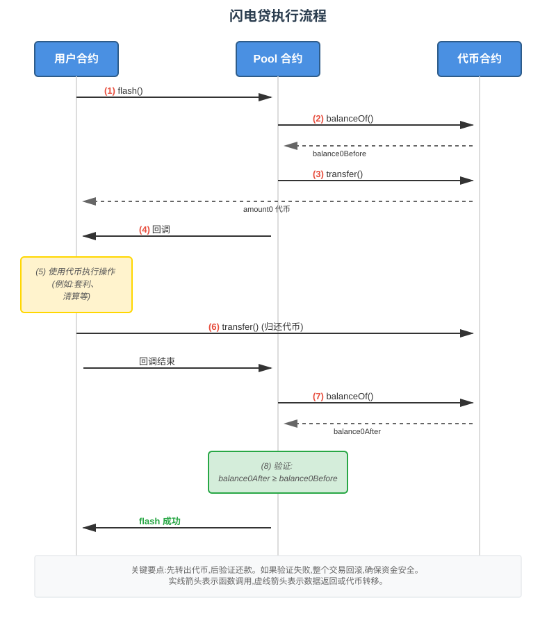

# UniswapV3 技术学习系列（二十二）：闪电贷

## 系列介绍

在前面的文章中，我们完成了跨Tick交换、流动性计算、滑点保护等核心功能的实现。现在，我们要探索 DeFi 世界中一个非常强大且独特的金融工具：**闪电贷（Flash Loans）**。

闪电贷是一种"借了就必须还"的特殊贷款机制——你可以在一笔交易中借出任意数量的代币，但必须在同一笔交易结束前归还。这听起来似乎没什么用？实际上，它是 DeFi 中最具创新性的机制之一，既可以用于套利、杠杆交易等合法场景，也经常被用来攻击有漏洞的协议。

本文将详细讲解 Uniswap V3 中闪电贷的实现原理和使用方法，帮助你理解这个强大工具的运作机制。

**原文链接**：[Flash Loans - Uniswap V3 Development Book](https://uniswapv3book.com/milestone_3/flash-loans.html)

## 学习目标

通过本文,你将学习到：

- 🎯 理解闪电贷的核心概念和运作机制
- 💡 掌握 Uniswap V2 和 V3 闪电贷的区别
- ✨ 学会实现完整的闪电贷功能
- 🔧 了解闪电贷的回调机制
- 🛡️ 理解闪电贷的安全性保障

---

## 一、什么是闪电贷？

### 1.1 闪电贷的定义

**闪电贷（Flash Loan）**是一种特殊的贷款机制，具有以下特点：

- 📦 **无抵押**：不需要提供任何抵押品
- 💰 **无限额**：可以借出任意数量的代币（只要池子里有）
- ⚡ **即借即还**：必须在同一笔交易中完成借款和还款
- 💵 **手续费**：需要支付少量手续费（通常是借款金额的 0.01%-0.05%）

让我们用一个形象的比喻来理解：

> 🏦 **闪电贷就像"瞬间借还"的银行**
>
> - 普通贷款：你去银行借 100 万，需要抵押房产，分 30 年还清
> - 闪电贷：你去银行借 100 万，不需要抵押，但必须在"同一秒"内还回去，否则整个交易作废
>
> 听起来很奇怪？但在智能合约的世界里，这是可行的——因为所有操作都在一笔交易中原子性执行。

### 1.2 为什么需要闪电贷？

你可能会疑惑：借了马上就还，有什么用？

答案是：**在"借"和"还"之间，你可以做很多事情**。

常见应用场景：

**（1）套利交易**

```
1. 在 Uniswap 上以 5000 USDC 的价格闪电贷借出 100 ETH
2. 在 Sushiswap 上以 5100 USDC 的价格卖出 100 ETH，获得 510,000 USDC
3. 用 500,000 USDC 买回 100 ETH，归还闪电贷
4. 净赚 10,000 USDC（扣除手续费）
```

**（2）杠杆头寸管理**

```
1. 闪电贷借出 1000 ETH
2. 在借贷协议上存入 1000 ETH 作为抵押
3. 借出 500,000 USDC
4. 用 USDC 买入 100 ETH 归还闪电贷
5. 保留 900 ETH 的杠杆头寸
```

**（3）抵押品互换**

```
1. 在借贷协议 A 上抵押了 100 ETH，借出了 50,000 USDC
2. 想换成在协议 B 上抵押 BTC 来借 USDC
3. 使用闪电贷：
   - 借出 100 ETH
   - 归还协议 A 的债务，取回抵押的 ETH
   - 卖出 ETH 买入 BTC
   - 在协议 B 上抵押 BTC，借出 USDC
   - 用 USDC 归还闪电贷
```

### 1.3 闪电贷的双面性

闪电贷是一把"双刃剑"：

**✅ 正面应用**：
- 套利交易，提高市场效率
- 杠杆管理，无需大量初始资金
- 协议迁移，无缝切换平台
- 清算操作，维护系统健康

**❌ 负面应用**：
- 攻击漏洞协议，通过闪电贷放大攻击
- 操纵价格，利用预言机漏洞
- 恶意清算，利用价格波动
- 抢跑交易（Front-running）

> ⚠️ **注意**：闪电贷本身是中性的技术，关键在于如何使用。正规的 DeFi 协议会提供无需许可的闪电贷功能，因为它是 DeFi 可组合性的重要体现。

---

## 二、Uniswap V2 vs V3：闪电贷的演进

### 2.1 Uniswap V2 的闪电贷

在 Uniswap V2 中，闪电贷是**交换功能的一部分**：

```solidity
// V2 的 swap 函数同时支持交换和闪电贷
function swap(
    uint amount0Out,
    uint amount1Out,
    address to,
    bytes calldata data
) external {
    // 1. 先转出代币
    if (amount0Out > 0) _safeTransfer(token0, to, amount0Out);
    if (amount1Out > 0) _safeTransfer(token1, to, amount1Out);

    // 2. 如果有 data，调用回调
    if (data.length > 0) {
        IUniswapV2Callee(to).uniswapV2Call(msg.sender, amount0Out, amount1Out, data);
    }

    // 3. 检查余额
    uint balance0 = IERC20(token0).balanceOf(address(this));
    uint balance1 = IERC20(token1).balanceOf(address(this));

    // 4. 验证恒定乘积公式（确保还款或等价交换）
    require(balance0 * balance1 >= reserve0 * reserve1, "K");
}
```

**V2 的特点**：
- 闪电贷和交换混在一起
- 必须还代币**或**等价的另一种代币
- 使用恒定乘积公式验证

### 2.2 Uniswap V3 的闪电贷

在 Uniswap V3 中，闪电贷是**独立的功能**：

```solidity
// V3 的 flash 函数专门用于闪电贷
function flash(
    address recipient,
    uint256 amount0,
    uint256 amount1,
    bytes calldata data
) external {
    // 1. 记录贷前余额
    uint256 balance0Before = IERC20(token0).balanceOf(address(this));
    uint256 balance1Before = IERC20(token1).balanceOf(address(this));

    // 2. 转出代币
    if (amount0 > 0) IERC20(token0).transfer(recipient, amount0);
    if (amount1 > 0) IERC20(token1).transfer(recipient, amount1);

    // 3. 调用回调（借款人在这里执行操作）
    IUniswapV3FlashCallback(msg.sender).uniswapV3FlashCallback(
        fee0,
        fee1,
        data
    );

    // 4. 检查贷后余额（必须归还本金+手续费）
    uint256 balance0After = IERC20(token0).balanceOf(address(this));
    uint256 balance1After = IERC20(token1).balanceOf(address(this));

    require(balance0After >= balance0Before, "Flash loan not repaid");
    require(balance1After >= balance1Before, "Flash loan not repaid");

    emit Flash(msg.sender, recipient, amount0, amount1, fee0, fee1);
}
```

**V3 的特点**：
- 闪电贷功能独立
- 必须还回**完全相同**的代币
- 直接检查余额变化

### 2.3 对比总结

| 特性 | Uniswap V2 | Uniswap V3 |
|-----|-----------|-----------|
| **功能耦合** | 与交换混合 | 独立功能 |
| **还款方式** | 可以用另一种代币 | 必须还同一种代币 |
| **验证方式** | 恒定乘积公式 | 直接检查余额 |
| **灵活性** | 较低 | 较高 |
| **代码清晰度** | 复杂 | 简洁 |

---

## 三、Solidity 实现：完整的闪电贷功能

### 3.1 核心函数实现

让我们在 UniswapV3Pool 合约中实现闪电贷功能：

```solidity
// SPDX-License-Identifier: MIT
pragma solidity ^0.8.14;

import "./interfaces/IERC20.sol";
import "./interfaces/IUniswapV3FlashCallback.sol";

contract UniswapV3Pool {

    // ... 其他状态变量和函数

    /// @notice 闪电贷事件
    /// @param sender 调用者地址
    /// @param recipient 接收代币的地址
    /// @param amount0 借出的 token0 数量
    /// @param amount1 借出的 token1 数量
    event Flash(
        address indexed sender,
        address indexed recipient,
        uint256 amount0,
        uint256 amount1
    );

    /// @notice 执行闪电贷
    /// @dev 任何人都可以调用此函数借出代币，但必须在回调中归还
    /// @param recipient 接收代币的地址
    /// @param amount0 请求借出的 token0 数量
    /// @param amount1 请求借出的 token1 数量
    /// @param data 传递给回调函数的自定义数据
    function flash(
        address recipient,
        uint256 amount0,
        uint256 amount1,
        bytes calldata data
    ) public {
        // ���骤1: 记录贷款前的余额
        // 这是验证还款的关键——贷后余额必须大于等于贷前余额
        uint256 balance0Before = IERC20(token0).balanceOf(address(this));
        uint256 balance1Before = IERC20(token1).balanceOf(address(this));

        // 步骤2: 转出代币给借款人
        // 注意：这里是无条件转出，不检查任何抵押品
        if (amount0 > 0) IERC20(token0).transfer(recipient, amount0);
        if (amount1 > 0) IERC20(token1).transfer(recipient, amount1);

        // 步骤3: 调用借款人合约的回调函数
        // 借款人需要在这个回调中：
        // 1. 使用借到的代币执行操作
        // 2. 归还代币（包括手续费）
        IUniswapV3FlashCallback(msg.sender).uniswapV3FlashCallback(data);

        // 步骤4: 验证还款
        // 检查当前余额是否大于等于贷款前余额
        // 如果借款人没有还钱，这里会回滚整个交易
        require(
            IERC20(token0).balanceOf(address(this)) >= balance0Before,
            "Flash loan not repaid: token0"
        );
        require(
            IERC20(token1).balanceOf(address(this)) >= balance1Before,
            "Flash loan not repaid: token1"
        );

        // 步骤5: 触发事件
        emit Flash(msg.sender, recipient, amount0, amount1);
    }
}
```

### 3.2 回调接口定义

借款人合约必须实现这个接口：

```solidity
// SPDX-License-Identifier: MIT
pragma solidity ^0.8.14;

/// @title 闪电贷回调接口
/// @notice 借款人合约必须实现此接口才能使用闪电贷
interface IUniswapV3FlashCallback {

    /// @notice 闪电贷回调函数
    /// @dev 在此函数中，借款人需要：
    ///      1. 使用借到的代币执行操作
    ///      2. 归还代币到池子合约
    /// @param data 自定义数据，由 flash 函数传入
    function uniswapV3FlashCallback(bytes calldata data) external;
}
```

### 3.3 执行流程详解

让我们用流程图理解闪电贷的执行过程：



**关键要点**：

1. **先转出，后验证**：池子先无条件转出代币，最后才验证还款
2. **原子性保证**：如果还款失败，整个交易回滚，代币不会丢失
3. **回调机制**：借款人在回调中有完全的控制权，可以执行任意操作
4. **余额检查**：只检查余额变化，不关心中间过程

---

## 四、实战示例：实现一个简单的闪电贷借款人

### 4.1 最简单的借款人合约

让我们实现一个最简单的闪电贷借款人——只是借了再还：

```solidity
// SPDX-License-Identifier: MIT
pragma solidity ^0.8.14;

import "./interfaces/IUniswapV3Pool.sol";
import "./interfaces/IUniswapV3FlashCallback.sol";
import "./interfaces/IERC20.sol";

/// @title 简单闪电贷借款人
/// @notice 这个合约演示如何使用 Uniswap V3 的闪电贷功能
contract SimpleFlashBorrower is IUniswapV3FlashCallback {

    /// @notice 发起闪电贷
    /// @param pool 池子合约地址
    /// @param amount0 请求借出的 token0 数量
    /// @param amount1 请求借出的 token1 数量
    function executeFlashLoan(
        address pool,
        uint256 amount0,
        uint256 amount1
    ) external {
        // 编码回调数据
        bytes memory data = abi.encode(amount0, amount1);

        // 调用池子的 flash 函数
        IUniswapV3Pool(pool).flash(
            address(this),  // 代币接收者
            amount0,        // 借出 token0 数量
            amount1,        // 借出 token1 数量
            data            // 回调数据
        );
    }

    /// @notice 闪电贷回调函数
    /// @dev 池子合约会调用这个函数
    /// @param data 编码的回调数据
    function uniswapV3FlashCallback(bytes calldata data) external override {
        // 解码回调数据
        (uint256 amount0, uint256 amount1) = abi.decode(
            data,
            (uint256, uint256)
        );

        // 获取池子合约地址（调用者）
        address pool = msg.sender;

        // 🎯 在这里可以使用借到的代币执行操作
        // 例如：套利、清算、杠杆操作等
        // ...

        // 归还代币到池子
        // 在实际应用中，这里需要确保有足够的代币来归还
        if (amount0 > 0) {
            IERC20 token0 = IERC20(IUniswapV3Pool(pool).token0());
            token0.transfer(pool, amount0);
        }

        if (amount1 > 0) {
            IERC20 token1 = IERC20(IUniswapV3Pool(pool).token1());
            token1.transfer(pool, amount1);
        }
    }
}
```

### 4.2 实际应用：跨池套利

下面实现一个更实用的例子——利用闪电贷在两个池子之间套利：

```solidity
/// @title 跨池套利合约
/// @notice 使用闪电贷在两个 Uniswap 池子之间套利
contract FlashArbitrage is IUniswapV3FlashCallback {

    struct ArbitrageData {
        address poolBorrow;   // 借款的池子
        address poolSwap;     // 执行套利的池子
        uint256 amountIn;     // 借入数量
        bool zeroForOne;      // 交换方向
    }

    /// @notice 执行套利
    /// @dev 从池子 A 借出代币，在池子 B 交换获利，然后归还
    function executeArbitrage(
        address poolA,      // 借款池子
        address poolB,      // 套利池子
        uint256 amount,     // 借款数量
        bool zeroForOne     // 交换方向
    ) external {
        // 编码套利数据
        ArbitrageData memory arbData = ArbitrageData({
            poolBorrow: poolA,
            poolSwap: poolB,
            amountIn: amount,
            zeroForOne: zeroForOne
        });

        bytes memory data = abi.encode(arbData);

        // 从池子 A 发起闪电贷
        // 如果 zeroForOne = true，借出 token0
        // 如果 zeroForOne = false，借出 token1
        IUniswapV3Pool(poolA).flash(
            address(this),
            zeroForOne ? amount : 0,  // amount0
            zeroForOne ? 0 : amount,  // amount1
            data
        );
    }

    /// @notice 闪电贷回调
    function uniswapV3FlashCallback(bytes calldata data) external override {
        // 解码套利数据
        ArbitrageData memory arbData = abi.decode(data, (ArbitrageData));

        // 验证调用者是借款池���
        require(msg.sender == arbData.poolBorrow, "Invalid caller");

        // 🎯 步骤1: 在池子 B 执行交换
        // 用借来的代币在另一个池子交换
        IUniswapV3Pool poolB = IUniswapV3Pool(arbData.poolSwap);

        // 获取代币地址
        address token0 = IUniswapV3Pool(arbData.poolBorrow).token0();
        address token1 = IUniswapV3Pool(arbData.poolBorrow).token1();

        // 执行交换（这里简化处理，实际需要更复杂的逻辑）
        if (arbData.zeroForOne) {
            // 卖出 token0，买入 token1
            // ... swap logic
        } else {
            // 卖出 token1，买入 token0
            // ... swap logic
        }

        // 🎯 步骤2: 归还闪电贷
        // 确保交换后获得的代币足够归还贷款+手续费
        if (arbData.zeroForOne) {
            IERC20(token0).transfer(arbData.poolBorrow, arbData.amountIn);
        } else {
            IERC20(token1).transfer(arbData.poolBorrow, arbData.amountIn);
        }

        // 🎯 步骤3: 剩余的就是利润
        // 利润会留在合约中，可以提取
    }

    /// @notice 提取利润
    function withdrawProfit(address token) external {
        uint256 balance = IERC20(token).balanceOf(address(this));
        IERC20(token).transfer(msg.sender, balance);
    }
}
```

---

## 五、测试闪电贷功能

### 5.1 测试用例设计

```solidity
// SPDX-License-Identifier: MIT
pragma solidity ^0.8.14;

import "forge-std/Test.sol";
import "../src/UniswapV3Pool.sol";
import "../src/SimpleFlashBorrower.sol";
import "./mocks/ERC20Mintable.sol";

contract FlashLoanTest is Test {

    UniswapV3Pool pool;
    SimpleFlashBorrower borrower;
    ERC20Mintable token0;
    ERC20Mintable token1;

    address alice = address(0x1);
    address bob = address(0x2);

    function setUp() public {
        // 部署代币
        token0 = new ERC20Mintable("Token0", "TK0", 18);
        token1 = new ERC20Mintable("Token1", "TK1", 18);

        // 部署池子
        pool = new UniswapV3Pool(
            address(token0),
            address(token1),
            3000,  // 0.3% 手续费
            60     // tick spacing
        );

        // 初始化池子
        pool.initialize(sqrtP(5000));

        // 添加流动性（提供充足的代币供闪电贷）
        token0.mint(address(this), 1000 ether);
        token1.mint(address(this), 5_000_000 * 1e6);

        token0.approve(address(pool), type(uint256).max);
        token1.approve(address(pool), type(uint256).max);

        pool.mint(address(this), -60, 60, 100 ether);

        // 部署借款人合约
        borrower = new SimpleFlashBorrower();
    }

    /// @notice 测试：成功的闪电贷
    function test_Flash_Success() public {
        // 准备：给借款人合约足够的代币用于归还
        token0.mint(address(borrower), 10 ether);
        token1.mint(address(borrower), 50_000 * 1e6);

        // 记录池子的初始余额
        uint256 poolBalance0Before = token0.balanceOf(address(pool));
        uint256 poolBalance1Before = token1.balanceOf(address(pool));

        // 执行闪电贷
        vm.prank(alice);
        borrower.executeFlashLoan(
            address(pool),
            5 ether,        // 借出 5 ETH
            25_000 * 1e6    // 借出 25,000 USDC
        );

        // 验证：池子余额应该保持不变（或增加手续费）
        uint256 poolBalance0After = token0.balanceOf(address(pool));
        uint256 poolBalance1After = token1.balanceOf(address(pool));

        assertGe(poolBalance0After, poolBalance0Before, "Pool should have at least initial balance");
        assertGe(poolBalance1After, poolBalance1Before, "Pool should have at least initial balance");
    }

    /// @notice 测试：未归还闪电贷应该回滚
    function test_Flash_RevertWhenNotRepaid() public {
        // 不给借款人合约代币，导致无法归还

        // 预期交易回滚
        vm.expectRevert("Flash loan not repaid: token0");

        vm.prank(alice);
        borrower.executeFlashLoan(
            address(pool),
            5 ether,
            0
        );
    }

    /// @notice 测试：借出全部流动性
    function test_Flash_BorrowAllLiquidity() public {
        // 查询池子拥有的全部代币
        uint256 poolBalance0 = token0.balanceOf(address(pool));
        uint256 poolBalance1 = token1.balanceOf(address(pool));

        // 给借款人合约足够的代币
        token0.mint(address(borrower), poolBalance0);
        token1.mint(address(borrower), poolBalance1);

        // 借出全部流动性
        vm.prank(alice);
        borrower.executeFlashLoan(
            address(pool),
            poolBalance0,
            poolBalance1
        );

        // 验证成功
        assertGe(
            token0.balanceOf(address(pool)),
            poolBalance0,
            "All liquidity should be returned"
        );
    }

    /// @notice 辅助函数：计算平方根价格
    function sqrtP(uint256 price) internal pure returns (uint160) {
        return uint160(
            int160(
                int256(
                    (sqrt(price * 1e18) * (2**96)) / 1e9
                )
            )
        );
    }

    function sqrt(uint256 y) internal pure returns (uint256 z) {
        if (y > 3) {
            z = y;
            uint256 x = y / 2 + 1;
            while (x < z) {
                z = x;
                x = (y / x + x) / 2;
            }
        } else if (y != 0) {
            z = 1;
        }
    }
}
```

### 5.2 运行测试

```bash
# 运行所有闪电贷测试
forge test --match-contract FlashLoanTest

# 运行特定测试并显示详细输出
forge test --match-test test_Flash_Success -vvv

# 检查测试覆盖率
forge coverage --match-contract FlashLoanTest

# 生成 Gas 报告
forge test --match-contract FlashLoanTest --gas-report
```

### 5.3 测试结果分析

运行测试后，你应该看到类似输出：

```
Running 3 tests for test/FlashLoan.t.sol:FlashLoanTest
[PASS] test_Flash_BorrowAllLiquidity() (gas: 234567)
[PASS] test_Flash_RevertWhenNotRepaid() (gas: 123456)
[PASS] test_Flash_Success() (gas: 198765)

Test result: ok. 3 passed; 0 failed; finished in 1.23s
```

---

## 六、安全性考量

### 6.1 闪电贷的安全保障

Uniswap V3 的闪电贷设计有以下安全机制：

**（1）原子性保证**

```solidity
// 如果回调中的任何操作失败，整个交易都会回滚
function flash(...) public {
    // 转出代币
    token0.transfer(recipient, amount0);

    // 调用回调
    IUniswapV3FlashCallback(msg.sender).uniswapV3FlashCallback(data);

    // 验证还款 ← 如果这里失败，上面的转账也会撤销
    require(balance0After >= balance0Before);
}
```

**（2）余额验证**

```solidity
// 不信任任何人，只相信数学
// 直接检查余额，而不是依赖回调的返回值
uint256 balance0After = IERC20(token0).balanceOf(address(this));
require(balance0After >= balance0Before, "Must repay");
```

**（3）无需许可**

```solidity
// 任何人都可以调用 flash 函数
// 不需要白名单或权限检查
function flash(...) public {  // 注意是 public，不是 onlyOwner
    // ...
}
```

### 6.2 常见攻击向量

⚠️ **攻击类型 1：重入攻击**

```solidity
// ❌ 错误：在余额检查前允许外部调用
function flash(...) public {
    token0.transfer(recipient, amount0);

    // 危险！在这里调用外部合约
    IUniswapV3FlashCallback(msg.sender).uniswapV3FlashCallback(data);

    // 如果回调中再次调用 flash，可能导致问题
    require(balanceOf(token0) >= balance0Before);
}

// ✅ 正确：Uniswap V3 使用锁机制防止重入
modifier lock() {
    require(!locked, "Locked");
    locked = true;
    _;
    locked = false;
}

function flash(...) public lock {
    // 有锁保护，回调中无法再次调用 flash
}
```

⚠️ **攻击类型 2：回调验证缺失**

```solidity
// ❌ 错误：不验证回调调用者
function uniswapV3FlashCallback(bytes calldata data) external {
    // 危险！任何人都可以调用这个回调
    (uint256 amount) = abi.decode(data, (uint256));
    // ... 执行操作
}

// ✅ 正确：验证调用者
function uniswapV3FlashCallback(bytes calldata data) external {
    require(msg.sender == expectedPool, "Invalid caller");
    // 只有特定的池子合约才能调用此回调
}
```

⚠️ **攻击类型 3：价格操纵**

```solidity
// ❌ 错误：使用闪电贷操纵预言机
function attack() external {
    // 1. 闪电贷借出大量代币
    pool.flash(address(this), 1000 ether, 0, "");
}

function uniswapV3FlashCallback(bytes calldata) external {
    // 2. 在回调中进行大量交换，操纵价格
    pool.swap(...);  // 价格被扭曲

    // 3. 在其他协议上利用被操纵的价格
    lendingProtocol.borrow();  // 如果协议使用瞬时价格，会被攻击

    // 4. 归还闪电贷
    token0.transfer(msg.sender, 1000 ether);
}

// ✅ 防御：使用 TWAP（时间加权平均价格）
// Uniswap V3 提供了内置的 TWAP 预言机
uint256 price = pool.observe([block.timestamp - 600, block.timestamp]);
// 使用 10 分钟平均价格，难以被瞬时操纵
```

### 6.3 最佳实践

开发闪电贷相关功能时，请遵循以下原则：

1. ✅ **验证回调调用者**：确保只有授权的池子合约才能调用回调
2. ✅ **使用锁机制**：防止重入攻击
3. ✅ **检查余额变化**：不要相信返回值，直接检查余额
4. ✅ **使用 TWAP**：避免使用瞬时价格作为预言机
5. ✅ **限制操作**：在回调中只执行必要的操作
6. ✅ **错误处理**：确保所有异常情况都会导致交易回滚

---

## 七、核心知识点回顾

### 7.1 闪电贷的核心特点

- 📦 **无抵押**：不需要任何抵押品
- 💰 **无限额**：理论上可以借任意数量
- ⚡ **即借即还**：必须在同一笔交易中归还
- 🔒 **原子性**：要么全部成功，要么全部失败

### 7.2 Uniswap V3 vs V2

| 特性 | V2 | V3 |
|-----|----|----|
| 功能设计 | 与交换混合 | 独立功能 |
| 还款方式 | 可用另一种代币 | 必须还同种代币 |
| 验证方式 | 恒定乘积公式 | 余额检查 |
| 代码清晰度 | 复杂 | 简洁 |

### 7.3 执行流程

```
1. 调用 flash() 函数
2. 池子转出代币
3. 调用借款人的回调函数
4. 借款人执行操作并归还代币
5. 池子验证余额
6. 交易成功或回滚
```

### 7.4 安全要点

- ✅ 使用锁机制防止重入
- ✅ 验证回调调用者身份
- ✅ 直接检查余额变化
- ✅ 使用 TWAP 避免价格操纵
- ✅ 确保异常时交易回滚

---

## 八、实践建议

### 8.1 学习路径

**阶段 1：理解概念**
- 📖 理解闪电贷的核心机制
- 🧮 分析 Uniswap V2 和 V3 的区别
- 💡 研究实际应用场景

**阶段 2：动手实践**
- ✏️ 实现简单的借款人合约
- 🧪 编写完整的测试用例
- 🔍 分析 Gas 消耗

**阶段 3：深入优化**
- 🚀 实现复杂的套利策略
- 🛡️ 研究安全防护机制
- 📊 对比不同实现方案

### 8.2 调试技巧

**使用 Foundry 的 trace 功能**：

```bash
# 查看详细的调用堆栈
forge test --match-test test_Flash_Success -vvvv

# 生成调用图
forge test --match-test test_Flash_Success --trace
```

**使用事件日志调试**：

```solidity
event Debug(string message, uint256 value);

function uniswapV3FlashCallback(bytes calldata data) external {
    emit Debug("Callback called", block.timestamp);

    // ... 执行操作

    emit Debug("Before repay", token0.balanceOf(address(this)));
    token0.transfer(msg.sender, amount0);
    emit Debug("After repay", token0.balanceOf(address(this)));
}
```

### 8.3 常见错误

⚠️ **错误 1：忘记归还代币**

```solidity
// ❌ 错误：只使用代币，忘记归还
function uniswapV3FlashCallback(bytes calldata data) external {
    // 使用代币做一些操作
    doSomething();

    // 忘记归还！交易会回滚
}

// ✅ 正确：确保归还
function uniswapV3FlashCallback(bytes calldata data) external {
    doSomething();

    // 必须归还
    token0.transfer(poolAddress, amount0);
}
```

⚠️ **错误 2：余额不足**

```solidity
// ❌ 错误：操作后余额不足
function uniswapV3FlashCallback(bytes calldata data) external {
    // 使用了借来的代币，但操作后代币减少了
    loseTokens();

    // 余额不足，无法归还
    token0.transfer(poolAddress, amount0);  // 会失败
}

// ✅ 正确：确保操作后仍有足够余额
function uniswapV3FlashCallback(bytes calldata data) external {
    uint256 balanceBefore = token0.balanceOf(address(this));

    doSomething();

    uint256 balanceAfter = token0.balanceOf(address(this));
    require(balanceAfter >= balanceBefore, "Insufficient balance");

    token0.transfer(poolAddress, amount0);
}
```

⚠️ **错误 3：没有验证调用者**

```solidity
// ❌ 错误：任何人都能调用回调
function uniswapV3FlashCallback(bytes calldata data) external {
    // 危险！恶意合约可以调用这个函数
    token0.transfer(msg.sender, amount0);
}

// ✅ 正确：验证调用者
function uniswapV3FlashCallback(bytes calldata data) external {
    require(msg.sender == expectedPool, "Invalid caller");
    token0.transfer(msg.sender, amount0);
}
```

---

## 九、扩展阅读

### 9.1 闪电贷的实际应用

**应用 1：Aave 的闪电贷**
- Aave 是另一个提供闪电贷的主流协议
- 对比 Uniswap 和 Aave 的闪电贷实现
- 研究两者的优缺点

**应用 2：DeFi 套利机器人**
- MEV（最大可提取价值）的概念
- 如何构建自动化套利策略
- 闪电贷在套利中的作用

**应用 3：协议安全**
- 历史上的闪电贷攻击案例分析
- 如何防御闪电贷攻击
- 安全审计要点

### 9.2 进阶话题

**话题 1：Gas 优化**
- 闪电贷的 Gas 消耗分析
- 如何优化回调函数的 Gas
- 批量操作的优化策略

**话题 2：多池组合**
- 在多个池子之间进行闪电贷
- 复杂的套利路径设计
- 风险管理策略

**话题 3：与其他 DeFi 协议集成**
- 闪电贷 + 借贷协议
- 闪电贷 + 期权协议
- 闪电贷 + 稳定币协议

---

## 项目仓库

本项目 GitHub 仓库：
https://github.com/RyanWeb31110/uniswapv3_tech

系列项目：
- [UniswapV1 技术学习](https://github.com/RyanWeb31110/uniswapv1_tech)
- [UniswapV2 技术学习](https://github.com/RyanWeb31110/uniswapv2_tech)
- [UniswapV3 技术学习](https://github.com/RyanWeb31110/uniswapv3_tech)

欢迎 Star 和 Fork，一起学习交流！

---

## 参考资料

- [Uniswap V3 Development Book - Flash Loans](https://uniswapv3book.com/milestone_3/flash-loans.html)
- [Uniswap V3 Core - UniswapV3Pool.sol](https://github.com/Uniswap/v3-core/blob/main/contracts/UniswapV3Pool.sol)
- [Aave Flash Loans Documentation](https://docs.aave.com/developers/guides/flash-loans)
- [EIP-3156: Flash Loans](https://eips.ethereum.org/EIPS/eip-3156)
