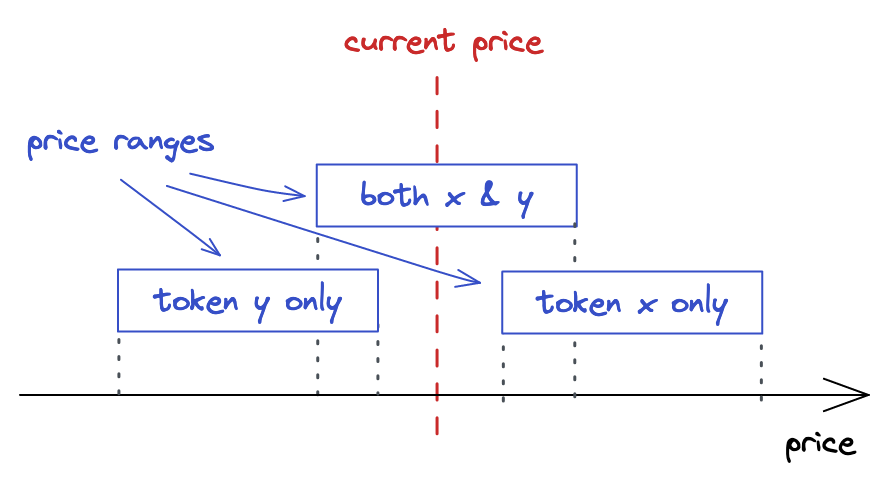

# UniswapV3 技术学习系列（十七）：不同价格区间

## 系列介绍

欢迎来到 UniswapV3 技术学习系列的第三阶段！在前面的文章中，我们已经成功实现了基础的流动性提供和代币交换功能，但仅限于包含当前价格的价格区间。本文将深入探讨 UniswapV3 的核心创新之一：**不同价格区间的流动性提供**，这是实现集中流动性和跨 Tick 交换的关键基础。

通过本文的学习，你将理解如何在不同价格区间提供流动性，掌握限价单的实现原理，并学会如何更新 mint 函数以支持更灵活的流动性管理策略。

**参考原文**: [Different Price Ranges](https://uniswapv3book.com/milestone_3/different-ranges.html)

---

## 一、当前实现的局限性

### 1.1 现有 mint 函数的限制

目前我们的 Pool 合约实现只能创建包含当前价格的价格区间：

```solidity
// src/UniswapV3Pool.sol
function mint() {
    ...
    amount0 = Math.calcAmount0Delta(
        slot0_.sqrtPriceX96,
        TickMath.getSqrtRatioAtTick(upperTick),
        amount
    );

    amount1 = Math.calcAmount1Delta(
        slot0_.sqrtPriceX96,
        TickMath.getSqrtRatioAtTick(lowerTick),
        amount
    );

    liquidity += uint128(amount);
    ...
}
```

从这段代码可以看出，我们总是使用当前价格（`slot0_.sqrtPriceX96`）作为计算基准，这意味着：

- ✅ **支持**: 包含当前价格的价格区间
- ❌ **不支持**: 完全在当前价格之上的价格区间  
- ❌ **不支持**: 完全在当前价格之下的价格区间

### 1.2 流动性跟踪器的局限性

注意到我们总是更新 `liquidity` 变量，这个变量只跟踪**立即可用的流动性**（即当前价格点的流动性）。但实际上，UniswapV3 的设计允许流动性提供者在**任何价格区间**提供流动性，**这些流动性会在价格进入相应区间时被"激活"**。

## 二、不同价格区间的类型

### 2.1 三种价格区间类型

在 UniswapV3 中，可能存在以下三种价格区间：

| 类型 | 描述 | 特点 | 流动性组成 |
|------|------|------|------------|
| **活跃价格区间** | 包含当前价格 | 立即可用 | 两种代币按比例 |
| **下方价格区间** | 上边界低于当前价格 | 等待激活 | 仅包含较便宜代币 |
| **上方价格区间** | 下边界高于当前价格 | 等待激活 | 仅包含较便宜代币 |

### 2.2 价格区间的动态特性

🎯 **核心洞察**: 非活跃流动性（即不在当前价格点的流动性）实际上起到了**限价单**的作用！

让我们用一个生动的比喻来理解这个概念：

> 想象流动性就像**水库**，当前价格就像**水位线**。活跃的流动性是水面上的水，可以立即使用；而休眠的流动性是水面下的水，只有当水位（价格）变化到相应位置时才会被"激活"。

## 三、限价单的实现原理

### 3.1 传统限价单 vs UniswapV3 限价单

在传统交易中，限价单是指当价格达到指定水平时自动执行的订单。UniswapV3 通过巧妙的价格区间设计，实现了类似的功能：

**传统限价单示例**:
- 买入限价单：当 ETH 价格跌至 $1000 时买入 1 ETH
- 卖出限价单：当 ETH 价格涨至 $2000 时卖出 1 ETH

**UniswapV3 限价单实现**:
- 在价格 $1000 附近设置一个窄价格区间，仅包含 USDC
- 当价格下跌触及该区间时，USDC 自动兑换为 ETH
- 移除流动性后，你就获得了以更低价格买入的 ETH

### 3.2 流动性组成的数学原理

假设我们构建一个 ETH/USDC 池，其中 ETH 是 token0，USDC 是 token1，价格定义为：

```
P = token1 / token0 = USDC / ETH
```

**价格区间在下方时**:
- 价格区间完全在当前价格之下
- 流动性完全由 USDC 组成（在该价格水平下相对更贵的代币）
- 当价格下跌进入该区间时，USDC 会被兑换为 ETH

**价格区间在上方时**:
- 价格区间完全在当前价格之上  
- 流动性完全由 ETH 组成（在该价格水平下相对更贵的代币）
- 当价格上涨进入该区间时，ETH 会被兑换为 USDC

> 🤔 **"在该价格水平下相对更贵的代币"是什么意思？**
> 
> **在价格区间内，代币的相对价值**：
> 
> - 当价格区间在**下方**时，该区间内的价格比当前价格**更低**
> - 在更低的价格下，ETH 相对更便宜，USDC 相对更贵
> - 因此流动性完全由 USDC 组成（因为 USDC 在这个价格区间内更"贵"）
> 
> - 当价格区间在**上方**时，该区间内的价格比当前价格**更高**  
> - 在更高的价格下，ETH 相对更贵，USDC 相对更便宜
> - 因此流动性完全由 ETH 组成（因为 ETH 在这个价格区间内更"贵"）
> 
> **简单记忆法**：在非活跃价格区间内，流动性总是由"在那个价格水平下相对更贵的代币"组成。

> 📊 **具体例子说明**：
> 
> 假设当前 ETH 价格 = $1500，我们分析不同价格区间的流动性组成：
> 
> **情况1：价格区间 $1000-$1200（下方区间）**
> - 在这个价格区间内，ETH 价格在 $1000-$1200 之间
> - 相比当前价格 $1500，ETH 在这个区间内更便宜
> - 因此流动性完全由 USDC 组成（USDC 在这个价格水平下相对更"贵"）
> 
> **情况2：价格区间 $1800-$2000（上方区间）**  
> - 在这个价格区间内，ETH 价格在 $1800-$2000 之间
> - 相比当前价格 $1500，ETH 在这个区间内更贵
> - 因此流动性完全由 ETH 组成（ETH 在这个价格水平下相对更"贵"）
> 
> **关键理解**：这里的"便宜"和"贵"是相对于当前价格而言的，不是绝对的代币价值。

> 💡 **可视化理解**: 下图展示了不同价格区间的流动性分布情况。可以看到，当前价格点之外的流动性就像"沉睡"的限价单，只有当价格触及相应区间时才会被激活。



### 3.3 价格区间耗尽的动态过程

让我们通过一个具体例子来理解价格区间的动态变化：

```
当前价格: $1500 ETH
价格区间A: $1000-$1200 (仅包含 USDC)
价格区间B: $1200-$1500 (包含当前价格，两种代币)
价格区间C: $1500-$1800 (仅包含 ETH)
```

**场景1: 大量买入 ETH**
1. 价格从 $1500 上涨到 $1600
2. 价格区间B 中的 USDC 被全部兑换为 ETH
3. 价格区间B 现在只包含 ETH
4. 价格继续上涨，进入价格区间C
5. 价格区间C 中的 ETH 被兑换为 USDC

**场景2: 大量卖出 ETH**  
1. 价格从 $1500 下跌到 $1100
2. 价格区间B 中的 ETH 被全部兑换为 USDC
3. 价格区间B 现在只包含 USDC
4. 价格继续下跌，进入价格区间A
5. 价格区间A 中的 USDC 被兑换为 ETH

> 🎯 **动态过程可视化**: 下图生动地展示了价格区间在交易过程中的"耗尽"现象。当价格移动时，流动性会从一种代币完全转换为另一种代币，这正是 UniswapV3 集中流动性的核心机制。


### 3.4 图片内容深度解析

通过上面的两张图片，我们可以更深入地理解 UniswapV3 的价格区间机制：

#### 3.4.1 第一张图片：不同价格区间的流动性分布

这张图片清晰地展示了：
- **当前价格点**：位于图片中央，是活跃的流动性中心
- **上方价格区间**：完全由 ETH 组成的"沉睡"流动性
- **下方价格区间**：完全由 USDC 组成的"沉睡"流动性
- **价格区间边界**：每个区间的上下边界，决定了流动性的激活条件

#### 3.4.2 第二张图片：价格区间耗尽过程

这张图片生动地演示了：
- **流动性转换**：从混合流动性到单一代币流动性的转换过程
- **价格移动**：价格如何从一个区间移动到另一个区间
- **耗尽现象**：当价格完全穿越一个区间时，该区间的流动性完全转换为另一种代币

#### 3.4.3 关键洞察

🎯 **核心理解**：
1. **流动性不是静态的**：它会根据价格变化动态调整组成
2. **限价单的本质**：非活跃价格区间实际上就是自动执行的限价单
3. **资金效率**：通过集中流动性，相同的资金可以获得更高的收益

## 四、更新 mint 函数实现

### 4.1 支持不同价格区间的逻辑

为了支持所有类型的价格区间，我们需要根据当前价格与用户指定价格区间的关系，采用不同的计算策略：

```solidity
// src/UniswapV3Pool.sol
function mint(
    address owner,
    int24 lowerTick,
    int24 upperTick,
    uint128 amount,
    bytes calldata data
) external returns (uint256 amount0, uint256 amount1) {
    // ... 参数验证和状态更新 ...
    
    // 获取当前价格状态
    Slot0 memory slot0_ = slot0;
    
    // 根据价格区间位置计算代币数量
    if (slot0_.tick < lowerTick) {
        // 情况1: 价格区间在当前价格之上
        // 流动性完全由 token0 (ETH) 组成
        amount0 = Math.calcAmount0Delta(
            TickMath.getSqrtRatioAtTick(lowerTick),
            TickMath.getSqrtRatioAtTick(upperTick),
            amount
        );
        amount1 = 0;
        
    } else if (slot0_.tick < upperTick) {
        // 情况2: 价格区间包含当前价格
        // 流动性由两种代币按比例组成
        amount0 = Math.calcAmount0Delta(
            slot0_.sqrtPriceX96,
            TickMath.getSqrtRatioAtTick(upperTick),
            amount
        );
        
        amount1 = Math.calcAmount1Delta(
            slot0_.sqrtPriceX96,
            TickMath.getSqrtRatioAtTick(lowerTick),
            amount
        );
        
        // 只有这种情况才更新流动性跟踪器
        liquidity = LiquidityMath.addLiquidity(liquidity, int128(amount));
        
    } else {
        // 情况3: 价格区间在当前价格之下
        // 流动性完全由 token1 (USDC) 组成
        amount0 = 0;
        amount1 = Math.calcAmount1Delta(
            TickMath.getSqrtRatioAtTick(lowerTick),
            TickMath.getSqrtRatioAtTick(upperTick),
            amount
        );
    }
    
    // ... 回调处理和事件发出 ...
}
```

### 4.2 关键实现细节

#### 4.2.1 流动性跟踪器的更新策略

**重要**: 只有当前价格区间包含当前价格时，我们才更新 `liquidity` 变量。这是因为：

- `liquidity` 变量跟踪的是**立即可用的流动性**
- 非活跃价格区间的流动性不会立即参与交换
- 只有当价格进入相应区间时，这些流动性才会被"激活"

#### 4.2.2 代币数量的计算逻辑

**上方价格区间** (`slot0_.tick < lowerTick`):
```solidity
amount0 = Math.calcAmount0Delta(
    TickMath.getSqrtRatioAtTick(lowerTick),  // 下边界价格
    TickMath.getSqrtRatioAtTick(upperTick),  // 上边界价格
    amount
);
```

**包含当前价格** (`slot0_.tick < upperTick`):
```solidity
amount0 = Math.calcAmount0Delta(
    slot0_.sqrtPriceX96,                     // 当前价格
    TickMath.getSqrtRatioAtTick(upperTick),  // 上边界价格
    amount
);

amount1 = Math.calcAmount1Delta(
    slot0_.sqrtPriceX96,                     // 当前价格
    TickMath.getSqrtRatioAtTick(lowerTick),  // 下边界价格
    amount
);
```

**下方价格区间** (其他情况):
```solidity
amount1 = Math.calcAmount1Delta(
    TickMath.getSqrtRatioAtTick(lowerTick),  // 下边界价格
    TickMath.getSqrtRatioAtTick(upperTick),  // 上边界价格
    amount
);
```

## 五、数学原理深入解析

### 5.1 集中流动性公式回顾

在之前的文章中，我们学习了集中流动性的基本公式：

**Token0 数量计算**:
```
Δx = L × (√P_u - √P_c) / (√P_u × √P_c)
```

**Token1 数量计算**:
```
Δy = L × (√P_c - √P_l)
```

其中：
- `L` = 流动性数量
- `√P_c` = 当前价格的平方根
- `√P_l` = 下边界价格的平方根  
- `√P_u` = 上边界价格的平方根

### 5.2 不同价格区间的数学推导

#### 5.2.1 上方价格区间

当价格区间完全在当前价格之上时：
- 当前价格 < 下边界价格 < 上边界价格
- 流动性完全由 token0 组成
- 使用完整价格区间计算：

```python
# Python 验证代码
import math

def calc_amount0_above_current(liquidity, lower_tick, upper_tick):
    """计算上方价格区间的 token0 数量"""
    sqrt_price_lower = math.sqrt(1.0001 ** lower_tick)
    sqrt_price_upper = math.sqrt(1.0001 ** upper_tick)
    
    # 使用完整价格区间
    amount0 = liquidity * (sqrt_price_upper - sqrt_price_lower) / (sqrt_price_upper * sqrt_price_lower)
    return amount0

# 示例计算
liquidity = 1000000  # 1M 流动性
lower_tick = 200000  # 对应价格约 $2000
upper_tick = 201000  # 对应价格约 $2010

amount0 = calc_amount0_above_current(liquidity, lower_tick, upper_tick)
print(f"上方价格区间需要 {amount0:.2f} ETH")
```

#### 5.2.2 下方价格区间

当价格区间完全在当前价格之下时：
- 下边界价格 < 上边界价格 < 当前价格
- 流动性完全由 token1 组成
- 使用完整价格区间计算：

```python
def calc_amount1_below_current(liquidity, lower_tick, upper_tick):
    """计算下方价格区间的 token1 数量"""
    sqrt_price_lower = math.sqrt(1.0001 ** lower_tick)
    sqrt_price_upper = math.sqrt(1.0001 ** upper_tick)
    
    # 使用完整价格区间
    amount1 = liquidity * (sqrt_price_upper - sqrt_price_lower)
    return amount1

# 示例计算
lower_tick = 199000  # 对应价格约 $1990
upper_tick = 200000  # 对应价格约 $2000

amount1 = calc_amount1_below_current(liquidity, lower_tick, upper_tick)
print(f"下方价格区间需要 {amount1:.2f} USDC")
```

## 六、完整实现代码

### 6.1 更新后的 mint 函数

```solidity
// SPDX-License-Identifier: MIT
pragma solidity ^0.8.14;

import "./interfaces/IUniswapV3MintCallback.sol";
import "./interfaces/IERC20.sol";
import "./lib/Math.sol";
import "./lib/TickMath.sol";
import "./lib/LiquidityMath.sol";
import "./lib/Tick.sol";
import "./lib/Position.sol";
import "./lib/TickBitmap.sol";

/// @title UniswapV3Pool 核心池合约
/// @notice 实现集中流动性的核心功能
/// @dev 支持不同价格区间的流动性提供和跨 Tick 交换
contract UniswapV3Pool {
    // ... 其他代码保持不变 ...

    /// @notice 在指定价格区间添加流动性
    /// @dev 支持三种价格区间类型：上方、包含当前价格、下方
    /// @param owner 流动性仓位的所有者
    /// @param lowerTick 价格区间下限
    /// @param upperTick 价格区间上限
    /// @param amount 要添加的流动性数量（L）
    /// @param data 回调函数的额外数据
    /// @return amount0 实际存入的 token0 数量
    /// @return amount1 实际存入的 token1 数量
    function mint(
        address owner,
        int24 lowerTick,
        int24 upperTick,
        uint128 amount,
        bytes calldata data
    ) external returns (uint256 amount0, uint256 amount1) {
        
        // 步骤 1: 验证参数
        if (lowerTick >= upperTick || lowerTick < MIN_TICK || upperTick > MAX_TICK) {
            revert InvalidTickRange();
        }

        if (amount == 0) revert ZeroLiquidity();

        // ==================== E: EFFECTS（效果）==================
        // 步骤 2: 更新 Tick 和位图索引
        bool flippedLower = ticks.update(lowerTick, amount);
        bool flippedUpper = ticks.update(upperTick, amount);
        
        if (flippedLower) {
            tickBitmap.flipTick(lowerTick, 1);
        }

        if (flippedUpper) {
            tickBitmap.flipTick(upperTick, 1);
        }

        // 步骤 3: 更新仓位
        Position.Info storage position = positions.get(owner, lowerTick, upperTick);
        position.update(amount);

        // 步骤 4: 根据价格区间位置计算代币数量
        Slot0 memory slot0_ = slot0;

        if (slot0_.tick < lowerTick) {
            // 情况1: 价格区间在当前价格之上
            // 流动性完全由 token0 组成
            amount0 = Math.calcAmount0Delta(
                TickMath.getSqrtRatioAtTick(lowerTick),
                TickMath.getSqrtRatioAtTick(upperTick),
                amount
            );
            amount1 = 0;

        } else if (slot0_.tick < upperTick) {
            // 情况2: 价格区间包含当前价格
            // 流动性由两种代币按比例组成
            amount0 = Math.calcAmount0Delta(
                slot0_.sqrtPriceX96,
                TickMath.getSqrtRatioAtTick(upperTick),
                amount
            );

            amount1 = Math.calcAmount1Delta(
                slot0_.sqrtPriceX96,
                TickMath.getSqrtRatioAtTick(lowerTick),
                amount
            );

            // 只有这种情况才更新流动性跟踪器
            liquidity = LiquidityMath.addLiquidity(liquidity, int128(amount));

        } else {
            // 情况3: 价格区间在当前价格之下
            // 流动性完全由 token1 组成
            amount0 = 0;
            amount1 = Math.calcAmount1Delta(
                TickMath.getSqrtRatioAtTick(lowerTick),
                TickMath.getSqrtRatioAtTick(upperTick),
                amount
            );
        }

        // ==================== I: INTERACTIONS（交互）=============
        // 步骤 5: 通过回调接收代币
        uint256 balance0Before;
        uint256 balance1Before;
        if (amount0 > 0) balance0Before = balance0();
        if (amount1 > 0) balance1Before = balance1();

        IUniswapV3MintCallback(msg.sender).uniswapV3MintCallback(amount0, amount1, data);

        // ==================== C: CHECK（再次检查）===============
        // 步骤 6: 验证余额变化
        if (amount0 > 0 && balance0() < balance0Before + amount0) {
            revert InsufficientInputAmount();
        }
        if (amount1 > 0 && balance1() < balance1Before + amount1) {
            revert InsufficientInputAmount();
        }

        // 步骤 7: 发出事件
        emit Mint(msg.sender, owner, lowerTick, upperTick, amount, amount0, amount1);
    }

    // ... 其他函数保持不变 ...
}
```

### 6.2 关键改进点总结

1. **条件判断逻辑**: 根据当前价格与价格区间的关系，采用不同的计算策略
2. **流动性跟踪**: 只有包含当前价格的价格区间才更新 `liquidity` 变量
3. **代币数量计算**: 使用适当的价格端点进行数学计算
4. **代码可读性**: 清晰的注释说明每种情况的处理逻辑

## 七、测试验证

### 7.1 Foundry 测试框架

让我们使用 Foundry 测试框架来验证不同价格区间的流动性提供功能：

```solidity
// test/UniswapV3Pool.t.sol
// SPDX-License-Identifier: MIT
pragma solidity ^0.8.14;

import "forge-std/Test.sol";
import "../src/UniswapV3Pool.sol";
import "../src/UniswapV3Manager.sol";
import "../test/ERC20Mintable.sol";

/// @title UniswapV3Pool 测试合约
/// @notice 测试不同价格区间的流动性提供功能
contract UniswapV3PoolTest is Test {
    UniswapV3Pool pool;
    UniswapV3Manager manager;
    ERC20Mintable token0;
    ERC20Mintable token1;
    
    // 测试用户
    address alice = address(0x1);
    address bob = address(0x2);
    
    // 测试参数
    uint160 constant INITIAL_PRICE = 79228162514264337593543950336; // 对应 tick 0
    int24 constant INITIAL_TICK = 0;
    uint128 constant LIQUIDITY_AMOUNT = 1000000;

    function setUp() public {
        // 部署测试代币
        token0 = new ERC20Mintable("Token0", "T0");
        token1 = new ERC20Mintable("Token1", "T1");
        
        // 部署池合约
        pool = new UniswapV3Pool(
            address(token0),
            address(token1),
            INITIAL_PRICE,
            INITIAL_TICK
        );
        
        // 部署管理合约
        manager = new UniswapV3Manager();
        
        // 给测试用户分配代币
        token0.mint(alice, 1000000e18);
        token1.mint(alice, 1000000e18);
        token0.mint(bob, 1000000e18);
        token1.mint(bob, 1000000e18);
    }

    /// @notice 测试上方价格区间的流动性提供
    function testMintAboveCurrentPrice() public {
        // 设置价格区间在当前价格之上
        int24 lowerTick = 100;   // 对应更高价格
        int24 upperTick = 200;
        
        // 切换到 Alice
        vm.startPrank(alice);
        
        // 授权代币
        token0.approve(address(manager), type(uint256).max);
        token1.approve(address(manager), type(uint256).max);
        
        // 提供流动性
        (uint256 amount0, uint256 amount1) = manager.mint(
            address(pool),
            lowerTick,
            upperTick,
            LIQUIDITY_AMOUNT,
            ""
        );
        
        vm.stopPrank();
        
        // 验证结果
        assertTrue(amount0 > 0, "应该需要 token0");
        assertTrue(amount1 == 0, "不应该需要 token1");
        
        // 验证池子状态
        assertEq(pool.liquidity(), 0, "流动性跟踪器应该为0");
        
        console.log("上方价格区间 - Token0 数量:", amount0);
        console.log("上方价格区间 - Token1 数量:", amount1);
    }

    /// @notice 测试包含当前价格的价格区间
    function testMintIncludingCurrentPrice() public {
        // 设置价格区间包含当前价格
        int24 lowerTick = -100;  // 低于当前价格
        int24 upperTick = 100;   // 高于当前价格
        
        vm.startPrank(alice);
        
        token0.approve(address(manager), type(uint256).max);
        token1.approve(address(manager), type(uint256).max);
        
        (uint256 amount0, uint256 amount1) = manager.mint(
            address(pool),
            lowerTick,
            upperTick,
            LIQUIDITY_AMOUNT,
            ""
        );
        
        vm.stopPrank();
        
        // 验证结果
        assertTrue(amount0 > 0, "应该需要 token0");
        assertTrue(amount1 > 0, "应该需要 token1");
        
        // 验证池子状态
        assertEq(pool.liquidity(), LIQUIDITY_AMOUNT, "流动性跟踪器应该更新");
        
        console.log("包含当前价格 - Token0 数量:", amount0);
        console.log("包含当前价格 - Token1 数量:", amount1);
    }

    /// @notice 测试下方价格区间的流动性提供
    function testMintBelowCurrentPrice() public {
        // 设置价格区间在当前价格之下
        int24 lowerTick = -200;  // 对应更低价格
        int24 upperTick = -100;
        
        vm.startPrank(alice);
        
        token0.approve(address(manager), type(uint256).max);
        token1.approve(address(manager), type(uint256).max);
        
        (uint256 amount0, uint256 amount1) = manager.mint(
            address(pool),
            lowerTick,
            upperTick,
            LIQUIDITY_AMOUNT,
            ""
        );
        
        vm.stopPrank();
        
        // 验证结果
        assertTrue(amount0 == 0, "不应该需要 token0");
        assertTrue(amount1 > 0, "应该需要 token1");
        
        // 验证池子状态
        assertEq(pool.liquidity(), 0, "流动性跟踪器应该为0");
        
        console.log("下方价格区间 - Token0 数量:", amount0);
        console.log("下方价格区间 - Token1 数量:", amount1);
    }

    /// @notice 测试边界情况
    function testMintBoundaryConditions() public {
        // 测试价格区间刚好在当前价格
        int24 currentTick = pool.slot0().tick;
        
        vm.startPrank(alice);
        token0.approve(address(manager), type(uint256).max);
        token1.approve(address(manager), type(uint256).max);
        
        // 测试下边界刚好等于当前价格
        (uint256 amount0_1, uint256 amount1_1) = manager.mint(
            address(pool),
            currentTick,
            currentTick + 100,
            LIQUIDITY_AMOUNT,
            ""
        );
        
        // 测试上边界刚好等于当前价格
        (uint256 amount0_2, uint256 amount1_2) = manager.mint(
            address(pool),
            currentTick - 100,
            currentTick,
            LIQUIDITY_AMOUNT,
            ""
        );
        
        vm.stopPrank();
        
        // 验证边界情况
        assertTrue(amount0_1 > 0 && amount1_1 > 0, "下边界等于当前价格应该需要两种代币");
        assertTrue(amount0_2 > 0 && amount1_2 > 0, "上边界等于当前价格应该需要两种代币");
    }

    /// @notice Fuzzing 测试
    function testFuzzMintDifferentRanges(
        int24 lowerTick,
        int24 upperTick,
        uint128 liquidity
    ) public {
        // 设置合理的边界
        vm.assume(lowerTick < upperTick);
        vm.assume(lowerTick >= -887272 && upperTick <= 887272);
        vm.assume(liquidity > 0 && liquidity < 1000000000);
        
        vm.startPrank(alice);
        token0.approve(address(manager), type(uint256).max);
        token1.approve(address(manager), type(uint256).max);
        
        // 执行 mint 操作
        (uint256 amount0, uint256 amount1) = manager.mint(
            address(pool),
            lowerTick,
            upperTick,
            liquidity,
            ""
        );
        
        vm.stopPrank();
        
        // 验证基本属性
        assertTrue(amount0 >= 0, "Token0 数量不能为负");
        assertTrue(amount1 >= 0, "Token1 数量不能为负");
        assertTrue(amount0 > 0 || amount1 > 0, "至少需要一种代币");
        
        // 验证价格区间逻辑
        int24 currentTick = pool.slot0().tick;
        if (currentTick < lowerTick) {
            // 上方价格区间
            assertTrue(amount0 > 0 && amount1 == 0, "上方价格区间应该只需要 token0");
        } else if (currentTick < upperTick) {
            // 包含当前价格
            assertTrue(amount0 > 0 && amount1 > 0, "包含当前价格应该需要两种代币");
        } else {
            // 下方价格区间
            assertTrue(amount0 == 0 && amount1 > 0, "下方价格区间应该只需要 token1");
        }
    }
}
```

### 7.2 测试运行和验证

运行测试命令：

```bash
# 运行所有测试
forge test

# 运行特定测试
forge test --match-test testMintAboveCurrentPrice -vvv

# 运行 Fuzzing 测试
forge test --match-test testFuzzMintDifferentRanges -vvv

# 生成 Gas 报告
forge test --gas-report
```

### 7.3 测试结果分析

测试应该验证以下关键点：

1. **上方价格区间**: 只需要 token0，流动性跟踪器不更新
2. **包含当前价格**: 需要两种代币，流动性跟踪器更新
3. **下方价格区间**: 只需要 token1，流动性跟踪器不更新
4. **边界情况**: 正确处理价格区间边界
5. **Fuzzing 测试**: 随机输入下的正确性

## 八、实际应用场景

### 8.1 限价单策略

通过在不同价格区间提供流动性，用户可以实现各种交易策略：

**买入限价单**:
```solidity
// 在 $1000 附近设置窄价格区间，仅包含 USDC
int24 lowerTick = TickMath.getTickAtSqrtRatio(/* $1000 对应的 sqrtPrice */);
int24 upperTick = lowerTick + 10; // 窄区间

// 当价格下跌触及该区间时，USDC 自动兑换为 ETH
```

**卖出限价单**:
```solidity
// 在 $2000 附近设置窄价格区间，仅包含 ETH
int24 lowerTick = TickMath.getTickAtSqrtRatio(/* $2000 对应的 sqrtPrice */);
int24 upperTick = lowerTick + 10;

// 当价格上涨触及该区间时，ETH 自动兑换为 USDC
```

### 8.2 流动性挖矿策略

**稳定币池策略**:
- 在价格 1.0 附近设置窄区间
- 利用稳定币价格波动进行套利

**波动性资产策略**:
- 在多个价格区间分散流动性
- 根据市场预期调整区间宽度

### 8.3 风险管理

**注意事项**:
1. **无常损失**: 价格区间外的流动性可能面临无常损失
2. **Gas 成本**: 频繁调整价格区间会产生 Gas 费用
3. **市场风险**: 价格快速变化可能导致流动性"沉睡"

## 九、总结与展望

### 9.1 核心知识点回顾

通过本文的学习，我们掌握了：

1. **三种价格区间类型**: 上方、包含当前价格、下方
2. **限价单实现原理**: 通过非活跃流动性实现自动交易
3. **数学计算逻辑**: 根据不同价格区间位置采用不同计算策略
4. **流动性跟踪机制**: 只有活跃流动性才更新跟踪器
5. **实际应用场景**: 限价单、流动性挖矿、风险管理

### 9.2 技术实现要点

- ✅ **条件判断**: 根据当前价格与价格区间的关系选择计算策略
- ✅ **数学精度**: 使用正确的价格端点进行流动性计算
- ✅ **状态管理**: 合理更新流动性跟踪器和 Tick 状态
- ✅ **测试覆盖**: 全面的单元测试和 Fuzzing 测试

### 9.3 下一步学习计划

在下一篇文章中，我们将学习：

1. **跨 Tick 交换**: 当交换需要跨越多个价格区间时的处理
2. **滑点保护**: 在 mint 和 swap 函数中实现滑点保护机制
3. **流动性计算优化**: 更高效的流动性聚合和计算
4. **用户界面更新**: 支持不同价格区间的 UI 交互

### 9.4 实践建议

🎯 **动手实践**:
1. 运行测试代码，观察不同价格区间的行为
2. 尝试在不同价格区间提供流动性
3. 观察价格变化时流动性的激活过程
4. 实验限价单策略的实现

🧠 **深入思考**:
1. 如何优化价格区间的选择策略？
2. 如何平衡流动性和 Gas 成本？
3. 如何设计更复杂的交易策略？

## 相关资源

### 官方文档
- [Uniswap V3 官方文档](https://docs.uniswap.org/protocol/concepts/V3-overview/concentrated-liquidity)
- [Uniswap V3 白皮书](https://uniswap.org/whitepaper-v3.pdf)

### 学习教程
- [Uniswap V3 Development Book](https://uniswapv3book.com/index.html)
- [Foundry Book](https://book.getfoundry.sh/)

### 系列项目
- [UniswapV1 技术学习](https://github.com/RyanWeb31110/uniswapv1_tech)
- [UniswapV2 技术学习](https://github.com/RyanWeb31110/uniswapv2_tech)
- [UniswapV3 技术学习](https://github.com/RyanWeb31110/uniswapv3_tech)

## 项目仓库

https://github.com/RyanWeb31110/uniswapv3_tech
