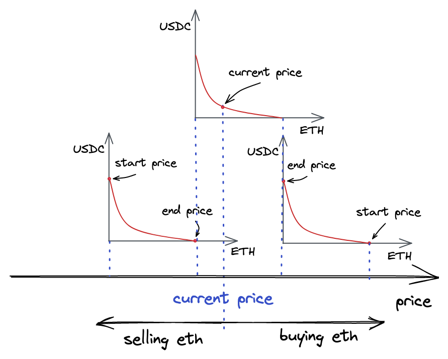
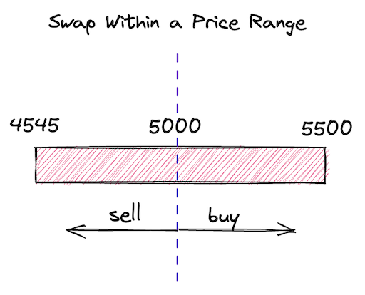
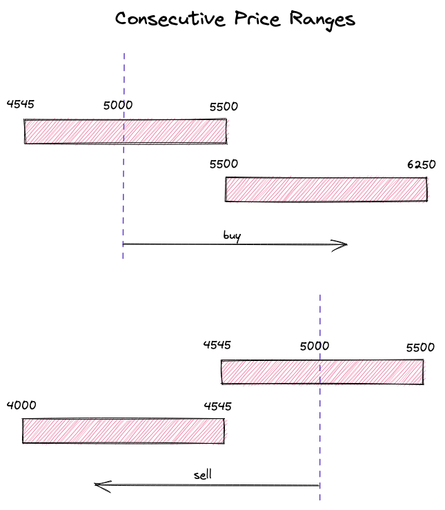

# UniswapV3 技术学习系列（十八）：跨Tick交换

## 系列介绍

欢迎来到 UniswapV3 技术学习系列的第三阶段！在前面的文章中，我们已经成功实现了不同价格区间的流动性提供功能，为集中流动性奠定了基础。本文将深入探讨 UniswapV3 最核心的高级功能：**跨Tick交换**，这是实现大额交易和复杂价格区间管理的关键技术。

通过本文的学习，你将理解价格区间动态激活机制，掌握跨多个价格区间的交换实现，并学会如何优化流动性跟踪和Tick交叉处理，实现真正的集中流动性交易体验。

**参考原文**: [Cross-Tick Swaps](https://uniswapv3book.com/milestone_3/cross-tick-swaps.html)

---

## 一、跨Tick交换的核心概念

### 1.1 什么是跨Tick交换？ 🎯

**跨Tick交换**是 UniswapV3 最先进的功能之一，它允许交易在多个价格区间之间无缝进行。与传统的单区间交换不同，跨Tick交换能够：

- 🔄 **动态激活价格区间**：当价格移动到新区间时自动激活流动性
- 📈 **支持大额交易**：突破单一价格区间的流动性限制
- ⚡ **无缝价格过渡**：在重叠区间提供更平滑的价格变化
- 🎛️ **智能流动性管理**：自动处理流动性的添加和移除

### 1.2 价格区间的动态特性

在 UniswapV3 中，每个池子都包含多个重叠和相邻的价格区间。**池子跟踪当前价格 √P 和对应的 Tick**。当用户进行代币交换时，价格会根据交换方向向左或向右移动，这些移动是由交换过程中代币的添加和移除引起的。

**池子还跟踪 L（代码中的 `liquidity` 变量）**，这是**包含当前价格的所有价格区间提供的总流动性**。

**在大幅价格变动期间，当前价格会移出某些价格区间，这些区间变为非活跃状态，其流动性从 L 中减去。**

**相反，当当前价格进入某个价格区间时，L 增加，该价格区间被激活。**

### 1.3 价格区间转换机制

让我们分析一个具体的例子：



假设有三个价格区间，最上面的是当前活跃的区间，包含当前价格。该价格区间的流动性被设置为 Pool 合约的 `liquidity` 状态变量。

- **买入ETH场景**：如果我们从顶部价格区间买入所有ETH，价格会上涨，我们将移动到右侧价格区间（此时只包含ETH，不包含USDC）
- **买入USDC场景**：如果我们买入顶部价格区间的所有USDC（并卖出ETH），价格会下跌，我们将移动到左侧价格区间（此时只包含USDC）

当前价格在交换过程中会移动，从一个价格区间移动到另一个价格区间，但必须始终保持在某个价格区间内——否则交易无法进行。

## 二、computeSwapStep 函数的优化

### 2.1 当前实现的局限性

在 `swap` 函数中，我们迭代初始化的 ticks（即有流动性的 ticks）来满足用户请求的金额。在每次迭代中，我们：

1. 使用 `tickBitmap.nextInitializedTickWithinOneWord` 找到下一个初始化的 tick
2. 在当前价格和下一个初始化 tick 之间的范围内进行交换（使用 `SwapMath.computeSwapStep`）
3. 总是期望当前流动性足以满足交换（即交换后的价格在当前价格和下一个初始化 tick 之间）

但如果第三步不成立会发生什么？我们在测试中已经涵盖了这种情况：

```solidity
// test/UniswapV3Pool.t.sol
function testSwapBuyEthNotEnoughLiquidity() public {
    // ...
    uint256 swapAmount = 5300 ether;
    // ...
    vm.expectRevert(stdError.arithmeticError);
    pool.swap(address(this), false, swapAmount, extra);
}
```

"算术上溢/下溢"错误发生在池子试图发送超过其拥有的以太币时。这个错误发生是因为，在我们当前的实现中，我们总是期望有足够的流动性来满足任何交换：

```solidity
// src/lib/SwapMath.sol
function computeSwapStep(...) {
    // ...
    sqrtPriceNextX96 = Math.getNextSqrtPriceFromInput(
        sqrtPriceCurrentX96,
        liquidity,
        amountRemaining,
        zeroForOne
    );
    // ...
}
```

### 2.2 改进策略

为了改进这种情况，我们需要考虑几种情况：

1. **当前区间有足够流动性**：当前和下一个 ticks 之间的范围有足够的流动性来满足 `amountRemaining`
2. **当前区间流动性不足**：该范围无法满足整个 `amountRemaining`

在第一种情况下，交换完全在范围内完成——这是我们已实现的场景。在第二种情况下，我们将消耗该范围提供的全部流动性，并**移动到下一个范围**（如果存在）。

### 2.3 重新设计 computeSwapStep

基于以上分析，让我们重新设计 `computeSwapStep`：

```solidity
// src/lib/SwapMath.sol
/**
 * @notice 计算单步交换的输入输出金额和下一个价格
 * @param sqrtPriceCurrentX96 当前价格的平方根
 * @param sqrtPriceTargetX96 目标价格的平方根
 * @param liquidity 当前流动性
 * @param amountRemaining 剩余交换金额
 * @param zeroForOne 交换方向，true表示用token0换token1
 * @return sqrtPriceNextX96 交换后的价格平方根
 * @return amountIn 实际输入金额
 * @return amountOut 实际输出金额
 */
function computeSwapStep(
    uint160 sqrtPriceCurrentX96,
    uint160 sqrtPriceTargetX96,
    uint128 liquidity,
    uint256 amountRemaining,
    bool zeroForOne
) internal pure returns (uint160 sqrtPriceNextX96, uint256 amountIn, uint256 amountOut) {
    // 计算当前价格区间能够满足的最大输入金额
    amountIn = zeroForOne
        ? Math.calcAmount0Delta(
            sqrtPriceCurrentX96,
            sqrtPriceTargetX96,
            liquidity
        )
        : Math.calcAmount1Delta(
            sqrtPriceCurrentX96,
            sqrtPriceTargetX96,
            liquidity
        );

    // 判断当前区间是否有足够流动性满足整个交换
    if (amountRemaining >= amountIn) {
        // 当前区间流动性不足，使用整个区间的流动性
        sqrtPriceNextX96 = sqrtPriceTargetX96;
    } else {
        // 当前区间流动性充足，计算实际能达到的价格
        sqrtPriceNextX96 = Math.getNextSqrtPriceFromInput(
            sqrtPriceCurrentX96,
            liquidity,
            amountRemaining,
            zeroForOne
        );
    }

    // 重新计算实际的输入输出金额
    amountIn = Math.calcAmount0Delta(
        sqrtPriceCurrentX96,
        sqrtPriceNextX96,
        liquidity
    );
    amountOut = Math.calcAmount1Delta(
        sqrtPriceCurrentX96,
        sqrtPriceNextX96,
        liquidity
    );
}
```

### 2.4 算法逻辑解析

这个改进的算法包含以下关键步骤：

1. **计算区间容量**：首先计算当前价格区间能够满足的最大输入金额 `amountIn`
2. **流动性判断**：如果 `amountRemaining >= amountIn`，说明当前区间流动性不足，需要使用整个区间的流动性
3. **价格计算**：根据流动性是否充足，计算下一个价格点
4. **重新计算金额**：基于实际的价格变化，重新计算输入输出金额

这种设计确保了：
- ✅ **流动性不足时**：消耗整个区间的流动性，移动到下一个区间
- ✅ **流动性充足时**：在当前区间内完成交换
- ✅ **价格连续性**：价格变化是连续和可预测的

## 三、swap 函数的更新

### 3.1 处理价格区间边界

现在，在 `swap` 函数中，我们需要处理上一节介绍的情况：当交换价格达到价格区间的边界时。当这种情况发生时，我们希望停用即将离开的价格区间，并激活下一个价格区间。

在更新循环之前，让我们将 `tickBitmap.nextInitializedTickWithinOneWord()` 调用返回的第二个值保存到 `step.initialized` 中：

```solidity
// 获取下一个初始化的tick和是否已初始化的标志
(step.nextTick, step.initialized) = tickBitmap.nextInitializedTickWithinOneWord(
    state.tick,
    1,
    zeroForOne
);
```

知道下一个 tick 是否已初始化将有助于我们在 ticks 位图的当前字中没有初始化 tick 的情况下节省一些 gas。

### 3.2 循环结束处理

现在，我们需要在循环末尾添加以下逻辑：

```solidity
// 检查是否到达了价格区间边界
if (state.sqrtPriceX96 == step.sqrtPriceNextX96) {
    // 到达边界，需要处理tick交叉
    if (step.initialized) {
        // 获取tick交叉时的流动性变化
        int128 liquidityDelta = ticks.cross(step.nextTick);

        // 根据交换方向调整流动性变化符号
        if (zeroForOne) liquidityDelta = -liquidityDelta;

        // 更新当前流动性
        state.liquidity = LiquidityMath.addLiquidity(
            state.liquidity,
            liquidityDelta
        );

        // 检查流动性是否为零
        if (state.liquidity == 0) revert NotEnoughLiquidity();
    }

    // 更新当前tick
    state.tick = zeroForOne ? step.nextTick - 1 : step.nextTick;
} else {
    // 价格仍在当前区间内，根据新价格计算tick
    state.tick = TickMath.getTickAtSqrtRatio(state.sqrtPriceX96);
}
```

### 3.3 边界处理逻辑解析

这个逻辑处理两种不同的情况：

**情况1：到达价格区间边界** (`state.sqrtPriceX96 == step.sqrtPriceNextX96`)
- 更新当前流动性（只有当下一个 tick 已初始化时）
- 根据交换方向调整流动性变化符号
- 更新当前 tick 位置

**情况2：价格仍在区间内** (else 分支)

- 根据新的价格计算对应的 tick

### 3.4 流动性更新优化

另一个重要但微小的变化是，我们需要在跨越 tick 时更新 L。我们在循环之后执行此操作：

```solidity
// 更新全局流动性变量
if (liquidity_ != state.liquidity) liquidity = state.liquidity;
```

在循环中，我们在进入/离开价格区间时多次更新 `state.liquidity`。交换后，我们需要更新全局 L 以反映新当前价格下的可用流动性。此外，我们仅在交换完成时更新全局变量的原因是为了优化 gas 消耗，因为写入合约存储是一项昂贵的操作。

## 四、流动性跟踪和Tick交叉

### 4.1 Tick.Info 结构更新

让我们看看更新后的 Tick 库。第一个变化是在 `Tick.Info` 结构中：我们现在有两个变量来跟踪 tick 流动性：

```solidity
/**
 * @notice Tick信息结构体
 * @param initialized 是否已初始化
 * @param liquidityGross tick处的总流动性
 * @param liquidityNet 跨越tick时添加或移除的流动性数量
 */
struct Info {
    bool initialized;
    // tick处的总流动性
    uint128 liquidityGross;
    // 跨越tick时添加或移除的流动性数量
    int128 liquidityNet;
}
```

- **`liquidityGross`**：跟踪 tick 的绝对流动性量，用于判断 tick 是否被翻转
- **`liquidityNet`**：有符号整数，跟踪跨越 tick 时添加（下 tick 情况）或移除（上 tick 情况）的流动性量

### 4.2 update 函数实现

`liquidityNet` 在 update 函数中设置：

```solidity
/**
 * @notice 更新tick信息
 * @param self tick映射
 * @param tick tick位置
 * @param liquidityDelta 流动性变化量
 * @param upper 是否为上tick
 * @return flipped tick是否被翻转
 */
function update(
    mapping(int24 => Tick.Info) storage self,
    int24 tick,
    int128 liquidityDelta,
    bool upper
) internal returns (bool flipped) {
    Tick.Info storage tickInfo = self[tick];
    
    // 记录tick是否已初始化
    bool wasInitialized = tickInfo.initialized;
    
    // 更新总流动性
    tickInfo.liquidityGross = LiquidityMath.addDelta(
        tickInfo.liquidityGross,
        liquidityDelta
    );
    
    // 更新净流动性变化
    tickInfo.liquidityNet = upper
        ? int128(int256(tickInfo.liquidityNet) - liquidityDelta)
        : int128(int256(tickInfo.liquidityNet) + liquidityDelta);
    
    // 检查tick是否被翻转
    flipped = wasInitialized != (tickInfo.liquidityGross > 0);
    
    // 更新初始化状态
    tickInfo.initialized = tickInfo.liquidityGross > 0;
}
```

### 4.3 cross 函数实现

我们上面看到的 cross 函数简单地返回 `liquidityNet`：

```solidity
/**
 * @notice 跨越tick时获取流动性变化
 * @param self tick映射
 * @param tick tick位置
 * @return liquidityDelta 流动性变化量
 */
function cross(mapping(int24 => Tick.Info) storage self, int24 tick)
    internal
    view
    returns (int128 liquidityDelta)
{
    Tick.Info storage info = self[tick];
    liquidityDelta = info.liquidityNet;
}
```

## 五、测试验证

让我们回顾不同的流动性设置并测试它们，以确保我们的池实现能够正确处理它们。

### 5.1 单一价格区间测试



这是我们之前遇到的情况。更新代码后，我们需要确保旧功能能够继续正常工作。

**购买ETH测试**：

```solidity
function testBuyETHOnePriceRange() public {
    LiquidityRange[] memory liquidity = new LiquidityRange[](1);
    liquidity[0] = liquidityRange(4545, 5500, 1 ether, 5000 ether, 5000);

    // 执行交换
    pool.swap(address(this), false, 42 ether, extra);

    // 验证交换状态
    (int256 expectedAmount0Delta, int256 expectedAmount1Delta) = (
        -0.008396874645169943 ether,
        42 ether
    );

    assertSwapState(
        ExpectedStateAfterSwap({
            expectedAmount0Delta: expectedAmount0Delta,
            expectedAmount1Delta: expectedAmount1Delta,
            sqrtPriceX96: 5604415652688968742392013927525, // 5003.8180249710795
            tick: 85183,
            currentLiquidity: liquidity[0].amount
        })
    );
}
```

**购买USDC测试**：

```solidity
function testBuyUSDCOnePriceRange() public {
    LiquidityRange[] memory liquidity = new LiquidityRange[](1);
    liquidity[0] = liquidityRange(4545, 5500, 1 ether, 5000 ether, 5000);

    // 执行交换
    pool.swap(address(this), true, 0.01337 ether, extra);

    // 验证交换状态
    (int256 expectedAmount0Delta, int256 expectedAmount1Delta) = (
        0.01337 ether,
        -66.807123823853842027 ether
    );

    assertSwapState(
        ExpectedStateAfterSwap({
            expectedAmount0Delta: expectedAmount0Delta,
            expectedAmount1Delta: expectedAmount1Delta,
            sqrtPriceX96: 5598737223630966236662554421688, // 4993.683362269102
            tick: 85163,
            currentLiquidity: liquidity[0].amount
        })
    );
}
```

在这两种情况下，我们买入少量 ETH 或 USDC——数量必须足够小，使价格不离开我们创建的唯一价格区间。交换完成后的关键值：

- `sqrtPriceX96` 略高于或低于初始价格，并保持在价格区间内
- `currentLiquidity` 保持不变

### 5.2 多个相同且重叠的价格区间测试


**购买ETH测试**：

```solidity
function testBuyETHTwoEqualPriceRanges() public {
    LiquidityRange memory range = liquidityRange(
        4545,
        5500,
        1 ether,
        5000 ether,
        5000
    );
    LiquidityRange[] memory liquidity = new LiquidityRange[](2);
    liquidity[0] = range;
    liquidity[1] = range;

    // 执行交换
    pool.swap(address(this), false, 42 ether, extra);

    // 验证交换状态
    (int256 expectedAmount0Delta, int256 expectedAmount1Delta) = (
        -0.008398516982770993 ether,
        42 ether
    );

    assertSwapState(
        ExpectedStateAfterSwap({
            expectedAmount0Delta: expectedAmount0Delta,
            expectedAmount1Delta: expectedAmount1Delta,
            sqrtPriceX96: 5603319704133145322707074461607, // 5001.861214026131
            tick: 85179,
            currentLiquidity: liquidity[0].amount + liquidity[1].amount
        })
    );
}
```

这种情况与上一种情况类似，但这次我们创建了两个相同的价格区间。由于这些是完全重叠的价格区间，它们实际上相当于一个流动性更高的价格区间。因此，价格变化比上一种情况更慢。此外，由于流动性更强，我们获得的代币数量也略有增加。

### 5.3 连续价格区间测试



**购买ETH测试**：

```solidity
function testBuyETHConsecutivePriceRanges() public {
    LiquidityRange[] memory liquidity = new LiquidityRange[](2);
    liquidity[0] = liquidityRange(4545, 5500, 1 ether, 5000 ether, 5000);
    liquidity[1] = liquidityRange(5500, 6250, 1 ether, 5000 ether, 5000);

    // 执行大额交换
    pool.swap(address(this), false, 10000 ether, extra);

    // 验证交换状态
    (int256 expectedAmount0Delta, int256 expectedAmount1Delta) = (
        -1.820694594787485635 ether,
        10000 ether
    );

    assertSwapState(
        ExpectedStateAfterSwap({
            expectedAmount0Delta: expectedAmount0Delta,
            expectedAmount1Delta: expectedAmount1Delta,
            sqrtPriceX96: 6190476002219365604851182401841, // 6105.045728033458
            tick: 87173,
            currentLiquidity: liquidity[1].amount
        })
    );
}
```

**购买USDC测试**：

```solidity
function testBuyUSDCConsecutivePriceRanges() public {
    LiquidityRange[] memory liquidity = new LiquidityRange[](2);
    liquidity[0] = liquidityRange(4545, 5500, 1 ether, 5000 ether, 5000);
    liquidity[1] = liquidityRange(4000, 4545, 1 ether, 5000 ether, 5000);

    // 执行大额交换
    pool.swap(address(this), true, 2 ether, extra);

    // 验证交换状态
    (int256 expectedAmount0Delta, int256 expectedAmount1Delta) = (
        2 ether,
        -9103.264925902176327184 ether
    );

    assertSwapState(
        ExpectedStateAfterSwap({
            expectedAmount0Delta: expectedAmount0Delta,
            expectedAmount1Delta: expectedAmount1Delta,
            sqrtPriceX96: 5069962753257045266417033265661, // 4094.9666586581643
            tick: 83179,
            currentLiquidity: liquidity[1].amount
        })
    );
}
```

在这些情况下，我们进行大额交换，导致价格超出某个价格区间。结果，第二个价格区间被激活，并提供足够的流动性来满足交换。在这两种情况下，我们都可以看到价格超出了当前价格区间，并且该价格区间被停用（当前流动性等于第二个价格区间的流动性）。

### 5.4 部分重叠价格区间测试


**购买ETH测试**：

```solidity
function testBuyETHPartiallyOverlappingPriceRanges() public {
    LiquidityRange[] memory liquidity = new LiquidityRange[](2);
    liquidity[0] = liquidityRange(4545, 5500, 1 ether, 5000 ether, 5000);
    liquidity[1] = liquidityRange(5001, 6250, 1 ether, 5000 ether, 5000);

    // 执行大额交换
    pool.swap(address(this), false, 10000 ether, extra);

    // 验证交换状态
    (int256 expectedAmount0Delta, int256 expectedAmount1Delta) = (
        -1.864220641170389178 ether,
        10000 ether
    );

    assertSwapState(
        ExpectedStateAfterSwap({
            expectedAmount0Delta: expectedAmount0Delta,
            expectedAmount1Delta: expectedAmount1Delta,
            sqrtPriceX96: 6165345094827913637987008642386, // 6055.578153852725
            tick: 87091,
            currentLiquidity: liquidity[1].amount
        })
    );
}
```

这是上一种情况的变体，但这次价格区间部分重叠。在价格区间重叠的区域，流动性更强，价格波动也更慢。这类似于在重叠区间内提供更多流动性。

还要注意，在两次交换中，我们获得的代币都比"连续价格区间"场景中多——这同样是由于重叠区间的流动性更深。

## 六、核心知识点回顾

### 6.1 跨Tick交换的关键特性

1. **动态流动性管理**：流动性根据价格移动自动激活和停用
2. **无缝价格过渡**：支持在多个价格区间之间连续交换
3. **智能边界处理**：正确处理价格区间边界的流动性变化
4. **Gas优化**：通过批量更新和缓存减少存储操作

### 6.2 实现要点总结

- **computeSwapStep优化**：支持流动性不足时的区间切换
- **Tick交叉处理**：正确管理流动性的添加和移除
- **价格连续性**：确保价格变化的连续性和可预测性
- **测试覆盖**：全面的测试场景验证各种流动性配置

### 6.3 与V2的对比优势

| 特性 | UniswapV2 | UniswapV3 |
|------|-----------|-----------|
| 流动性分布 | 全价格范围 | 集中价格区间 |
| 资金效率 | 低 | 高（最高4000x） |
| 价格影响 | 大额交易影响大 | 集中流动性减少影响 |
| 手续费收益 | 平均分配 | 活跃区间收益更高 |

## 七、实践要点总结

### 7.1 开发注意事项

1. **流动性检查**：始终检查流动性是否为零，避免除零错误
2. **Tick边界处理**：正确处理上tick和下tick的流动性变化符号
3. **Gas优化**：批量更新存储变量，减少不必要的存储写入
4. **价格精度**：使用Q64.96格式确保价格计算的精度

### 7.2 测试策略

1. **边界测试**：测试价格区间边界的各种情况
2. **流动性测试**：验证不同流动性配置下的交换行为
3. **大额交易测试**：确保大额交易能够正确跨越多个区间
4. **Fuzzing测试**：使用随机输入测试各种边界情况

## 八、下一步学习计划

通过本文的学习，你已经掌握了UniswapV3最核心的跨Tick交换功能。接下来我们将学习：

1. **滑点保护机制**：如何实现交易滑点保护
2. **流动性计算优化**：更精确的流动性计算算法
3. **定点数运算深入**：Q64.96和Q128.128格式的详细应用
4. **闪电贷功能**：实现无抵押的闪电贷机制

## 九、相关资源链接

- [Uniswap V3 官方文档](https://docs.uniswap.org/protocol/concepts/V3-overview/concentrated-liquidity)
- [Uniswap V3 白皮书](https://uniswap.org/whitepaper-v3.pdf)
- [Foundry 测试框架](https://book.getfoundry.sh/)

## 项目仓库

https://github.com/RyanWeb31110/uniswapv3_tech

---

*本文是 UniswapV3 技术学习系列的第十八篇，专注于跨Tick交换的核心实现。通过深入理解价格区间的动态管理机制，我们为构建更高级的DeFi应用奠定了坚实基础。*
