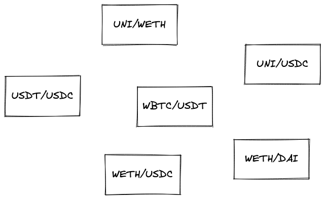
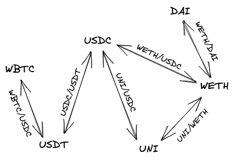

# UniswapV3 技术学习系列（二十七）：前端实现自动路由查找功能

## 系列介绍

在前面的文章中，我们实现了交换路径（Swap Path）功能，让用户可以通过多个池子进行代币交换。现在，我们将把这个强大的功能集成到 Web 应用的用户界面中，让用户能够轻松地在任意两个代币之间进行交换。

本文是 UniswapV3 技术学习系列的第二十七篇，将介绍如何简化 Web 应用的内部结构，以及如何实现自动路由查找功能。

**原文链接**：https://uniswapv3book.com/milestone_4/user-interface.html

在第二十六章中，我们学习了：
- 交换路径的编码和解码机制
- 如何构建多池交换的路径
- SwapRouter 合约如何处理复杂的交换路径

现在，我们要让用户能够在界面上直观地使用这些功能，而不需要关心底层的路径构建细节。

- 🎯 简化 Web 应用的内部结构，统一使用路径进行交换
- 🎯 实现自动路由查找算法，找到任意两个代币之间的最短路径
- 🎯 使用图数据结构和 A* 搜索算法解决路径查找问题
- 🎯 提供用户友好的交换界面

---

## 一、简化 Web 应用结构

### 1.1 统一路径处理

引入交换路径后，我们可以显著简化 Web 应用的内部结构。主要改进包括：

**1. 统一的交换方式**

现在每次交换都使用路径，因为路径不必包含多个池子。即使是简单的单池交换，我们也用路径来表示：

```javascript
// 单池交换也使用路径
const singlePoolPath = [tokenA, tickSpacing, tokenB];

// 多池交换使用更长的路径
const multiPoolPath = [tokenA, tickSpacing1, tokenB, tickSpacing2, tokenC];
```

这种统一的方式让代码更加简洁，不需要为单池和多池交换分别编写逻辑。

**2. 简化方向切换**

更改交换方向变得非常简单，只需反转路径即可：

```javascript
// 原路径：USDC → WETH → DAI
const forwardPath = [USDC, 60, WETH, 60, DAI];

// 反向路径：DAI → WETH → USDC
const reversePath = forwardPath.reverse();
```

**3. 无需存储池子地址**

得益于 CREATE2 和唯一的盐值（salt），我们可以从代币地址和费率档位计算出池子地址，不再需要：
- 手动存储池子地址
- 关注代币在池子中的顺序（token0 vs token1）
- 维护池子地址映射表

```javascript
// 可以直接从路径信息计算池子地址
function getPoolAddress(token0, token1, tickSpacing) {
  // 使用 CREATE2 公式计算
  return computeAddress(factory, token0, token1, tickSpacing);
}
```

### 1.2 架构优势

这种简化带来的好处：

| 维度 | 改进前 | 改进后 |
|------|--------|--------|
| 代码复杂度 | 需要区分单池/多池逻辑 | 统一处理所有交换 |
| 方向切换 | 需要重新构建交换参数 | 简单反转路径数组 |
| 池子管理 | 需要存储和查询地址 | 动态计算，无需存储 |
| 代码可维护性 | 多套逻辑，容易出错 | 单一逻辑，易于维护 |

---

## 二、自动路由：路径查找的挑战

### 2.1 问题背景

然而，要在 Web 应用中真正实现多池交换，还缺少一个关键算法。思考这个问题：

> **"如何找到两个没有直接池子的代币之间的路径？"**

假设用户想要用 WBTC 交换 DAI，但这两个代币之间没有直接的池子。我们需要自动找到一条经过中间代币的路径，比如：

```
WBTC → USDT → USDC → DAI
```

这就是 **自动路由（AutoRouter）** 要解决的问题。

### 2.2 Uniswap 的 AutoRouter

Uniswap 官方实现了一个强大的 AutoRouter 算法，它具有以下特性：

**1. 最短路径查找**

找到两个代币之间跳数最少的路径，减少手续费损耗和滑点。

**2. 智能拆单**

将一笔大额交易拆分成多笔小额交易，分别通过不同的路径执行，以获得更好的平均汇率。

**3. 显著的收益提升**

根据官方数据，相比不拆单的交易，使用拆单策略可以获得高达 **36.84%** 的收益提升！这是一个非常可观的数字。

### 2.3 我们的简化方案

虽然 Uniswap 的 AutoRouter 功能强大，但实现起来相当复杂，涉及：
- 复杂的图论算法
- 实时的流动性深度分析
- 动态的拆单优化策略
- 大量的链下计算

对于学习项目来说，我们将实现一个 **简化版本**，专注于核心的路径查找功能：
- ✅ 找到任意两个代币之间的最短路径
- ✅ 使用经典的图搜索算法
- ❌ 暂不实现智能拆单功能
- ❌ 暂不考虑流动性深度优化

---

## 三、基于图的路径查找

### 3.1 问题建模

假设我们有很多分散的流动性池子：



在这种杂乱的布局中，如何找到两个代币之间的最短路径呢？

### 3.2 图数据结构

最适合这类问题的解决方案是 **图（Graph）** 数据结构。

**什么是图？**

图是一种由 **节点（Node）** 和 **边（Edge）** 组成的数据结构：
- **节点**：代表对象（在我们的场景中是代币）
- **边**：连接节点的链接（在我们的场景中是池子）

**流动性池的图表示**

我们可以将杂乱的池子转换为一个清晰的图：
- 每个 **节点** 代表一个代币
- 每条 **边** 代表连接两个代币的池子

这样，一个池子就是图中的一条边，连接两个代币节点。

**图的可视化**

上面的分散池子可以转换为如下的图结构：



可以看到，图结构让代币之间的连接关系一目了然！

### 3.3 图的优势

图数据结构为我们提供了强大的能力：

| 能力 | 说明 |
|------|------|
| **遍历节点** | 从一个节点移动到另一个节点 |
| **查找路径** | 找到连接两个节点的路径 |
| **最短路径** | 找到跳数最少的路径 |
| **连通性检测** | 判断两个节点是否可达 |

有了图结构，我们就可以使用各种图搜索算法来解决路径查找问题。

---

## 四、A* 搜索算法

### 4.1 算法选择

对于我们的路径查找问题，我们选择使用 **A* 搜索算法（A-Star Search Algorithm）**。

**为什么选择 A*？**

A* 是一种启发式搜索算法，具有以下优点：
- ✅ 能找到最短路径（如果启发函数满足条件）
- ✅ 搜索效率高，比简单的广度优先搜索快
- ✅ 广泛应用于路径规划问题
- ✅ 有成熟的库实现

### 4.2 算法原理

A* 算法的核心思想：

$$
f(n) = g(n) + h(n)
$$

其中：
- `f(n)` 是节点 n 的总评估成本
- `g(n)` 是从起点到节点 n 的实际成本
- `h(n)` 是从节点 n 到终点的估计成本（启发函数）

算法每次选择 `f(n)` 最小的节点进行扩展，直到找到目标节点。

**💡 小贴士**：如果你对 A* 算法的详细工作原理感兴趣，可以参考相关的算法教程。在我们的实现中，我们将使用现成的库，不需要自己实现算法细节。

### 4.3 使用库实现

为了简化开发，我们使用以下 JavaScript 库：

| 库名称 | 用途 |
|--------|------|
| `ngraph.graph` | 构建和管理图数据结构 |
| `ngraph.path` | 实现路径查找算法（包括 A*） |

这些库为我们提供了开箱即用的图操作和路径查找功能。

---

## 五、实现 PathFinder 类

### 5.1 类设计

在 UI 应用中，我们创建一个 `PathFinder` 类，负责：
1. 将代币对列表转换为图结构
2. 使用 A* 算法查找最短路径
3. 将找到的路径转换为我们需要的格式

### 5.2 构造函数实现

```javascript
import createGraph from 'ngraph.graph';
import path from 'ngraph.path';

class PathFinder {
  constructor(pairs) {
    // 创建一个空图
    this.graph = createGraph();

    // 遍历所有代币对，构建图结构
    pairs.forEach((pair) => {
      // 添加两个代币节点
      this.graph.addNode(pair.token0.address);
      this.graph.addNode(pair.token1.address);

      // 添加双向边，存储 tick spacing 信息
      this.graph.addLink(
        pair.token0.address,
        pair.token1.address,
        pair.tickSpacing
      );
      this.graph.addLink(
        pair.token1.address,
        pair.token0.address,
        pair.tickSpacing
      );
    });

    // 初始化 A* 搜索算法
    this.finder = path.aStar(this.graph);
  }

  // ... 其他方法
}
```

**代码解析**：

1. **创建空图**：`createGraph()` 创建一个空的图数据结构

2. **添加节点**：每个代币地址作为一个节点添加到图中

3. **添加边**：
   - 为每个池子添加 **双向边**（因为交换可以双向进行）
   - 边的数据存储 `tickSpacing`（费率档位），后续需要用它构建完整路径

4. **初始化 A***：`path.aStar(this.graph)` 创建 A* 算法实例

### 5.3 路径查找实现

接下来实现 `findPath` 方法，它负责查找并格式化路径：

```javascript
findPath(fromToken, toToken) {
  // 使用 A* 查找路径
  const nodePath = this.finder.find(fromToken, toToken);

  // 转换为我们需要的格式：[token, tickSpacing, token, tickSpacing, ...]
  return nodePath
    .reduce((acc, node, i, orig) => {
      // 如果不是第一个节点，添加边的数据（tickSpacing）
      if (acc.length > 0) {
        const link = this.graph.getLink(orig[i - 1].id, node.id);
        acc.push(link.data);
      }

      // 添加当前节点（代币地址）
      acc.push(node.id);

      return acc;
    }, [])
    .reverse(); // 反转数组得到正确的顺序
}
```

**代码解析**：

1. **查找节点路径**：
   - `this.finder.find(fromToken, toToken)` 返回节点列表（代币地址数组）
   - 但这个列表**只包含代币信息，不包含连接它们的边（池子）信息**

2. **补充边信息**：
   - 由于需要知道每个池子的 `tickSpacing`，我们必须手动提取边的信息
   - 使用 `this.graph.getLink(prevNode, currNode)` 获取相邻节点之间的边
   - 从边的 `data` 属性中提取 `tickSpacing`

3. **构建完整路径**：
   - 路径格式：`[token, tickSpacing, token, tickSpacing, token]`
   - 使用 `reduce` 交替添加节点和边信息

4. **反转数组**：
   - A* 返回的路径是从终点到起点
   - 使用 `reverse()` 得到从起点到终点的路径

### 5.4 使用示例

```javascript
// 初始化 PathFinder
const pairs = [
  { token0: USDC, token1: WETH, tickSpacing: 60 },
  { token0: WETH, token1: DAI, tickSpacing: 60 },
  { token0: USDT, token1: USDC, tickSpacing: 10 },
  // ... 更多池子
];
const pathFinder = new PathFinder(pairs);

// 查找路径
const path = pathFinder.findPath(USDC.address, DAI.address);
// 结果：[USDC, 60, WETH, 60, DAI]
```

### 5.5 集成到用户界面

现在，每当用户更改输入或输出代币时，我们可以自动查找路径：

```javascript
// 用户选择代币时触发
function onTokenChange(inputToken, outputToken) {
  // 自动查找最短路径
  const path = pathFinder.findPath(inputToken.address, outputToken.address);

  if (path.length > 0) {
    // 找到路径，显示预估信息
    updateSwapPreview(path);
  } else {
    // 没有可用路径
    showError('这两个代币之间没有可用的交换路径');
  }
}
```

---

## 六、完整的实现示例

### 6.1 PathFinder 完整代码

```javascript
import createGraph from 'ngraph.graph';
import path from 'ngraph.path';

/**
 * 路径查找器：在代币图中查找最短交换路径
 */
class PathFinder {
  /**
   * 构造函数
   * @param {Array} pairs - 代币对数组
   * @param {Object} pairs[].token0 - 代币0
   * @param {Object} pairs[].token1 - 代币1
   * @param {Number} pairs[].tickSpacing - Tick 间距
   */
  constructor(pairs) {
    // 创建图数据结构
    this.graph = createGraph();

    // 构建代币图
    pairs.forEach((pair) => {
      // 添加代币节点
      this.graph.addNode(pair.token0.address);
      this.graph.addNode(pair.token1.address);

      // 添加双向边（池子）
      this.graph.addLink(
        pair.token0.address,
        pair.token1.address,
        pair.tickSpacing
      );
      this.graph.addLink(
        pair.token1.address,
        pair.token0.address,
        pair.tickSpacing
      );
    });

    // 初始化 A* 搜索
    this.finder = path.aStar(this.graph);
  }

  /**
   * 查找两个代币之间的最短路径
   * @param {String} fromToken - 起始代币地址
   * @param {String} toToken - 目标代币地址
   * @returns {Array} 路径数组 [token, tickSpacing, token, ...]
   */
  findPath(fromToken, toToken) {
    // 使用 A* 查找节点路径
    const nodePath = this.finder.find(fromToken, toToken);

    // 转换为完整路径格式
    return nodePath
      .reduce((acc, node, i, orig) => {
        // 添加边信息（tickSpacing）
        if (acc.length > 0) {
          const link = this.graph.getLink(orig[i - 1].id, node.id);
          acc.push(link.data);
        }

        // 添加节点信息（代币地址）
        acc.push(node.id);

        return acc;
      }, [])
      .reverse();
  }

  /**
   * 检查两个代币之间是否存在路径
   * @param {String} fromToken - 起始代币地址
   * @param {String} toToken - 目标代币地址
   * @returns {Boolean} 是否存在路径
   */
  hasPath(fromToken, toToken) {
    const path = this.findPath(fromToken, toToken);
    return path && path.length > 0;
  }
}

export default PathFinder;
```

### 6.2 使用示例

```javascript
import PathFinder from './PathFinder';

// 准备代币对数据
const tokenPairs = [
  {
    token0: { address: '0xUSDC', symbol: 'USDC' },
    token1: { address: '0xWETH', symbol: 'WETH' },
    tickSpacing: 60
  },
  {
    token0: { address: '0xWETH', symbol: 'WETH' },
    token1: { address: '0xDAI', symbol: 'DAI' },
    tickSpacing: 60
  },
  {
    token0: { address: '0xUSDT', symbol: 'USDT' },
    token1: { address: '0xUSDC', symbol: 'USDC' },
    tickSpacing: 10
  },
  // ... 更多池子
];

// 创建路径查找器
const pathFinder = new PathFinder(tokenPairs);

// 查找 USDT → DAI 的路径
const path = pathFinder.findPath('0xUSDT', '0xDAI');
console.log(path);
// 输出：['0xUSDT', 10, '0xUSDC', 60, '0xWETH', 60, '0xDAI']

// 检查是否存在路径
if (pathFinder.hasPath('0xWBTC', '0xDAI')) {
  console.log('找到交换路径！');
}
```

---

## 七、进阶优化方向

虽然我们的实现已经能够满足基本需求，但还有很多优化空间：

### 7.1 流动性权重

当前实现只考虑最短路径（跳数最少），但实际上还应该考虑：
- 每个池子的流动性深度
- 交易额相对于流动性的比例
- 预期滑点大小

```javascript
// 可以在边上存储流动性信息
this.graph.addLink(
  token0,
  token1,
  {
    tickSpacing: 60,
    liquidity: 1000000, // 添加流动性数据
    volume24h: 500000   // 添加24小时交易量
  }
);
```

### 7.2 智能拆单

对于大额交易，可以拆分成多条路径：

```javascript
// 伪代码：拆单优化
function findOptimalSplit(amount, fromToken, toToken) {
  const paths = findMultiplePaths(fromToken, toToken, 3); // 找3条路径

  // 动态规划：找到最优拆分比例
  const split = optimizeSplit(amount, paths);

  return split; // [{path: path1, amount: 0.6}, {path: path2, amount: 0.4}]
}
```

### 7.3 实时价格更新

定期更新池子的价格信息，提供更准确的预估：

```javascript
// 定期更新图的权重
async function updateGraphWeights() {
  const prices = await fetchPoolPrices();

  prices.forEach(({ pool, price, liquidity }) => {
    updateEdgeWeight(pool, price, liquidity);
  });
}

// 每30秒更新一次
setInterval(updateGraphWeights, 30000);
```

### 7.4 缓存优化

缓存常用路径，减少重复计算：

```javascript
class PathFinder {
  constructor(pairs) {
    // ... 初始化代码
    this.pathCache = new Map(); // 添加缓存
  }

  findPath(fromToken, toToken) {
    const cacheKey = `${fromToken}-${toToken}`;

    // 检查缓存
    if (this.pathCache.has(cacheKey)) {
      return this.pathCache.get(cacheKey);
    }

    // 计算路径
    const path = this._computePath(fromToken, toToken);

    // 存入缓存
    this.pathCache.set(cacheKey, path);

    return path;
  }
}
```

---

## 八、总结与展望

### 8.1 本章核心要点

✅ **架构简化**：
- 统一使用路径进行交换，简化代码逻辑
- 方向切换只需反转路径数组
- 利用 CREATE2 动态计算池子地址

✅ **自动路由**：
- 使用图数据结构建模代币和池子的关系
- 使用 A* 搜索算法查找最短路径
- 实现 PathFinder 类，自动查找交换路径

✅ **用户体验**：
- 用户无需关心底层路径构建细节
- 自动找到最佳交换路径
- 支持任意代币对之间的交换

### 8.2 实践要点

💡 **重要提示**：
1. 图的构建需要遍历所有可用的池子
2. A* 算法返回的路径需要转换格式
3. 需要处理没有可用路径的情况
4. 考虑添加路径缓存提升性能

⚠️ **注意事项**：
- 图的规模会随着池子数量增长而变大
- 需要定期更新池子信息
- 大额交易可能需要更复杂的优化策略
- 生产环境建议使用更全面的 AutoRouter

### 8.3 下一步学习

在下一章中，我们将：
- 完善用户界面的其他功能
- 添加交易预览和确认流程
- 实现滑点保护机制
- 优化用户交互体验

通过本章的学习，我们成功地将多池交换功能集成到了用户界面，让用户能够轻松地在任意代币之间进行交换。虽然我们的实现相对简单，但已经展示了自动路由的核心思想和实现方法。🎉

---

## 项目仓库

本项目 GitHub 仓库：
https://github.com/RyanWeb31110/uniswapv3_tech

系列项目：
- [UniswapV1 技术学习](https://github.com/RyanWeb31110/uniswapv1_tech)
- [UniswapV2 技术学习](https://github.com/RyanWeb31110/uniswapv2_tech)
- [UniswapV3 技术学习](https://github.com/RyanWeb31110/uniswapv3_tech)

欢迎 Star 和 Fork，一起学习交流！
