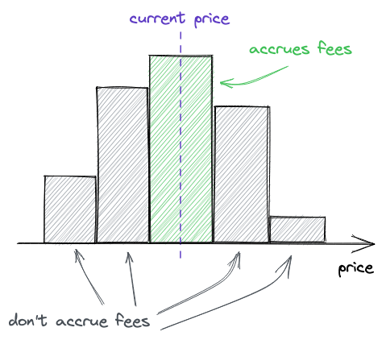
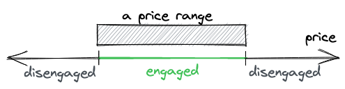
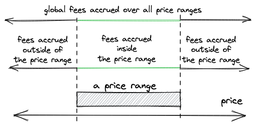

# UniswapV3 技术学习系列（二十九）：交易手续费

## 系列介绍

欢迎来到 UniswapV3 技术学习系列的第二十九章！在前面的章节中，我们已经构建了 UniswapV3 的核心功能：集中流动性、价格区间管理、跨 Tick 交换等。现在，是时候添加两个重要的辅助功能了——交易手续费和价格预言机。

在之前的章节中，我们实现了：
- 完整的流动性管理机制
- 跨多个价格区间的交换逻辑
- 工厂合约和池子创建

然而，我们的实现还缺少一个关键的激励机制——交易手续费。没有手续费，流动性提供者就没有动力提供流动性，整个系统也就无法运转。

原文链接：[Swap Fees - Uniswap V3 Development Book](https://uniswapv3book.com/milestone_5/swap-fees.html)

## 一、为什么需要交易手续费？

### 1.1 手续费的核心作用

想象一下，如果你是流动性提供者，你把资金锁在池子里，承担着无常损失的风险，却没有任何收益——你还会提供流动性吗？显然不会。这就是为什么交易手续费如此重要：

- **激励机制** 🎯：手续费是流动性提供者的主要收入来源
- **风险补偿** 💰：补偿流动性提供者承担的无常损失风险
- **系统运转** ⚙️：没有流动性就没有交易，没有手续费就没有流动性

### 1.2 手续费 vs 价格预言机

虽然这两个功能在同一个里程碑中实现，但它们的重要性却大不相同：

| 功能 | 重要性 | 作用 | 对系统的影响 |
|-----|--------|------|------------|
| 交易手续费 | **核心功能** | 激励流动性提供 | 直接影响系统生存 |
| 价格预言机 | 辅助功能 | 提供价格数据服务 | 增值服务，不影响核心交易 |

## 二、交易手续费的运作机制

### 2.1 手续费的收取与分配流程

让我们通过一个生动的比喻来理解手续费机制。想象一个收费高速公路：

1. **收费站（交易时收费）**：每辆车（交易者）经过时支付过路费
2. **总收入池（全局费用累积）**：所有过路费汇总到一个大池子
3. **股东分红（LP 分配）**：按照各股东（LP）的持股比例分配收益

在 UniswapV3 中，这个过程是这样的：

```solidity
// 交易者支付手续费 -> 池子累积费用 -> LP按比例分享
交易输入: 1000 USDC
手续费率: 0.3% (3000/1000000)
实际交换: 997 USDC
累积费用: 3 USDC
```

### 2.2 价格区间与手续费累积

这是 UniswapV3 最精妙的设计之一。只有**被激活的价格区间**才能赚取手续费！



如上图所示：
- **绿色区间**：当前价格所在的区间，正在累积手续费 ✅
- **灰色区间**：价格不在这些区间，无法获得手续费 ❌

这就像是开店做生意：
- 在繁华地段（活跃价格区间）的店铺生意兴隆，赚取利润
- 在偏僻地段（非活跃价格区间）的店铺门可罗雀，没有收入

### 2.3 价格穿过与离开区间

当价格移动时，会穿过不同的价格区间边界（Tick），决定着该区间是否能赚取手续费：



理解价格运动的关键在于区分 **"穿过边界进入"** 和 **"穿过边界离开"**：

**价格进入区间（开始赚取手续费）** ✅
- 价格上涨：从区间下方穿过下界，进入区间
- 价格下跌：从区间上方穿过上界，进入区间

**价格离开区间（停止赚取手续费）** ❌
- 价格上涨：穿过上界继续上涨，离开区间
- 价格下跌：穿过下界继续下跌，离开区间

## 三、手续费的计算原理

### 3.1 全局费用追踪机制

为了简化费用核算，Uniswap V3 会追踪**每单位流动性产生的全局费用** 。

价格区间费用则基于全局费用计算：超出价格区间的费用将从全局费用中扣除。

超出价格区间的费用会在价格突破一个最小价格变动单位（tick）时被追踪（价格突破最小价格变动单位是指swap操作导致价格变动；费用在swap操作期间收取）。

通过这种方式，我们无需更新每个仓位在每次互换操作中累积的费用——这可以节省大量 gas 费用，并降低与资金池交互的成本。

UniswapV3 的费用追踪机制是整个系统的精华之一。让我深入解释这个巧妙的设计：

#### 为什么不直接追踪每个仓位？

想象一个池子里有 1000 个流动性仓位。如果每次交换都要更新所有仓位的费用，那将是灾难性的 Gas 消耗！UniswapV3 采用了一个聪明的解决方案：

```solidity
// ❌ 传统方法：直接追踪每个仓位的费用
positions[alice].fees += 100 USDC  // 需要更新
positions[bob].fees += 200 USDC    // 需要更新
positions[charlie].fees += 150 USDC // 需要更新
// ... 可能有上千个仓位都要更新！

// ✅ UniswapV3 方法：只追踪全局的单位费用
feeGrowthGlobal = totalFees / totalLiquidity  // 只更新一个变量！
// 各仓位的费用 = feeGrowthGlobal × 仓位流动性（延迟计算）
```

#### 费用追踪的核心数据结构

UniswapV3 通过以下几层数据结构实现费用追踪：

1. **全局层面**：
   - `feeGrowthGlobal0X128`：追踪 token0 的全局累积费用
     - 记录从池子创建以来，每单位流动性累积的 token0 手续费总和
     - 每次有人用 token0 作为输入进行交换时增加
     - 值永远只增不减，是一个累加器
     - 使用 Q128 定点数格式（乘以 2^128）提高精度

   - `feeGrowthGlobal1X128`：追踪 token1 的全局累积费用
     - 记录从池子创建以来，每单位流动性累积的 token1 手续费总和
     - 每次有人用 token1 作为输入进行交换时增加
     - 值永远只增不减，是一个累加器

2. **Tick 层面**：
   - `feeGrowthOutside0X128`：记录该 Tick "外部"的 token0 累积费用
     - 当价格在 Tick 下方时，"外部"指 Tick 上方的所有区间
     - 当价格在 Tick 上方时，"外部"指 Tick 下方的所有区间
     - 每次价格穿过该 Tick 时通过翻转操作更新

   - `feeGrowthOutside1X128`：记录该 Tick "外部"的 token1 累积费用
     - 与 `feeGrowthOutside0X128` 逻辑相同，但追踪的是 token1
     - 价格穿过时同步更新
     - 用于计算特定区间内的费用

3. **仓位层面**：
   - `feeGrowthInside0LastX128`：仓位上次更新时区间内 token0 费用的快照
     - 在 mint/burn 时记录当时的区间内费用值
     - 作为基准点，用于计算从上次更新到现在新增的费用
     - 每个仓位独立维护这个值

   - `feeGrowthInside1LastX128`：仓位上次更新时区间内 token1 费用的快照
     - 与 `feeGrowthInside0LastX128` 逻辑相同，但追踪的是 token1
     - 用于计算该仓位应得的 token1 手续费
     - 通过 (当前值 - 快照值) × 流动性 = 应得费用

#### 费用计算的完整流程

让我们通过一个具体例子理解整个流程：

**步骤 1：用户进行交换，产生手续费**
```solidity
// 用户用 1000 USDC 交换 ETH
输入金额: 1000 USDC
手续费率: 0.3%
实际交换: 997 USDC
收取费用: 3 USDC
```

**步骤 2：更新全局费用累积器**
```solidity
// 假设当前池子总流动性是 10000
feeGrowthGlobal0X128 += (3 USDC × 2^128) / 10000
// 这样每单位流动性累积了 0.0003 USDC 的费用
```

**步骤 3：价格穿过 Tick 时更新 Tick 费用**
```solidity
// 当价格穿过某个 Tick
tick.feeGrowthOutside0X128 =
    feeGrowthGlobal0X128 - tick.feeGrowthOutside0X128
// 这个翻转操作实现了内外费用的自动切换
```

**步骤 4：计算仓位应得费用（延迟到 burn/collect）**
```solidity
// 计算区间内累积的费用
feeGrowthInside = feeGrowthGlobal - feeGrowthBelow - feeGrowthAbove

// 计算仓位应得的代币数量
tokensOwed = (feeGrowthInside - position.feeGrowthInsideLast) × position.liquidity
```

#### 为什么这种设计如此高效？

这种设计的精妙之处在于**延迟计算**和**批量处理**：

1. **交换时的操作最小化**
   - 只更新一个全局变量
   - 只在穿过 Tick 时更新 Tick 数据
   - 不触碰任何仓位数据

2. **费用结算的延迟执行**
   - 仓位费用只在需要时（burn/collect）计算
   - 大部分不活跃的仓位永远不会被更新
   - 极大降低了 Gas 消耗

3. **数学上的等价性**
   - 虽然延迟计算，但结果完全准确
   - 每个 LP 获得的费用与实时计算完全一致

### 3.2 价格区间内外的费用计算

这是整个机制中最复杂的部分。我们需要计算某个价格区间内累积的费用：



计算公式很简单，但理解起来需要一些思考：

$$
f_r = f_g - f_b(i_l) - f_a(i_u)
$$

其中：
- `f_r` 是价格区间内累积的费用
- `f_g` 是全局累积的总费用
- `f_b(i_l)` 是下界 Tick 以下累积的费用
- `f_a(i_u)` 是上界 Tick 以上累积的费用

这就像计算某个年龄段的人口：
- 总人口 - 18岁以下人口 - 65岁以上人口 = 18-65岁人口

### 3.3 动态费用更新策略

费用的更新时机很关键，我们需要考虑两种情况：

**情况一：当前价格在区间内** 📍
```solidity
// 直接使用 Tick 记录的费用
feeBelow = lowerTick.feeGrowthOutside
feeAbove = upperTick.feeGrowthOutside
```

**情况二：当前价格在区间外** 📍
```solidity
// 需要更新费用（但不写入存储）
if (currentPrice < lowerTick) {
    // 价格在区间下方，更新下界费用
    feeBelow = globalFee - lowerTick.feeGrowthOutside
}
if (currentPrice > upperTick) {
    // 价格在区间上方，更新上界费用
    feeAbove = globalFee - upperTick.feeGrowthOutside
}
```

## 四、代码实现详解

### 4.1 添加费用相关状态变量

首先，我们需要在池子中添加费用追踪变量：

```solidity
// src/UniswapV3Pool.sol
contract UniswapV3Pool {
    // 费用率（以百万分之一为单位）
    // 500 = 0.05%, 3000 = 0.3%, 10000 = 1%
    uint24 public immutable fee;

    // 全局费用累积器
    // 使用 Q128 定点数格式，提高精度
    uint256 public feeGrowthGlobal0X128;  // token0 的累积费用
    uint256 public feeGrowthGlobal1X128;  // token1 的累积费用
}
```

### 4.2 在交换中收取手续费

修改 `SwapMath.computeSwapStep` 函数，扣除手续费：

```solidity
// src/lib/SwapMath.sol
function computeSwapStep(...) {
    // 从输入金额中扣除手续费
    uint256 amountRemainingLessFee = PRBMath.mulDiv(
        amountRemaining,
        1e6 - fee,  // 如果费率是 3000，则实际使用 997000/1000000
        1e6
    );

    // 计算本步骤收取的费用
    bool max = sqrtPriceNextX96 == sqrtPriceTargetX96;
    if (!max) {
        // 当前区间流动性充足
        feeAmount = amountRemaining - amountIn;
    } else {
        // 当前区间流动性不足，只对实际交换部分收费
        feeAmount = Math.mulDivRoundingUp(amountIn, fee, 1e6 - fee);
    }
}
```

### 4.3 更新 Tick 的费用追踪器

#### 翻转操作的实现

当价格穿过 Tick 时，需要更新费用记录。UniswapV3 使用了一个极其巧妙的翻转机制：

```solidity
// src/lib/Tick.sol
function cross(
    mapping(int24 => Tick.Info) storage self,
    int24 tick,
    uint256 feeGrowthGlobal0X128,
    uint256 feeGrowthGlobal1X128
) internal returns (int128 liquidityDelta) {
    Tick.Info storage info = self[tick];

    // 翻转费用记录（内外互换）
    info.feeGrowthOutside0X128 =
        feeGrowthGlobal0X128 - info.feeGrowthOutside0X128;
    info.feeGrowthOutside1X128 =
        feeGrowthGlobal1X128 - info.feeGrowthOutside1X128;

    liquidityDelta = info.liquidityNet;
}
```

#### 翻转机制的数学原理

这个翻转操作是 UniswapV3 最精妙的设计之一！它利用了一个简单的数学恒等式：

```
全局费用 = 内部费用 + 外部费用

因此：
内部费用 = 全局费用 - 外部费用
外部费用 = 全局费用 - 内部费用
```

关键在于理解 Tick 的"外部"定义是**动态变化**的：

```
当价格在 Tick 左侧：
    ← ← ← 价格 ← ← ← [Tick] ← ← ← ← ← ← ← ←
    |<--- 内部 --->||<------ 外部 ------>|

当价格在 Tick 右侧：
    → → → → → → → → [Tick] → → → 价格 → → →
    |<--- 外部 --->||<------ 内部 ------>|
```

#### 具体例子演示翻转过程

让我们通过一个实际例子理解这个机制：

**初始状态（价格 $2500，在 Tick $3000 左侧）**
```solidity
全局累积费用: 100
Tick.feeGrowthOutside = 70  // Tick 右侧（外部）的费用

费用分布：
- 左侧费用（内部）= 100 - 70 = 30
- 右侧费用（外部）= 70
```

**第一次穿过（价格上涨到 $3500）**
```solidity
全局累积费用: 150  // 期间累积了 50 费用

// 执行翻转
Tick.feeGrowthOutside = 150 - 70 = 80

翻转后的费用分布：
- 左侧费用（外部）= 80  // 左侧变成了"外部"
- 右侧费用（内部）= 150 - 80 = 70
```

**第二次穿过（价格下跌到 $2800）**
```solidity
全局累积费用: 200  // 又累积了 50 费用

// 再次翻转
Tick.feeGrowthOutside = 200 - 80 = 120

翻转后的费用分布：
- 左侧费用（内部）= 200 - 120 = 80
- 右侧费用（外部）= 120  // 右侧又变回"外部"
```

#### 为什么这个设计如此巧妙？

1. **无需额外存储**：不需要记录"上次穿过方向"或"哪边是外部"，一个值搞定一切

2. **自动追踪增量**：每次翻转自动记录了自上次穿过以来的费用增量
   
   ```solidity
   第一次增量 = 80 - 70 = 10  // 左侧新增的费用
   第二次增量 = 120 - 80 = 40  // 右侧新增的费用
   ```
   
3. **计算效率极高**：无论从哪个方向穿过，都是同一个简单公式
   
   ```solidity
   newOutside = globalFee - currentOutside
   ```
   
4. **数学上的优雅**：利用减法的交换律，实现了内外的自动切换

### 4.4 计算仓位累积的费用

这是最复杂的部分，需要仔细处理各种边界情况：

```solidity
// src/lib/Tick.sol
function getFeeGrowthInside(
    mapping(int24 => Tick.Info) storage self,
    int24 lowerTick_,
    int24 upperTick_,
    int24 currentTick,
    uint256 feeGrowthGlobal0X128,
    uint256 feeGrowthGlobal1X128
) internal view returns (
    uint256 feeGrowthInside0X128,
    uint256 feeGrowthInside1X128
) {
    Tick.Info storage lowerTick = self[lowerTick_];
    Tick.Info storage upperTick = self[upperTick_];

    // 计算下界以下的费用
    uint256 feeGrowthBelow0X128;
    uint256 feeGrowthBelow1X128;
    if (currentTick >= lowerTick_) {
        // 价格在下界之上，直接使用记录值
        feeGrowthBelow0X128 = lowerTick.feeGrowthOutside0X128;
        feeGrowthBelow1X128 = lowerTick.feeGrowthOutside1X128;
    } else {
        // 价格在下界之下，需要计算更新值
        feeGrowthBelow0X128 =
            feeGrowthGlobal0X128 - lowerTick.feeGrowthOutside0X128;
        feeGrowthBelow1X128 =
            feeGrowthGlobal1X128 - lowerTick.feeGrowthOutside1X128;
    }

    // 计算上界以上的费用（逻辑类似）
    uint256 feeGrowthAbove0X128;
    uint256 feeGrowthAbove1X128;
    if (currentTick < upperTick_) {
        feeGrowthAbove0X128 = upperTick.feeGrowthOutside0X128;
        feeGrowthAbove1X128 = upperTick.feeGrowthOutside1X128;
    } else {
        feeGrowthAbove0X128 =
            feeGrowthGlobal0X128 - upperTick.feeGrowthOutside0X128;
        feeGrowthAbove1X128 =
            feeGrowthGlobal1X128 - upperTick.feeGrowthOutside1X128;
    }

    // 区间内费用 = 总费用 - 下界以下费用 - 上界以上费用
    feeGrowthInside0X128 =
        feeGrowthGlobal0X128 - feeGrowthBelow0X128 - feeGrowthAbove0X128;
    feeGrowthInside1X128 =
        feeGrowthGlobal1X128 - feeGrowthBelow1X128 - feeGrowthAbove1X128;
}
```

## 五、移除流动性与费用提取

### 5.1 销毁流动性（burn）

销毁流动性的本质就是"负数的铸造"：

```solidity
// src/UniswapV3Pool.sol
function burn(
    int24 lowerTick,
    int24 upperTick,
    uint128 amount
) public returns (uint256 amount0, uint256 amount1) {
    // 使用负数的流动性增量
    (Position.Info storage position, int256 amount0Int, int256 amount1Int) =
        _modifyPosition(
            ModifyPositionParams({
                owner: msg.sender,
                lowerTick: lowerTick,
                upperTick: upperTick,
                liquidityDelta: -(int128(amount))  // 注意这里是负数！
            })
        );

    // 将返还的代币数量（包括本金+手续费）记录到仓位
    amount0 = uint256(-amount0Int);
    amount1 = uint256(-amount1Int);

    if (amount0 > 0 || amount1 > 0) {
        position.tokensOwed0 += uint128(amount0);
        position.tokensOwed1 += uint128(amount1);
    }

    emit Burn(msg.sender, lowerTick, upperTick, amount, amount0, amount1);
}
```

### 5.2 提取代币（collect）

这个函数负责实际的代币转账：

```solidity
// src/UniswapV3Pool.sol
function collect(
    address recipient,
    int24 lowerTick,
    int24 upperTick,
    uint128 amount0Requested,
    uint128 amount1Requested
) public returns (uint128 amount0, uint128 amount1) {
    Position.Info storage position = positions.get(
        msg.sender,
        lowerTick,
        upperTick
    );

    // 确保不能提取超过欠款的金额
    amount0 = amount0Requested > position.tokensOwed0
        ? position.tokensOwed0
        : amount0Requested;
    amount1 = amount1Requested > position.tokensOwed1
        ? position.tokensOwed1
        : amount1Requested;

    // 更新欠款并转账
    if (amount0 > 0) {
        position.tokensOwed0 -= amount0;
        IERC20(token0).transfer(recipient, amount0);
    }

    if (amount1 > 0) {
        position.tokensOwed1 -= amount1;
        IERC20(token1).transfer(recipient, amount1);
    }

    emit Collect(msg.sender, recipient, lowerTick, upperTick, amount0, amount1);
}
```

### 5.3 仅提取手续费的技巧

有一个巧妙的技巧可以只提取手续费而不移除流动性：

```solidity
// 销毁 0 流动性，这会更新仓位的费用但不改变流动性
pool.burn(lowerTick, upperTick, 0);

// 然后提取累积的手续费
pool.collect(recipient, lowerTick, upperTick, type(uint128).max, type(uint128).max);
```

## 六、实践要点总结

### 6.1 Gas 优化策略

UniswapV3 的费用机制设计充分考虑了 Gas 优化：

1. **延迟计算** ⏰：不在每次交换时更新所有仓位
2. **批量处理** 📦：只在需要时（burn/collect）计算具体费用
3. **存储优化** 💾：使用紧凑的数据结构存储费用信息

### 6.2 精度处理

费用计算涉及大量的除法运算，需要注意精度：

- 使用 Q128 定点数格式（2<sup>128</sup>）提高精度
- 先乘后除，避免精度损失
- 使用 `mulDiv` 函数进行安全的乘除运算

### 6.3 常见误区

❌ **误区一**：认为所有流动性都能获得手续费
✅ **正确理解**：只有当前价格区间内的流动性才能赚取手续费

❌ **误区二**：手续费立即分配给 LP
✅ **正确理解**：手续费在池子中累积，只在 burn/collect 时结算

❌ **误区三**：手续费率可以随意设置
✅ **正确理解**：手续费率在池子创建时固定，通常只有几个标准选项（0.05%、0.3%、1%）

## 七、测试验证

让我们编写测试来验证手续费机制：

```solidity
// test/UniswapV3Pool.t.sol
contract UniswapV3PoolTest is Test {
    UniswapV3Pool pool;

    /// @notice 测试手续费累积
    function test_FeeAccumulation() public {
        // 1. 添加流动性
        pool.mint(alice, -600, 600, 10000);

        // 2. 执行交换（会产生手续费）
        uint256 swapAmount = 1000e18;
        pool.swap(bob, true, swapAmount, ...);

        // 3. 验证全局费用累积
        assertGt(pool.feeGrowthGlobal0X128(), 0, "Should accumulate fees");

        // 4. 销毁 0 流动性以更新费用
        pool.burn(-600, 600, 0);

        // 5. 验证 LP 可以提取手续费
        (uint256 fees0, uint256 fees1) = pool.collect(alice, -600, 600, ...);
        assertGt(fees0, 0, "Should collect fees");
    }

    /// @notice 测试只有活跃区间累积费用
    function test_OnlyActiveRangeAccruesFees() public {
        // 1. 在不同区间添加流动性
        pool.mint(alice, -1200, -600, 10000);  // 区间 A
        pool.mint(bob, -600, 600, 10000);      // 区间 B（包含当前价格）
        pool.mint(charlie, 600, 1200, 10000);  // 区间 C

        // 2. 执行交换（当前价格在区间 B）
        pool.swap(...);

        // 3. 检查各区间的费用
        // 只有区间 B 应该有费用
        (uint256 feesA0, ) = calculateFeesForPosition(alice, -1200, -600);
        (uint256 feesB0, ) = calculateFeesForPosition(bob, -600, 600);
        (uint256 feesC0, ) = calculateFeesForPosition(charlie, 600, 1200);

        assertEq(feesA0, 0, "Inactive range A should have no fees");
        assertGt(feesB0, 0, "Active range B should have fees");
        assertEq(feesC0, 0, "Inactive range C should have no fees");
    }
}
```

## 八、下一步学习计划

恭喜你！我们已经完成了 UniswapV3 交易手续费机制的实现。这个机制的精妙之处在于：

1. **公平分配**：按流动性比例分配手续费
2. **激励集中**：鼓励 LP 将流动性集中在活跃价格区间
3. **Gas 高效**：延迟计算，批量处理

在下一章中，我们将实现**价格预言机**功能，让 UniswapV3 不仅能够进行交易，还能为其他 DeFi 协议提供可靠的价格数据源。

## 项目仓库

本项目 GitHub 仓库：
https://github.com/RyanWeb31110/uniswapv3_tech

系列项目：
- [UniswapV1 技术学习](https://github.com/RyanWeb31110/uniswapv1_tech)
- [UniswapV2 技术学习](https://github.com/RyanWeb31110/uniswapv2_tech)
- [UniswapV3 技术学习](https://github.com/RyanWeb31110/uniswapv3_tech)

欢迎 Star 和 Fork，一起学习交流！