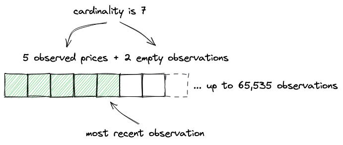
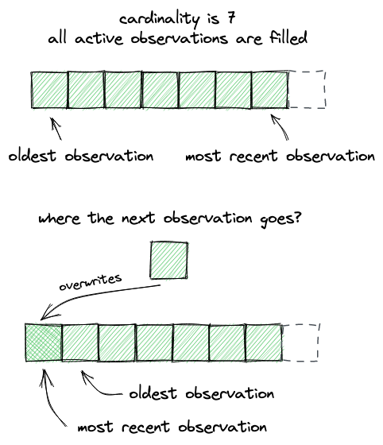
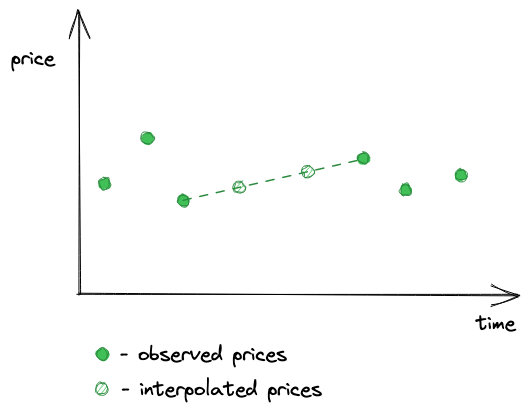
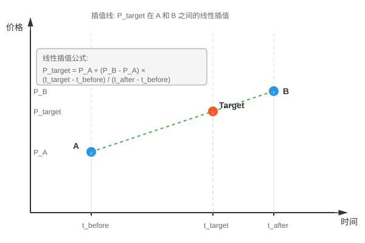

# UniswapV3 技术学习系列（三十二）：价格预言机

## 系列介绍

欢迎来到 UniswapV3 技术学习系列的第三十二章！在前面的章节中，我们已经完成了 UniswapV3 的核心交易功能和费用机制。现在，我们将添加最后一个重要特性——**价格预言机（Price Oracle）**。

在之前的章节中，我们实现了：
- 完整的交易手续费机制，激励 LP 提供流动性
- 闪电贷手续费机制，让 LP 从借贷中获益
- 协议费用的预留设计，为未来发展留下空间

虽然价格预言机不是 DEX 的必备功能（有些 DEX 根本没有实现），但它却是 Uniswap 的一项重要特性，值得我们深入学习。


## 一、什么是价格预言机？

### 1.1 区块链的"信息孤岛"问题

区块链就像一座孤岛 🏝️：

- **封闭的生态系统**：无法直接查询外部数据
- **无法联网**：不能通过 API 从中心化交易所获取价格
- **信任难题**：即使能获取外部数据，如何确保其真实性？

想象一下，如果你在智能合约中需要知道 ETH 的当前价格，你会面临这些挑战：
- 📡 数据来源：从哪里获取价格？
- 🔒 数据可信：如何确保价格未被篡改？
- ⚡ 实时性：如何保证数据的时效性？
- 🛡️ 安全性：如何防止 DNS 劫持、API 服务器宕机等问题？

### 1.2 两种价格预言机方案

**方案一：外部数据源（以 Chainlink 为代表）**

Chainlink 是最早成功解决价格预言机问题的方案之一：

```
中心化交易所 → API → 去中心化预言机网络 → 链上合约
   ↓         ↓           ↓              ↓
Binance     HTTP      多个独立节点     Chainlink
Coinbase    请求       获取并聚合        合约存储
Kraken                 计算平均价       任何人可读
```

**Chainlink 的工作原理**：
1. 多个独立的预言机节点从不同交易所获取价格
2. 对获取的价格进行加权平均
3. 以防篡改的方式将价格写入链上合约
4. 任何人都能读取，但只有预言机能写入

**优势** ✅：
- 数据来源多样化，不依赖单一交易所
- 去中心化网络，提高可靠性
- 覆盖广泛的资产类型

**劣势** ❌：
- 需要信任外部数据提供者
- 需要支付预言机服务费用
- 仍存在数据传输的潜在风险

**方案二：原生链上价格（以 Uniswap 为代表）**

既然我们已经有了链上的去中心化交易所，**为什么还要从外部获取价格呢？** 🤔

这就是 Uniswap 价格预言机的核心思想：

```
Uniswap 池子价格 ← 套利者 ← 中心化交易所价格
   ↓                ↓              ↓
 链上原生          价格差驱动      外部基准
 无需信任          自动校准        市场真实
```

**为什么 Uniswap 价格可信？**

得益于 **套利机制** 和 **高流动性**：
- 如果 Uniswap 价格高于 CEX，套利者会在 Uniswap 卖出
- 如果 Uniswap 价格低于 CEX，套利者会在 Uniswap 买入
- 套利行为会自动将价格拉回到市场真实价格附近

**优势** ✅：
- 完全去中心化，无需信任第三方
- 无需额外费用
- 实时反映市场供需
- 数据完全在链上，可验证

**劣势** ❌：
- 仅限于 Uniswap 支持的交易对
- 低流动性池子可能价格偏差较大
- 需要防范价格操纵攻击

### 1.3 价格预言机的应用场景

价格预言机在 DeFi 生态中扮演着关键角色：

| 应用场景 | 使用示例 | 为什么需要价格 |
|---------|---------|--------------|
| **借贷协议** | Aave、Compound | 计算抵押率，触发清算 |
| **稳定币** | MakerDAO (DAI) | 维持锚定，管理超额抵押 |
| **衍生品** | dYdX、GMX | 结算合约，计算盈亏 |
| **保险** | Nexus Mutual | 评估风险，计算保费 |
| **合成资产** | Synthetix | 铸造和赎回资产 |

## 二、Uniswap 价格预言机的工作原理

### 2.1 累计价格机制

Uniswap 采用了一种巧妙的设计：**不直接存储每个时刻的价格，而是存储累计价格**。

**什么是累计价格？**

累计价格是历史上每一秒价格的总和：

$$
a_i = \sum_{i=1}^{t} p_i
$$

其中：
- `a_i` 是时刻 i 的累计价格
- `p_i` 是时刻 i 的瞬时价格
- `t` 是从池子创建到现在的总秒数

**为什么用累计价格？**

通过累计价格，我们可以非常方便地计算任意两个时间点之间的**时间加权平均价格（TWAP）**：

$$
p_{t_1,t_2} = \frac{a_{t_2} - a_{t_1}}{t_2 - t_1}
$$

其中：
- `p_{t_1,t_2}` 是时间段 `[t_1, t_2]` 的平均价格
- `a_{t_1}` 和 `a_{t_2}` 分别是两个时刻的累计价格
- `t_2 - t_1` 是时间间隔（秒）

**例子**：假设我们想知道过去 1 小时的平均价格
```
当前时间 t_2 = 10000 秒, 累计价格 = 5000000
1小时前 t_1 = 6400 秒, 累计价格 = 3200000

平均价格 = (5000000 - 3200000) / (10000 - 6400)
        = 1800000 / 3600
        = 500
```

### 2.2 V2 vs V3：价格存储方式的进化

**Uniswap V2 的方案**

V2 直接存储价格的累计值：

$$
a_i = \sum_{i=1}^{t} p_i
$$

**Uniswap V3 的改进**

V3 存储的是 **Tick 的累计值**（Tick 是价格的对数表示）：

$$
a_i = \sum_{i=1}^{t} \log_{1.0001} P(i)
$$

这样做有什么好处？

1. **更高的精度**：Tick 是整数，避免了浮点数精度问题
2. **更小的存储**：log 值范围更小，节省存储空间
3. **更方便的计算**：几何平均价更适合金融计算

### 2.3 几何平均价 vs 算术平均价

**算术平均价（V2 使用）**：

$$
P_{t_1,t_2} = \frac{\sum_{i=t_1}^{t_2} P_i}{t_2 - t_1}
$$

**几何平均价（V3 使用）**：

$$
P_{t_1,t_2} = \left(\prod_{i=t_1}^{t_2} P_i\right)^{\frac{1}{t_2-t_1}}
$$

**为什么选择几何平均？**

考虑一个例子：价格先从 100 涨到 200，再从 200 跌回 100

| 平均方式 | 计算 | 结果 | 问题 |
|---------|------|------|------|
| 算术平均 | (100 + 200) / 2 | 150 | ❌ 偏高，不反映实际 |
| 几何平均 | √(100 × 200) | 141.4 | ✅ 更准确 |

几何平均价能更好地反映价格的真实变化趋势，尤其是在价格剧烈波动时。

### 2.4 V3 的 TWAP 计算公式

在 V3 中，计算时间加权几何平均价的完整过程：

**步骤 1：计算 Tick 的时间加权平均值**

$$
\log_{1.0001}(P_{t_1,t_2}) = \frac{\sum_{i=t_1}^{t_2} \log_{1.0001}(P_i)}{t_2 - t_1} = \frac{a_{t_2} - a_{t_1}}{t_2 - t_1}
$$

**步骤 2：将 Tick 转换为价格**

$$
P_{t_1,t_2} = 1.0001^{\frac{a_{t_2} - a_{t_1}}{t_2 - t_1}}
$$

其中：
- `P_{t_1,t_2}` 是时间段 `[t_1, t_2]` 的几何平均价格
- `a_{t_1}` 和 `a_{t_2}` 是两个时刻的累计 Tick 值
- `t_2 - t_1` 是时间间隔（秒）

### 2.5 V3 的重大改进：历史价格存储

**V2 的限制** ❌：
- 只存储最新的累计价格
- 无法查询历史价格
- 需要依赖第三方索引服务（如 The Graph）来获取历史数据

**V3 的突破** ✅：
- 可以存储多达 **65,535 个历史观测值**
- 任何人都可以扩展观测数组容量（支付 gas 即可）
- 完全链上，无需依赖外部服务
- 可以直接计算任意历史时间段的 TWAP

这是一个巨大的进步！让我们用一个类比来理解：

```
V2: 就像只有一个温度计，只能看当前温度
    想知道昨天的平均温度？抱歉，没记录 ❌

V3: 就像一个智能温度记录仪，可以记录 65,535 个时间点
    想知道过去一周的平均温度？查一下历史记录即可 ✅
```

## 三、价格操纵防护机制

### 3.1 为什么需要防护价格操纵？

想象一个攻击场景 😈：

```
1. 攻击者在区块开始时大量买入 ETH
   → Uniswap 价格从 2000 USDC 涨到 3000 USDC

2. 某个借贷协议使用 Uniswap 价格预言机
   → 认为 ETH 价格 = 3000 USDC

3. 攻击者用 ETH 作为抵押品借出大量 USDC
   → 按 3000 USDC/ETH 计算，超额借贷

4. 攻击者在区块结束时卖出 ETH
   → 价格回落到 2000 USDC

5. 攻击者跑路 💰
   → 协议损失惨重
```

这种攻击被称为 **闪电贷价格操纵攻击**，在 DeFi 历史上造成了数亿美元的损失。

### 3.2 Uniswap 的防护方案

Uniswap 采用了一个巧妙的防护机制：**记录区块末尾的价格，而不是区块中间的价格**。

**关键设计**：
- 价格在每个区块**开始时**更新
- 记录的是**上一个区块最后一笔交易后的价格**
- 区块内的价格波动**不会被记录**

**为什么这能防护攻击？**

让我们重新审视攻击场景：

```
区块 N:
  ├─ 开始时: 记录价格 = 2000 USDC (区块 N-1 结束时的价格)
  ├─ 攻击者买入: 价格涨到 3000 USDC (不记录!)
  ├─ 攻击者借贷: 但预言机显示价格 = 2000 USDC ✅
  └─ 攻击者卖出: 价格回到 2000 USDC

区块 N+1:
  └─ 开始时: 记录价格 = 2000 USDC (区块 N 结束时的价格)
```

**防护原理** 🛡️：
- 攻击者**无法在同一区块内**完成"操纵价格 → 利用价格 → 恢复价格"
- 如果要跨区块攻击，需要承担**巨大的套利风险**
- 套利者会迅速将价格拉回正常水平

### 3.3 时间加权平均价的额外保护

即使攻击者愿意承担跨区块的成本，TWAP 机制也提供了额外的保护：

假设攻击者操纵价格持续了 10 分钟（600 秒），而借贷协议使用 1 小时 TWAP：

```
正常价格 (50分钟) = 2000 USDC
操纵价格 (10分钟) = 3000 USDC

1小时 TWAP = (2000 × 3000 + 3000 × 600) / 3600
           = (6000000 + 1800000) / 3600
           = 2167 USDC
```

操纵的影响被大大稀释了！攻击成本远高于收益。

## 四、观测值（Observations）存储机制

### 4.1 观测值的数据结构

每个观测值包含三个字段：

```solidity
struct Observation {
    uint32 timestamp;        // 记录时间戳
    int56 tickCumulative;    // 累计 Tick 值
    bool initialized;        // 是否已初始化
}
```

观测值数组可以存储最多 65,535 个历史记录：

```solidity
Oracle.Observation[65535] public observations;
```



如图所示：
- 数组固定长度为 65,535
- **基数（Cardinality）**：已激活的观测槽位数量
- **未激活槽位**：用灰色表示，尚未写入数据
- **最近观测**：当前写入位置

### 4.2 三个核心管理参数

在 `Slot0` 结构体中，有三个参数共同管理着价格预言机的存储机制：

```solidity
struct Slot0 {
    uint160 sqrtPriceX96;              // 当前价格
    int24 tick;                         // 当前 Tick
    uint16 observationIndex;            // 最新观测索引
    uint16 observationCardinality;      // 当前基数
    uint16 observationCardinalityNext;  // 目标基数
}
```

#### 参数 1：observationCardinality（当前基数）

**含义**：当前已激活的观测槽位数量

**作用**：
- 决定了观测数组中**实际可用**的存储空间大小
- 默认值为 1（池子初始化时）
- 最大可以扩展到 65,535

**例子**：
```
observationCardinality = 1    → 只能存储 1 个观测值
observationCardinality = 100  → 可以存储 100 个观测值
observationCardinality = 1000 → 可以存储 1000 个观测值
```

**初始化代码**：

```solidity
function initialize(uint160 sqrtPriceX96) public {
    // 初始化第一个观测值
    (uint16 cardinality, uint16 cardinalityNext) = observations.initialize(
        _blockTimestamp()
    );

    slot0 = Slot0({
        sqrtPriceX96: sqrtPriceX96,
        tick: tick,
        observationIndex: 0,
        observationCardinality: cardinality,      // = 1
        observationCardinalityNext: cardinalityNext  // = 1
    });
}
```

#### 参数 2：observationCardinalityNext（目标基数）

**含义**：计划扩展到的目标基数

**作用**：
- 表示**准备扩展**到的容量
- 任何人都可以调用 `increaseObservationCardinalityNext()` 来设置这个值
- 当下一次 swap 发生时，会尝试将 `observationCardinality` 扩展到这个值

**为什么需要这个参数？**

因为扩展容量是**渐进式**的，不是一次性完成。这样设计有两个好处：
1. **节省 Gas**：一次性扩展大容量会消耗过多 Gas
2. **按需付费**：谁需要历史数据，谁在 swap 时支付扩展成本

**渐进式扩展过程**：

```
用户调用扩展函数：
pool.increaseObservationCardinalityNext(100);
此时：observationCardinality = 1（当前仍是 1）
      observationCardinalityNext = 100（目标是 100）

第1次 swap 发生：
检查：index == (cardinality - 1)?  → 0 == 0，是的！
扩展：observationCardinality = 2（增加 1 个槽位）
索引：index = 1

第2次 swap 发生：
检查：index == (cardinality - 1)?  → 1 == 1，是的！
扩展：observationCardinality = 3（再增加 1 个槽位）
索引：index = 2

... 持续到 observationCardinality = 100
```

**扩展函数代码**：

```solidity
function increaseObservationCardinalityNext(
    uint16 observationCardinalityNext
) public {
    uint16 observationCardinalityNextOld = slot0.observationCardinalityNext;
    uint16 observationCardinalityNextNew = observations.grow(
        observationCardinalityNextOld,
        observationCardinalityNext
    );

    if (observationCardinalityNextNew != observationCardinalityNextOld) {
        slot0.observationCardinalityNext = observationCardinalityNextNew;
        emit IncreaseObservationCardinalityNext(
            observationCardinalityNextOld,
            observationCardinalityNextNew
        );
    }
}
```

**扩展逻辑**（来自 Oracle.sol 的 write 函数）：

```solidity
// 在写入观测值时检查是否需要扩展
if (cardinalityNext > cardinality && index == (cardinality - 1)) {
    cardinalityUpdated = cardinalityNext;  // 扩展基数
} else {
    cardinalityUpdated = cardinality;  // 保持不变
}
```

#### 参数 3：observationIndex（最新观测索引）

**含义**：最新观测值在数组中的位置

**作用**：
- 指向观测数组中**最近写入**的观测值
- 使用循环索引机制（0 → 1 → 2 → ... → cardinality-1 → 0）
- 配合基数确定最老观测值的位置：`(index + 1) % cardinality`

**循环索引演示**：

假设 `observationCardinality = 5`

```
初始状态：
[obs0, _, _, _, _]
 ↑
 index = 0

第1次 swap：
[obs0, obs1, _, _, _]
       ↑
       index = 1

第2次 swap：
[obs0, obs1, obs2, _, _]
             ↑
             index = 2

第3次 swap：
[obs0, obs1, obs2, obs3, _]
                   ↑
                   index = 3

第4次 swap：
[obs0, obs1, obs2, obs3, obs4]
                         ↑
                         index = 4

第5次 swap（循环开始）：
[obs5, obs1, obs2, obs3, obs4]  ← 覆盖索引 0
 ↑
 index = 0（回到开头）

第6次 swap：
[obs5, obs6, obs2, obs3, obs4]  ← 覆盖索引 1
       ↑
       index = 1
```

**查询历史价格时的索引计算**：

```
假设 observationCardinality = 7，observationIndex = 3

最新的观测值在：index = 3
最老的观测值在：(index + 1) % cardinality = (3 + 1) % 7 = 4

观测数组布局：
[obs4, obs5, obs6, obs0, obs1, obs2, obs3]
  ↑                              ↑
最老(4)                        最新(3)
```

### 4.3 实际应用场景

#### 场景 1：借贷协议需要 24 小时 TWAP

```solidity
// 1. 检查当前基数
(,, uint16 observationIndex, uint16 observationCardinality,,) = pool.slot0();
console.log("Current cardinality:", observationCardinality);  // 输出：1

// 2. 计算需要的基数
// 以太坊平均出块时间 ≈ 12 秒
// 24 小时 = 86400 秒
// 需要的基数 = 86400 / 12 = 7200
pool.increaseObservationCardinalityNext(7200);

// 3. 等待多次 swap 后，基数逐渐增长
// 之后可以查询 24 小时的 TWAP
uint32[] memory secondsAgos = new uint32[](2);
secondsAgos[0] = 0;      // 现在
secondsAgos[1] = 86400;  // 24 小时前

int56[] memory tickCumulatives = pool.observe(secondsAgos);
int24 avgTick = int24((tickCumulatives[0] - tickCumulatives[1]) / 86400);
```

#### 场景 2：估算需要的基数大小

**计算公式**：

$$
基数 \geq \frac{TWAP时间窗口（秒）}{平均区块时间（秒）}
$$

**示例计算**：

```
以太坊主网平均区块时间 ≈ 12 秒

1 小时 TWAP:
  基数 ≥ 3600 / 12 = 300

4 小时 TWAP:
  基数 ≥ 14400 / 12 = 1200

24 小时 TWAP:
  基数 ≥ 86400 / 12 = 7200
```

**推荐配置**：

```solidity
// 对于一般池子
pool.increaseObservationCardinalityNext(1000);  // 支持约 3.3 小时

// 对于核心池子（如 ETH/USDC）
pool.increaseObservationCardinalityNext(10000); // 支持约 33 小时
```

### 4.4 参数总结

| 参数 | 作用 | 默认值 | 比喻 |
|-----|------|--------|------|
| **observationCardinality** | 当前可用容量 | 1 | 书架上**已安装**的书架板数量 |
| **observationCardinalityNext** | 目标容量 | 1 | 计划要**安装**的书架板总数 |
| **observationIndex** | 最新数据位置 | 0 | 最新一本书放在哪个位置 |

**这种设计的优势**：

1. ✅ **渐进式扩展**：避免一次性扩展大容量消耗过多 Gas
2. ✅ **按需付费**：谁需要历史数据，谁支付扩展的 Gas
3. ✅ **灵活高效**：可以根据实际需求动态调整容量
4. ✅ **节省存储**：只激活需要的槽位，未使用的槽位不占用存储

### 4.5 观测值的循环覆盖机制

观测数组使用**环形缓冲区**的方式存储：



**写入逻辑**：

```solidity
function write(
    Observation[65535] storage self,
    uint16 index,
    uint32 timestamp,
    int24 tick,
    uint16 cardinality,
    uint16 cardinalityNext
) internal returns (uint16 indexUpdated, uint16 cardinalityUpdated) {
    Observation memory last = self[index];

    // 如果当前区块已有观测，跳过
    if (last.timestamp == timestamp) return (index, cardinality);

    // 尝试扩展基数
    if (cardinalityNext > cardinality && index == (cardinality - 1)) {
        cardinalityUpdated = cardinalityNext;
    } else {
        cardinalityUpdated = cardinality;
    }

    // 计算新索引（循环）
    indexUpdated = (index + 1) % cardinalityUpdated;

    // 写入新观测值
    self[indexUpdated] = transform(last, timestamp, tick);
}
```

**关键点**：
1. 使用**取模运算符 `%`** 实现循环
2. 当索引达到基数上限时，从 0 开始覆盖
3. 最老的观测值会被新的观测值覆盖

**例子**：假设基数 = 7

```
索引序列: 0 → 1 → 2 → 3 → 4 → 5 → 6 → 0 → 1 → ...
          最老            最新    覆盖开始

第 8 次写入会覆盖索引 0 的数据
第 9 次写入会覆盖索引 1 的数据
...
```

### 4.6 累计 Tick 的计算

每次写入新观测值时，会计算累计 Tick：

```solidity
function transform(
    Observation memory last,
    uint32 timestamp,
    int24 tick
) internal pure returns (Observation memory) {
    uint56 delta = timestamp - last.timestamp;

    return Observation({
        timestamp: timestamp,
        tickCumulative: last.tickCumulative + int56(tick) * int56(delta),
        initialized: true
    });
}
```

**公式解释**：

$$
tickCumulative_{new} = tickCumulative_{last} + tick_{current} \times \Delta t
$$

其中：
- `tickCumulative_last` 是上次的累计值
- `tick_current` 是当前 Tick
- `Δt` 是距离上次观测的秒数

**例子**：

```
上次观测: timestamp = 1000, tickCumulative = 50000, tick = 85176
当前交易: timestamp = 1010, tick = 85200

新的 tickCumulative = 50000 + 85176 × (1010 - 1000)
                    = 50000 + 85176 × 10
                    = 50000 + 851760
                    = 901760
```

## 五、观测值读取与插值

### 5.1 读取观测值的挑战

读取观测值并不像看起来那么简单，因为存在这些挑战：

1. **并非每个区块都有观测值**：如果某些区块没有交易，就没有观测值
2. **数组可能循环覆盖**：最老的观测值可能在数组中间
3. **需要插值计算**：用户可能请求两个观测值之间的时间点



### 5.2 观测值读取函数

```solidity
function observe(
    Observation[65535] storage self,
    uint32 time,
    uint32[] memory secondsAgos,
    int24 tick,
    uint16 index,
    uint16 cardinality
) internal view returns (int56[] memory tickCumulatives) {
    tickCumulatives = new int56[](secondsAgos.length);

    for (uint256 i = 0; i < secondsAgos.length; i++) {
        tickCumulatives[i] = observeSingle(
            self,
            time,
            secondsAgos[i],
            tick,
            index,
            cardinality
        );
    }
}
```

**参数说明**：
- `time`：当前区块时间戳
- `secondsAgos`：请求的时间点数组（距今多少秒前）
- `tick`：当前 Tick
- `index`：最新观测值的索引
- `cardinality`：当前基数

### 5.3 单个观测值的读取逻辑

```solidity
function observeSingle(
    Observation[65535] storage self,
    uint32 time,
    uint32 secondsAgo,
    int24 tick,
    uint16 index,
    uint16 cardinality
) internal view returns (int56 tickCumulative) {
    // 情况 1: 请求最新观测（0 秒前）
    if (secondsAgo == 0) {
        Observation memory last = self[index];
        if (last.timestamp != time) {
            // 如果当前区块还没有观测，计算当前累计值
            last = transform(last, time, tick);
        }
        return last.tickCumulative;
    }

    // 情况 2 和 3: 需要查找历史观测
    uint32 target = time - secondsAgo;

    // 情况 2: 目标时间恰好是某个观测值
    // 情况 3: 目标时间在两个观测值之间，需要插值
    (Observation memory beforeOrAt, Observation memory atOrAfter) =
        binarySearch(self, time, target, index, cardinality);

    // 如果找到精确匹配
    if (target == beforeOrAt.timestamp) {
        return beforeOrAt.tickCumulative;
    }

    // 需要插值计算
    uint56 observationTimeDelta = atOrAfter.timestamp - beforeOrAt.timestamp;
    uint56 targetDelta = target - beforeOrAt.timestamp;

    return beforeOrAt.tickCumulative +
           ((atOrAfter.tickCumulative - beforeOrAt.tickCumulative) /
            int56(observationTimeDelta)) *
           int56(targetDelta);
}
```

### 5.4 二分查找算法

由于观测数组可能很大（最多 65,535 个），我们使用**二分查找**来快速定位：

```solidity
function binarySearch(
    Observation[65535] storage self,
    uint32 time,
    uint32 target,
    uint16 index,
    uint16 cardinality
)
    private
    view
    returns (Observation memory beforeOrAt, Observation memory atOrAfter)
{
    // 初始化搜索边界
    uint256 l = (index + 1) % cardinality;  // 最老的观测
    uint256 r = l + cardinality - 1;         // 最新的观测
    uint256 i;

    while (true) {
        i = (l + r) / 2;  // 中点

        beforeOrAt = self[i % cardinality];

        // 如果未初始化，继续向右搜索
        if (!beforeOrAt.initialized) {
            l = i + 1;
            continue;
        }

        atOrAfter = self[(i + 1) % cardinality];

        // 检查 target 是否在 [beforeOrAt, atOrAfter] 区间内
        bool targetAtOrAfter = lte(time, beforeOrAt.timestamp, target);

        if (targetAtOrAfter && lte(time, target, atOrAfter.timestamp)) {
            break;  // 找到了！
        }

        // 调整搜索范围
        if (!targetAtOrAfter) {
            r = i - 1;
        } else {
            l = i + 1;
        }
    }
}
```

**二分查找的时间复杂度**：O(log n)，远优于线性搜索的 O(n)

### 5.5 价格插值计算

当目标时间点恰好在两个观测值之间时，我们需要进行**线性插值**：

**插值公式**：
$$
tickCumulative_{target} = tickCumulative_{before} + \frac{tickCumulative_{after} - tickCumulative_{before}}{t_{after} - t_{before}} \times (t_{target} - t_{before})
$$

**几何解释**：



如图所示，我们在 A 点（`beforeOrAt`）和 B 点（`atOrAfter`）之间画一条直线，Target 点（目标时间点的价格）就精确地落在这条线上。这就是**线性插值**的几何意义：通过两个已知点，估算中间任意点的值。

**代码实现**：

```solidity
uint56 observationTimeDelta = atOrAfter.timestamp - beforeOrAt.timestamp;
uint56 targetDelta = target - beforeOrAt.timestamp;

return beforeOrAt.tickCumulative +
       ((atOrAfter.tickCumulative - beforeOrAt.tickCumulative) /
        int56(observationTimeDelta)) *
       int56(targetDelta);
```

## 六、实际使用示例

### 6.1 测试场景设置

让我们通过一个完整的测试来理解价格预言机的使用：

```solidity
function testObserve() public {
    // 扩展观测容量到 3
    pool.increaseObservationCardinalityNext(3);

    // 时间戳 2: 第一次交换
    vm.warp(2);
    pool.swap(address(this), false, swapAmount, sqrtP(6000), extra);

    // 时间戳 7: 第二次交换
    vm.warp(7);
    pool.swap(address(this), true, swapAmount2, sqrtP(4000), extra);

    // 时间戳 20: 第三次交换
    vm.warp(20);
    pool.swap(address(this), false, swapAmount, sqrtP(6000), extra);
}
```

> `vm.warp` 是 Foundry 提供的一个作弊码：它能将区块推进到具有指定时间戳的状态。2、7、20 是区块的时间戳。

**时间线**：

```
时间 0 ────┬──── 时间 2 ────┬──── 时间 7 ──────┬──── 时间 20
          │              │              │
        初始化         第1次交换      第2次交换      第3次交换
    tick = 85176    记录: 85176    记录: 85194    记录: 84301
```

### 6.2 读取观测值

```solidity
// 请求 4 个时间点的观测值
uint32[] memory secondsAgos = new uint32[](4);
secondsAgos[0] = 0;   // 当前时刻（时间 20）
secondsAgos[1] = 13;  // 13秒前（时间 7）
secondsAgos[2] = 17;  // 17秒前（时间 3）
secondsAgos[3] = 18;  // 18秒前（时间 2）

int56[] memory tickCumulatives = pool.observe(secondsAgos);
```

**返回结果**：

```solidity
tickCumulatives[0] = 1607059  // 时间 20 的累计值
tickCumulatives[1] = 511146   // 时间 7 的累计值
tickCumulatives[2] = 170370   // 时间 3 的累计值（插值）
tickCumulatives[3] = 85176    // 时间 2 的累计值
```

### 6.3 解析观测数据

让我们逐步解读测试返回的累计价格值。回顾一下测试场景：

```
时间 0: 池子初始化，tick = 85176
时间 2: 第1次交换，价格变化
时间 7: 第2次交换，价格变化
时间 20: 第3次交换，价格变化
```

现在我们请求的时间点是：

```solidity
secondsAgos[0] = 0;   // 当前（时间 20）
secondsAgos[1] = 13;  // 13秒前（时间 7）
secondsAgos[2] = 17;  // 17秒前（时间 3）
secondsAgos[3] = 18;  // 18秒前（时间 2）
```

**重要提醒** ⚠️：观测值记录的是**交换前**的 tick，这是防止价格操纵的关键设计！

**返回的累计 Tick 值**：

| 请求时间 | 累计 Tick | 说明 |
|---------|----------|------|
| 时间 20（0秒前） | 1607059 | 当前最新的累计值 |
| 时间 7（13秒前） | 511146 | 第2次交换时记录的累计值 |
| 时间 3（17秒前） | 170370 | 通过插值计算得出 |
| 时间 2（18秒前） | 85176 | 第1次交换时记录的累计值 |

**关键理解** 💡：

不要试图推算每个累计值是怎么来的（涉及复杂的区块时间和价格变化），重点是掌握**如何使用这些累计值**：

**计算时间 7 到时间 20 的平均 Tick**：

$$
\text{平均 Tick} = \frac{tickCumulative_{20} - tickCumulative_7}{20 - 7} = \frac{1607059 - 511146}{13} = 84301
$$

**转换为价格**：

$$
\text{价格} = 1.0001^{84301} \approx 4581.03 \text{ USDC/ETH}
$$

这就是价格预言机的核心用途：**通过累计值快速计算任意时间段的平均价格**！

### 6.4 插值示例：请求非观测时间点

如果我们请求的时间点不是实际观测点呢？

```solidity
secondsAgos = new uint32[](5);
secondsAgos[0] = 0;   // 当前（时间 20）
secondsAgos[1] = 5;   // 5秒前（时间 15）
secondsAgos[2] = 10;  // 10秒前（时间 10）
secondsAgos[3] = 15;  // 15秒前（时间 5）
secondsAgos[4] = 18;  // 18秒前（时间 2）

tickCumulatives = pool.observe(secondsAgos);
```

**返回结果**：

```solidity
tickCumulatives[0] = 1607059   // 时间 20（实际观测）
tickCumulatives[1] = 1185554   // 时间 15（插值计算）
tickCumulatives[2] = 764049    // 时间 10（插值计算）
tickCumulatives[3] = 340758    // 时间 5（插值计算）
tickCumulatives[4] = 85176     // 时间 2（实际观测）
```

**使用 Python 计算各时间段的平均价格**：

```python
# 观测数据
vals = [1607059, 1185554, 764049, 340758, 85176]
secs = [0, 5, 10, 15, 18]

# 计算每个时间段的平均价格
prices = [1.0001**((vals[i] - vals[i+1]) / (secs[i+1] - secs[i]))
          for i in range(len(vals)-1)]

print(prices)
# 输出: [4581.03, 4581.03, 4747.6, 5008.91]
```

**价格变化趋势**：

| 时间段 | 平均 Tick | 平均价格 (USDC/ETH) | 价格走势 |
|-------|----------|-------------------|---------|
| 时间 15-20 | 84301 | 4581.03 | 基准价格 |
| 时间 10-15 | 84301 | 4581.03 | 保持稳定 |
| 时间 5-10 | 84658 | 4747.60 | 上涨 3.6% |
| 时间 2-5 | 85194 | 5008.91 | 继续上涨 5.5% |

通过插值，即使在没有实际交易的时间点，我们也能准确估算出平均价格！

## 七、实现细节与优化

### 7.1 状态变量管理

在 `Slot0` 结构体中添加观测相关字段：

```solidity
struct Slot0 {
    uint160 sqrtPriceX96;              // 当前价格
    int24 tick;                         // 当前 Tick
    uint16 observationIndex;            // 最新观测索引
    uint16 observationCardinality;      // 当前基数
    uint16 observationCardinalityNext;  // 目标基数
}
```

### 7.2 交换时更新观测

在 `swap` 函数中，当价格变化时更新观测：

```solidity
function swap(...) public returns (...) {
    // ... 交换逻辑 ...

    if (state.tick != slot0_.tick) {
        // 写入新观测（记录交换前的价格）
        (
            uint16 observationIndex,
            uint16 observationCardinality
        ) = observations.write(
                slot0_.observationIndex,
                _blockTimestamp(),
                slot0_.tick,  // ⚠️ 注意：是交换前的 tick
                slot0_.observationCardinality,
                slot0_.observationCardinalityNext
            );

        // 更新状态
        (
            slot0.sqrtPriceX96,
            slot0.tick,
            slot0.observationIndex,
            slot0.observationCardinality
        ) = (
            state.sqrtPriceX96,
            state.tick,
            observationIndex,
            observationCardinality
        );
    }
}
```

**关键点** 🔑：
- 记录的是 `slot0_.tick`（交换前），而不是 `state.tick`（交换后）
- 这正是价格操纵防护的核心：记录区块结束时的价格

### 7.3 公共查询接口

```solidity
function observe(uint32[] calldata secondsAgos)
    public
    view
    returns (int56[] memory tickCumulatives)
{
    return observations.observe(
        _blockTimestamp(),
        secondsAgos,
        slot0.tick,
        slot0.observationIndex,
        slot0.observationCardinality
    );
}
```

**使用示例**：

```solidity
// 查询过去 1 小时、6 小时、24 小时的 TWAP
uint32[] memory secondsAgos = new uint32[](4);
secondsAgos[0] = 0;
secondsAgos[1] = 3600;      // 1 小时前
secondsAgos[2] = 21600;     // 6 小时前
secondsAgos[3] = 86400;     // 24 小时前

int56[] memory ticks = pool.observe(secondsAgos);

// 计算 1 小时 TWAP
int24 avgTick1h = int24((ticks[0] - ticks[1]) / 3600);
uint160 price1h = TickMath.getSqrtRatioAtTick(avgTick1h);
```

## 八、最佳实践与注意事项

### 8.1 选择合适的 TWAP 时间窗口

| 时间窗口 | 优势 | 劣势 | 适用场景 |
|---------|------|------|---------|
| **短期（5-15分钟）** | 反应快，更接近实时价格 | 容易被操纵 | 低价值交易、参考价格 |
| **中期（1-4小时）** | 平衡性好，较难操纵 | 可能滞后于市场 | 借贷清算、一般 DeFi 应用 |
| **长期（12-24小时）** | 非常稳定，几乎不可能操纵 | 严重滞后，不适合快速市场 | 稳定币锚定、长期合约 |

### 8.2 基数设置建议

**如何确定需要的基数？**

$$
基数 \geq \frac{TWAP时间窗口（秒）}{平均区块时间（秒）}
$$

**示例计算**：

```
以太坊主网平均区块时间 ≈ 12 秒

1 小时 TWAP:
  基数 ≥ 3600 / 12 = 300

24 小时 TWAP:
  基数 ≥ 86400 / 12 = 7200
```

**推荐配置**：

```solidity
// 对于重要的池子
pool.increaseObservationCardinalityNext(1000);  // 支持约 3.3 小时

// 对于核心池子（如 ETH/USDC）
pool.increaseObservationCardinalityNext(10000); // 支持约 33 小时
```

### 8.3 防止价格操纵的额外措施

**1. 使用多个时间窗口**

```solidity
// 同时检查多个 TWAP，如果差异过大则拒绝
uint32[] memory windows = new uint32[](3);
windows[0] = 900;   // 15 分钟
windows[1] = 3600;  // 1 小时
windows[2] = 14400; // 4 小时

int56[] memory ticks = pool.observe(windows);

// 计算各个窗口的价格
uint256 price15m = calculatePrice(ticks[0], ticks[1], 900);
uint256 price1h = calculatePrice(ticks[1], ticks[2], 2700);

// 如果短期价格与长期价格偏差过大，可能存在操纵
require(
    price15m * 100 / price1h > 95 && price15m * 100 / price1h < 105,
    "Price manipulation detected"
);
```

**2. 结合 Chainlink 等外部预言机**

```solidity
// 双重验证
uint256 uniswapPrice = getUniswapTWAP();
uint256 chainlinkPrice = getChainlinkPrice();

// 如果两个价格差异过大，使用更保守的估值
if (abs(uniswapPrice - chainlinkPrice) * 100 / chainlinkPrice > 5) {
    // 使用两者中较低的价格作为抵押品估值
    return min(uniswapPrice, chainlinkPrice);
}
```

**3. 设置最大滑点保护**

```solidity
function borrow(uint256 amount) external {
    uint256 collateralValue = getCollateralValue();  // 使用 TWAP
    uint256 spotValue = getSpotValue();              // 使用即时价格

    // 如果即时价格明显低于 TWAP，可能存在操纵
    require(
        spotValue * 100 / collateralValue >= 90,
        "Suspicious price drop"
    );

    // ... 借贷逻辑 ...
}
```

### 8.4 Gas 优化建议

**1. 批量读取观测值**

```solidity
// ✅ 好：一次调用获取多个时间点
uint32[] memory times = new uint32[](3);
times[0] = 0;
times[1] = 3600;
times[2] = 86400;
int56[] memory ticks = pool.observe(times);

// ❌ 差：多次调用
int56 tick0 = pool.observeSingle(0);
int56 tick1 = pool.observeSingle(3600);
int56 tick2 = pool.observeSingle(86400);
```

**2. 缓存常用的 TWAP**

```solidity
// 在您的合约中缓存计算结果
mapping(uint32 => CachedTWAP) public cachedTWAPs;

struct CachedTWAP {
    uint256 price;
    uint256 lastUpdate;
}

function getTWAP(uint32 window) public returns (uint256) {
    // 如果缓存仍然有效（比如 5 分钟内）
    if (block.timestamp - cachedTWAPs[window].lastUpdate < 300) {
        return cachedTWAPs[window].price;
    }

    // 否则重新计算并缓存
    uint256 price = calculateTWAP(window);
    cachedTWAPs[window] = CachedTWAP(price, block.timestamp);
    return price;
}
```

## 九、总结

### 9.1 核心知识点回顾

**价格预言机的本质**：
- 🎯 为区块链提供可信的资产价格数据
- 🔗 解决区块链与外部世界的信息隔离问题
- 🛡️ 通过 TWAP 和防护机制确保价格可靠性

**Uniswap V3 预言机的创新**：
- ✅ 完全去中心化，无需信任第三方
- ✅ 支持最多 65,535 个历史观测值
- ✅ 使用几何平均价，更适合金融计算
- ✅ 内置价格操纵防护机制

**实现机制**：
- 📊 累计 Tick 值，而非直接存储价格
- 🔄 循环数组，自动覆盖最老观测值
- 🔍 二分查找 + 线性插值，高效读取任意时间点价格
- ⏱️ 记录区块结束时的价格，防止区块内操纵

### 9.2 与其他预言机方案的对比

| 特性 | Uniswap V3 | Chainlink | Band Protocol |
|-----|-----------|-----------|---------------|
| **去中心化** | ✅ 完全去中心化 | ⚠️ 依赖预言机网络 | ⚠️ 依赖验证者网络 |
| **成本** | 💰 无额外费用 | 💰💰 需支付服务费 | 💰💰 需支付服务费 |
| **实时性** | ⚡ 高（每区块更新） | ⚡⚡ 中（按需更新） | ⚡⚡ 中（定期更新） |
| **资产覆盖** | ⚠️ 仅限池子内资产 | ✅ 广泛 | ✅ 广泛 |
| **抗操纵性** | 🛡️ TWAP + 防护机制 | 🛡️🛡️ 多数据源聚合 | 🛡️🛡️ 多验证者共识 |
| **历史数据** | ✅ 65,535 个观测 | ⚠️ 需外部服务 | ⚠️ 需外部服务 |

### 9.3 实践要点

**使用 Uniswap 预言机时**：
1. ✅ 选择流动性充足的池子
2. ✅ 使用足够长的 TWAP 窗口（至少 1 小时）
3. ✅ 确保观测基数足够大
4. ✅ 结合多个时间窗口进行验证
5. ✅ 考虑与其他预言机结合使用

**安全建议**：
- 🛡️ 永远不要直接使用即时价格进行重要决策
- 🛡️ 实施多层价格验证机制
- 🛡️ 设置合理的价格偏差阈值
- 🛡️ 对异常价格波动进行监控和告警

## 项目仓库

本项目 GitHub 仓库：
https://github.com/RyanWeb31110/uniswapv3_tech

系列项目：
- [UniswapV1 技术学习](https://github.com/RyanWeb31110/uniswapv1_tech)
- [UniswapV2 技术学习](https://github.com/RyanWeb31110/uniswapv2_tech)
- [UniswapV3 技术学习](https://github.com/RyanWeb31110/uniswapv3_tech)

欢迎 Star 和 Fork，一起学习交流！

原文链接：[Price Oracle - Uniswap V3 Development Book](https://uniswapv3book.com/milestone_5/price-oracle.html)
